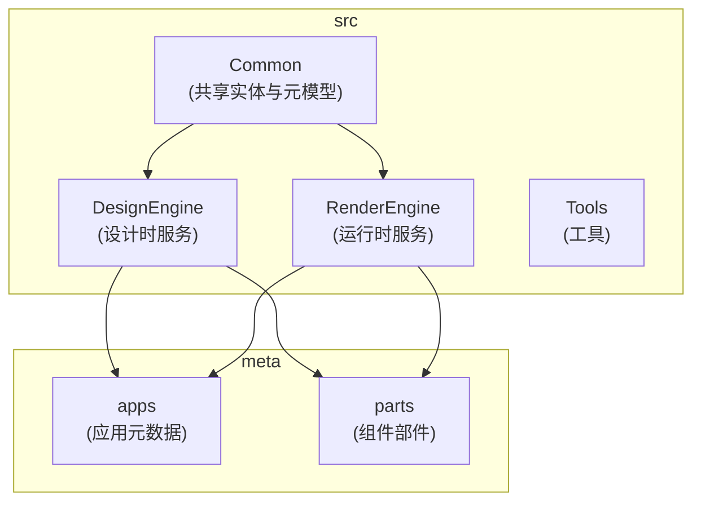
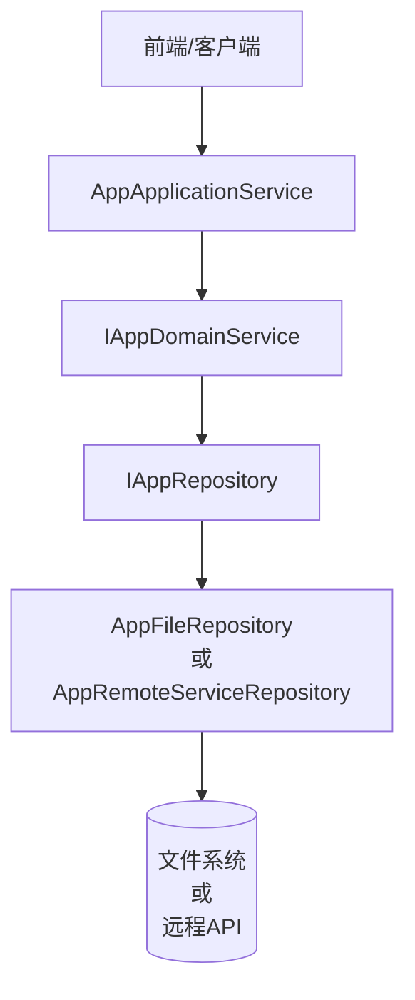
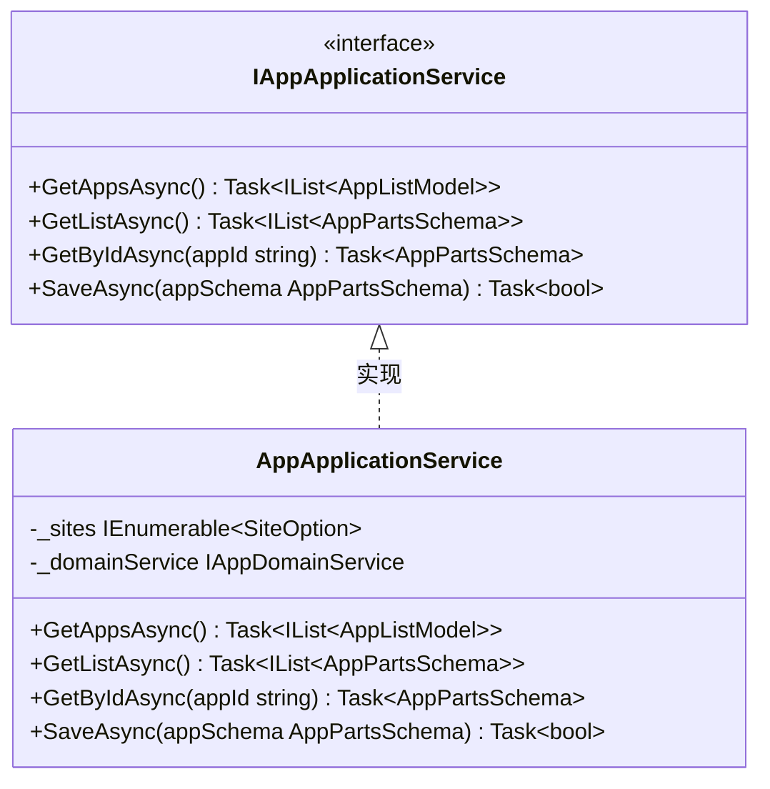
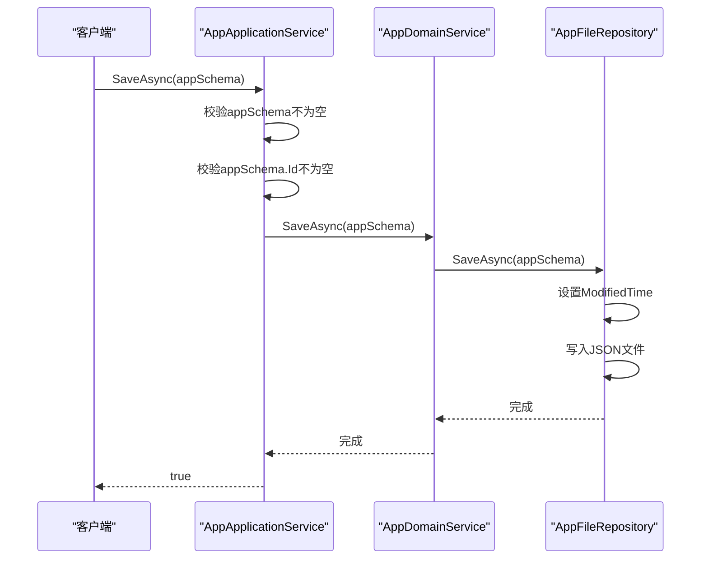
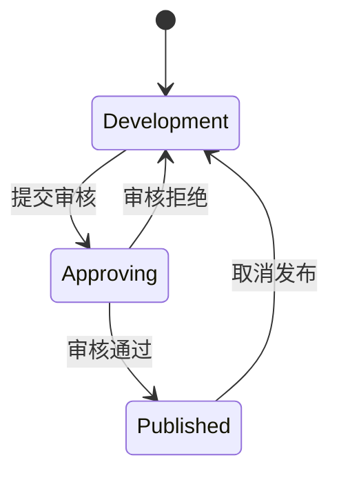
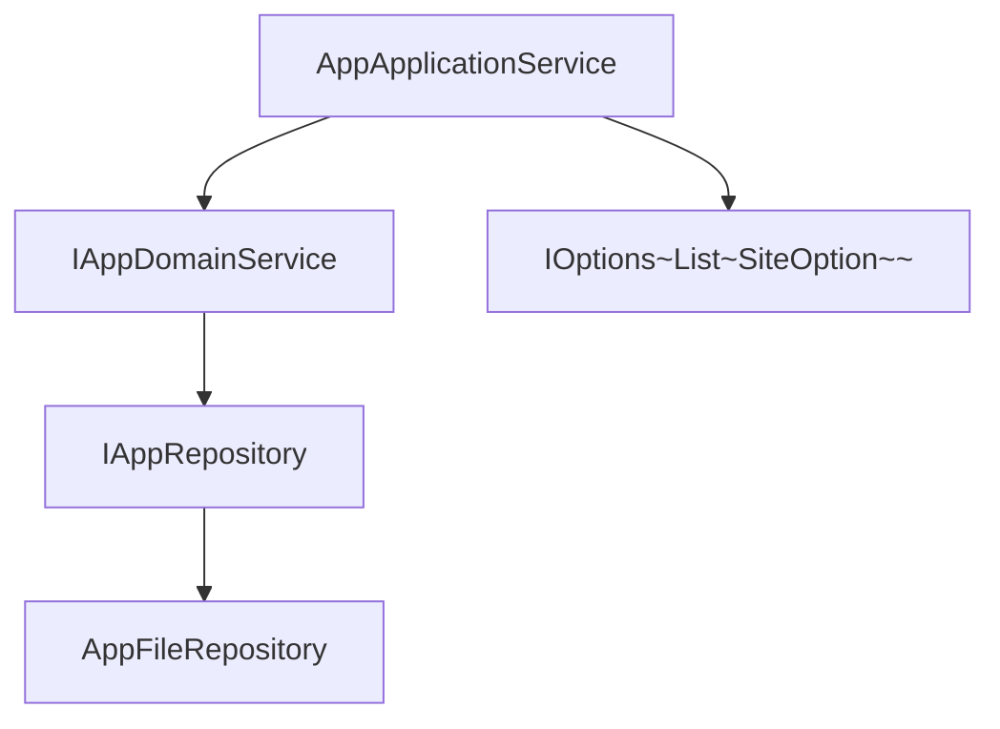

# 应用管理服务

<cite>
**本文档引用的文件**   
- [AppApplicationService.cs](file://src/DesignEngine/H.LowCode.DesignEngine.Application/AppServices/AppApplicationService.cs)
- [IAppApplicationService.cs](file://src/DesignEngine/H.LowCode.DesignEngine.Application.Contracts/AppServices/IAppApplicationService.cs)
- [AppDomainService.cs](file://src/DesignEngine/H.LowCode.DesignEngine.Domain/MetaDomainServices/AppDomainService.cs)
- [AppListModel.cs](file://src/DesignEngine/H.LowCode.DesignEngine.Model/Models/AppListModel.cs)
- [AppFileRepository.cs](file://src/DesignEngine/H.LowCode.DesignEngine.Repository.JsonFile/Repositories/AppFileRepository.cs)
- [AppSchemaBase.cs](file://src/Common/H.LowCode.MetaSchema/AppSchemaBase.cs)
- [LowCodeAutoMapperProfile.cs](file://src/RenderEngine/H.LowCode.RenderEngine.Application/MapperProfiles/LowCodeAutoMapperProfile.cs)
- [PublishStatusEnum.cs](file://src/Common/H.LowCode.MetaSchema/Enums/PublishStatusEnum.cs)
</cite>

## 目录
1. [简介](#简介)
2. [项目结构](#项目结构)
3. [核心组件](#核心组件)
4. [架构概览](#架构概览)
5. [详细组件分析](#详细组件分析)
6. [依赖分析](#依赖分析)
7. [性能考虑](#性能考虑)
8. [故障排除指南](#故障排除指南)
9. [结论](#结论)

## 简介
本文档深入解析低代码平台中`AppApplicationService`的实现机制，重点阐述其在应用生命周期管理中的核心作用。文档详细说明了创建、更新、删除、发布和查询低代码应用的业务逻辑流程，包括与`IAppDomainService`领域服务的交互方式、事务边界控制以及应用元数据的持久化策略。同时，文档解释了服务如何通过AutoMapper将App实体转换为`AppListModel`等DTO模型，并处理多租户环境下的应用隔离。结合代码示例，展示了创建新应用时的参数校验、唯一性检查和默认配置初始化过程。文档还涵盖了接口契约定义、异常处理模式（如应用不存在、名称冲突等）、权限控制机制，并提供了RESTful API调用示例（如POST /api/app/create）及其请求/响应JSON结构。

## 项目结构
本项目采用分层架构设计，主要分为`Common`、`DesignEngine`、`RenderEngine`和`Tools`四大模块。`Common`模块存放跨领域共享的实体、元数据模型和配置选项。`DesignEngine`模块负责应用的设计时功能，包含应用、菜单、页面等元数据的管理服务。`RenderEngine`模块负责运行时的渲染和数据处理。`Tools`模块包含数据库迁移和元数据迁移工具。应用元数据（apps）和组件部件（parts）以JSON文件的形式存储在`meta`目录下，实现了配置即代码（Configuration as Code）的理念。



**Diagram sources**
- [AppApplicationService.cs](file://src/DesignEngine/H.LowCode.DesignEngine.Application/AppServices/AppApplicationService.cs)
- [AppFileRepository.cs](file://src/DesignEngine/H.LowCode.DesignEngine.Repository.JsonFile/Repositories/AppFileRepository.cs)

**Section sources**
- [AppApplicationService.cs](file://src/DesignEngine/H.LowCode.DesignEngine.Application/AppServices/AppApplicationService.cs)

## 核心组件
`AppApplicationService`是应用管理的核心应用服务，位于`DesignEngine`模块的`Application`层。它实现了`IAppApplicationService`接口，为前端提供了一组用于管理低代码应用的API。该服务不直接处理业务逻辑或数据持久化，而是作为协调者，调用位于`Domain`层的`IAppDomainService`来执行核心业务规则，并通过`Repository`层将应用元数据持久化到文件系统。服务通过`LazyServiceProvider`获取依赖，实现了依赖注入。`GetAppsAsync`方法展示了如何将领域模型`AppPartsSchema`转换为传输模型`AppListModel`，并注入站点URL等额外信息。

**Section sources**
- [AppApplicationService.cs](file://src/DesignEngine/H.LowCode.DesignEngine.Application/AppServices/AppApplicationService.cs)
- [IAppApplicationService.cs](file://src/DesignEngine/H.LowCode.DesignEngine.Application.Contracts/AppServices/IAppApplicationService.cs)

## 架构概览
系统采用经典的分层架构（Layered Architecture），清晰地分离了关注点。`Application`层（应用服务）负责处理HTTP请求、参数验证和DTO转换。`Domain`层（领域服务）封装了核心业务逻辑和规则。`Repository`层（仓储）负责数据的持久化和检索，与具体的存储技术（如文件系统或远程服务）解耦。这种设计使得业务逻辑独立于外部框架和基础设施，提高了代码的可测试性和可维护性。`AppApplicationService`作为应用层的入口，协调领域服务和仓储，完成应用的全生命周期管理。



**Diagram sources**
- [AppApplicationService.cs](file://src/DesignEngine/H.LowCode.DesignEngine.Application/AppServices/AppApplicationService.cs)
- [AppDomainService.cs](file://src/DesignEngine/H.LowCode.DesignEngine.Domain/MetaDomainServices/AppDomainService.cs)
- [AppFileRepository.cs](file://src/DesignEngine/H.LowCode.DesignEngine.Repository.JsonFile/Repositories/AppFileRepository.cs)

## 详细组件分析
### AppApplicationService 分析
`AppApplicationService`是`IAppApplicationService`接口的具体实现，负责处理与应用管理相关的所有应用层逻辑。它通过`IAppDomainService`代理业务操作，并对输入输出进行转换和处理。

#### 接口契约与方法
`IAppApplicationService`定义了四个核心方法，构成了应用管理的API契约：
- `GetAppsAsync`: 获取应用列表，返回`AppListModel`。
- `GetListAsync`: 获取应用元数据列表，返回`AppPartsSchema`。
- `GetByIdAsync`: 根据ID获取单个应用的元数据。
- `SaveAsync`: 保存或更新应用元数据。



**Diagram sources**
- [IAppApplicationService.cs](file://src/DesignEngine/H.LowCode.DesignEngine.Application.Contracts/AppServices/IAppApplicationService.cs)
- [AppApplicationService.cs](file://src/DesignEngine/H.LowCode.DesignEngine.Application/AppServices/AppApplicationService.cs)

#### 业务逻辑流程
`AppApplicationService`的业务逻辑流程遵循典型的CQRS（命令查询职责分离）模式。查询操作（如`GetAppsAsync`）直接调用领域服务获取数据，并进行DTO转换。命令操作（如`SaveAsync`）则负责参数验证和调用领域服务执行变更。

**创建/更新应用流程**:
1.  **参数校验**: `SaveAsync`方法首先使用`ArgumentNullException.ThrowIfNull`和`ArgumentException.ThrowIfNullOrEmpty`对输入参数`appSchema`及其`Id`进行空值检查。
2.  **调用领域服务**: 通过`_domainService.SaveAsync(appSchema)`将保存请求委托给领域层。
3.  **返回结果**: 领域服务成功执行后，返回`true`表示操作成功。



**Diagram sources**
- [AppApplicationService.cs](file://src/DesignEngine/H.LowCode.DesignEngine.Application/AppServices/AppApplicationService.cs#L45-L51)
- [AppDomainService.cs](file://src/DesignEngine/H.LowCode.DesignEngine.Domain/MetaDomainServices/AppDomainService.cs#L25-L28)
- [AppFileRepository.cs](file://src/DesignEngine/H.LowCode.DesignEngine.Repository.JsonFile/Repositories/AppFileRepository.cs#L37-L48)

#### DTO转换与AutoMapper
`AppApplicationService`在`GetAppsAsync`方法中手动执行了从`AppPartsSchema`到`AppListModel`的转换。虽然项目中存在`LowCodeAutoMapperProfile`，但当前`AppApplicationService`并未使用它，而是通过LINQ的`Select`方法进行手动映射。`AppListModel`包含了`Id`、`Name`、`Description`和从`SiteOption`配置中获取的`SiteUrl`。

```csharp
return appSchemas.Select(x => new AppListModel
{
    Id = x.Id,
    SiteUrl = _sites.FirstOrDefault(t => t.AppId.Equals(x.Id, StringComparison.OrdinalIgnoreCase))?.SiteUrl,
    Name = x.Name,
    Description = x.Description
}).ToList();
```

**Section sources**
- [AppApplicationService.cs](file://src/DesignEngine/H.LowCode.DesignEngine.Application/AppServices/AppApplicationService.cs#L15-L24)
- [AppListModel.cs](file://src/DesignEngine/H.LowCode.DesignEngine.Model/Models/AppListModel.cs)

#### 多租户环境下的应用隔离
本系统通过文件系统的目录结构实现应用隔离。每个应用的元数据（如`app.json`、`menu`目录、`page`目录）都存储在以应用ID命名的子目录下（例如`meta/apps/caseapp/`）。`AppFileRepository`在读写文件时，会根据`appId`动态构建文件路径，确保不同应用的数据物理隔离。`SiteOption`配置也通过`AppId`字段与特定应用关联，实现了配置的租户隔离。

**Section sources**
- [AppFileRepository.cs](file://src/DesignEngine/H.LowCode.DesignEngine.Repository.JsonFile/Repositories/AppFileRepository.cs#L42-L46)

#### 异常处理模式
`AppApplicationService`采用了防御性编程来处理异常。在`SaveAsync`方法中，它主动抛出`ArgumentNullException`和`ArgumentException`来处理空值和无效参数。对于其他可能的异常（如文件IO异常、领域规则异常），它选择不捕获，而是让异常向上传播。这符合领域驱动设计（DDD）的原则，即应用服务层不处理领域层的业务异常，而是由上层（如API控制器）进行统一的异常处理和响应。

**Section sources**
- [AppApplicationService.cs](file://src/DesignEngine/H.LowCode.DesignEngine.Application/AppServices/AppApplicationService.cs#L45-L47)

#### 权限控制机制
当前代码中未发现显式的权限控制代码。`AppApplicationService`类上标记了`[RemoteService]`属性，这通常由ABP框架处理，可能用于启用远程调用和集成其权限系统。真正的权限检查（如基于角色或策略的授权）很可能在更上层的API控制器或通过ABP的`[Authorize]`属性实现，而不在应用服务内部。

**Section sources**
- [AppApplicationService.cs](file://src/DesignEngine/H.LowCode.DesignEngine.Application/AppServices/AppApplicationService.cs#L10)

#### 应用发布功能
应用的发布状态由`AppSchemaBase`中的`PublishStatus`属性管理，其类型为`PublishStatusEnum`，包含`Development`、`Approving`和`Published`三种状态。`AppApplicationService`本身不直接提供发布/取消发布的专用方法。发布操作是通过`SaveAsync`方法间接完成的：客户端在更新应用元数据时，将`PublishStatus`字段设置为`Published`，然后调用`SaveAsync`进行保存。这表明发布是应用元数据的一个普通属性变更。



**Diagram sources**
- [AppSchemaBase.cs](file://src/Common/H.LowCode.MetaSchema/AppSchemaBase.cs#L20-L27)
- [PublishStatusEnum.cs](file://src/Common/H.LowCode.MetaSchema/Enums/PublishStatusEnum.cs)

#### RESTful API 调用示例
虽然`AppApplicationService`是应用服务，但根据ABP框架的约定，它会被自动发布为RESTful API。以下是一个创建或更新应用的API调用示例。

**请求**:
- **方法**: POST
- **路径**: `/api/app/save`
- **内容类型**: `application/json`
- **请求体**:
```json
{
  "id": "mynewapp",
  "name": "我的新应用",
  "description": "这是一个测试应用",
  "publishStatus": 0,
  "supportPlatforms": [0]
}
```

**响应**:
- **状态码**: 200 OK
- **响应体**:
```json
true
```

**Section sources**
- [AppApplicationService.cs](file://src/DesignEngine/H.LowCode.DesignEngine.Application/AppServices/AppApplicationService.cs)
- [IAppApplicationService.cs](file://src/DesignEngine/H.LowCode.DesignEngine.Application.Contracts/AppServices/IAppApplicationService.cs)

## 依赖分析
`AppApplicationService`的依赖关系清晰地体现了分层架构。它直接依赖于`IAppDomainService`（领域服务）和`IOptions<List<SiteOption>>`（配置）。`IAppDomainService`又依赖于`IAppRepository`（仓储接口），而具体的仓储实现（如`AppFileRepository`）则依赖于文件系统API。这种依赖关系确保了应用服务层的纯净，使其不直接与数据存储细节耦合。



**Diagram sources**
- [AppApplicationService.cs](file://src/DesignEngine/H.LowCode.DesignEngine.Application/AppServices/AppApplicationService.cs)
- [AppDomainService.cs](file://src/DesignEngine/H.LowCode.DesignEngine.Domain/MetaDomainServices/AppDomainService.cs)
- [AppFileRepository.cs](file://src/DesignEngine/H.LowCode.DesignEngine.Repository.JsonFile/Repositories/AppFileRepository.cs)

**Section sources**
- [AppApplicationService.cs](file://src/DesignEngine/H.LowCode.DesignEngine.Application/AppServices/AppApplicationService.cs)
- [AppDomainService.cs](file://src/DesignEngine/H.LowCode.DesignEngine.Domain/MetaDomainServices/AppDomainService.cs)

## 性能考虑
由于应用元数据以JSON文件形式存储，读取操作（如`GetListAsync`）需要遍历目录并反序列化多个文件，这在应用数量庞大时可能成为性能瓶颈。写入操作（`SaveAsync`）是原子的，每次只写入单个应用的元数据文件，性能相对稳定。为了提高性能，可以考虑引入缓存机制，例如使用内存缓存（如`IMemoryCache`）来缓存频繁访问的应用列表或单个应用元数据，减少对文件系统的I/O操作。

## 故障排除指南
- **问题**: 调用`SaveAsync`时返回`false`或抛出异常。
  - **检查**: 确保传入的`appSchema`对象及其`Id`属性不为`null`或空字符串。
- **问题**: 创建的应用在列表中找不到。
  - **检查**: 确认`meta/apps/{appId}/`目录下是否生成了`{appId}.json`文件。检查文件系统权限是否允许写入。
- **问题**: `SiteUrl`在`AppListModel`中为`null`。
  - **检查**: 确认`appsettings.json`中的`SiteOptions`配置是否包含与应用ID匹配的条目。
- **问题**: 应用发布后前端未更新。
  - **检查**: 确认`PublishStatus`字段已正确设置为`Published`，并已通过`SaveAsync`保存。检查前端是否正确处理了发布状态。

**Section sources**
- [AppApplicationService.cs](file://src/DesignEngine/H.LowCode.DesignEngine.Application/AppServices/AppApplicationService.cs)
- [AppFileRepository.cs](file://src/DesignEngine/H.LowCode.DesignEngine.Repository.JsonFile/Repositories/AppFileRepository.cs)
- [AppListModel.cs](file://src/DesignEngine/H.LowCode.DesignEngine.Model/Models/AppListModel.cs)

## 结论
`AppApplicationService`作为低代码平台应用管理的核心服务，设计简洁且职责明确。它成功地将应用层逻辑与领域逻辑和数据持久化逻辑分离，遵循了良好的软件设计原则。服务通过调用领域服务来执行业务操作，并通过手动映射处理DTO转换。系统利用文件系统的目录结构实现了有效的应用隔离。虽然当前的异常处理和权限控制较为基础，但其架构为未来的扩展（如引入缓存、增强权限系统）提供了坚实的基础。整体而言，该服务是低代码平台可维护性和可扩展性的关键组成部分。