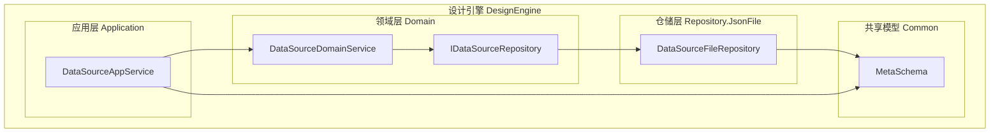
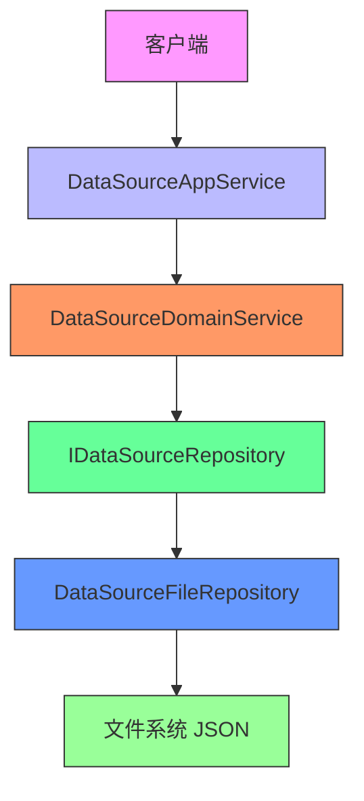
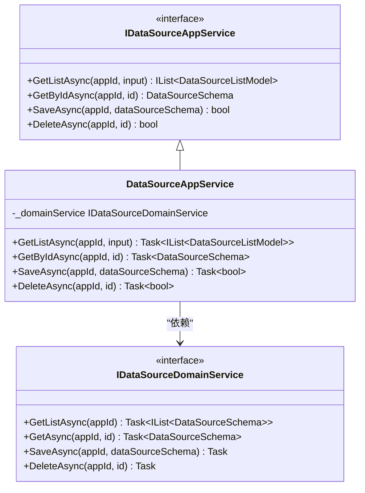
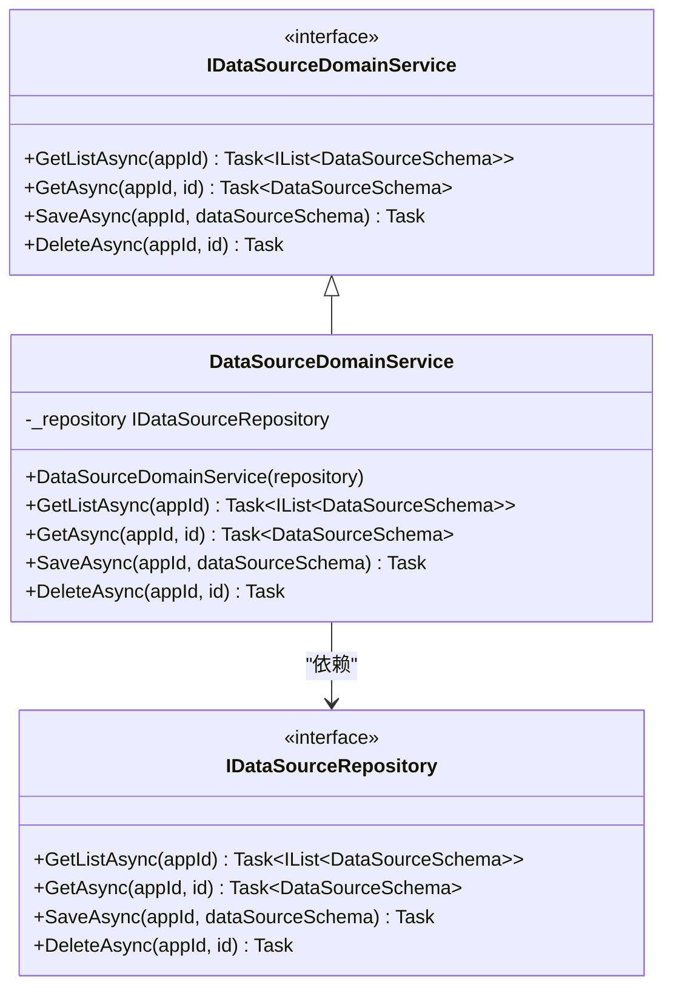
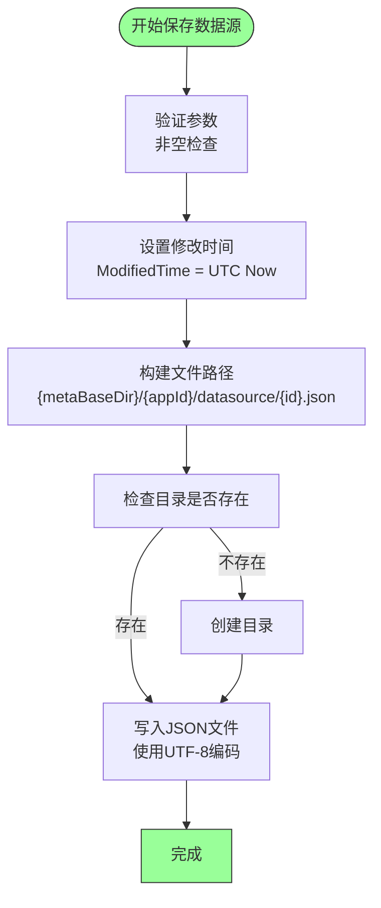
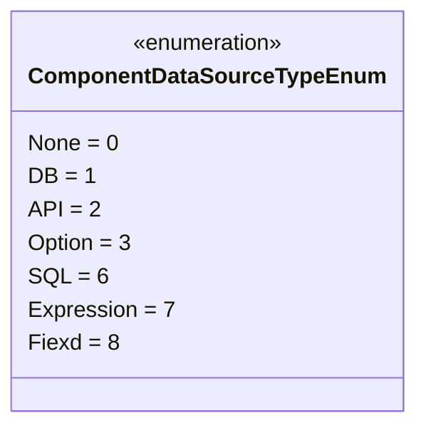
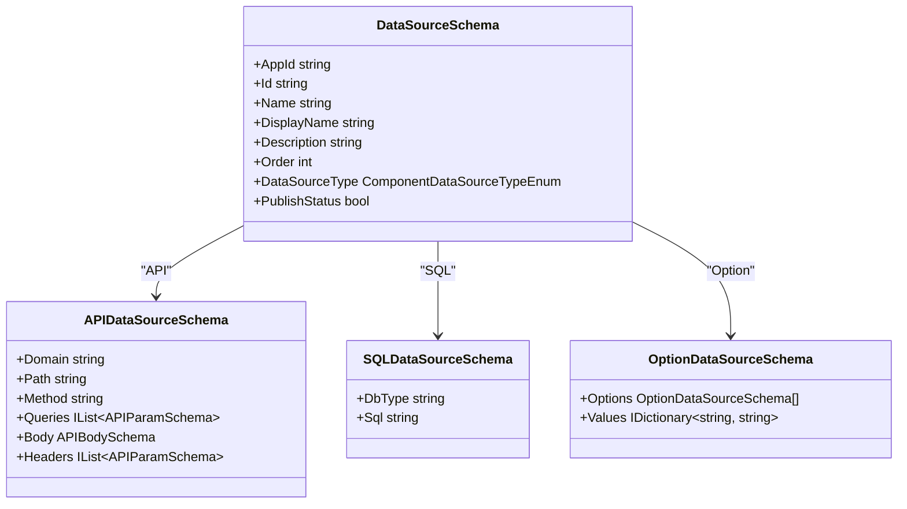
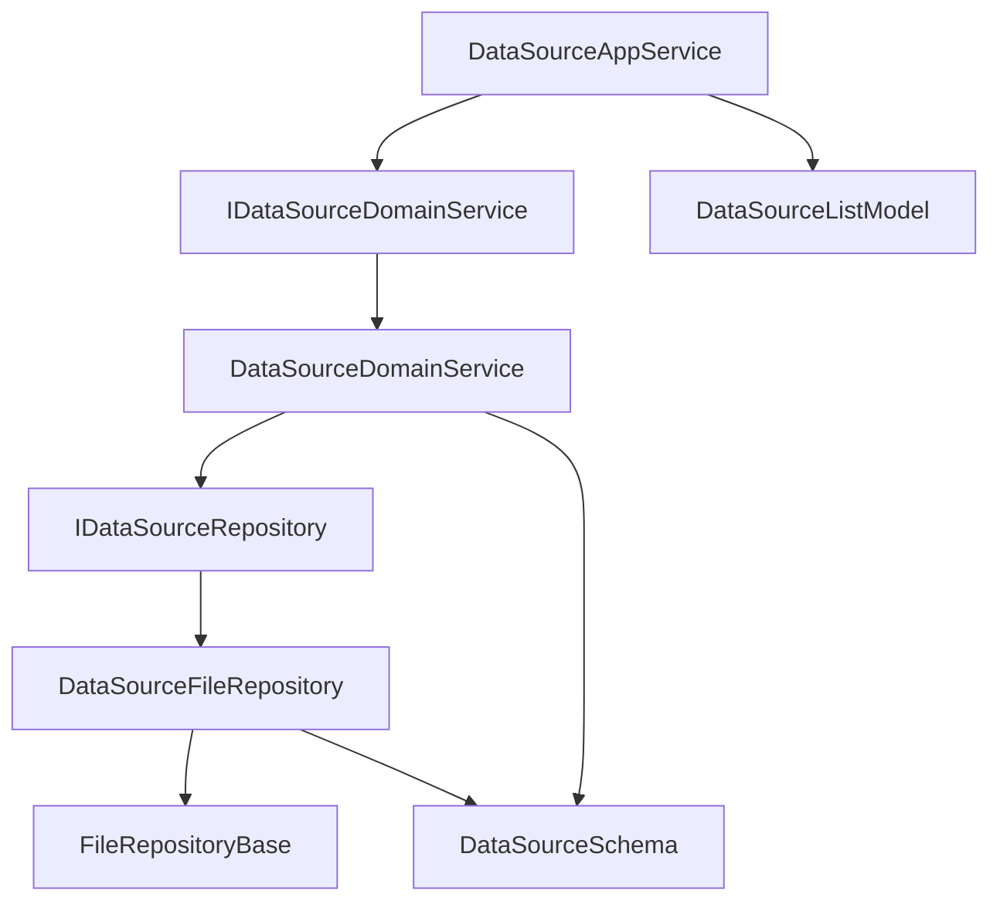

# 数据源管理服务

<cite>
**本文档引用的文件**   
- [IDataSourceAppService.cs](file://src/DesignEngine/H.LowCode.DesignEngine.Application.Contracts/AppServices/IDataSourceAppService.cs)
- [DataSourceAppService.cs](file://src/DesignEngine/H.LowCode.DesignEngine.Application/AppServices/DataSourceAppService.cs)
- [IDataSourceDomainService.cs](file://src/DesignEngine/H.LowCode.DesignEngine.Domain/MetaDomainServices/IDataSourceDomainService.cs)
- [DataSourceDomainService.cs](file://src/DesignEngine/H.LowCode.DesignEngine.Domain/MetaDomainServices/DataSourceDomainService.cs)
- [IDataSourceRepository.cs](file://src/DesignEngine/H.LowCode.DesignEngine.Domain/MetaRepositories/IDataSourceRepository.cs)
- [DataSourceFileRepository.cs](file://src/DesignEngine/H.LowCode.DesignEngine.Repository.JsonFile/Repositories/DataSourceFileRepository.cs)
- [ComponentDataSourceTypeEnum.cs](file://src/Common/H.LowCode.MetaSchema/Enums/ComponentDataSourceTypeEnum.cs)
- [DataSourceSchema.cs](file://src/Common/H.LowCode.MetaSchema/DataSourceSchema.cs)
- [APIDataSourceSchema.cs](file://src/Common/H.LowCode.MetaSchema/DataSourceSchemas/APIDataSourceSchema.cs)
- [SQLDataSourceSchema.cs](file://src/Common/H.LowCode.MetaSchema/DataSourceSchemas/SQLDataSourceSchema.cs)
</cite>

## 目录
1. [简介](#简介)
2. [项目结构](#项目结构)
3. [核心组件](#核心组件)
4. [架构概览](#架构概览)
5. [详细组件分析](#详细组件分析)
6. [依赖关系分析](#依赖关系分析)
7. [性能考量](#性能考量)
8. [故障排除指南](#故障排除指南)
9. [结论](#结论)

## 简介
本文档深入剖析了低代码平台中数据源管理服务（DataSourceAppService）的核心功能与实现机制。该服务作为设计引擎的一部分，负责统一管理多种类型的数据源，包括数据库、API、静态选项等。文档详细阐述了数据源的创建、保存、查询、删除等全生命周期管理流程，揭示了从应用服务层到领域服务层再到仓储层的分层架构设计。通过分析接口契约、领域逻辑和文件持久化机制，展示了系统如何将数据源配置以JSON文件的形式存储在文件系统中，并支持按应用ID进行隔离管理。同时，文档还介绍了不同类型数据源（如API、SQL）的差异化配置结构及其在系统中的分类方式。

## 项目结构
项目采用分层架构设计，将应用逻辑、领域逻辑和数据访问逻辑清晰分离。数据源管理功能主要分布在`src/DesignEngine`目录下，遵循典型的DDD（领域驱动设计）模式。

**图示来源**
- [DataSourceAppService.cs](file://src/DesignEngine/H.LowCode.DesignEngine.Application/AppServices/DataSourceAppService.cs)
- [DataSourceDomainService.cs](file://src/DesignEngine/H.LowCode.DesignEngine.Domain/MetaDomainServices/DataSourceDomainService.cs)
- [DataSourceFileRepository.cs](file://src/DesignEngine/H.LowCode.DesignEngine.Repository.JsonFile/Repositories/DataSourceFileRepository.cs)
- [DataSourceSchema.cs](file://src/Common/H.LowCode.MetaSchema/DataSourceSchema.cs)

**本节来源**
- [DataSourceAppService.cs](file://src/DesignEngine/H.LowCode.DesignEngine.Application/AppServices/DataSourceAppService.cs)
- [DataSourceDomainService.cs](file://src/DesignEngine/H.LowCode.DesignEngine.Domain/MetaDomainServices/DataSourceDomainService.cs)

## 核心组件
数据源管理服务的核心组件包括应用服务（AppService）、领域服务（DomainService）和仓储（Repository）。`DataSourceAppService`作为外部接口的入口，实现了`IDataSourceAppService`契约，提供增删改查等RESTful风格的操作。`DataSourceDomainService`封装了业务逻辑，确保操作的原子性和一致性。`DataSourceFileRepository`则负责将数据源配置持久化到文件系统，采用JSON格式存储，路径为`{metaBaseDir}/{appId}/datasource/{id}.json`。所有数据源的配置都继承自`DataSourceSchema`基类，该类定义了ID、名称、类型、排序等通用属性，并通过组合模式支持不同类型数据源的特定配置。

**本节来源**
- [IDataSourceAppService.cs](file://src/DesignEngine/H.LowCode.DesignEngine.Application.Contracts/AppServices/IDataSourceAppService.cs)
- [DataSourceSchema.cs](file://src/Common/H.LowCode.MetaSchema/DataSourceSchema.cs)
- [DataSourceFileRepository.cs](file://src/DesignEngine/H.LowCode.DesignEngine.Repository.JsonFile/Repositories/DataSourceFileRepository.cs)

## 架构概览
系统采用清晰的分层架构，确保关注点分离。应用服务层负责处理HTTP请求和响应，进行基本的参数验证。领域服务层包含核心业务逻辑，协调仓储操作。仓储层则专注于数据的持久化，与具体的存储介质（如文件系统）交互。这种设计使得上层逻辑不依赖于底层存储实现，便于未来扩展支持数据库或其他存储方式。

**图示来源**
- [IDataSourceAppService.cs](file://src/DesignEngine/H.LowCode.DesignEngine.Application.Contracts/AppServices/IDataSourceAppService.cs)
- [DataSourceDomainService.cs](file://src/DesignEngine/H.LowCode.DesignEngine.Domain/MetaDomainServices/DataSourceDomainService.cs)
- [IDataSourceRepository.cs](file://src/DesignEngine/H.LowCode.DesignEngine.Domain/MetaRepositories/IDataSourceRepository.cs)
- [DataSourceFileRepository.cs](file://src/DesignEngine/H.LowCode.DesignEngine.Repository.JsonFile/Repositories/DataSourceFileRepository.cs)

## 详细组件分析
### 应用服务层分析
`DataSourceAppService`实现了`IDataSourceAppService`接口，是外部系统访问数据源功能的入口。它通过依赖注入获取`IDataSourceDomainService`实例，并将请求委派给领域服务处理。

#### 类图

**图示来源**
- [IDataSourceAppService.cs](file://src/DesignEngine/H.LowCode.DesignEngine.Application.Contracts/AppServices/IDataSourceAppService.cs)
- [DataSourceAppService.cs](file://src/DesignEngine/H.LowCode.DesignEngine.Application/AppServices/DataSourceAppService.cs)
- [IDataSourceDomainService.cs](file://src/DesignEngine/H.LowCode.DesignEngine.Domain/MetaDomainServices/IDataSourceDomainService.cs)

**本节来源**
- [DataSourceAppService.cs](file://src/DesignEngine/H.LowCode.DesignEngine.Application/AppServices/DataSourceAppService.cs)

### 领域服务层分析
`DataSourceDomainService`实现了`IDataSourceDomainService`接口，是业务逻辑的核心。它不包含复杂的业务规则，主要职责是协调仓储操作，体现了该系统中领域逻辑相对简单的特性。

#### 类图

**图示来源**
- [IDataSourceDomainService.cs](file://src/DesignEngine/H.LowCode.DesignEngine.Domain/MetaDomainServices/IDataSourceDomainService.cs)
- [DataSourceDomainService.cs](file://src/DesignEngine/H.LowCode.DesignEngine.Domain/MetaDomainServices/DataSourceDomainService.cs)
- [IDataSourceRepository.cs](file://src/DesignEngine/H.LowCode.DesignEngine.Domain/MetaRepositories/IDataSourceRepository.cs)

**本节来源**
- [DataSourceDomainService.cs](file://src/DesignEngine/H.LowCode.DesignEngine.Domain/MetaDomainServices/DataSourceDomainService.cs)

### 仓储层分析
`DataSourceFileRepository`是`IDataSourceRepository`的具体实现，负责将数据源配置持久化到文件系统。它使用`FileRepositoryBase`基类提供的文件读写能力。

#### 数据源保存流程

**图示来源**
- [DataSourceFileRepository.cs](file://src/DesignEngine/H.LowCode.DesignEngine.Repository.JsonFile/Repositories/DataSourceFileRepository.cs#L55-L75)

**本节来源**
- [DataSourceFileRepository.cs](file://src/DesignEngine/H.LowCode.DesignEngine.Repository.JsonFile/Repositories/DataSourceFileRepository.cs)

### 数据模型分析
`DataSourceSchema`是所有数据源的基类，采用组合模式支持不同类型的数据源配置。

#### 数据源类型枚举

**图示来源**
- [ComponentDataSourceTypeEnum.cs](file://src/Common/H.LowCode.MetaSchema/Enums/ComponentDataSourceTypeEnum.cs)

#### 数据源模式类图

**图示来源**
- [DataSourceSchema.cs](file://src/Common/H.LowCode.MetaSchema/DataSourceSchema.cs)
- [APIDataSourceSchema.cs](file://src/Common/H.LowCode.MetaSchema/DataSourceSchemas/APIDataSourceSchema.cs)
- [SQLDataSourceSchema.cs](file://src/Common/H.LowCode.MetaSchema/DataSourceSchemas/SQLDataSourceSchema.cs)

**本节来源**
- [DataSourceSchema.cs](file://src/Common/H.LowCode.MetaSchema/DataSourceSchema.cs)
- [APIDataSourceSchema.cs](file://src/Common/H.LowCode.MetaSchema/DataSourceSchemas/APIDataSourceSchema.cs)
- [SQLDataSourceSchema.cs](file://src/Common/H.LowCode.MetaSchema/DataSourceSchemas/SQLDataSourceSchema.cs)

## 依赖关系分析
系统各组件之间存在清晰的依赖关系，遵循依赖倒置原则。高层模块（AppService）依赖于抽象（DomainService接口），而非具体实现。

**图示来源**
- [IDataSourceAppService.cs](file://src/DesignEngine/H.LowCode.DesignEngine.Application.Contracts/AppServices/IDataSourceAppService.cs)
- [DataSourceDomainService.cs](file://src/DesignEngine/H.LowCode.DesignEngine.Domain/MetaDomainServices/DataSourceDomainService.cs)
- [IDataSourceRepository.cs](file://src/DesignEngine/H.LowCode.DesignEngine.Domain/MetaRepositories/IDataSourceRepository.cs)
- [DataSourceFileRepository.cs](file://src/DesignEngine/H.LowCode.DesignEngine.Repository.JsonFile/Repositories/DataSourceFileRepository.cs)

**本节来源**
- [DataSourceAppService.cs](file://src/DesignEngine/H.LowCode.DesignEngine.Application/AppServices/DataSourceAppService.cs)
- [DataSourceDomainService.cs](file://src/DesignEngine/H.LowCode.DesignEngine.Domain/MetaDomainServices/DataSourceDomainService.cs)
- [DataSourceFileRepository.cs](file://src/DesignEngine/H.LowCode.DesignEngine.Repository.JsonFile/Repositories/DataSourceFileRepository.cs)

## 性能考量
由于数据源配置通常不会频繁变动，且单个应用的数据源数量有限，当前基于文件系统的持久化方案在性能上是可接受的。每次读取操作会加载应用目录下的所有数据源文件，对于数据源数量较多的应用，可能会产生一定的I/O开销。缓存机制可以进一步优化性能，但当前代码中未实现。`GetAllEntities`方法中使用了`.Result`来同步获取异步结果，这在高并发场景下可能导致线程阻塞，是一个潜在的性能瓶颈。

## 故障排除指南
### 常见问题
1. **数据源无法保存**：检查`appId`和`id`是否为空，确保`metaBaseDir`配置正确且应用目录有写入权限。
2. **数据源无法读取**：确认文件路径`{metaBaseDir}/{appId}/datasource/{id}.json`是否存在，文件内容是否为有效的JSON格式。
3. **连接测试失败**：虽然本文档未涉及连接测试代码，但通常需要检查API的域名、路径、参数或数据库连接字符串是否正确。

### 错误处理
- `SaveAsync`和`DeleteAsync`方法在参数为空时会抛出`ArgumentNullException`或`ArgumentException`。
- 文件读取时，如果文件不存在，`GetAsync`会抛出异常，而`GetListAsync`会返回空列表。
- 文件写入时，如果目录不存在，会自动创建。

**本节来源**
- [DataSourceAppService.cs](file://src/DesignEngine/H.LowCode.DesignEngine.Application/AppServices/DataSourceAppService.cs#L45-L48)
- [DataSourceFileRepository.cs](file://src/DesignEngine/H.LowCode.DesignEngine.Repository.JsonFile/Repositories/DataSourceFileRepository.cs)

## 结论
数据源管理服务通过清晰的分层架构实现了对多种类型数据源的统一管理。系统采用DDD模式，将应用服务、领域服务和仓储分离，确保了代码的可维护性和可扩展性。数据源配置以JSON文件的形式持久化在文件系统中，实现了按应用隔离的存储策略。`DataSourceSchema`基类通过组合模式灵活支持API、SQL、选项等不同类型的数据源。尽管当前实现较为简单，但其架构设计为未来引入更复杂的业务逻辑（如连接测试、字段探测、敏感信息加密）提供了良好的基础。建议优化`GetAllEntities`中的同步等待问题，并考虑引入缓存机制以提升读取性能。