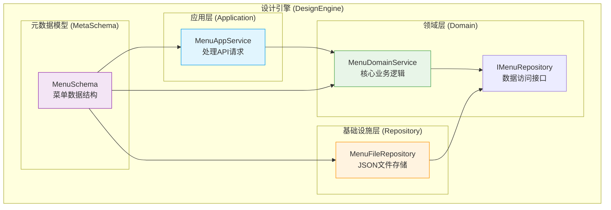
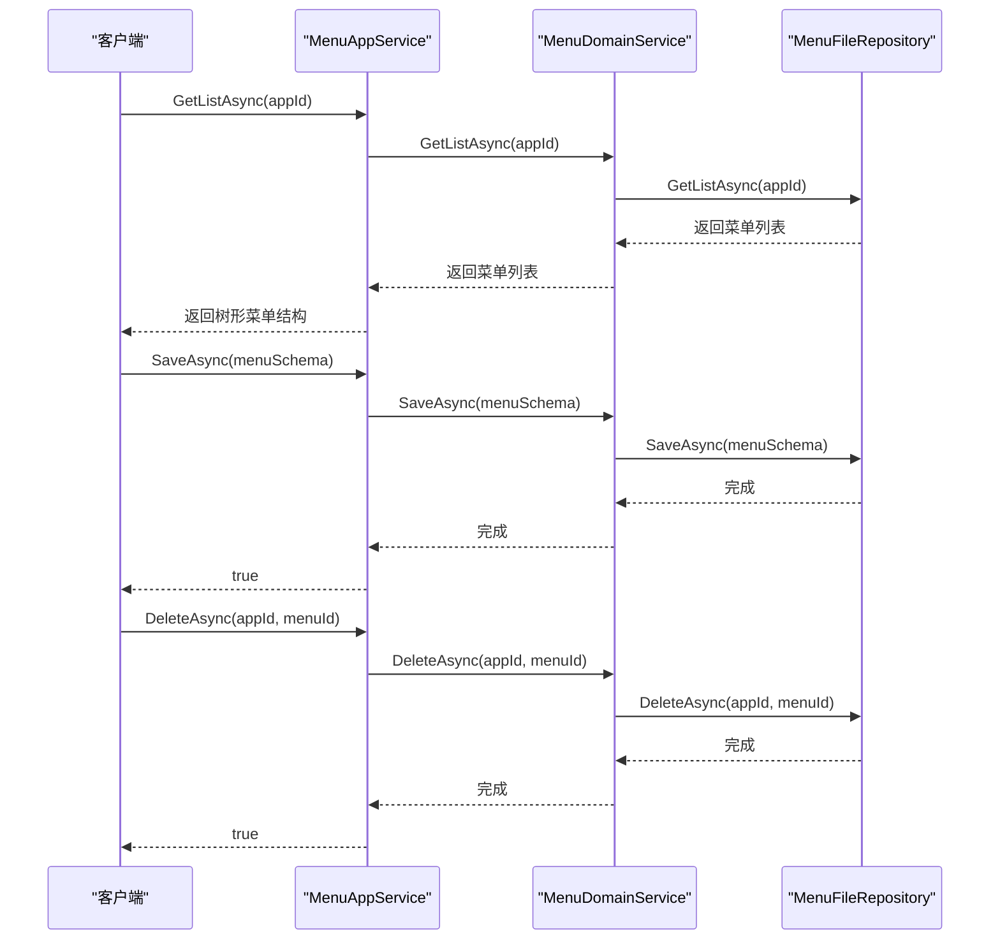
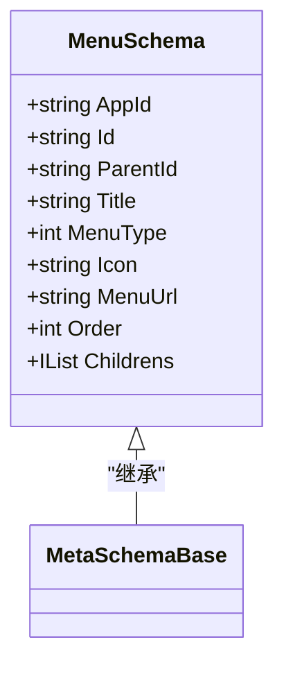
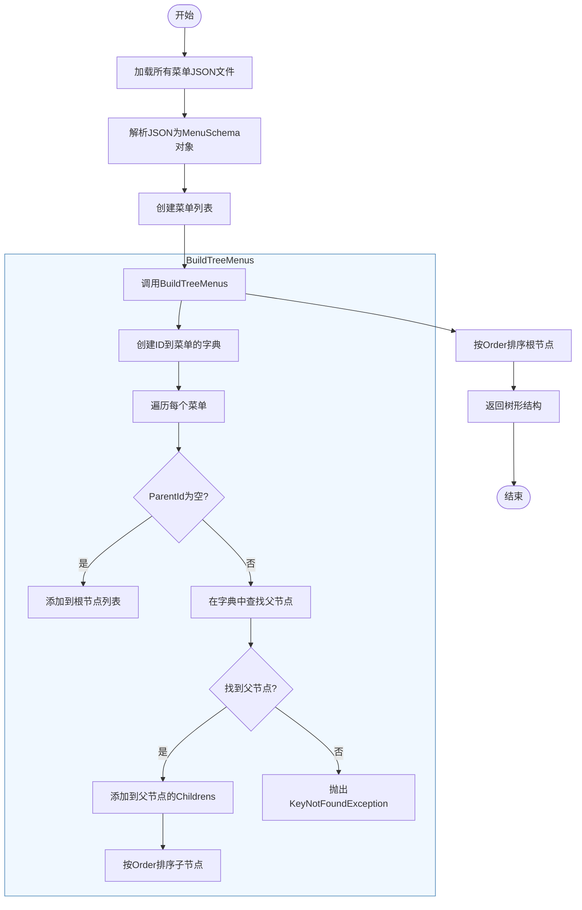
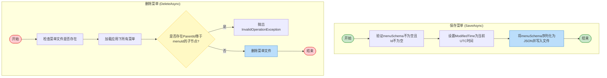
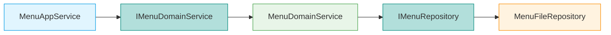

# 菜单管理服务

<cite>
**本文档引用的文件**  
- [MenuAppService.cs](file://src/DesignEngine/H.LowCode.DesignEngine.Application/AppServices/MenuAppService.cs)
- [MenuDomainService.cs](file://src/DesignEngine/H.LowCode.DesignEngine.Domain/MetaDomainServices/MenuDomainService.cs)
- [MenuFileRepository.cs](file://src/DesignEngine/H.LowCode.DesignEngine.Repository.JsonFile/Repositories/MenuFileRepository.cs)
- [MenuSchema.cs](file://src/Common/H.LowCode.MetaSchema/MenuSchema.cs)
</cite>

## 目录
1. [简介](#简介)
2. [项目结构](#项目结构)
3. [核心组件](#核心组件)
4. [架构概览](#架构概览)
5. [详细组件分析](#详细组件分析)
6. [依赖分析](#依赖分析)
7. [性能考虑](#性能考虑)
8. [故障排除指南](#故障排除指南)
9. [结论](#结论)

## 简介
本文档全面解析了低代码平台中的菜单管理服务（MenuAppService）的实现逻辑。该服务负责管理应用的菜单项，支持菜单的增删改查操作，维护菜单的层级结构，并构建用于导航的树形菜单。文档重点描述了菜单项的父子关系管理、排序机制、图标与路径配置、权限控制以及与页面的关联方式。通过分析核心代码文件，揭示了从数据存储到树形结构构建的完整流程。

## 项目结构
菜单管理服务是低代码平台设计引擎（DesignEngine）的一部分，其代码分布在多个模块中，遵循分层架构设计。核心逻辑位于`H.LowCode.DesignEngine.Application`模块，业务规则在`H.LowCode.DesignEngine.Domain`模块，数据持久化由`H.LowCode.DesignEngine.Repository.JsonFile`模块实现，而数据结构定义在`H.LowCode.MetaSchema`模块中。

**图示来源**
- [MenuAppService.cs](file://src/DesignEngine/H.LowCode.DesignEngine.Application/AppServices/MenuAppService.cs)
- [MenuDomainService.cs](file://src/DesignEngine/H.LowCode.DesignEngine.Domain/MetaDomainServices/MenuDomainService.cs)
- [MenuFileRepository.cs](file://src/DesignEngine/H.LowCode.DesignEngine.Repository.JsonFile/Repositories/MenuFileRepository.cs)
- [MenuSchema.cs](file://src/Common/H.LowCode.MetaSchema/MenuSchema.cs)

**本节来源**
- [MenuAppService.cs](file://src/DesignEngine/H.LowCode.DesignEngine.Application/AppServices/MenuAppService.cs)
- [MenuDomainService.cs](file://src/DesignEngine/H.LowCode.DesignEngine.Domain/MetaDomainServices/MenuDomainService.cs)

## 核心组件
菜单管理服务的核心组件包括`MenuAppService`、`MenuDomainService`、`MenuFileRepository`和`MenuSchema`。`MenuAppService`作为应用服务，对外提供API接口；`MenuDomainService`封装了核心业务逻辑；`MenuFileRepository`负责将菜单数据以JSON文件的形式持久化到文件系统；`MenuSchema`定义了菜单项的数据结构，包含标题、图标、路径、排序和父子关系等属性。

**本节来源**
- [MenuAppService.cs](file://src/DesignEngine/H.LowCode.DesignEngine.Application/AppServices/MenuAppService.cs)
- [MenuDomainService.cs](file://src/DesignEngine/H.LowCode.DesignEngine.Domain/MetaDomainServices/MenuDomainService.cs)
- [MenuFileRepository.cs](file://src/DesignEngine/H.LowCode.DesignEngine.Repository.JsonFile/Repositories/MenuFileRepository.cs)
- [MenuSchema.cs](file://src/Common/H.LowCode.MetaSchema/MenuSchema.cs)

## 架构概览
菜单管理服务采用典型的分层架构，分为应用层、领域层和基础设施层。应用层的`MenuAppService`接收外部请求，通过依赖注入获取领域服务`MenuDomainService`的实例来执行业务逻辑。领域服务`MenuDomainService`通过`IMenuRepository`接口与数据访问层交互，具体的实现由`MenuFileRepository`提供，它将菜单数据存储在`meta/apps/{appId}/menu/`目录下的JSON文件中。`MenuSchema`作为数据传输对象（DTO），贯穿于各层之间。

**图示来源**
- [MenuAppService.cs](file://src/DesignEngine/H.LowCode.DesignEngine.Application/AppServices/MenuAppService.cs#L12-L41)
- [MenuDomainService.cs](file://src/DesignEngine/H.LowCode.DesignEngine.Domain/MetaDomainServices/MenuDomainService.cs#L15-L18)
- [MenuFileRepository.cs](file://src/DesignEngine/H.LowCode.DesignEngine.Repository.JsonFile/Repositories/MenuFileRepository.cs#L39-L80)

## 详细组件分析
本节将深入分析菜单管理服务的各个关键组件，包括菜单数据结构、增删改查操作、树形结构构建和删除约束等。

### 菜单数据结构分析
`MenuSchema`类定义了菜单项的所有属性，是整个服务的数据基础。

**图示来源**
- [MenuSchema.cs](file://src/Common/H.LowCode.MetaSchema/MenuSchema.cs#L5-L37)

**本节来源**
- [MenuSchema.cs](file://src/Common/H.LowCode.MetaSchema/MenuSchema.cs)

#### 菜单项层级结构与导航树构建
服务通过`GetListAsync`方法获取指定应用的所有菜单项，并在`MenuFileRepository`中调用`BuildTreeMenus`方法将扁平化的菜单列表转换为树形结构。该方法首先创建一个以菜单ID为键的字典，然后遍历所有菜单项，如果`ParentId`为空，则将其作为根节点添加到`treeMenus`列表中；否则，根据`ParentId`在字典中查找父节点，并将当前菜单项添加到父节点的`Childrens`集合中。最后，对根节点和每个父节点的子节点集合按`Order`字段进行排序。

**图示来源**
- [MenuFileRepository.cs](file://src/DesignEngine/H.LowCode.DesignEngine.Repository.JsonFile/Repositories/MenuFileRepository.cs#L39-L84)

**本节来源**
- [MenuFileRepository.cs](file://src/DesignEngine/H.LowCode.DesignEngine.Repository.JsonFile/Repositories/MenuFileRepository.cs)

#### 菜单增删改查操作
`MenuAppService`提供了标准的CRUD（创建、读取、更新、删除）接口。`SaveAsync`方法用于创建或更新菜单项，它会验证输入参数的合法性，并在保存时更新`ModifiedTime`字段。`DeleteAsync`方法在删除前会检查是否存在子节点，如果存在，则抛出`InvalidOperationException`异常，防止出现孤立的子节点。

**图示来源**
- [MenuAppService.cs](file://src/DesignEngine/H.LowCode.DesignEngine.Application/AppServices/MenuAppService.cs#L30-L41)
- [MenuFileRepository.cs](file://src/DesignEngine/H.LowCode.DesignEngine.Repository.JsonFile/Repositories/MenuFileRepository.cs#L81-L129)

**本节来源**
- [MenuAppService.cs](file://src/DesignEngine/H.LowCode.DesignEngine.Application/AppServices/MenuAppService.cs)
- [MenuFileRepository.cs](file://src/DesignEngine/H.LowCode.DesignEngine.Repository.JsonFile/Repositories/MenuFileRepository.cs)

## 依赖分析
菜单管理服务的依赖关系清晰，遵循依赖倒置原则。`MenuAppService`依赖于抽象的`IMenuDomainService`，`MenuDomainService`依赖于抽象的`IMenuRepository`。具体的实现`MenuFileRepository`实现了`IMenuRepository`接口。这种设计使得应用层和领域层不直接依赖于具体的数据存储技术，提高了代码的可测试性和可维护性。

**图示来源**
- [MenuAppService.cs](file://src/DesignEngine/H.LowCode.DesignEngine.Application/AppServices/MenuAppService.cs#L12)
- [MenuDomainService.cs](file://src/DesignEngine/H.LowCode.DesignEngine.Domain/MetaDomainServices/MenuDomainService.cs#L10)
- [MenuFileRepository.cs](file://src/DesignEngine/H.LowCode.DesignEngine.Repository.JsonFile/Repositories/MenuFileRepository.cs#L9)

**本节来源**
- [MenuAppService.cs](file://src/DesignEngine/H.LowCode.DesignEngine.Application/AppServices/MenuAppService.cs)
- [MenuDomainService.cs](file://src/DesignEngine/H.LowCode.DesignEngine.Domain/MetaDomainServices/MenuDomainService.cs)
- [MenuFileRepository.cs](file://src/DesignEngine/H.LowCode.DesignEngine.Repository.JsonFile/Repositories/MenuFileRepository.cs)

## 性能考虑
目前的实现将每个菜单项存储为一个独立的JSON文件。这种设计简单直接，但在菜单项数量庞大时，`GetListAsync`方法需要遍历整个菜单目录并读取每个文件，可能会导致性能瓶颈。此外，`DeleteAsync`方法在删除前需要加载所有菜单项以检查子节点，这也增加了I/O开销。一个潜在的优化方向是引入缓存机制，在应用启动或菜单变更时将整个菜单树缓存到内存中，从而避免频繁的文件I/O操作。

## 故障排除指南
*   **问题：删除菜单项时失败，提示“存在子节点, 不允许删除!”**
    *   **原因**：尝试删除的菜单项仍有子菜单。
    *   **解决方案**：请先删除或移动所有子菜单，然后再尝试删除父菜单。

*   **问题：获取菜单列表时返回空或部分菜单**
    *   **原因**：文件系统中的菜单JSON文件可能损坏，或者`ParentId`指向了一个不存在的ID。
    *   **解决方案**：检查`meta/apps/{appId}/menu/`目录下的所有JSON文件，确保`ParentId`的有效性，并修复或删除损坏的文件。

*   **问题：菜单树的顺序不正确**
    *   **原因**：`Order`字段的值设置不正确。
    *   **解决方案**：确保在保存菜单项时，为`Order`字段设置了正确的整数值，数值越小，排序越靠前。

**本节来源**
- [MenuFileRepository.cs](file://src/DesignEngine/H.LowCode.DesignEngine.Repository.JsonFile/Repositories/MenuFileRepository.cs#L110)
- [MenuFileRepository.cs](file://src/DesignEngine/H.LowCode.DesignEngine.Repository.JsonFile/Repositories/MenuFileRepository.cs#L55)
- [MenuFileRepository.cs](file://src/DesignEngine/H.LowCode.DesignEngine.Repository.JsonFile/Repositories/MenuFileRepository.cs#L70)

## 结论
菜单管理服务通过清晰的分层架构和简洁的JSON文件存储方案，有效地实现了菜单项的增删改查和树形结构管理。服务通过`MenuSchema`的`ParentId`和`Childrens`属性维护层级关系，并利用`Order`字段实现排序。`BuildTreeMenus`方法是构建导航树的核心，而`DeleteAsync`方法中的子节点检查保证了数据的完整性。尽管当前实现存在潜在的性能问题，但其设计为未来的优化（如引入缓存）提供了良好的基础。该服务是低代码平台中构建应用导航结构的关键组件。