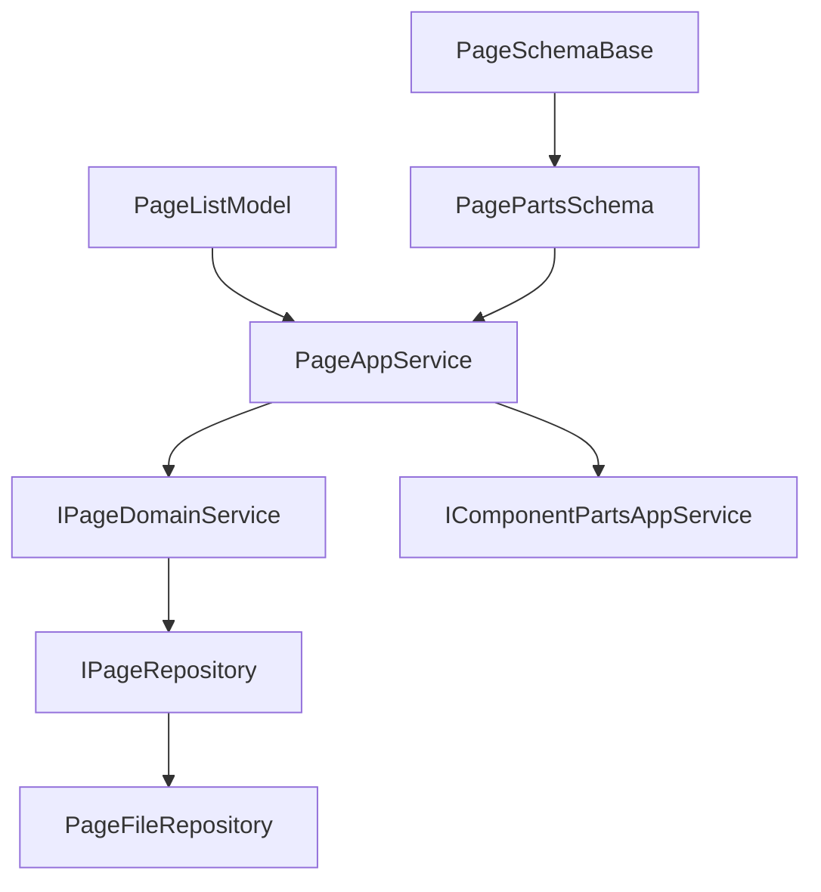
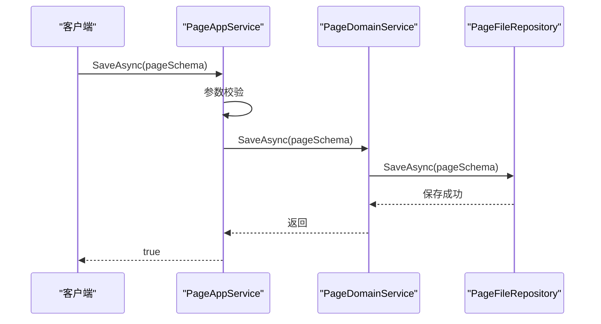
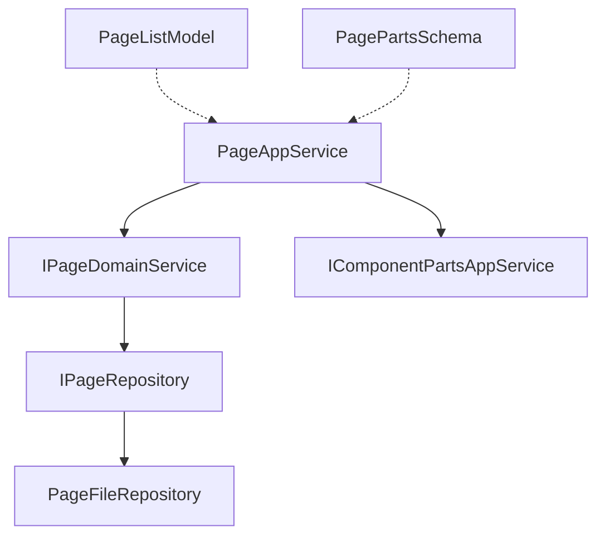

# 页面管理服务

<cite>
**本文档引用文件**  
- [PageAppService.cs](file://src\DesignEngine\H.LowCode.DesignEngine.Application\AppServices\PageAppService.cs)
- [IPageAppService.cs](file://src\DesignEngine\H.LowCode.DesignEngine.Application.Contracts\AppServices\IPageAppService.cs)
- [PageListModel.cs](file://src\DesignEngine\H.LowCode.DesignEngine.Model\Models\PageListModel.cs)
- [IPageDomainService.cs](file://src\DesignEngine\H.LowCode.DesignEngine.Domain\MetaDomainServices\IPageDomainService.cs)
- [PageDomainService.cs](file://src\DesignEngine\H.LowCode.DesignEngine.Domain\MetaDomainServices\PageDomainService.cs)
- [PageTypeEnum.cs](file://src\Common\H.LowCode.MetaSchema\Enums\PageTypeEnum.cs)
- [PageSchemaBase.cs](file://src\Common\H.LowCode.MetaSchema\PageSchemaBase.cs)
- [PageFileRepository.cs](file://src\DesignEngine\H.LowCode.DesignEngine.Repository.JsonFile\Repositories\PageFileRepository.cs)
</cite>

## 目录
1. [引言](#引言)
2. [项目结构](#项目结构)
3. [核心组件](#核心组件)
4. [架构概览](#架构概览)
5. [详细组件分析](#详细组件分析)
6. [依赖分析](#依赖分析)
7. [性能考量](#性能考量)
8. [故障排除指南](#故障排除指南)
9. [结论](#结论)

## 引言
本文档详细阐述了低代码平台中 `PageAppService` 在页面设计与管理中的核心职责。该服务作为应用层的关键组件，负责协调领域服务完成页面的增删改查、发布、版本管理和元数据操作。文档将深入分析其与 `IPageDomainService` 的协作机制、DTO 与实体的映射逻辑、分页查询实现、事务处理、缓存策略及事件发布机制，并结合代码实例说明页面类型、路由规则和权限校验等关键功能。

## 项目结构
项目采用分层架构，核心页面管理功能位于 `src/DesignEngine` 目录下。主要模块包括：
- **Application**: 应用服务层，`PageAppService` 位于此，处理业务编排。
- **Application.Contracts**: 定义应用服务接口，如 `IPageAppService`。
- **Domain**: 领域层，包含 `IPageDomainService` 和 `PageDomainService`，负责核心业务逻辑。
- **Repository.JsonFile**: 数据访问层，`PageFileRepository` 将页面元数据持久化为 JSON 文件。
- **Model**: 数据传输对象（DTO）定义，如 `PageListModel`。
- **Common/H.LowCode.MetaSchema**: 元数据模型基类和枚举定义。



**图示来源**
- [PageAppService.cs](file://src\DesignEngine\H.LowCode.DesignEngine.Application\AppServices\PageAppService.cs)
- [IPageAppService.cs](file://src\DesignEngine\H.LowCode.DesignEngine.Application.Contracts\AppServices\IPageAppService.cs)
- [IPageDomainService.cs](file://src\DesignEngine\H.LowCode.DesignEngine.Domain\MetaDomainServices\IPageDomainService.cs)
- [PageFileRepository.cs](file://src\DesignEngine\H.LowCode.DesignEngine.Repository.JsonFile\Repositories\PageFileRepository.cs)

**本节来源**
- [PageAppService.cs](file://src\DesignEngine\H.LowCode.DesignEngine.Application\AppServices\PageAppService.cs)
- [project_structure](file://project_structure)

## 核心组件
核心组件包括 `PageAppService`（应用服务）、`IPageDomainService`（领域服务接口）、`PageDomainService`（领域服务实现）和 `PageFileRepository`（仓储实现）。`PageAppService` 作为协调者，调用 `IPageDomainService` 执行业务逻辑，后者通过 `IPageRepository` 操作数据。`PageListModel` 是用于列表展示的 DTO，而 `PagePartsSchema` 则是包含完整页面结构的领域实体。

**本节来源**
- [PageAppService.cs](file://src\DesignEngine\H.LowCode.DesignEngine.Application\AppServices\PageAppService.cs)
- [IPageDomainService.cs](file://src\DesignEngine\H.LowCode.DesignEngine.Domain\MetaDomainServices\IPageDomainService.cs)
- [PageListModel.cs](file://src\DesignEngine\H.LowCode.DesignEngine.Model\Models\PageListModel.cs)

## 架构概览
系统采用经典的分层架构（Application -> Domain -> Repository），确保关注点分离。`PageAppService` 处于应用层，接收外部请求，进行初步校验后，将任务委派给领域服务 `PageDomainService`。领域服务负责业务规则的执行，如页面结构验证，然后通过仓储接口 `IPageRepository` 将数据持久化。当前实现使用 `PageFileRepository` 将页面元数据以 JSON 文件形式存储在磁盘上。



**图示来源**
- [PageAppService.cs](file://src\DesignEngine\H.LowCode.DesignEngine.Application\AppServices\PageAppService.cs)
- [PageDomainService.cs](file://src\DesignEngine\H.LowCode.DesignEngine.Domain\MetaDomainServices\PageDomainService.cs)
- [PageFileRepository.cs](file://src\DesignEngine\H.LowCode.DesignEngine.Repository.JsonFile\Repositories\PageFileRepository.cs)

## 详细组件分析

### PageAppService 分析
`PageAppService` 是页面管理功能的入口，实现了 `IPageAppService` 接口，提供了页面的增删改查、获取及组件查询等 API。

#### 职责与方法
- **增删改查 (CRUD)**: `SaveAsync` 和 `DeleteAsync` 方法分别用于创建/更新和删除页面。`GetListAsync` 和 `GetByIdAsync` 用于查询。
- **协调领域服务**: 服务通过依赖注入获取 `IPageDomainService` 实例，并将其作为 `LazyServiceProvider`，在需要时才解析，以优化性能。所有核心操作（如保存、删除）都直接委托给 `_domainService`。
- **组件属性合并**: `GetByIdWithDefineAsync` 方法在获取页面后，会递归遍历页面中的所有组件，并调用 `MergeComponentPartsDefineRecursive` 方法，从 `IComponentPartsAppService` 获取组件的最新定义（`ComponentPartsDefine`），并将其与页面中组件的实例属性进行合并。这确保了旧的组件实例能够继承新版本组件的所有特性和默认配置。

```csharp
private async Task MergeComponentPartsDefineRecursive(ComponentPartsSchema component)
{
    // 获取组件定义
    var componentPartsDefine = await _componentPartsAppService.GetByIdAsync(component.LibraryId, component.ComponentId);
    // 实例与定义合并
    component.MergeComponentPartsDefine(componentPartsDefine);
    // 递归处理子组件
    if (component.Childrens != null && component.Childrens.Count > 0)
    {
        foreach (var child in component.Childrens)
        {
            await MergeComponentPartsDefineRecursive(child);
        }
    }
}
```

#### 页面 DTO 与实体映射
`PageListModel` 是一个轻量级的 DTO，用于在页面列表中展示关键信息。它与领域实体 `PagePartsSchema` 的映射发生在仓储层（`PageFileRepository`）。

```csharp
// 在 PageFileRepository.GetListAsync 中的映射逻辑
PageListModel model = new()
{
    PageId = pageSchema.Id,
    PageName = pageSchema.Name,
    Order = pageSchema.Order,
    PageType = pageSchema.PageType,
    PublishStatus = pageSchema.PublishStatus,
    ModifiedTime = pageSchema.ModifiedTime
};
```
这种映射将完整的 `PagePartsSchema` 实体精简为列表视图所需的字段，提高了查询效率。

#### 分页查询实现
`GetListAsync` 方法返回一个 `List<PageListModel>`。虽然当前实现没有显式的分页参数（如 `pageIndex`, `pageSize`），但其返回的是一个完整的列表。分页逻辑可能在前端或更高层的 API 网关中实现。服务本身负责从仓储获取所有数据，并按 `Order` 字段进行排序。

**本节来源**
- [PageAppService.cs](file://src\DesignEngine\H.LowCode.DesignEngine.Application\AppServices\PageAppService.cs)
- [PageListModel.cs](file://src\DesignEngine\H.LowCode.DesignEngine.Model\Models\PageListModel.cs)
- [PageFileRepository.cs](file://src\DesignEngine\H.LowCode.DesignEngine.Repository.JsonFile\Repositories\PageFileRepository.cs)

### PageDomainService 分析
`PageDomainService` 是 `IPageDomainService` 接口的实现，它本身不包含复杂的业务逻辑，而是作为一个薄层，将调用转发给 `IPageRepository`。这表明当前的业务规则（如页面创建时的默认配置生成、结构验证、父子关系维护）可能直接内嵌在 `PagePartsSchema` 实体的构造函数或方法中，或者在 `PageAppService` 中完成，而领域服务层主要负责协调。

#### 与 IPageDomainService 的协作
`PageAppService` 通过 `IPageDomainService` 接口与领域服务交互，这遵循了依赖倒置原则。尽管当前 `PageDomainService` 实现较为简单，但它为未来扩展（如添加复杂的验证逻辑、事务管理或事件发布）提供了清晰的扩展点。

**本节来源**
- [PageDomainService.cs](file://src\DesignEngine\H.LowCode.DesignEngine.Domain\MetaDomainServices\PageDomainService.cs)
- [IPageDomainService.cs](file://src\DesignEngine\H.LowCode.DesignEngine.Domain\MetaDomainServices\IPageDomainService.cs)

### 页面保存流程分析
页面保存流程是一个典型的 CQRS 模式应用。

#### 事务处理
在当前基于文件系统的实现中，`PageFileRepository.SaveAsync` 方法将整个页面 Schema 序列化为一个 JSON 文件并写入磁盘。这个操作本身是原子的（覆盖写入），但由于没有数据库事务，无法保证跨多个文件的强一致性。如果未来迁移到数据库，`PageDomainService` 将是添加事务注解（如 `[UnitOfWork]`）的理想位置。

#### 缓存更新策略
当前代码中未发现显式的缓存机制（如内存缓存或分布式缓存）。每次 `GetByIdAsync` 调用都会直接从文件系统读取 JSON 文件。这意味着数据始终是最新，但可能影响性能。一个潜在的优化是在 `PageDomainService` 或 `PageAppService` 中引入缓存层，在数据变更时（`SaveAsync`, `DeleteAsync`）使缓存失效。

#### 事件发布机制
当前代码中未发现事件发布（Event Publishing）的实现。`PageAppService` 在 `SaveAsync` 成功后直接返回 `true`，没有发布任何领域事件（如 `PageCreatedEvent`, `PageUpdatedEvent`）。事件机制可以在此服务中添加，用于通知其他系统（如索引服务、审计服务）页面状态的变更。

**本节来源**
- [PageAppService.cs](file://src\DesignEngine\H.LowCode.DesignEngine.Application\AppServices\PageAppService.cs)
- [PageDomainService.cs](file://src\DesignEngine\H.LowCode.DesignEngine.Domain\MetaDomainServices\PageDomainService.cs)
- [PageFileRepository.cs](file://src\DesignEngine\H.LowCode.DesignEngine.Repository.JsonFile\Repositories\PageFileRepository.cs)

### 页面类型与路由规则
#### 页面类型 (PageTypeEnum)
`PageTypeEnum` 枚举定义了平台支持的页面类型，包括普通页面、表单页面、列表页面和报表页面。该类型存储在 `PageSchemaBase` 的 `PageType` 属性中，用于在运行时区分页面的用途和渲染方式。

```csharp
public enum PageTypeEnum
{
    [Display(Name = "普通")]
    Normal = 0,
    [Display(Name = "表单")]
    Form = 1,
    [Display(Name = "列表")]
    Table = 2,
    [Display(Name = "报表")]
    Report = 5
}
```

#### 路由生成规则
当前代码库中未找到明确的路由生成逻辑。路由规则可能由前端框架（如 Blazor）根据应用和页面的 ID 动态生成，或在 `RenderEngine` 模块中处理。`PageFileRepository` 中的 `pageFileName_Format` 定义了元数据文件的存储路径 `"{0}\{1}\page\{2}.json"`，其中 `{1}` 是 `appId`，`{2}` 是 `pageId`，这暗示了 URL 路径可能与此类似（例如 `/app/{appId}/page/{pageId}`）。

**本节来源**
- [PageTypeEnum.cs](file://src\Common\H.LowCode.MetaSchema\Enums\PageTypeEnum.cs)
- [PageSchemaBase.cs](file://src\Common\H.LowCode.MetaSchema\PageSchemaBase.cs)
- [PageFileRepository.cs](file://src\DesignEngine\H.LowCode.DesignEngine.Repository.JsonFile\Repositories\PageFileRepository.cs)

### 权限校验逻辑
在分析的 `PageAppService`、`PageDomainService` 和 `PageFileRepository` 代码中，**未发现显式的权限校验逻辑**。例如，在 `SaveAsync` 或 `DeleteAsync` 方法中，没有检查当前用户是否具有修改特定 `appId` 下页面的权限。这表明权限校验可能在更上层的拦截器、中间件或 API 网关中实现，或者在未来的版本中需要添加。

**本节来源**
- [PageAppService.cs](file://src\DesignEngine\H.LowCode.DesignEngine.Application\AppServices\PageAppService.cs)
- [PageDomainService.cs](file://src\DesignEngine\H.LowCode.DesignEngine.Domain\MetaDomainServices\PageDomainService.cs)

### API 示例
#### 创建表单页面
```csharp
// 1. 创建页面 Schema
var formPage = new PagePartsSchema
{
    AppId = "caseapp",
    Name = "用户信息表单",
    PageType = PageTypeEnum.Form,
    Order = 1,
    PageProperty = new PagePropertySchema { PageLayout = 1 }, // 一列表单
    Components = new List<ComponentPartsSchema>()
    // ... 添加表单组件
};

// 2. 调用服务保存
var success = await pageAppService.SaveAsync(formPage);
if (success)
{
    Console.WriteLine("表单页面创建成功！");
}
```

#### 更新页面布局配置
```csharp
// 1. 获取现有页面
var pageSchema = await pageAppService.GetByIdAsync("caseapp", "0lgu6xpop");

// 2. 修改布局
pageSchema.PageProperty.PageLayout = 3; // 改为三列布局

// 3. 保存更新
await pageAppService.SaveAsync(pageSchema);
```

**本节来源**
- [PageAppService.cs](file://src\DesignEngine\H.LowCode.DesignEngine.Application\AppServices\PageAppService.cs)
- [PageSchemaBase.cs](file://src\Common\H.LowCode.MetaSchema\PageSchemaBase.cs)
- [PageTypeEnum.cs](file://src\Common\H.LowCode.MetaSchema\Enums\PageTypeEnum.cs)

## 依赖分析
`PageAppService` 的主要依赖关系清晰：
- **强依赖**: `IPageDomainService` (领域服务) 和 `IComponentPartsAppService` (用于组件定义合并)。
- **间接依赖**: 通过领域服务依赖 `IPageRepository`，最终由 `PageFileRepository` 实现。
- **数据模型依赖**: `PageListModel` 和 `PagePartsSchema`。



**图示来源**
- [PageAppService.cs](file://src\DesignEngine\H.LowCode.DesignEngine.Application\AppServices\PageAppService.cs)
- [IPageDomainService.cs](file://src\DesignEngine\H.LowCode.DesignEngine.Domain\MetaDomainServices\IPageDomainService.cs)
- [PageFileRepository.cs](file://src\DesignEngine\H.LowCode.DesignEngine.Repository.JsonFile\Repositories\PageFileRepository.cs)

**本节来源**
- [PageAppService.cs](file://src\DesignEngine\H.LowCode.DesignEngine.Application\AppServices\PageAppService.cs)

## 性能考量
- **优点**: 基于文件的存储简单、轻量，读取速度快，适合元数据不频繁变更的场景。
- **缺点**: 
  - **列表查询**: `GetListAsync` 会扫描整个 `page` 目录并读取每个 JSON 文件，当页面数量庞大时，性能会显著下降。建议实现分页和缓存。
  - **缓存缺失**: 缺少缓存机制，每次请求都会触发磁盘 I/O。
  - **并发写入**: 文件系统在高并发写入时可能存在锁竞争问题。

## 故障排除指南
- **页面无法保存**: 检查 `appId` 和 `pageId` 是否为空，确认磁盘路径 `{metaBaseDir}\{appId}\page\` 是否可写。
- **页面列表为空**: 确认 `appId` 是否正确，检查对应应用的 `page` 目录是否存在且包含 `.json` 文件。
- **组件属性未更新**: 确保 `IComponentPartsAppService` 能正确返回最新的组件定义，检查 `MergeComponentPartsDefineRecursive` 逻辑是否执行。

**本节来源**
- [PageAppService.cs](file://src\DesignEngine\H.LowCode.DesignEngine.Application\AppServices\PageAppService.cs)
- [PageFileRepository.cs](file://src\DesignEngine\H.LowCode.DesignEngine.Repository.JsonFile\Repositories\PageFileRepository.cs)

## 结论
`PageAppService` 是低代码平台页面管理的核心服务，它通过协调 `IPageDomainService` 和 `IComponentPartsAppService`，高效地完成了页面的全生命周期管理。其设计遵循了分层架构和依赖倒置原则。然而，当前实现缺少事务、缓存和事件发布等高级特性，且权限校验需在外部处理。未来可通过引入数据库、缓存和领域事件来增强系统的健壮性和可扩展性。