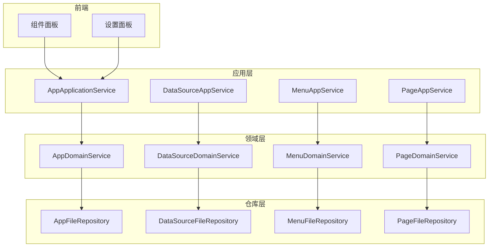
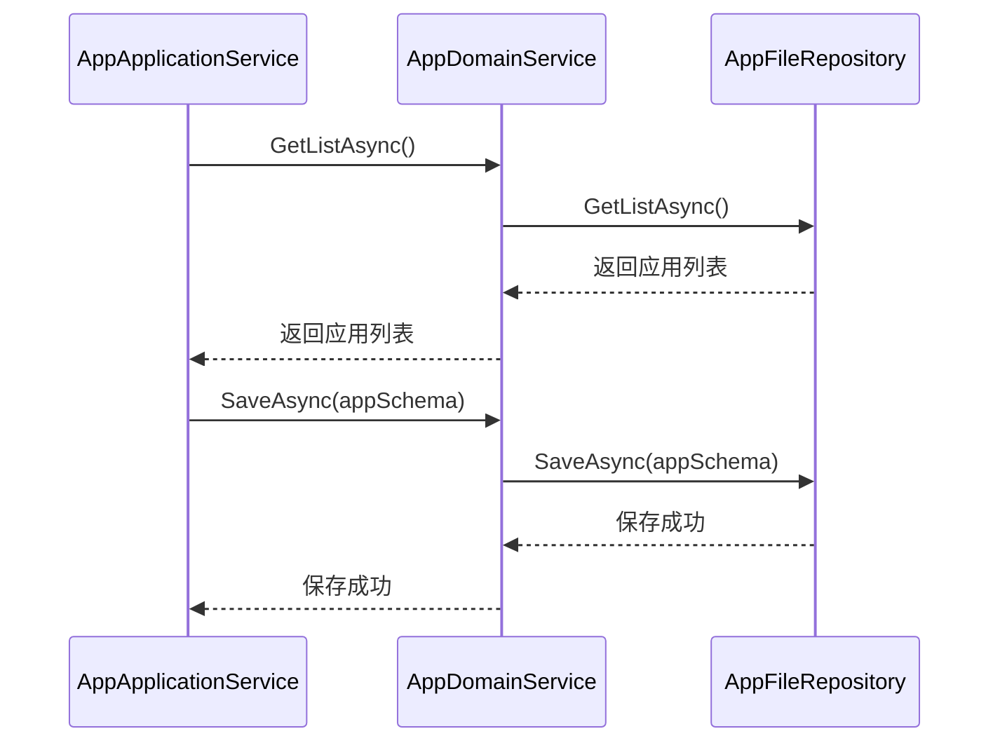
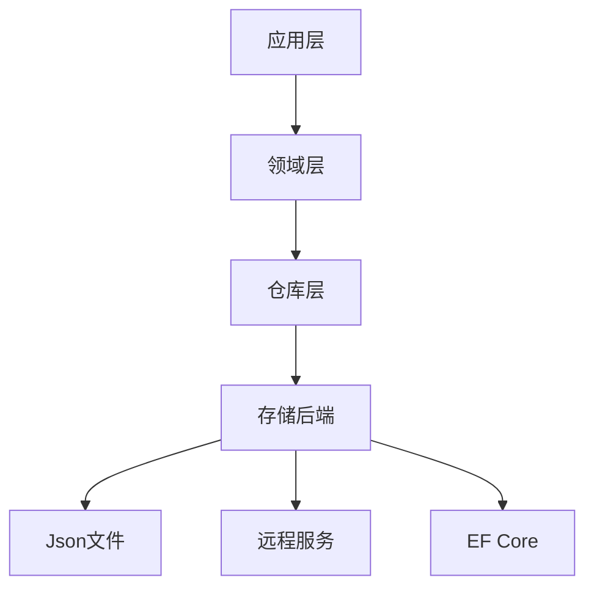
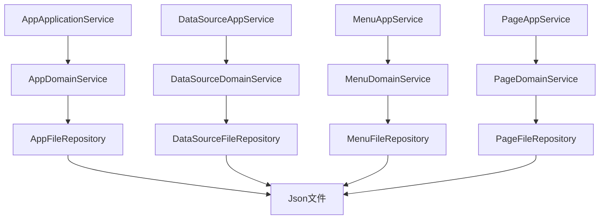

# 设计引擎

<cite>
**本文档中引用的文件**
- [AppApplicationService.cs](file://src\DesignEngine\H.LowCode.DesignEngine.Application\AppServices\AppApplicationService.cs)
- [AppDomainService.cs](file://src\DesignEngine\H.LowCode.DesignEngine.Domain\MetaDomainServices\AppDomainService.cs)
- [FileRepositoryBase.cs](file://src\DesignEngine\H.LowCode.DesignEngine.Repository.JsonFile\Base\FileRepositoryBase.cs)
- [AppFileRepository.cs](file://src\DesignEngine\H.LowCode.DesignEngine.Repository.JsonFile\Repositories\AppFileRepository.cs)
- [DragItem.razor.css](file://src\DesignEngine\H.LowCode.DesignEngine\ComponentPanel\DragItem.razor.css)
- [PageSetting.razor.css](file://src\DesignEngine\H.LowCode.DesignEngine\SettingPanel\PageSetting.razor.css)
- [DragDropStateService.cs](file://src\DesignEngine\H.LowCode.DesignEngineBase\Services\DragDropStateService.cs)
- [ComponentPartsSchema.cs](file://src\Common\H.LowCode.MetaSchema.DesignEngine\ComponentPartsSchema.cs)
- [PagePartsSchema.cs](file://src\Common\H.LowCode.MetaSchema.DesignEngine\PagePartsSchema.cs)
- [ComponentDesignStateSchema.cs](file://src\Common\H.LowCode.MetaSchema.DesignEngine\PropertySchemas\ComponentDesignStateSchema.cs)
</cite>

## 目录
1. [简介](#简介)
2. [项目结构](#项目结构)
3. [核心组件](#核心组件)
4. [架构概述](#架构概述)
5. [详细组件分析](#详细组件分析)
6. [依赖关系分析](#依赖关系分析)
7. [性能考量](#性能考量)
8. [故障排除指南](#故障排除指南)
9. [结论](#结论)

## 简介
设计引擎是低代码平台中的可视化开发环境，允许用户通过拖拽方式构建应用程序界面。该引擎采用分层架构，包含应用层、领域层和仓库层，支持多种存储后端（如JsonFile、RemoteService、EF Core）。本文档全面阐述设计引擎的功能与实现机制，重点分析其模块组成、调用关系以及元数据持久化机制。

## 项目结构
设计引擎的项目结构清晰地划分为多个模块，每个模块负责不同的功能。主要模块包括：
- **H.LowCode.DesignEngine**: 包含前端组件和样式文件。
- **H.LowCode.DesignEngine.Application**: 提供应用服务，处理业务逻辑。
- **H.LowCode.DesignEngine.Domain**: 封装业务逻辑和领域规则。
- **H.LowCode.DesignEngine.Repository.JsonFile**: 实现基于JSON文件的元数据持久化。
- **H.LowCode.DesignEngineBase**: 提供基础服务，如拖拽状态管理。



**图示来源**
- [AppApplicationService.cs](file://src\DesignEngine\H.LowCode.DesignEngine.Application\AppServices\AppApplicationService.cs)
- [AppDomainService.cs](file://src\DesignEngine\H.LowCode.DesignEngine.Domain\MetaDomainServices\AppDomainService.cs)
- [AppFileRepository.cs](file://src\DesignEngine\H.LowCode.DesignEngine.Repository.JsonFile\Repositories\AppFileRepository.cs)

**本节来源**
- [AppApplicationService.cs](file://src\DesignEngine\H.LowCode.DesignEngine.Application\AppServices\AppApplicationService.cs)
- [AppDomainService.cs](file://src\DesignEngine\H.LowCode.DesignEngine.Domain\MetaDomainServices\AppDomainService.cs)
- [AppFileRepository.cs](file://src\DesignEngine\H.LowCode.DesignEngine.Repository.JsonFile\Repositories\AppFileRepository.cs)

## 核心组件
设计引擎的核心组件包括应用服务、领域服务和仓库服务。这些组件协同工作，实现应用、页面、菜单和数据源的CRUD操作。

### 应用服务与领域服务的调用关系
应用服务（AppApplicationService）通过依赖注入获取领域服务（AppDomainService）的实例，并调用其方法来处理业务逻辑。领域服务进一步调用仓库服务（IAppRepository）来持久化数据。



**图示来源**
- [AppApplicationService.cs](file://src\DesignEngine\H.LowCode.DesignEngine.Application\AppServices\AppApplicationService.cs)
- [AppDomainService.cs](file://src\DesignEngine\H.LowCode.DesignEngine.Domain\MetaDomainServices\AppDomainService.cs)
- [AppFileRepository.cs](file://src\DesignEngine\H.LowCode.DesignEngine.Repository.JsonFile\Repositories\AppFileRepository.cs)

**本节来源**
- [AppApplicationService.cs](file://src\DesignEngine\H.LowCode.DesignEngine.Application\AppServices\AppApplicationService.cs)
- [AppDomainService.cs](file://src\DesignEngine\H.LowCode.DesignEngine.Domain\MetaDomainServices\AppDomainService.cs)

## 架构概述
设计引擎采用典型的分层架构，分为应用层、领域层和仓库层。每一层都有明确的职责，确保系统的可维护性和可扩展性。

### 分层架构
- **应用层**: 提供应用、页面、菜单、数据源的CRUD服务。
- **领域层**: 封装业务逻辑和领域规则。
- **仓库层**: 支持多种存储后端，如JsonFile、RemoteService、EF Core。



**图示来源**
- [AppApplicationService.cs](file://src\DesignEngine\H.LowCode.DesignEngine.Application\AppServices\AppApplicationService.cs)
- [AppDomainService.cs](file://src\DesignEngine\H.LowCode.DesignEngine.Domain\MetaDomainServices\AppDomainService.cs)
- [AppFileRepository.cs](file://src\DesignEngine\H.LowCode.DesignEngine.Repository.JsonFile\Repositories\AppFileRepository.cs)

**本节来源**
- [AppApplicationService.cs](file://src\DesignEngine\H.LowCode.DesignEngine.Application\AppServices\AppApplicationService.cs)
- [AppDomainService.cs](file://src\DesignEngine\H.LowCode.DesignEngine.Domain\MetaDomainServices\AppDomainService.cs)
- [AppFileRepository.cs](file://src\DesignEngine\H.LowCode.DesignEngine.Repository.JsonFile\Repositories\AppFileRepository.cs)

## 详细组件分析
### 元数据持久化机制
设计引擎通过`FileRepositoryBase`类实现元数据的持久化。该类提供了读取和写入JSON文件的基本方法，具体的仓库实现类（如`AppFileRepository`）继承自`FileRepositoryBase`，并实现具体的持久化逻辑。

#### FileRepositoryBase
`FileRepositoryBase`是所有文件仓库的基类，负责初始化元数据目录路径，并提供读取文件内容的方法。

```csharp
public abstract class FileRepositoryBase
{
    public bool? IsChangeTrackingEnabled { get; set; }

    protected static string _metaBaseDir;

    public FileRepositoryBase(IOptions<MetaOption> metaOption)
    {
        _metaBaseDir = metaOption.Value.AppsFilePath;
        IsChangeTrackingEnabled = false;
    }

    protected static string ReadAllText(string fileName)
    {
        if (!File.Exists(fileName))
            throw new FileNotFoundException(fileName);

        return File.ReadAllText(fileName, Encoding.UTF8);
    }
}
```

**本节来源**
- [FileRepositoryBase.cs](file://src\DesignEngine\H.LowCode.DesignEngine.Repository.JsonFile\Base\FileRepositoryBase.cs)

#### AppFileRepository
`AppFileRepository`实现了`IAppRepository`接口，负责应用元数据的持久化。它将应用元数据保存为JSON文件，并存储在指定的目录中。

```csharp
public class AppFileRepository : FileRepositoryBase, IAppRepository
{
    private static string appFileName_Format = @"{0}\{1}\{2}.json";

    public async Task<IList<AppPartsSchema>> GetListAsync()
    {
        List<AppPartsSchema> appSchemas = [];

        if (Directory.Exists(_metaBaseDir) == false)
            return appSchemas;

        var directories = Directory.GetDirectories(_metaBaseDir);
        foreach (var directory in directories)
        {
            DirectoryInfo dirInfo = new(directory);
            var fileName = string.Format(appFileName_Format, _metaBaseDir, dirInfo.Name, dirInfo.Name);

            if (!File.Exists(fileName))
                continue;

            var appSchemaJson = ReadAllText(fileName);
            var appSchema = appSchemaJson.FromJson<AppPartsSchema>();
            appSchemas.Add(appSchema);
        }

        return await Task.FromResult(appSchemas);
    }

    public async Task SaveAsync(AppPartsSchema appSchema)
    {
        ArgumentNullException.ThrowIfNull(appSchema);
        ArgumentException.ThrowIfNullOrEmpty(appSchema.Id);

        appSchema.ModifiedTime = DateTime.UtcNow;

        string fileName = string.Format(appFileName_Format, _metaBaseDir, appSchema.Id, appSchema.Id);

        string fileDirectory = Path.GetDirectoryName(fileName);
        if (!Directory.Exists(fileDirectory))
            Directory.CreateDirectory(fileDirectory);

        File.WriteAllText(fileName, appSchema.ToJson(), Encoding.UTF8);
        await Task.CompletedTask;
    }

    public async Task<AppPartsSchema> GetAsync(string appId)
    {
        string fileName = string.Format(appFileName_Format, _metaBaseDir, appId, appId);

        var appSchemaJson = ReadAllText(fileName);
        var appSchema = appSchemaJson.FromJson<AppPartsSchema>();
        return await Task.FromResult(appSchema);
    }
}
```

**本节来源**
- [AppFileRepository.cs](file://src\DesignEngine\H.LowCode.DesignEngine.Repository.JsonFile\Repositories\AppFileRepository.cs)

### 前端实现
设计引擎的前端实现主要包括组件面板、属性设置面板和拖拽状态管理服务。

#### 组件面板
组件面板通过`DragItem.razor.css`文件定义样式，每个组件项具有固定的宽度和高度，并在鼠标悬停时显示边框和颜色变化。

```css
.dragitem {
    float: left;
    width: 6.8rem;
    height: 2.2rem;
    margin: 4px;
    cursor: pointer;
    display: flex;
    justify-content: center;
    align-items: center;
    color: #333;
    background-color: #f5f7fa;
}

.dragitem:hover {
    border: #409eff dashed 1px;
    color: #409eff;
}
```

**本节来源**
- [DragItem.razor.css](file://src\DesignEngine\H.LowCode.DesignEngine\ComponentPanel\DragItem.razor.css)

#### 属性设置面板
属性设置面板通过`PageSetting.razor.css`文件定义样式，每个设置项具有一定的外边距。

```css
.pagesetting-item {
    margin: 5px 15px 20px 10px;
}
```

**本节来源**
- [PageSetting.razor.css](file://src\DesignEngine\H.LowCode.DesignEngine\SettingPanel\PageSetting.razor.css)

#### 拖拽状态管理服务
`DragDropStateService`负责管理拖拽过程中的各种状态，包括当前拖拽的组件、最后选中的组件、最后拖拽到的组件等。该服务通过字典存储不同应用和页面的状态，并提供相应的获取和设置方法。

```csharp
public class DragDropStateService
{
    private IDictionary<string, DragDropStateSchema> schemaStates = new Dictionary<string, DragDropStateSchema>();

    public ComponentPartsSchema GetRootComponent(string appId, string pageId)
    {
        var stateSchema = GetStateSchema(appId, pageId);
        return stateSchema?.RootComponent;
    }

    public void SetRootComponent(string appId, string pageId, ComponentPartsSchema rootComponent)
    {
        SetStateSchema(appId, pageId, (stateSchema) => {
            stateSchema.RootComponent = rootComponent;
        });
    }

    // 其他方法...
}
```

**本节来源**
- [DragDropStateService.cs](file://src\DesignEngine\H.LowCode.DesignEngineBase\Services\DragDropStateService.cs)

### 数据结构分析
#### ComponentPartsSchema
`ComponentPartsSchema`类定义了组件的元数据结构，包括组件ID、名称、类型、渲染片段、数据源、属性定义分组、子组件等。此外，还包含设计过程中的状态信息，如是否选中、拖拽效果样式等。

```csharp
public class ComponentPartsSchema : ComponentSchemaBase
{
    [JsonPropertyName("partsId")]
    public string PartsId { get; set; } = ShortIdGenerator.Generate();

    [JsonPropertyName("libid")]
    public string LibraryId { get; set; }

    [JsonPropertyName("cn")]
    public string ComponentName { get; set; }

    [JsonPropertyName("ct")]
    public int ComponentType { get; set; }

    [JsonPropertyName("frag")]
    public ComponentPartsFragmentSchema Fragment { get; set; }

    [JsonPropertyName("ds")]
    public ComponentPartsDataSourceSchema DataSource { get; set; } = new();

    [JsonPropertyName("attrdefgroups")]
    public IEnumerable<ComponentPartsAttributeDefineGroupSchema> AttributeDefineGroups { get; set; } = [];

    [JsonPropertyName("childs")]
    public IList<ComponentPartsSchema> Childrens { get; set; } = [];

    [JsonPropertyName("sptevs")]
    public string[] SupportEvents { get; set; }

    [JsonPropertyName("order")]
    public int Order { get; set; }

    [JsonPropertyName("pub")]
    public int PublishStatus { get; set; }

    [JsonPropertyName("mt")]
    public DateTime ModifiedTime { get; set; }

    [JsonIgnore]
    public ComponentDesignStateSchema DesignState { get; set; } = new();

    [JsonIgnore]
    public Action Refresh { get; set; }

    public void RefreshState()
    {
        Refresh?.Invoke();
    }

    // 其他方法...
}
```

**本节来源**
- [ComponentPartsSchema.cs](file://src\Common\H.LowCode.MetaSchema.DesignEngine\ComponentPartsSchema.cs)

#### PagePartsSchema
`PagePartsSchema`类定义了页面的元数据结构，包括组件列表和支持的事件。

```csharp
public class PagePartsSchema : PageSchemaBase
{
    [JsonPropertyName("comps")]
    public IList<ComponentPartsSchema> Components { get; set; } = [];

    [JsonPropertyName("sptevs")]
    public string[] SupportEvents { get; } = ["OnLoad"];
}
```

**本节来源**
- [PagePartsSchema.cs](file://src\Common\H.LowCode.MetaSchema.DesignEngine\PagePartsSchema.cs)

#### ComponentDesignStateSchema
`ComponentDesignStateSchema`类定义了组件在设计过程中的状态，这些状态信息无需持久化存储。

```csharp
public class ComponentDesignStateSchema
{
    [JsonIgnore]
    public bool IsSelected { get; set; }

    [JsonIgnore]
    public string DragEffectStyle { get; set; }

    [JsonIgnore]
    public bool IsDroppedFromComponentPanel { get; set; }

    [JsonIgnore]
    public string AnimationTransform { get; set; } = string.Empty;

    [JsonIgnore]
    public bool IsAnimating { get; set; }
}
```

**本节来源**
- [ComponentDesignStateSchema.cs](file://src\Common\H.LowCode.MetaSchema.DesignEngine\PropertySchemas\ComponentDesignStateSchema.cs)

## 依赖关系分析
设计引擎的各个组件之间存在明确的依赖关系。应用服务依赖于领域服务，领域服务依赖于仓库服务，仓库服务依赖于具体的存储后端。



**图示来源**
- [AppApplicationService.cs](file://src\DesignEngine\H.LowCode.DesignEngine.Application\AppServices\AppApplicationService.cs)
- [AppDomainService.cs](file://src\DesignEngine\H.LowCode.DesignEngine.Domain\MetaDomainServices\AppDomainService.cs)
- [AppFileRepository.cs](file://src\DesignEngine\H.LowCode.DesignEngine.Repository.JsonFile\Repositories\AppFileRepository.cs)

**本节来源**
- [AppApplicationService.cs](file://src\DesignEngine\H.LowCode.DesignEngine.Application\AppServices\AppApplicationService.cs)
- [AppDomainService.cs](file://src\DesignEngine\H.LowCode.DesignEngine.Domain\MetaDomainServices\AppDomainService.cs)
- [AppFileRepository.cs](file://src\DesignEngine\H.LowCode.DesignEngine.Repository.JsonFile\Repositories\AppFileRepository.cs)

## 性能考量
设计引擎在处理大量元数据时，应考虑以下性能优化措施：
- 使用缓存机制减少对文件系统的频繁读写。
- 优化JSON序列化和反序列化的性能。
- 在前端实现中，使用虚拟滚动技术提高组件面板的渲染性能。

## 故障排除指南
### 常见问题
- **元数据无法保存**: 检查文件路径是否正确，确保目录存在且有写权限。
- **组件拖拽失效**: 检查`DragDropStateService`是否正确初始化，确保状态管理正常。
- **样式不生效**: 检查CSS文件是否正确引用，确保样式规则没有被覆盖。

### 调试建议
- 使用日志记录关键操作，如保存元数据、加载应用等。
- 在开发环境中启用详细的错误信息，便于定位问题。

**本节来源**
- [AppFileRepository.cs](file://src\DesignEngine\H.LowCode.DesignEngine.Repository.JsonFile\Repositories\AppFileRepository.cs)
- [DragDropStateService.cs](file://src\DesignEngine\H.LowCode.DesignEngineBase\Services\DragDropStateService.cs)

## 结论
设计引擎通过分层架构和模块化设计，实现了低代码平台的可视化开发功能。应用服务、领域服务和仓库服务的协同工作，确保了元数据的高效管理和持久化。前端组件面板和属性设置面板的实现，提供了直观的用户界面。拖拽状态管理服务则保证了拖拽操作的流畅性和状态的一致性。通过合理的性能优化和故障排除措施，设计引擎能够稳定高效地支持低代码应用的开发。