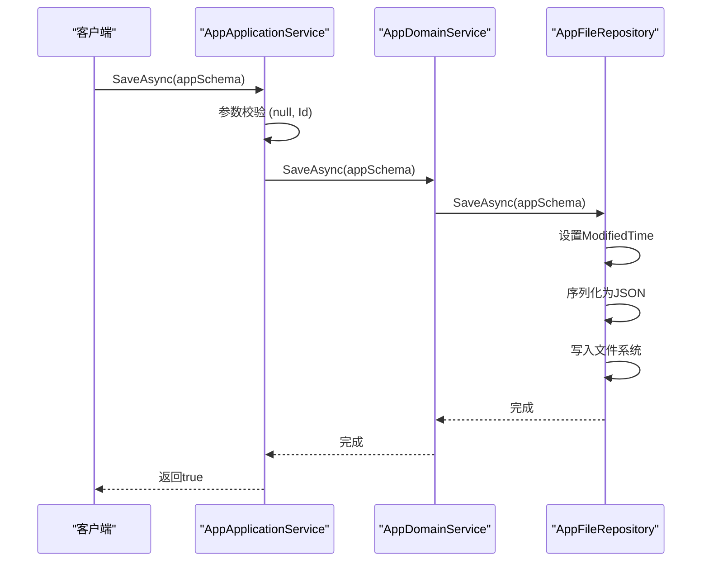
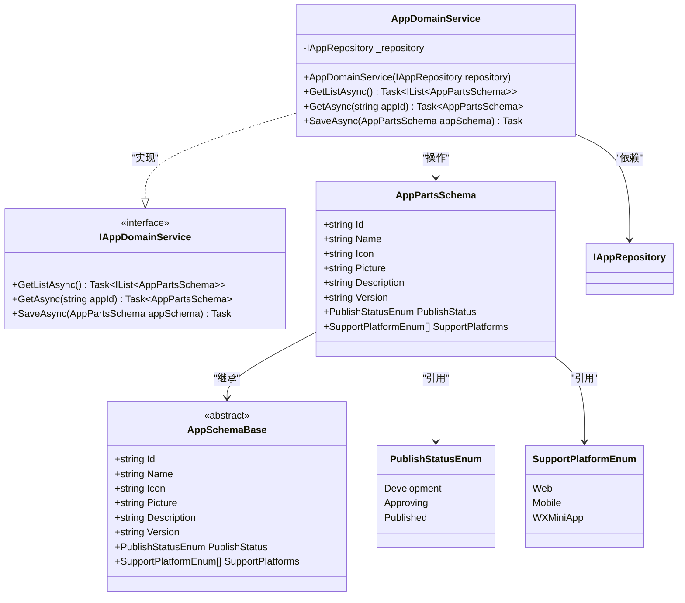

# 应用领域服务

<cite>
**本文档引用文件**   
- [AppDomainService.cs](file://src/DesignEngine/H.LowCode.DesignEngine.Domain/MetaDomainServices/AppDomainService.cs)
- [IAppDomainService.cs](file://src/DesignEngine/H.LowCode.DesignEngine.Domain/MetaDomainServices/IAppDomainService.cs)
- [AppFileRepository.cs](file://src/DesignEngine/H.LowCode.DesignEngine.Repository.JsonFile/Repositories/AppFileRepository.cs)
- [AppApplicationService.cs](file://src/DesignEngine/H.LowCode.DesignEngine.Application/AppServices/AppApplicationService.cs)
- [AppSchemaBase.cs](file://src/Common/H.LowCode.MetaSchema/AppSchemaBase.cs)
- [AppPartsSchema.cs](file://src/Common/H.LowCode.MetaSchema.DesignEngine/AppPartsSchema.cs)
- [PublishStatusEnum.cs](file://src/Common/H.LowCode.MetaSchema/Enums/PublishStatusEnum.cs)
- [SupportPlatformEnum.cs](file://src/Common/H.LowCode.MetaSchema/Enums/SupportPlatformEnum.cs)
- [FileRepositoryBase.cs](file://src/DesignEngine/H.LowCode.DesignEngine.Repository.JsonFile/Base/FileRepositoryBase.cs)
</cite>

## 目录
1. [项目结构](#项目结构)
2. [核心组件](#核心组件)
3. [架构概览](#架构概览)
4. [详细组件分析](#详细组件分析)
5. [依赖分析](#依赖分析)
6. [性能考量](#性能考量)
7. [最佳实践与优化建议](#最佳实践与优化建议)

## 项目结构

本项目采用模块化分层架构，主要分为 `Common`、`DesignEngine` 和 `RenderEngine` 三大模块。`Common` 模块存放共享的元数据模型和基础组件；`DesignEngine` 负责应用的设计时功能，包含领域服务、应用服务和基于 JSON 文件的元数据持久化；`RenderEngine` 则负责运行时渲染逻辑。

应用元数据（如应用、页面、菜单）以 JSON 文件形式存储在 `meta/apps` 目录下，每个应用一个子目录，其核心配置文件与应用ID同名。设计引擎通过 `AppFileRepository` 实现对这些文件的读写操作。

```mermaid
graph TB
subgraph "设计引擎 DesignEngine"
subgraph "领域层 Domain"
AppDomainService["应用领域服务<br/>AppDomainService"]
IAppDomainService["应用领域服务接口<br/>IAppDomainService"]
end
subgraph "应用层 Application"
AppApplicationService["应用应用服务<br/>AppApplicationService"]
IAppApplicationService["应用应用服务接口<br/>IAppApplicationService"]
end
subgraph "仓储层 Repository"
AppFileRepository["应用文件仓储<br/>AppFileRepository"]
IAppRepository["应用仓储接口<br/>IAppRepository"]
end
AppDomainService --> AppFileRepository : "依赖"
AppApplicationService --> AppDomainService : "调用"
end
subgraph "公共模块 Common"
AppSchemaBase["应用元数据基类<br/>AppSchemaBase"]
AppPartsSchema["应用部件元数据<br/>AppPartsSchema"]
PublishStatusEnum["发布状态枚举<br/>PublishStatusEnum"]
SupportPlatformEnum["支持平台枚举<br/>SupportPlatformEnum"]
end
AppPartsSchema --> AppSchemaBase : "继承"
AppFileRepository --> AppPartsSchema : "读写"
AppDomainService --> AppPartsSchema : "操作"
```

**图示来源**
- [AppDomainService.cs](file://src/DesignEngine/H.LowCode.DesignEngine.Domain/MetaDomainServices/AppDomainService.cs)
- [AppFileRepository.cs](file://src/DesignEngine/H.LowCode.DesignEngine.Repository.JsonFile/Repositories/AppFileRepository.cs)
- [AppApplicationService.cs](file://src/DesignEngine/H.LowCode.DesignEngine.Application/AppServices/AppApplicationService.cs)
- [AppPartsSchema.cs](file://src/Common/H.LowCode.MetaSchema.DesignEngine/AppPartsSchema.cs)

## 核心组件

`AppDomainService` 是低代码平台中负责应用生命周期管理的核心领域服务。它遵循领域驱动设计（DDD）原则，封装了与应用聚合根相关的所有业务逻辑和规则。该服务不直接处理持久化，而是通过依赖倒置，将数据访问操作委托给 `IAppRepository` 接口，从而实现了业务逻辑与数据存储的解耦。

其主要职责包括：
- **应用元数据的获取**：提供异步方法获取所有应用列表或根据ID获取单个应用。
- **应用元数据的保存**：协调应用聚合根的持久化操作。
- **业务规则的执行**：虽然当前实现较为简单，但其设计为未来扩展复杂的业务校验逻辑（如唯一性检查、状态流转）提供了清晰的入口。

**本节来源**
- [AppDomainService.cs](file://src/DesignEngine/H.LowCode.DesignEngine.Domain/MetaDomainServices/AppDomainService.cs)
- [IAppDomainService.cs](file://src/DesignEngine/H.LowCode.DesignEngine.Domain/MetaDomainServices/IAppDomainService.cs)

## 架构概览

系统采用典型的分层架构，从上至下分为应用服务层、领域服务层和仓储层。

1.  **应用服务层 (Application Layer)**：`AppApplicationService` 作为应用服务，是外部（如前端API）的直接调用入口。它负责处理应用服务契约、数据传输对象（DTO）的转换，并协调领域服务的调用。
2.  **领域服务层 (Domain Layer)**：`AppDomainService` 作为领域服务，是业务逻辑的核心。它专注于应用聚合根的业务规则和状态管理，确保数据的一致性和完整性。
3.  **仓储层 (Repository Layer)**：`AppFileRepository` 实现了 `IAppRepository` 接口，负责将 `AppPartsSchema` 对象持久化到文件系统（JSON文件）或从文件系统中读取。它隐藏了底层存储的细节。

这种分层确保了关注点分离，使得业务逻辑清晰、可测试且易于维护。



**图示来源**
- [AppApplicationService.cs](file://src/DesignEngine/H.LowCode.DesignEngine.Application/AppServices/AppApplicationService.cs)
- [AppDomainService.cs](file://src/DesignEngine/H.LowCode.DesignEngine.Domain/MetaDomainServices/AppDomainService.cs)
- [AppFileRepository.cs](file://src/DesignEngine/H.LowCode.DesignEngine.Repository.JsonFile/Repositories/AppFileRepository.cs)

## 详细组件分析

### 应用领域服务 (AppDomainService) 分析

`AppDomainService` 的实现简洁而符合DDD规范。它通过构造函数注入 `IAppRepository`，体现了依赖注入和依赖倒置原则。

#### 类图


**图示来源**
- [AppDomainService.cs](file://src/DesignEngine/H.LowCode.DesignEngine.Domain/MetaDomainServices/AppDomainService.cs)
- [IAppDomainService.cs](file://src/DesignEngine/H.LowCode.DesignEngine.Domain/MetaDomainServices/IAppDomainService.cs)
- [AppSchemaBase.cs](file://src/Common/H.LowCode.MetaSchema/AppSchemaBase.cs)
- [AppPartsSchema.cs](file://src/Common/H.LowCode.MetaSchema.DesignEngine/AppPartsSchema.cs)
- [PublishStatusEnum.cs](file://src/Common/H.LowCode.MetaSchema/Enums/PublishStatusEnum.cs)
- [SupportPlatformEnum.cs](file://src/Common/H.LowCode.MetaSchema/Enums/SupportPlatformEnum.cs)

#### 业务规则校验逻辑

根据当前代码分析，`AppDomainService` 本身并未实现复杂的业务规则校验。其 `SaveAsync` 方法直接委托给仓储层。然而，**业务规则的校验点主要位于其上层调用者 `AppApplicationService`**：

1.  **参数校验**：在 `AppApplicationService.SaveAsync` 方法中，明确调用了 `ArgumentNullException.ThrowIfNull(appSchema)` 和 `ArgumentException.ThrowIfNullOrEmpty(appSchema.Id)`，确保了传入的应用元数据对象及其ID不为空。这是最基础的输入验证。
2.  **元数据完整性**：由于 `AppPartsSchema` 继承自 `AppSchemaBase`，其核心属性（如 `Id`, `Name`, `PublishStatus`）在反序列化时会由JSON框架处理。若JSON中缺少这些字段，反序列化可能失败或使用默认值，这构成了隐式的完整性检查。
3.  **状态流转控制**：`PublishStatusEnum` 定义了 `Development`、`Approving`、`Published` 三种状态，为状态流转提供了数据基础。但当前代码中并未实现状态变更的业务规则（例如，不能从 `Published` 直接变更为 `Development`），这部分逻辑需要在 `AppDomainService` 或 `AppApplicationService` 中补充。
4.  **应用标识唯一性**：当前的 `AppFileRepository` 在保存时，会根据 `appSchema.Id` 确定文件路径。如果存在同名文件，新内容会直接覆盖旧文件。这表明**系统目前没有强制执行应用ID的唯一性检查**。要实现唯一性，需要在 `SaveAsync` 过程中，先查询所有应用，检查ID是否已存在。

#### 聚合根构建与持久化

- **聚合根构建**：`AppPartsSchema` 类本身非常简单，仅继承了 `AppSchemaBase`。真正的应用聚合根实例是通过从JSON文件反序列化 `AppPartsSchema` 对象来构建的。这个过程由 `AppFileRepository.GetAsync` 完成。
- **持久化操作**：`AppDomainService` 通过调用 `IAppRepository.SaveAsync(AppPartsSchema appSchema)` 来实现持久化。`AppFileRepository` 的实现会：
    1.  验证 `appSchema` 和 `Id` 不为空。
    2.  更新 `ModifiedTime` 为当前UTC时间。
    3.  根据 `Id` 确定文件路径（格式为 `{metaBaseDir}/{appId}/{appId}.json`）。
    4.  确保目录存在，然后将对象序列化为JSON字符串并写入文件。

#### 异常处理与事务边界

- **异常处理**：当前代码的异常处理较为基础。`AppApplicationService` 处理了空值参数，而 `AppFileRepository` 在文件操作时可能抛出 `IOException` 等，但未在 `AppDomainService` 或 `AppApplicationService` 中显式捕获和处理。建议在 `AppDomainService` 中捕获仓储层异常，并根据情况抛出更具体的领域异常（如 `AppSaveFailedException`）。
- **事务边界**：由于应用元数据是独立的JSON文件，且 `AppDomainService` 只操作单个 `AppPartsSchema`，因此其 `SaveAsync` 方法的事务边界就是单个文件的写入操作。文件系统的原子性（写入成功或失败）保证了单个应用数据的最终一致性。对于跨聚合（如应用、页面、菜单）的一致性维护，当前设计未体现，需要更高级的协调机制。

**本节来源**
- [AppDomainService.cs](file://src/DesignEngine/H.LowCode.DesignEngine.Domain/MetaDomainServices/AppDomainService.cs)
- [AppFileRepository.cs](file://src/DesignEngine/H.LowCode.DesignEngine.Repository.JsonFile/Repositories/AppFileRepository.cs)
- [AppApplicationService.cs](file://src/DesignEngine/H.LowCode.DesignEngine.Application/AppServices/AppApplicationService.cs)
- [AppSchemaBase.cs](file://src/Common/H.LowCode.MetaSchema/AppSchemaBase.cs)

## 依赖分析

`AppDomainService` 的依赖关系清晰，体现了松耦合的设计。

```mermaid
graph TD
AppDomainService --> IAppRepository : "依赖接口"
IAppRepository --> AppFileRepository : "具体实现"
AppFileRepository --> FileRepositoryBase : "继承"
AppFileRepository --> AppPartsSchema : "操作数据"
AppPartsSchema --> AppSchemaBase : "继承"
AppSchemaBase --> PublishStatusEnum : "引用"
AppSchemaBase --> SupportPlatformEnum : "引用"
AppApplicationService --> AppDomainService : "调用服务"
```

**图示来源**
- [AppDomainService.cs](file://src/DesignEngine/H.LowCode.DesignEngine.Domain/MetaDomainServices/AppDomainService.cs)
- [AppFileRepository.cs](file://src/DesignEngine/H.LowCode.DesignEngine.Repository.JsonFile/Repositories/AppFileRepository.cs)
- [AppApplicationService.cs](file://src/DesignEngine/H.LowCode.DesignEngine.Application/AppServices/AppApplicationService.cs)

## 性能考量

- **读取性能**：`GetListAsync` 方法会扫描 `meta/apps` 目录下的所有子目录，并为每个目录读取一个JSON文件。当应用数量庞大时，这可能导致性能瓶颈。优化方案包括引入缓存机制，或维护一个应用列表的索引文件。
- **写入性能**：`SaveAsync` 操作是单个文件的IO操作，性能取决于磁盘速度。由于是直接覆盖写入，不存在复杂的事务开销，性能较好。
- **序列化开销**：每次读写都需要进行JSON的序列化和反序列化，对于大型应用配置，这会带来一定的CPU开销。

## 最佳实践与优化建议

1.  **增强业务规则校验**：在 `AppDomainService` 中实现完整的业务规则，例如：
    ```csharp
    public async Task SaveAsync(AppPartsSchema appSchema)
    {
        // 检查ID唯一性（排除自身）
        var existingApps = await _repository.GetListAsync();
        var existingApp = existingApps.FirstOrDefault(a => a.Id == appSchema.Id && a.Id != appSchema.Id);
        if (existingApp != null)
        {
            throw new BusinessException("应用ID已存在");
        }
        
        // 检查状态流转合法性
        if (appSchema.PublishStatus == PublishStatusEnum.Development && 
            appSchema.PreviousStatus == PublishStatusEnum.Published)
        {
            throw new BusinessException("已发布应用不能直接变更为开发中");
        }
        
        await _repository.SaveAsync(appSchema);
    }
    ```
2.  **引入缓存**：为 `GetListAsync` 和 `GetAsync` 方法添加内存缓存（如 `IMemoryCache`），显著提升读取性能。
3.  **完善异常处理**：在 `AppDomainService` 中捕获 `IAppRepository` 抛出的底层异常，并将其转换为领域特定的业务异常，便于上层服务进行统一处理。
4.  **考虑最终一致性**：如果未来需要维护应用与页面、菜单等实体的一致性，可以考虑使用领域事件（Domain Events）模式。当应用状态变更时，发布一个事件，由其他服务监听并更新关联实体。
5.  **优化文件结构**：对于大型应用，可以考虑将应用元数据拆分为多个文件（如 `app.json`, `pages.json`, `menus.json`），以提高读写效率和可维护性。