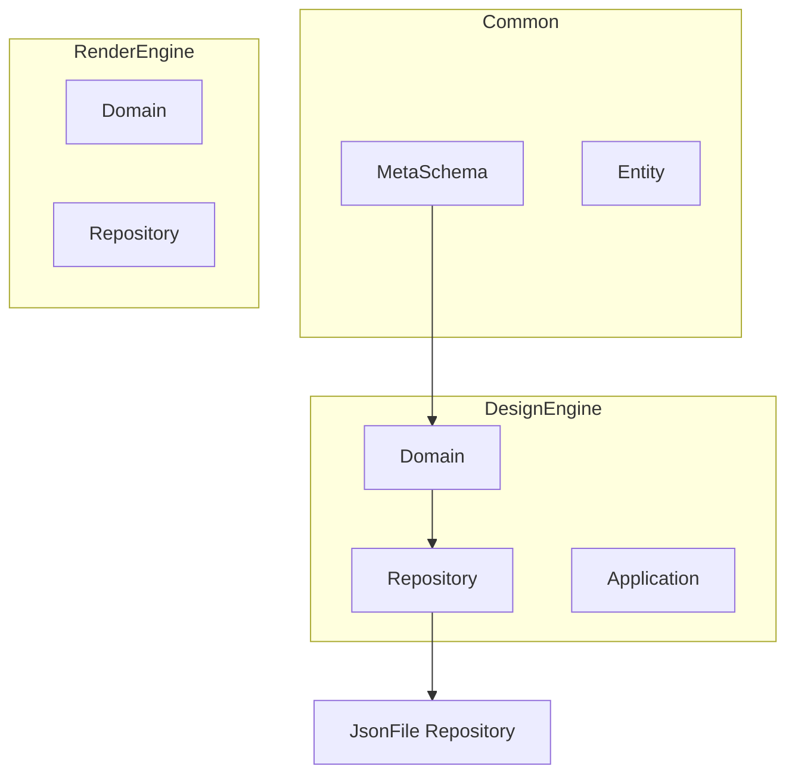
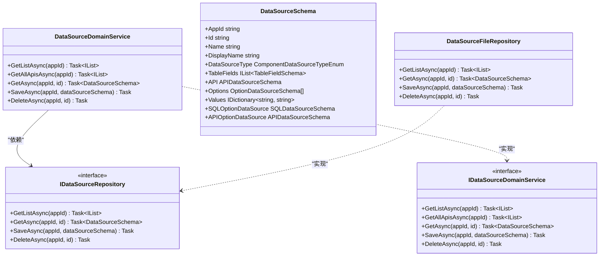
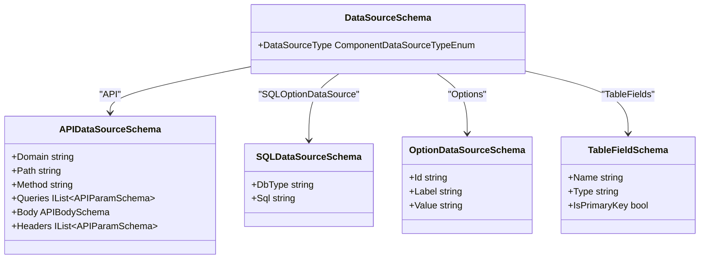
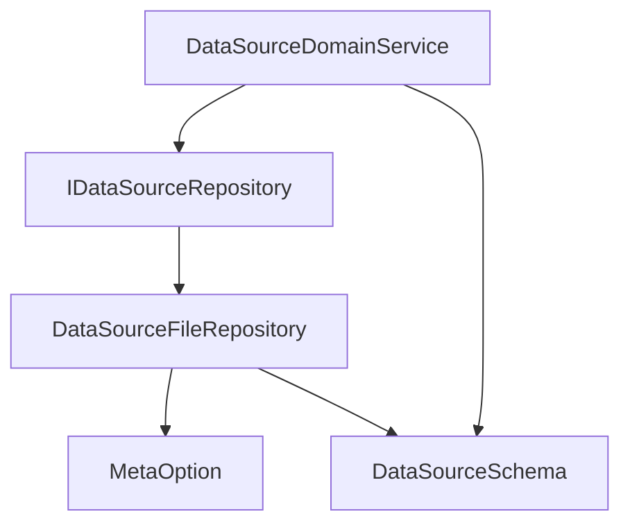

# 数据源领域服务

<cite>
**本文档引用的文件**  
- [DataSourceDomainService.cs](file://src/DesignEngine/H.LowCode.DesignEngine.Domain/MetaDomainServices/DataSourceDomainService.cs)
- [IDataSourceDomainService.cs](file://src/DesignEngine/H.LowCode.DesignEngine.Domain/MetaDomainServices/IDataSourceDomainService.cs)
- [DataSourceSchema.cs](file://src/Common/H.LowCode.MetaSchema/DataSourceSchema.cs)
- [APIDataSourceSchema.cs](file://src/Common/H.LowCode.MetaSchema/DataSourceSchemas/APIDataSourceSchema.cs)
- [SQLDataSourceSchema.cs](file://src/Common/H.LowCode.MetaSchema/DataSourceSchemas/SQLDataSourceSchema.cs)
- [OptionDataSourceSchema.cs](file://src/Common/H.LowCode.MetaSchema/DataSourceSchemas/OptionDataSourceSchema.cs)
- [DataSourceFileRepository.cs](file://src/DesignEngine/H.LowCode.DesignEngine.Repository.JsonFile/Repositories/DataSourceFileRepository.cs)
- [IDataSourceRepository.cs](file://src/DesignEngine/H.LowCode.DesignEngine.Domain/MetaRepositories/IDataSourceRepository.cs)
- [StateHasChangeSchema.cs](file://src/Common/H.LowCode.MetaSchema/StateHasChangeSchema.cs)
</cite>

## 目录
1. [引言](#引言)
2. [项目结构](#项目结构)
3. [核心组件](#核心组件)
4. [架构概览](#架构概览)
5. [详细组件分析](#详细组件分析)
6. [依赖分析](#依赖分析)
7. [性能考量](#性能考量)
8. [故障排除指南](#故障排除指南)
9. [结论](#结论)

## 引言

本文档深入剖析了低代码平台中 `DataSourceDomainService` 对各类数据源（API、SQL、静态选项等）的统一管理机制。通过分析其领域服务实现、数据源抽象建模、持久化机制及缓存策略，全面阐述了系统在数据源创建、验证、测试连接、依赖管理及安全性保障方面的设计与实现。

## 项目结构

本项目采用分层架构，主要分为 `Common`（通用组件与元数据模型）、`DesignEngine`（设计时核心逻辑）、`RenderEngine`（运行时渲染逻辑）和 `Tools`（工具模块）。数据源管理的核心逻辑位于 `DesignEngine` 的 `Domain` 层，其元数据模型定义在 `Common` 层，持久化实现则位于 `Repository.JsonFile` 模块。



**图示来源**
- [DataSourceDomainService.cs](file://src/DesignEngine/H.LowCode.DesignEngine.Domain/MetaDomainServices/DataSourceDomainService.cs)
- [DataSourceFileRepository.cs](file://src/DesignEngine/H.LowCode.DesignEngine.Repository.JsonFile/Repositories/DataSourceFileRepository.cs)

**本节来源**
- [DataSourceDomainService.cs](file://src/DesignEngine/H.LowCode.DesignEngine.Domain/MetaDomainServices/DataSourceDomainService.cs)
- [DataSourceFileRepository.cs](file://src/DesignEngine/H.LowCode.DesignEngine.Repository.JsonFile/Repositories/DataSourceFileRepository.cs)

## 核心组件

`DataSourceDomainService` 是数据源管理的核心领域服务，它通过 `IDataSourceRepository` 接口与底层持久化机制解耦，实现了对应用内所有数据源的增删改查（CRUD）操作。该服务定义了获取所有数据源列表、按类型筛选（如仅API）、获取单个数据源、保存和删除数据源等核心方法。

**本节来源**
- [DataSourceDomainService.cs](file://src/DesignEngine/H.LowCode.DesignEngine.Domain/MetaDomainServices/DataSourceDomainService.cs)
- [IDataSourceDomainService.cs](file://src/DesignEngine/H.LowCode.DesignEngine.Domain/MetaDomainServices/IDataSourceDomainService.cs)

## 架构概览

系统采用领域驱动设计（DDD）模式，将数据源管理的业务逻辑封装在 `Domain` 层。`DataSourceDomainService` 作为领域服务，协调 `DataSourceSchema` 领域对象和 `IDataSourceRepository` 仓储接口。持久化实现 `DataSourceFileRepository` 将数据源元数据以 JSON 文件的形式存储在文件系统中，实现了轻量级的配置管理。



**图示来源**
- [DataSourceDomainService.cs](file://src/DesignEngine/H.LowCode.DesignEngine.Domain/MetaDomainServices/DataSourceDomainService.cs)
- [IDataSourceDomainService.cs](file://src/DesignEngine/H.LowCode.DesignEngine.Domain/MetaDomainServices/IDataSourceDomainService.cs)
- [DataSourceSchema.cs](file://src/Common/H.LowCode.MetaSchema/DataSourceSchema.cs)
- [DataSourceFileRepository.cs](file://src/DesignEngine/H.LowCode.DesignEngine.Repository.JsonFile/Repositories/DataSourceFileRepository.cs)
- [IDataSourceRepository.cs](file://src/DesignEngine/H.LowCode.DesignEngine.Domain/MetaRepositories/IDataSourceRepository.cs)

## 详细组件分析

### 数据源抽象建模

系统通过 `DataSourceSchema` 基类对不同类型的数据源进行统一建模。该类使用 `DataSourceType` 枚举区分数据源类型，并通过属性聚合的方式包含不同类型数据源的具体配置。

#### 数据源类型与结构



**图示来源**
- [DataSourceSchema.cs](file://src/Common/H.LowCode.MetaSchema/DataSourceSchema.cs)
- [APIDataSourceSchema.cs](file://src/Common/H.LowCode.MetaSchema/DataSourceSchemas/APIDataSourceSchema.cs)
- [SQLDataSourceSchema.cs](file://src/Common/H.LowCode.MetaSchema/DataSourceSchemas/SQLDataSourceSchema.cs)
- [OptionDataSourceSchema.cs](file://src/Common/H.LowCode.MetaSchema/DataSourceSchemas/OptionDataSourceSchema.cs)

**本节来源**
- [DataSourceSchema.cs](file://src/Common/H.LowCode.MetaSchema/DataSourceSchema.cs)
- [APIDataSourceSchema.cs](file://src/Common/H.LowCode.MetaSchema/DataSourceSchemas/APIDataSourceSchema.cs)
- [SQLDataSourceSchema.cs](file://src/Common/H.LowCode.MetaSchema/DataSourceSchemas/SQLDataSourceSchema.cs)
- [OptionDataSourceSchema.cs](file://src/Common/H.LowCode.MetaSchema/DataSourceSchemas/OptionDataSourceSchema.cs)

### 统一管理机制

`DataSourceDomainService` 通过统一的接口方法管理所有数据源。例如，`GetListAsync` 方法从仓库获取应用内所有数据源，而 `GetAllApisAsync` 则在此基础上通过 LINQ 筛选出类型为 `API` 的数据源。

```csharp
public async Task<IList<DataSourceSchema>> GetAllApisAsync(string appId)
{
    var list = await GetListAsync(appId);
    return list.Where(t => t.DataSourceType == ComponentDataSourceTypeEnum.API).ToList();
}
```

**本节来源**
- [DataSourceDomainService.cs](file://src/DesignEngine/H.LowCode.DesignEngine.Domain/MetaDomainServices/DataSourceDomainService.cs#L15-L20)

### 连接验证与参数校验

虽然在 `DataSourceDomainService` 中未直接实现复杂的连接验证逻辑，但其依赖的 `IDataSourceRepository` 和上层应用服务（如 `DataSourceAppService`）会负责具体的验证。参数校验主要通过数据传输对象（DTO）的属性注解（如 `[JsonRequired]`）在应用层完成。

**本节来源**
- [DataSourceInput.cs](file://src/DesignEngine/H.LowCode.DesignEngine.Application.Contracts/Inputs/DataSourceInput.cs#L7)
- [DataSourceDomainService.cs](file://src/DesignEngine/H.LowCode.DesignEngine.Domain/MetaDomainServices/DataSourceDomainService.cs)

### 安全性检查流程

#### SQL注入防护
系统通过在 EF Core 查询拦截器 `QueryWithNoLockDbCommandInterceptor` 中修改 SQL 命令，为所有 `FROM` 和 `JOIN` 子句添加 `WITH (NOLOCK)` 提示。虽然这主要是为了提高查询性能，但其通过正则表达式操作 SQL 文本的方式，也间接要求开发者避免在 SQL 字符串中直接拼接用户输入，从而降低了 SQL 注入风险。真正的 SQL 注入防护应依赖于参数化查询，这在 EF Core 的正常使用中是默认启用的。

#### API超时设置
在当前分析的代码中，未直接发现 API 超时设置的配置。此类设置通常在 HTTP 客户端（如 `HttpClient`）的配置或 API 调用的具体实现中进行。

#### 认证信息加密存储
在 `APIDataSourceSchema` 的定义中，认证信息（如 API 密钥、Token）通常会作为 `Headers` 或 `Queries` 的一部分进行配置。然而，代码中并未显示对这些敏感信息进行加密存储的逻辑。理想情况下，敏感信息应加密后存储，或通过密钥管理服务（KMS）进行引用。

**本节来源**
- [QueryWithNoLockDbCommandInterceptor.cs](file://src/DesignEngine/H.LowCode.DesignEngine.EntityFrameworkCore/EntityFrameworkCore/Extensions/QueryWithNoLockDbCommandInterceptor.cs#L25-L33)
- [APIDataSourceSchema.cs](file://src/Common/H.LowCode.MetaSchema/DataSourceSchemas/APIDataSourceSchema.cs#L15-L17)

### 测试连接功能与缓存失效

#### 测试连接实现
测试连接功能通常由上层应用服务（`DataSourceAppService`）调用 `DataSourceDomainService` 获取数据源配置后，根据 `DataSourceType` 实例化相应的客户端（如 `HttpClient` 用于 API，`DbConnection` 用于数据库）并执行一个轻量级的连接操作（如发送一个空请求或执行 `SELECT 1`）来实现。`DataSourceDomainService` 本身不直接处理测试逻辑。

#### 元数据更新与缓存失效
当数据源被保存（`SaveAsync`）时，`DataSourceFileRepository` 会更新对应的 JSON 文件。为了通知系统元数据已变更，系统使用了 `StateHasChangeSchema` 基类。该基类包含一个 `StateKey` 属性和一个 `ChangeStateKey()` 方法。每当元数据发生变更时，调用 `ChangeStateKey()` 会生成一个新的唯一键。上层组件（如页面渲染器）可以监听此 `StateKey` 的变化，一旦检测到变化，即可触发缓存失效和重新加载元数据的逻辑，确保用户界面与最新配置保持同步。

```csharp
// 在保存数据源时，会更新 ModifiedTime，但 ChangeStateKey 可能由上层调用
dataSourceSchema.ModifiedTime = DateTime.UtcNow;
```

**本节来源**
- [DataSourceFileRepository.cs](file://src/DesignEngine/H.LowCode.DesignEngine.Repository.JsonFile/Repositories/DataSourceFileRepository.cs#L55)
- [StateHasChangeSchema.cs](file://src/Common/H.LowCode.MetaSchema/StateHasChangeSchema.cs#L6-L10)

### 依赖分析、引用计数与级联删除

#### 依赖分析与引用计数
当前代码分析中，未发现显式的依赖分析或引用计数管理机制。`DataSourceDomainService` 的 `DeleteAsync` 方法直接删除数据源，没有检查是否有其他组件（如页面、组件）正在引用该数据源。

#### 级联删除规则
目前的删除逻辑是直接的，不包含级联删除。如果一个数据源被其他元数据（如页面配置）所引用，直接删除该数据源会导致引用失效，可能引发运行时错误。一个健壮的系统应在删除前进行依赖检查，或提供级联删除选项。

```csharp
public async Task DeleteAsync(string appId, string id)
{
    string fileName = string.Format(dataSourceName_Format, _metaBaseDir, appId, id);
    if (!File.Exists(fileName))
        return;
    File.Delete(fileName);
    await Task.CompletedTask;
}
```

**本节来源**
- [DataSourceDomainService.cs](file://src/DesignEngine/H.LowCode.DesignEngine.Domain/MetaDomainServices/DataSourceDomainService.cs#L35-L39)
- [DataSourceFileRepository.cs](file://src/DesignEngine/H.LowCode.DesignEngine.Repository.JsonFile/Repositories/DataSourceFileRepository.cs#L70-L79)

## 依赖分析

`DataSourceDomainService` 的核心依赖关系清晰。它直接依赖于 `IDataSourceRepository` 接口，实现了业务逻辑与数据访问的解耦。`DataSourceSchema` 类作为领域对象，被 `DataSourceDomainService` 和 `DataSourceFileRepository` 共同使用。`DataSourceFileRepository` 依赖于 `MetaOption` 配置来确定元数据的存储路径。



**图示来源**
- [DataSourceDomainService.cs](file://src/DesignEngine/H.LowCode.DesignEngine.Domain/MetaDomainServices/DataSourceDomainService.cs#L7)
- [DataSourceFileRepository.cs](file://src/DesignEngine/H.LowCode.DesignEngine.Repository.JsonFile/Repositories/DataSourceFileRepository.cs#L12)
- [DataSourceSchema.cs](file://src/Common/H.LowCode.MetaSchema/DataSourceSchema.cs)

**本节来源**
- [DataSourceDomainService.cs](file://src/DesignEngine/H.LowCode.DesignEngine.Domain/MetaDomainServices/DataSourceDomainService.cs)
- [DataSourceFileRepository.cs](file://src/DesignEngine/H.LowCode.DesignEngine.Repository.JsonFile/Repositories/DataSourceFileRepository.cs)

## 性能考量

- **持久化性能**：使用文件系统存储元数据简单轻量，但在高并发读写场景下，文件 I/O 可能成为瓶颈。`DataSourceFileRepository` 的 `GetListAsync` 方法会遍历目录下所有文件，当数据源数量庞大时，性能会线性下降。
- **内存使用**：每次读取数据源都会反序列化整个 JSON 文件，对于大型数据源，可能会占用较多内存。
- **缓存策略**：当前设计依赖 `StateKey` 触发缓存失效，但缺乏主动的内存缓存机制。频繁读取数据源列表可能会导致重复的文件读取和反序列化操作。

## 故障排除指南

- **数据源无法保存**：检查 `MetaOption` 配置的 `_metaBaseDir` 路径是否正确，以及应用是否有对该目录的读写权限。
- **数据源列表为空**：确认 `appId` 是否正确，以及对应的 `datasource` 目录下是否存在 `.json` 文件。
- **测试连接失败**：检查数据源配置（如 API 的域名、路径、认证头）是否正确，网络是否通畅，数据库连接字符串是否有效。
- **删除数据源后功能异常**：可能是因为有页面或组件仍在引用已删除的数据源。建议在删除前先进行依赖检查。

**本节来源**
- [DataSourceFileRepository.cs](file://src/DesignEngine/H.LowCode.DesignEngine.Repository.JsonFile/Repositories/DataSourceFileRepository.cs)
- [DataSourceDomainService.cs](file://src/DesignEngine/H.LowCode.DesignEngine.Domain/MetaDomainServices/DataSourceDomainService.cs)

## 结论

`DataSourceDomainService` 通过领域驱动设计，为低代码平台提供了统一的数据源管理能力。其通过抽象的 `DataSourceSchema` 模型和 `IDataSourceRepository` 接口，实现了对 API、SQL、静态选项等多种数据源的灵活支持。系统采用文件存储作为持久化方案，简单易用。在安全性方面，虽有基础防护，但对敏感信息的加密存储有待加强。缓存失效机制通过 `StateKey` 变更实现，有效保证了元数据的一致性。然而，系统在依赖分析、引用计数和级联删除方面存在不足，直接删除被引用的数据源可能导致系统不稳定。未来可考虑引入数据库存储、增强安全加密、实现依赖检查和提供更完善的缓存策略来进一步提升系统的健壮性和性能。