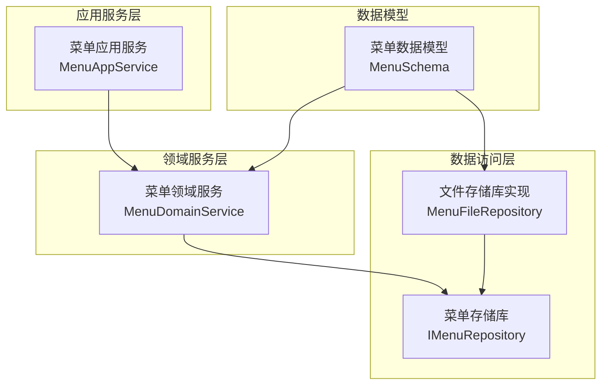
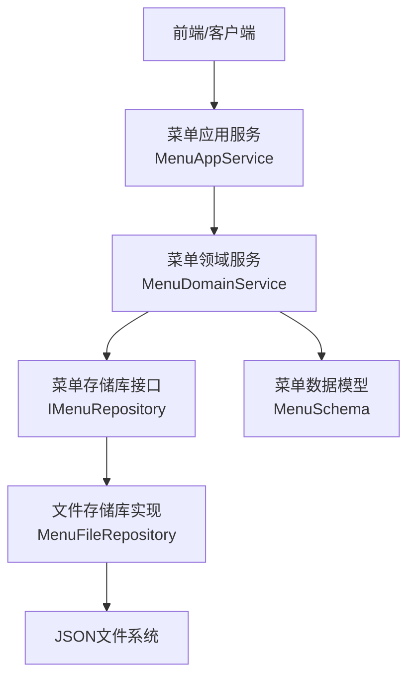
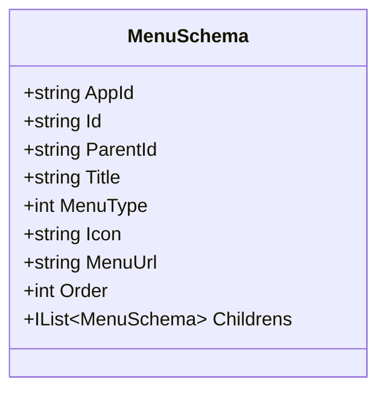
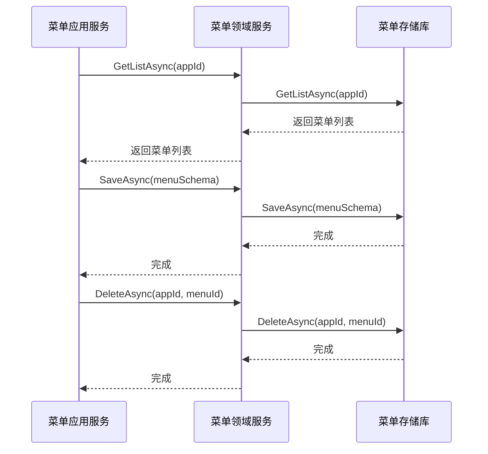
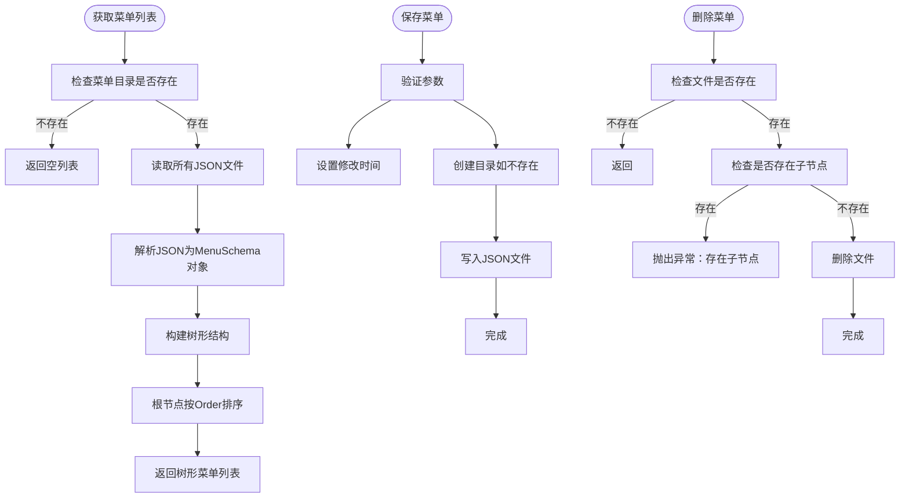
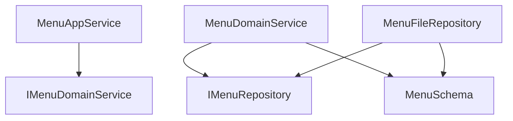

# 菜单领域服务

<cite>
**本文档中引用的文件**   
- [MenuSchema.cs](file://src\Common\H.LowCode.MetaSchema\MenuSchema.cs)
- [MenuFileRepository.cs](file://src\DesignEngine\H.LowCode.DesignEngine.Repository.JsonFile\Repositories\MenuFileRepository.cs)
- [MenuDomainService.cs](file://src\DesignEngine\H.LowCode.DesignEngine.Domain\MetaDomainServices\MenuDomainService.cs)
- [IMenuDomainService.cs](file://src\DesignEngine\H.LowCode.DesignEngine.Domain\MetaDomainServices\IMenuDomainService.cs)
- [MenuAppService.cs](file://src\DesignEngine\H.LowCode.DesignEngine.Application\AppServices\MenuAppService.cs)
- [IMenuAppService.cs](file://src\DesignEngine\H.LowCode.DesignEngine.Application.Contracts\AppServices\IMenuAppService.cs)
- [IMenuRepository.cs](file://src\DesignEngine\H.LowCode.DesignEngine.Domain\MetaRepositories\IMenuRepository.cs)
</cite>

## 目录
1. [简介](#简介)
2. [项目结构](#项目结构)
3. [核心组件](#核心组件)
4. [架构概述](#架构概述)
5. [详细组件分析](#详细组件分析)
6. [依赖分析](#依赖分析)
7. [性能考虑](#性能考虑)
8. [故障排除指南](#故障排除指南)
9. [结论](#结论)

## 简介
本文档系统性阐述了`MenuDomainService`在菜单层级结构管理中的实现机制。重点解析了菜单项的树形结构维护、父子节点关系约束、排序规则和路径生成算法。详细说明了菜单创建、移动、删除操作中的业务校验逻辑，包括循环引用检测、层级深度限制和权限关联验证。描述了菜单与应用、页面之间的绑定关系管理，以及如何确保导航结构的一致性与完整性。结合代码实例展示了递归遍历、批量更新和缓存同步的实现策略。提供了菜单数据加载性能优化建议和常见操作异常的处理方案，为上层服务调用提供可靠支撑。

## 项目结构
本项目采用分层架构设计，将菜单管理功能分布在多个模块中。核心的菜单领域服务位于`src\DesignEngine\H.LowCode.DesignEngine.Domain\MetaDomainServices`目录下，其数据模型定义在`src\Common\H.LowCode.MetaSchema`中。数据持久化通过`src\DesignEngine\H.LowCode.DesignEngine.Repository.JsonFile\Repositories`中的文件存储库实现。应用服务层则通过`src\DesignEngine\H.LowCode.DesignEngine.Application\AppServices`对外提供API接口。

**图示来源**
- [MenuSchema.cs](file://src\Common\H.LowCode.MetaSchema\MenuSchema.cs)
- [MenuDomainService.cs](file://src\DesignEngine\H.LowCode.DesignEngine.Domain\MetaDomainServices\MenuDomainService.cs)
- [MenuFileRepository.cs](file://src\DesignEngine\H.LowCode.DesignEngine.Repository.JsonFile\Repositories\MenuFileRepository.cs)

**本节来源**
- [MenuSchema.cs](file://src\Common\H.LowCode.MetaSchema\MenuSchema.cs)
- [MenuDomainService.cs](file://src\DesignEngine\H.LowCode.DesignEngine.Domain\MetaDomainServices\MenuDomainService.cs)
- [MenuFileRepository.cs](file://src\DesignEngine\H.LowCode.DesignEngine.Repository.JsonFile\Repositories\MenuFileRepository.cs)

## 核心组件
菜单管理的核心组件包括`MenuSchema`数据模型、`MenuDomainService`领域服务、`MenuFileRepository`存储库实现以及`MenuAppService`应用服务。这些组件共同协作，实现了菜单的全生命周期管理。

`MenuSchema`类定义了菜单项的所有属性，包括ID、父ID、标题、类型、图标、路径和排序号。`MenuDomainService`作为领域服务，封装了所有业务逻辑，确保操作的原子性和一致性。`MenuFileRepository`负责将菜单数据持久化到JSON文件中。`MenuAppService`则作为外部接口，为前端或其他服务提供调用入口。

**本节来源**
- [MenuSchema.cs](file://src\Common\H.LowCode.MetaSchema\MenuSchema.cs)
- [MenuDomainService.cs](file://src\DesignEngine\H.LowCode.DesignEngine.Domain\MetaDomainServices\MenuDomainService.cs)
- [MenuFileRepository.cs](file://src\DesignEngine\H.LowCode.DesignEngine.Repository.JsonFile\Repositories\MenuFileRepository.cs)
- [MenuAppService.cs](file://src\DesignEngine\H.LowCode.DesignEngine.Application\AppServices\MenuAppService.cs)

## 架构概述
菜单管理系统的架构遵循领域驱动设计（DDD）原则，分为应用层、领域层和基础设施层。应用层负责处理HTTP请求和响应；领域层包含核心业务逻辑和领域模型；基础设施层负责数据持久化。

**图示来源**
- [MenuAppService.cs](file://src\DesignEngine\H.LowCode.DesignEngine.Application\AppServices\MenuAppService.cs)
- [MenuDomainService.cs](file://src\DesignEngine\H.LowCode.DesignEngine.Domain\MetaDomainServices\MenuDomainService.cs)
- [IMenuRepository.cs](file://src\DesignEngine\H.LowCode.DesignEngine.Domain\MetaRepositories\IMenuRepository.cs)
- [MenuFileRepository.cs](file://src\DesignEngine\H.LowCode.DesignEngine.Repository.JsonFile\Repositories\MenuFileRepository.cs)
- [MenuSchema.cs](file://src\Common\H.LowCode.MetaSchema\MenuSchema.cs)

## 详细组件分析

### 菜单数据模型分析
`MenuSchema`类是菜单系统的核心数据结构，定义了菜单项的所有属性和关系。

**图示来源**
- [MenuSchema.cs](file://src\Common\H.LowCode.MetaSchema\MenuSchema.cs)

**本节来源**
- [MenuSchema.cs](file://src\Common\H.LowCode.MetaSchema\MenuSchema.cs)

### 菜单领域服务分析
`MenuDomainService`实现了菜单管理的核心业务逻辑，通过依赖注入获取`IMenuRepository`来执行数据操作。

**图示来源**
- [MenuDomainService.cs](file://src\DesignEngine\H.LowCode.DesignEngine.Domain\MetaDomainServices\MenuDomainService.cs)
- [IMenuDomainService.cs](file://src\DesignEngine\H.LowCode.DesignEngine.Domain\MetaDomainServices\IMenuDomainService.cs)
- [IMenuRepository.cs](file://src\DesignEngine\H.LowCode.DesignEngine.Domain\MetaRepositories\IMenuRepository.cs)

**本节来源**
- [MenuDomainService.cs](file://src\DesignEngine\H.LowCode.DesignEngine.Domain\MetaDomainServices\MenuDomainService.cs)

### 菜单存储库分析
`MenuFileRepository`实现了基于文件系统的菜单数据持久化，将每个菜单项保存为独立的JSON文件。

**图示来源**
- [MenuFileRepository.cs](file://src\DesignEngine\H.LowCode.DesignEngine.Repository.JsonFile\Repositories\MenuFileRepository.cs)

**本节来源**
- [MenuFileRepository.cs](file://src\DesignEngine\H.LowCode.DesignEngine.Repository.JsonFile\Repositories\MenuFileRepository.cs)

## 依赖分析
菜单管理系统各组件之间的依赖关系清晰明确，遵循依赖倒置原则。高层模块依赖于抽象接口，而非具体实现。

**图示来源**
- [MenuAppService.cs](file://src\DesignEngine\H.LowCode.DesignEngine.Application\AppServices\MenuAppService.cs)
- [MenuDomainService.cs](file://src\DesignEngine\H.LowCode.DesignEngine.Domain\MetaDomainServices\MenuDomainService.cs)
- [IMenuDomainService.cs](file://src\DesignEngine\H.LowCode.DesignEngine.Domain\MetaDomainServices\IMenuDomainService.cs)
- [IMenuRepository.cs](file://src\DesignEngine\H.LowCode.DesignEngine.Domain\MetaRepositories\IMenuRepository.cs)
- [MenuFileRepository.cs](file://src\DesignEngine\H.LowCode.DesignEngine.Repository.JsonFile\Repositories\MenuFileRepository.cs)
- [MenuSchema.cs](file://src\Common\H.LowCode.MetaSchema\MenuSchema.cs)

**本节来源**
- [MenuAppService.cs](file://src\DesignEngine\H.LowCode.DesignEngine.Application\AppServices\MenuAppService.cs)
- [MenuDomainService.cs](file://src\DesignEngine\H.LowCode.DesignEngine.Domain\MetaDomainServices\MenuDomainService.cs)
- [IMenuDomainService.cs](file://src\DesignEngine\H.LowCode.DesignEngine.Domain\MetaDomainServices\IMenuDomainService.cs)
- [IMenuRepository.cs](file://src\DesignEngine\H.LowCode.DesignEngine.Domain\MetaRepositories\IMenuRepository.cs)
- [MenuFileRepository.cs](file://src\DesignEngine\H.LowCode.DesignEngine.Repository.JsonFile\Repositories\MenuFileRepository.cs)

## 性能考虑
菜单数据的加载性能主要受文件I/O操作影响。`MenuFileRepository`在加载菜单列表时，会读取应用目录下所有菜单JSON文件，然后在内存中构建树形结构。对于菜单数量较多的应用，这可能导致性能瓶颈。

优化建议：
1. 实现缓存机制，避免重复读取文件系统
2. 考虑将所有菜单数据存储在单个文件中，减少文件打开关闭开销
3. 实现懒加载，只在需要时加载子菜单
4. 使用更高效的数据存储方式，如数据库

**本节来源**
- [MenuFileRepository.cs](file://src\DesignEngine\H.LowCode.DesignEngine.Repository.JsonFile\Repositories\MenuFileRepository.cs)

## 故障排除指南
### 菜单删除失败
当尝试删除一个仍有子节点的菜单时，系统会抛出`InvalidOperationException`异常，提示"存在子节点, 不允许删除!"。解决方法是先删除所有子节点，再删除父节点。

### 父节点引用错误
在构建树形结构时，如果发现某个菜单项的`ParentId`在菜单列表中找不到对应的父节点，系统会抛出`KeyNotFoundException`异常。这通常发生在数据不一致或文件损坏的情况下。

### 文件路径错误
确保`MetaOption`配置中的基础目录路径正确，否则可能导致无法找到菜单文件或无法创建目录。

**本节来源**
- [MenuFileRepository.cs](file://src\DesignEngine\H.LowCode.DesignEngine.Repository.JsonFile\Repositories\MenuFileRepository.cs#L76-L129)

## 结论
`MenuDomainService`通过清晰的分层架构和职责分离，有效地管理了菜单的层级结构。系统实现了基本的树形结构维护、父子节点关系约束和排序功能。然而，在性能优化、循环引用检测和层级深度限制方面还有改进空间。当前的文件存储方案适合小型应用，但对于大型应用可能需要考虑更高效的存储和缓存策略。