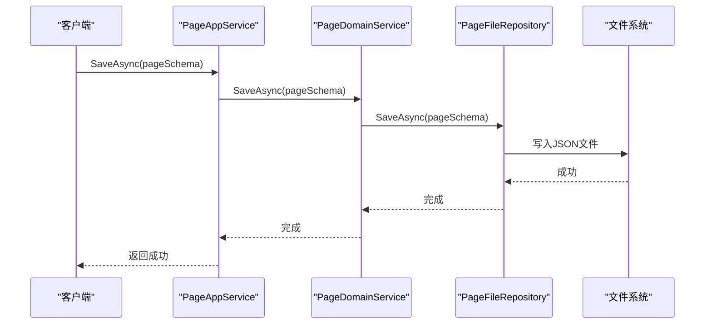
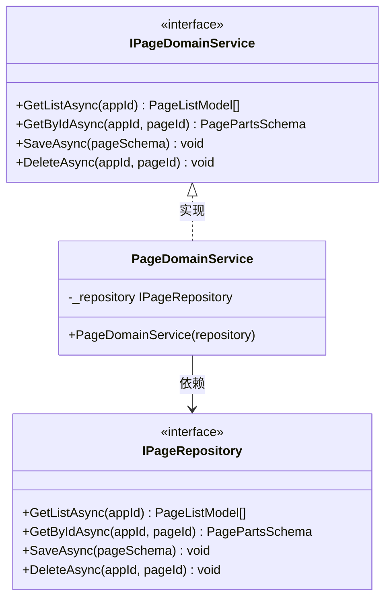
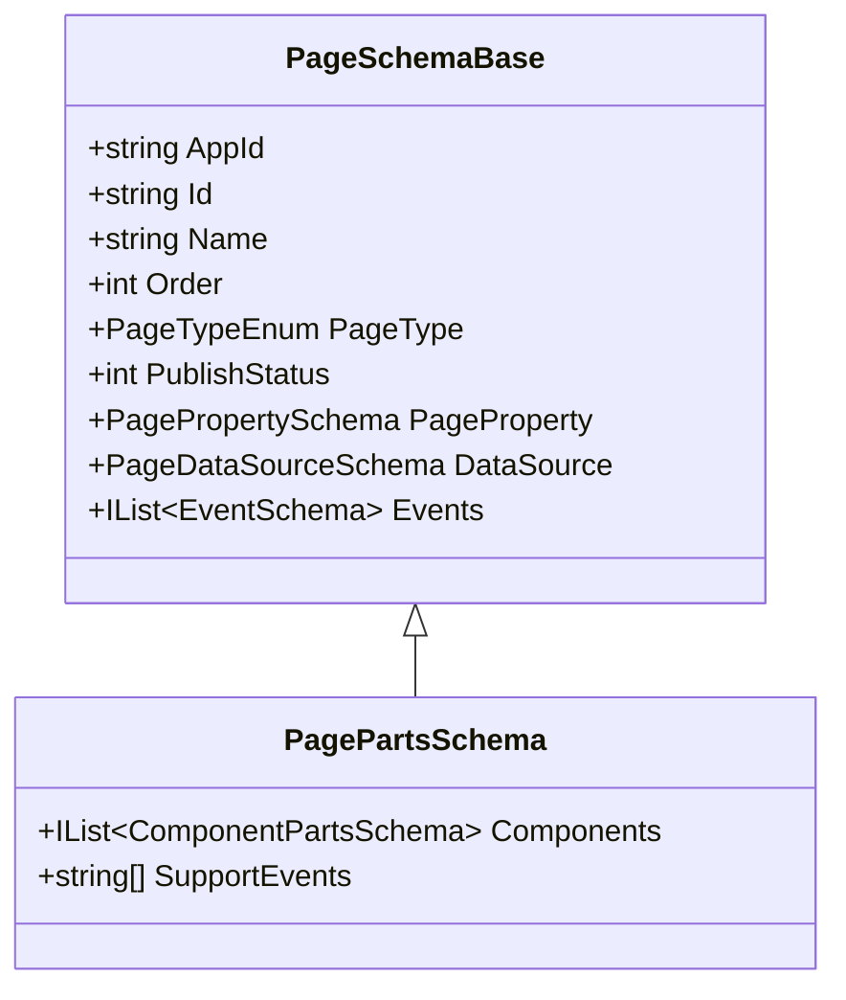
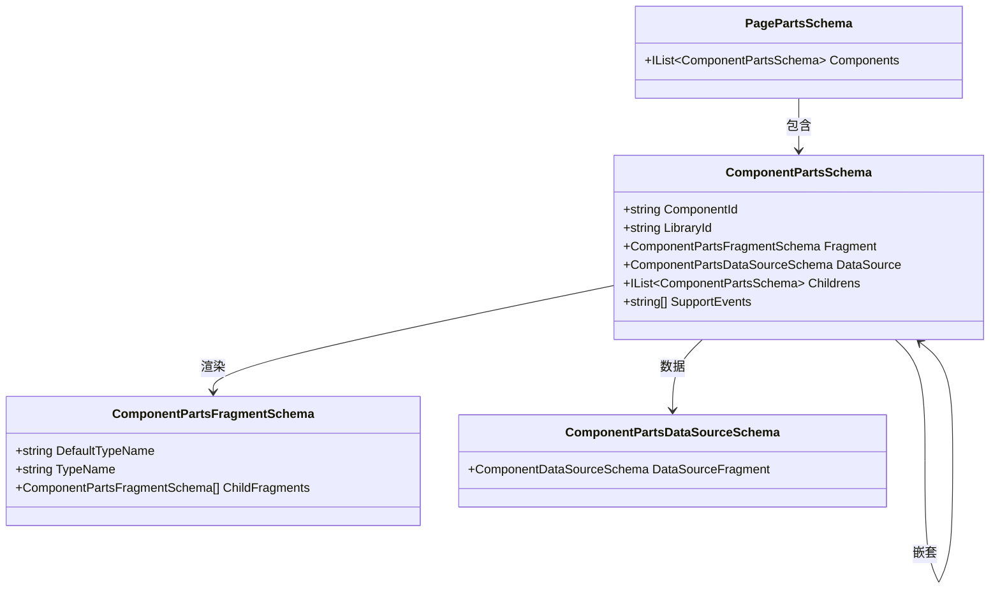
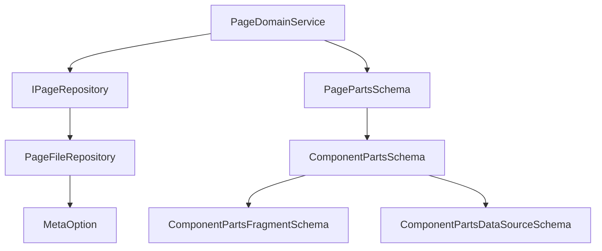

# 页面领域服务

<cite>
**本文档引用的文件**  
- [PageDomainService.cs](file://src/DesignEngine/H.LowCode.DesignEngine.Domain/MetaDomainServices/PageDomainService.cs)
- [IPageDomainService.cs](file://src/DesignEngine/H.LowCode.DesignEngine.Domain/MetaDomainServices/IPageDomainService.cs)
- [PageFileRepository.cs](file://src/DesignEngine/H.LowCode.DesignEngine.Repository.JsonFile/Repositories/PageFileRepository.cs)
- [PagePartsSchema.cs](file://src/Common/H.LowCode.MetaSchema.DesignEngine/PagePartsSchema.cs)
- [ComponentPartsSchema.cs](file://src/Common/H.LowCode.MetaSchema.DesignEngine/ComponentPartsSchema.cs)
- [PageTypeEnum.cs](file://src/Common/H.LowCode.MetaSchema/Enums/PageTypeEnum.cs)
- [PublishStatusEnum.cs](file://src/Common/H.LowCode.MetaSchema/Enums/PublishStatusEnum.cs)
- [PageSchemaBase.cs](file://src/Common/H.LowCode.MetaSchema/PageSchemaBase.cs)
- [ComponentPartsFragmentSchema.cs](file://src/Common/H.LowCode.MetaSchema.DesignEngine/PropertySchemas/ComponentPartsFragmentSchema.cs)
- [ComponentPartsDataSourceSchema.cs](file://src/Common/H.LowCode.MetaSchema.DesignEngine/DataSourceSchemas/ComponentPartsDataSourceSchema.cs)
</cite>

## 目录
1. [简介](#简介)
2. [项目结构](#项目结构)
3. [核心组件](#核心组件)
4. [架构概览](#架构概览)
5. [详细组件分析](#详细组件分析)
6. [依赖分析](#依赖分析)
7. [性能考量](#性能考量)
8. [故障排除指南](#故障排除指南)
9. [结论](#结论)

## 简介
本文档全面分析了低代码平台中的**页面领域服务（PageDomainService）**，重点聚焦于页面元数据管理、页面类型控制（普通/表单/列表/报表）、发布流程、结构校验、组件布局合法性、与应用的关联验证、版本控制、状态变更规则以及与数据源和事件配置的一致性保证机制。通过深入解析代码实现，揭示了页面聚合根的操作流程、与IPageRepository的交互模式及事务处理方式，并探讨了批量操作、依赖检测和级联更新的实现细节，旨在为开发者提供清晰的业务逻辑理解。

## 项目结构
项目采用分层架构，核心业务逻辑位于`src/DesignEngine`和`src/RenderEngine`目录下。`src/Common`包含共享的元数据模型和枚举。`PageDomainService`作为领域服务，位于`H.LowCode.DesignEngine.Domain`模块中，负责处理页面的核心业务逻辑。

```mermaid
graph TB
subgraph "src/Common"
A[MetaSchema] --> B[PageSchemaBase]
A --> C[PageTypeEnum]
A --> D[PublishStatusEnum]
end
subgraph "src/DesignEngine"
E[Domain] --> F[PageDomainService]
E --> G[IPageDomainService]
H[Repository.JsonFile] --> I[PageFileRepository]
end
subgraph "src/Common/H.LowCode.MetaSchema.DesignEngine"
J[PagePartsSchema]
K[ComponentPartsSchema]
end
F --> I : "依赖"
F --> J : "操作"
J --> K : "包含"
```

**图示来源**
- [PageDomainService.cs](file://src/DesignEngine/H.LowCode.DesignEngine.Domain/MetaDomainServices/PageDomainService.cs)
- [PageFileRepository.cs](file://src/DesignEngine/H.LowCode.DesignEngine.Repository.JsonFile/Repositories/PageFileRepository.cs)
- [PagePartsSchema.cs](file://src/Common/H.LowCode.MetaSchema.DesignEngine/PagePartsSchema.cs)

**本节来源**
- [PageDomainService.cs](file://src/DesignEngine/H.LowCode.DesignEngine.Domain/MetaDomainServices/PageDomainService.cs)
- [PageFileRepository.cs](file://src/DesignEngine/H.LowCode.DesignEngine.Repository.JsonFile/Repositories/PageFileRepository.cs)

## 核心组件
`PageDomainService`是页面管理的核心领域服务，实现了`IPageDomainService`接口。它不直接处理数据持久化，而是通过依赖注入的`IPageRepository`来完成。其主要职责是定义页面管理的业务契约，包括获取页面列表、根据ID获取页面、保存页面和删除页面。

**本节来源**
- [PageDomainService.cs](file://src/DesignEngine/H.LowCode.DesignEngine.Domain/MetaDomainServices/PageDomainService.cs)
- [IPageDomainService.cs](file://src/DesignEngine/H.LowCode.DesignEngine.Domain/MetaDomainServices/IPageDomainService.cs)

## 架构概览
系统采用领域驱动设计（DDD）模式，`PageDomainService`作为领域服务层，协调聚合根`PagePartsSchema`与仓储`IPageRepository`之间的交互。`PagePartsSchema`是页面的聚合根，包含了页面的所有元数据，如名称、类型、数据源、事件和组件布局。`IPageRepository`的具体实现`PageFileRepository`负责将`PagePartsSchema`序列化为JSON文件并存储在文件系统中。



**图示来源**
- [PageDomainService.cs](file://src/DesignEngine/H.LowCode.DesignEngine.Domain/MetaDomainServices/PageDomainService.cs)
- [PageFileRepository.cs](file://src/DesignEngine/H.LowCode.DesignEngine.Repository.JsonFile/Repositories/PageFileRepository.cs)

## 详细组件分析
### 页面领域服务 (PageDomainService) 分析
`PageDomainService`是一个轻量级的门面，它将应用服务（Application Service）的请求转发给仓储（Repository）。它本身不包含复杂的业务逻辑，但定义了清晰的业务边界。

#### 类图


**图示来源**
- [IPageDomainService.cs](file://src/DesignEngine/H.LowCode.DesignEngine.Domain/MetaDomainServices/IPageDomainService.cs)
- [PageDomainService.cs](file://src/DesignEngine/H.LowCode.DesignEngine.Domain/MetaDomainServices/PageDomainService.cs)
- [IPageRepository.cs](file://src/DesignEngine/H.LowCode.DesignEngine.Domain/MetaRepositories/IPageRepository.cs)

#### 业务逻辑实现
`PageDomainService`的实现非常直接，每个方法都直接调用`IPageRepository`的对应方法。例如，`SaveAsync`方法接收一个`PagePartsSchema`对象，并将其传递给`_repository.SaveAsync`。

```csharp
public async Task SaveAsync(PagePartsSchema pageSchema)
{
    await _repository.SaveAsync(pageSchema);
}
```

**本节来源**
- [PageDomainService.cs](file://src/DesignEngine/H.LowCode.DesignEngine.Domain/MetaDomainServices/PageDomainService.cs)

### 页面元数据与类型控制分析
页面的核心元数据由`PageSchemaBase`和`PagePartsSchema`定义。`PageSchemaBase`是所有页面的基类，定义了通用属性。

#### 页面类型 (PageTypeEnum)
页面类型通过`PageTypeEnum`枚举进行控制，支持四种类型：
- **Normal (0)**: 普通页面
- **Form (1)**: 表单页面
- **Table (2)**: 列表页面
- **Report (5)**: 报表页面

此枚举确保了页面类型的强类型约束和可读性。

#### 页面状态 (PublishStatusEnum)
页面的发布状态由`PublishStatusEnum`枚举管理：
- **Development**: 开发中（草稿）
- **Approving**: 审核中
- **Published**: 已发布

此状态机控制了页面的生命周期，决定了页面是否可以被渲染引擎访问。

#### 页面聚合根 (PagePartsSchema)
`PagePartsSchema`继承自`PageSchemaBase`，是页面的聚合根，包含了页面的所有组成部分。



**图示来源**
- [PageSchemaBase.cs](file://src/Common/H.LowCode.MetaSchema/PageSchemaBase.cs)
- [PageTypeEnum.cs](file://src/Common/H.LowCode.MetaSchema/Enums/PageTypeEnum.cs)
- [PublishStatusEnum.cs](file://src/Common/H.LowCode.MetaSchema/Enums/PublishStatusEnum.cs)
- [PagePartsSchema.cs](file://src/Common/H.LowCode.MetaSchema.DesignEngine/PagePartsSchema.cs)

**本节来源**
- [PageSchemaBase.cs](file://src/Common/H.LowCode.MetaSchema/PageSchemaBase.cs)
- [PageTypeEnum.cs](file://src/Common/H.LowCode.MetaSchema/Enums/PageTypeEnum.cs)
- [PublishStatusEnum.cs](file://src/Common/H.LowCode.MetaSchema/Enums/PublishStatusEnum.cs)

### 页面创建与结构校验分析
虽然`PageDomainService`本身不执行结构校验，但其依赖的`PageFileRepository`在保存时会进行基本的空值检查。更复杂的校验（如组件布局合法性）通常在应用服务层或前端完成。

#### 组件布局与一致性保证
`PagePartsSchema`通过`Components`属性管理一个组件列表。每个`ComponentPartsSchema`都包含其自身的数据源`DataSource`和事件`Events`，这保证了页面与数据源、事件配置的一致性。



**图示来源**
- [PagePartsSchema.cs](file://src/Common/H.LowCode.MetaSchema.DesignEngine/PagePartsSchema.cs)
- [ComponentPartsSchema.cs](file://src/Common/H.LowCode.MetaSchema.DesignEngine/ComponentPartsSchema.cs)
- [ComponentPartsFragmentSchema.cs](file://src/Common/H.LowCode.MetaSchema.DesignEngine/PropertySchemas/ComponentPartsFragmentSchema.cs)
- [ComponentPartsDataSourceSchema.cs](file://src/Common/H.LowCode.MetaSchema.DesignEngine/DataSourceSchemas/ComponentPartsDataSourceSchema.cs)

**本节来源**
- [PagePartsSchema.cs](file://src/Common/H.LowCode.MetaSchema.DesignEngine/PagePartsSchema.cs)
- [ComponentPartsSchema.cs](file://src/Common/H.LowCode.MetaSchema.DesignEngine/ComponentPartsSchema.cs)

### 批量操作、依赖检测与级联更新
当前`PageDomainService`的接口设计（`GetListAsync`, `DeleteAsync`）支持批量操作。例如，`GetListAsync`可以获取一个应用下的所有页面，`DeleteAsync`可以删除单个页面。然而，代码中并未直接体现复杂的依赖检测或级联更新逻辑。这类逻辑可能在应用服务层实现，例如，在删除一个应用时，需要级联删除其下的所有页面。

## 依赖分析
`PageDomainService`的依赖关系清晰，仅依赖于`IPageRepository`接口，实现了控制反转（IoC）。`PageFileRepository`则依赖于`MetaOption`配置来确定元数据的存储路径。`PagePartsSchema`及其子组件形成了一个复杂的对象图，但通过JSON序列化/反序列化，实现了与文件系统的松耦合。



**图示来源**
- [PageDomainService.cs](file://src/DesignEngine/H.LowCode.DesignEngine.Domain/MetaDomainServices/PageDomainService.cs)
- [PageFileRepository.cs](file://src/DesignEngine/H.LowCode.DesignEngine.Repository.JsonFile/Repositories/PageFileRepository.cs)
- [MetaOption.cs](file://src/Common/H.LowCode.Configuration/Options/MetaOption.cs)

**本节来源**
- [PageDomainService.cs](file://src/DesignEngine/H.LowCode.DesignEngine.Domain/MetaDomainServices/PageDomainService.cs)
- [PageFileRepository.cs](file://src/DesignEngine/H.LowCode.DesignEngine.Repository.JsonFile/Repositories/PageFileRepository.cs)

## 性能考量
由于数据存储在文件系统中，性能主要受文件I/O影响。`GetListAsync`方法需要读取目录下所有JSON文件并反序列化，对于页面数量庞大的应用，这可能成为性能瓶颈。可以考虑引入缓存机制来优化频繁的读取操作。`SaveAsync`和`DeleteAsync`操作是原子的，单个文件的读写性能通常较好。

## 故障排除指南
- **问题：保存页面失败，但无错误信息。**
  **解决方案：** 检查`MetaOption`配置的`_metaBaseDir`路径是否存在且有写入权限。确认`pageSchema.Id`和`AppId`不为空。

- **问题：获取页面列表为空。**
  **解决方案：** 检查指定的`appId`是否正确，确认`meta/apps/{appId}/page/`目录下是否存在JSON文件。

- **问题：页面类型或状态不正确。**
  **解决方案：** 检查前端或应用服务层是否正确设置了`PageType`和`PublishStatus`字段，确保使用的是`PageTypeEnum`和`PublishStatusEnum`的正确值。

**本节来源**
- [PageFileRepository.cs](file://src/DesignEngine/H.LowCode.DesignEngine.Repository.JsonFile/Repositories/PageFileRepository.cs)
- [PageDomainService.cs](file://src/DesignEngine/H.LowCode.DesignEngine.Domain/MetaDomainServices/PageDomainService.cs)

## 结论
`PageDomainService`作为低代码平台的核心领域服务，提供了一个简洁而有效的API来管理页面的生命周期。它通过清晰的分层（领域服务、仓储）和聚合根设计（`PagePartsSchema`），实现了业务逻辑与数据持久化的分离。虽然当前实现侧重于基础的CRUD操作，但其设计为扩展复杂的业务规则（如结构校验、依赖检测、工作流）提供了坚实的基础。未来可以通过引入缓存、数据库存储或更复杂的校验规则来进一步提升其功能和性能。