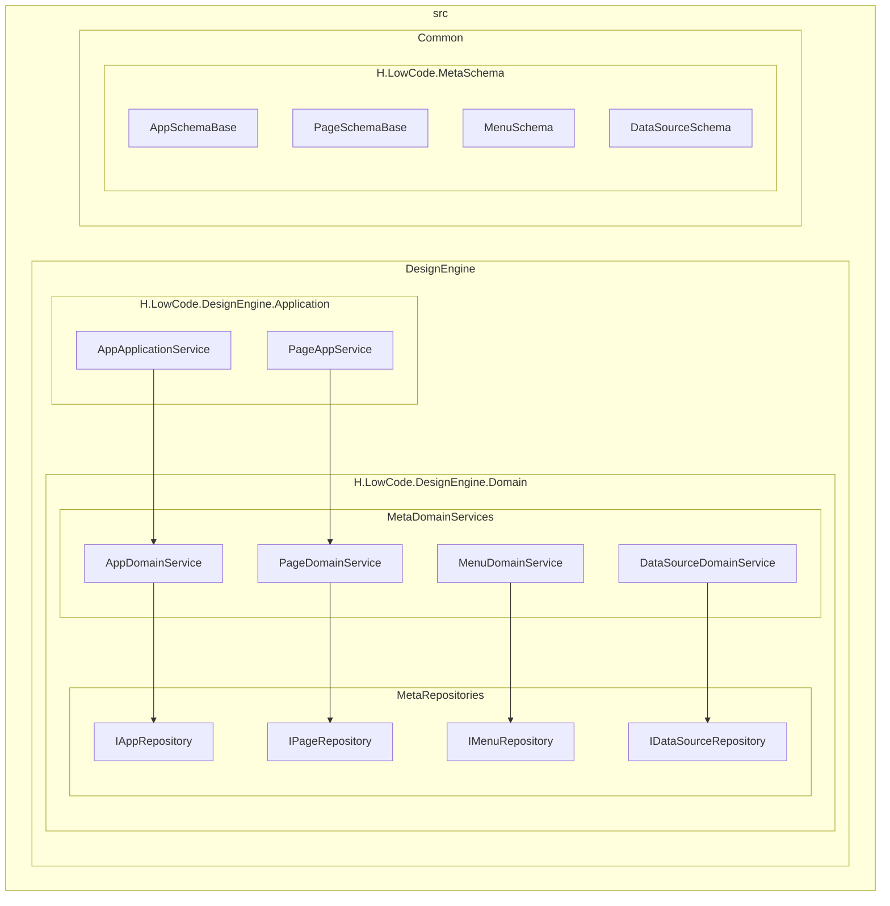
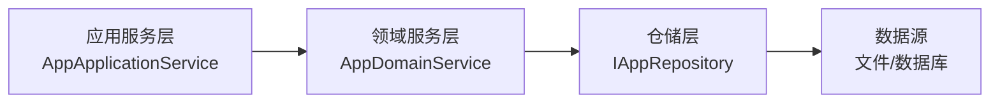
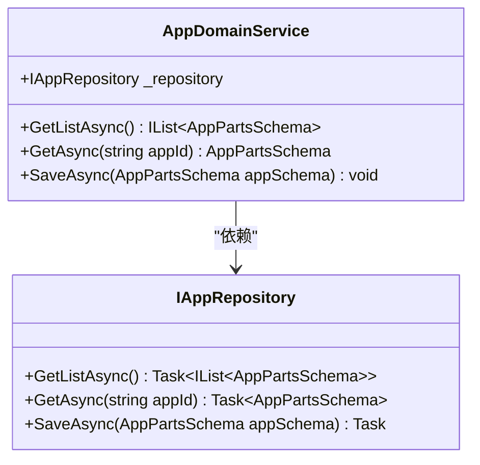
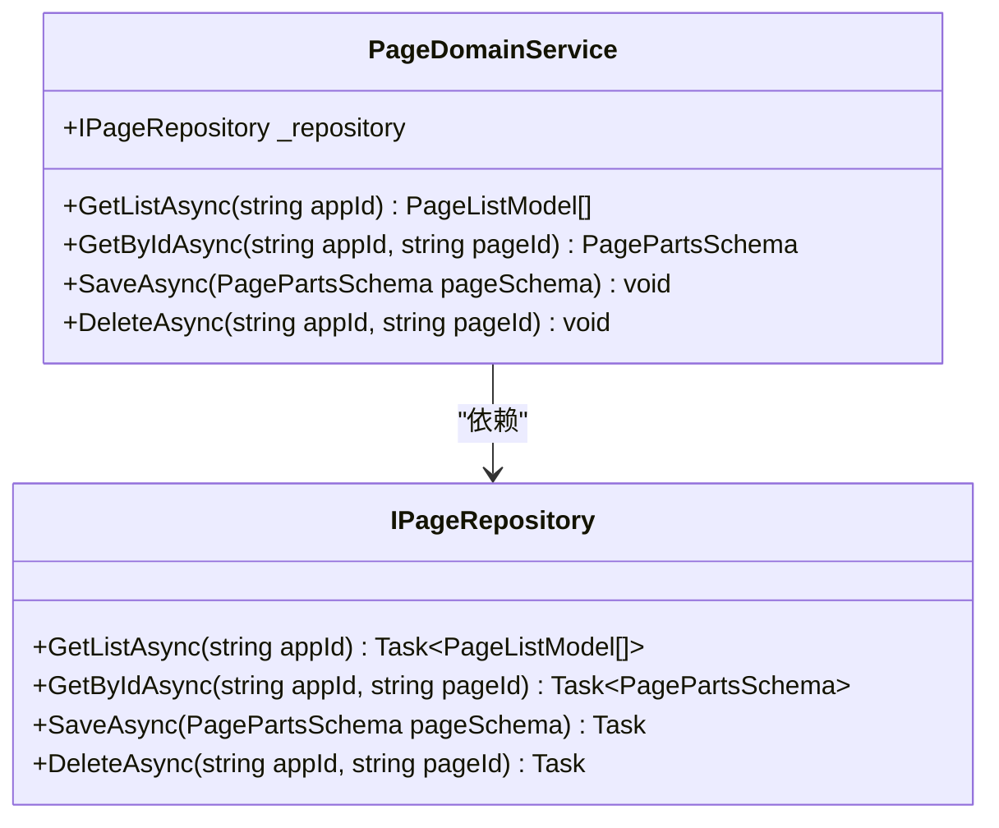
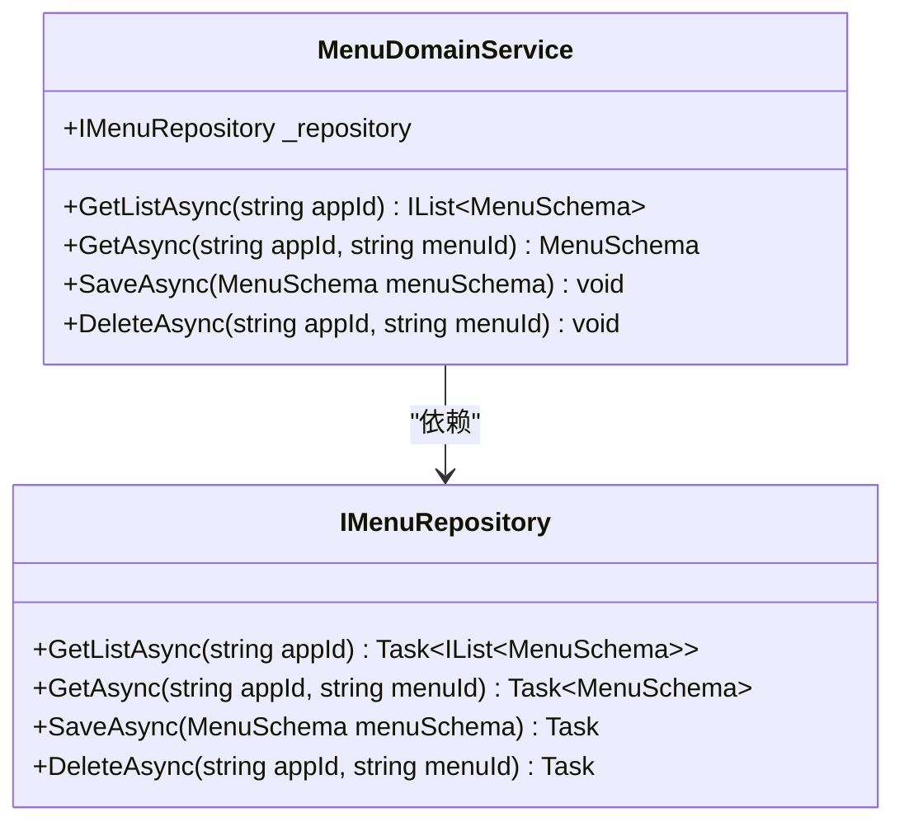
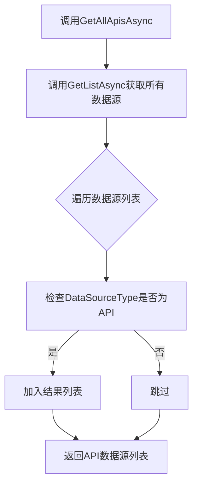
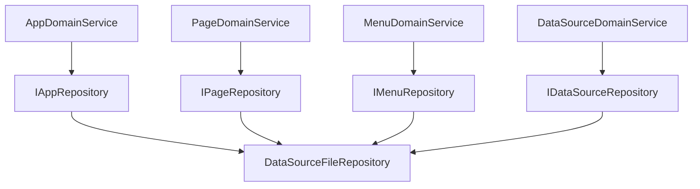

# 领域服务层

<cite>
**本文档引用的文件**  
- [AppDomainService.cs](file://src/DesignEngine/H.LowCode.DesignEngine.Domain/MetaDomainServices/AppDomainService.cs)
- [PageDomainService.cs](file://src/DesignEngine/H.LowCode.DesignEngine.Domain/MetaDomainServices/PageDomainService.cs)
- [MenuDomainService.cs](file://src/DesignEngine/H.LowCode.DesignEngine.Domain/MetaDomainServices/MenuDomainService.cs)
- [DataSourceDomainService.cs](file://src/DesignEngine/H.LowCode.DesignEngine.Domain/MetaDomainServices/DataSourceDomainService.cs)
- [IAppRepository.cs](file://src/DesignEngine/H.LowCode.DesignEngine.Domain/MetaRepositories/IAppRepository.cs)
- [IPageRepository.cs](file://src/DesignEngine/H.LowCode.DesignEngine.Domain/MetaRepositories/IPageRepository.cs)
- [IMenuRepository.cs](file://src/DesignEngine/H.LowCode.DesignEngine.Domain/MetaRepositories/IMenuRepository.cs)
- [IDataSourceRepository.cs](file://src/DesignEngine/H.LowCode.DesignEngine.Domain/MetaRepositories/IDataSourceRepository.cs)
- [AppSchemaBase.cs](file://src/Common/H.LowCode.MetaSchema/AppSchemaBase.cs)
- [PageSchemaBase.cs](file://src/Common/H.LowCode.MetaSchema/PageSchemaBase.cs)
- [MenuSchema.cs](file://src/Common/H.LowCode.MetaSchema/MenuSchema.cs)
- [DataSourceSchema.cs](file://src/Common/H.LowCode.MetaSchema/DataSourceSchema.cs)
- [PublishStatusEnum.cs](file://src/Common/H.LowCode.MetaSchema/Enums/PublishStatusEnum.cs)
</cite>

## 目录

1. [引言](#引言)
2. [项目结构](#项目结构)
3. [核心组件](#核心组件)
4. [架构概览](#架构概览)
5. [详细组件分析](#详细组件分析)
6. [依赖分析](#依赖分析)
7. [性能考量](#性能考量)
8. [故障排除指南](#故障排除指南)
9. [结论](#结论)

## 引言

本文档全面阐述低代码设计引擎的领域服务层（Domain Layer）架构与核心实现。重点分析 `AppDomainService`、`PageDomainService`、`MenuDomainService` 和 `DataSourceDomainService` 如何封装业务规则、维护领域模型一致性并协调聚合根操作。文档将说明领域服务与仓储接口（如 `IAppRepository`）的依赖关系，以及如何通过领域事件或事务边界保证数据完整性。结合代码实例解释应用创建时的校验逻辑、页面发布状态变更、菜单层级结构维护等关键业务流程。同时描述领域模型（如 `App`、`Page`）的聚合边界与生命周期管理，并说明领域服务如何为上层应用服务提供细粒度的业务能力支撑。

## 项目结构

低代码平台的源码结构清晰地划分为多个模块，其中领域服务层位于 `src/DesignEngine/H.LowCode.DesignEngine.Domain` 目录下。该层是业务逻辑的核心，负责封装与特定业务领域相关的复杂规则和流程。

**图示来源**  
- [AppDomainService.cs](file://src/DesignEngine/H.LowCode.DesignEngine.Domain/MetaDomainServices/AppDomainService.cs)
- [IAppRepository.cs](file://src/DesignEngine/H.LowCode.DesignEngine.Domain/MetaRepositories/IAppRepository.cs)

**本节来源**  
- [AppDomainService.cs](file://src/DesignEngine/H.LowCode.DesignEngine.Domain/MetaDomainServices/AppDomainService.cs)
- [IAppRepository.cs](file://src/DesignEngine/H.LowCode.DesignEngine.Domain/MetaRepositories/IAppRepository.cs)

## 核心组件

领域服务层的核心组件是四个主要的领域服务类：`AppDomainService`、`PageDomainService`、`MenuDomainService` 和 `DataSourceDomainService`。这些服务类均继承自 `Volo.Abp.Domain.Services.DomainService`，并实现了对应的接口（如 `IAppDomainService`）。它们的主要职责是封装跨多个实体或聚合的复杂业务逻辑，协调对仓储（Repository）的调用，并确保业务规则的一致性。

**本节来源**  
- [AppDomainService.cs](file://src/DesignEngine/H.LowCode.DesignEngine.Domain/MetaDomainServices/AppDomainService.cs)
- [PageDomainService.cs](file://src/DesignEngine/H.LowCode.DesignEngine.Domain/MetaDomainServices/PageDomainService.cs)

## 架构概览

领域服务层在整体架构中扮演着承上启下的关键角色。上层的应用服务（Application Service）通过领域服务来执行业务操作，而领域服务则通过仓储接口与数据持久化层进行交互。这种分层设计确保了业务逻辑的集中化和可维护性。

**图示来源**  
- [AppApplicationService.cs](file://src/DesignEngine/H.LowCode.DesignEngine.Application/AppServices/AppApplicationService.cs)
- [AppDomainService.cs](file://src/DesignEngine/H.LowCode.DesignEngine.Domain/MetaDomainServices/AppDomainService.cs)
- [IAppRepository.cs](file://src/DesignEngine/H.LowCode.DesignEngine.Domain/MetaRepositories/IAppRepository.cs)

## 详细组件分析

### AppDomainService 分析

`AppDomainService` 是应用（App）领域的核心服务，负责管理应用元数据的生命周期。它通过依赖注入获取 `IAppRepository` 实例，从而将具体的持久化细节（如文件存储或数据库访问）与业务逻辑解耦。

#### 类图

**图示来源**  
- [AppDomainService.cs](file://src/DesignEngine/H.LowCode.DesignEngine.Domain/MetaDomainServices/AppDomainService.cs)
- [IAppRepository.cs](file://src/DesignEngine/H.LowCode.DesignEngine.Domain/MetaRepositories/IAppRepository.cs)

**本节来源**  
- [AppDomainService.cs](file://src/DesignEngine/H.LowCode.DesignEngine.Domain/MetaDomainServices/AppDomainService.cs)
- [IAppRepository.cs](file://src/DesignEngine/H.LowCode.DesignEngine.Domain/MetaRepositories/IAppRepository.cs)

### PageDomainService 分析

`PageDomainService` 负责管理页面（Page）的业务逻辑。与 `AppDomainService` 类似，它也依赖于 `IPageRepository` 来执行数据操作。其关键方法包括根据应用ID获取页面列表、根据ID获取特定页面、保存页面以及删除页面。

#### 类图

**图示来源**  
- [PageDomainService.cs](file://src/DesignEngine/H.LowCode.DesignEngine.Domain/MetaDomainServices/PageDomainService.cs)
- [IPageRepository.cs](file://src/DesignEngine/H.LowCode.DesignEngine.Domain/MetaRepositories/IPageRepository.cs)

**本节来源**  
- [PageDomainService.cs](file://src/DesignEngine/H.LowCode.DesignEngine.Domain/MetaDomainServices/PageDomainService.cs)
- [IPageRepository.cs](file://src/DesignEngine/H.LowCode.DesignEngine.Domain/MetaRepositories/IPageRepository.cs)

### MenuDomainService 分析

`MenuDomainService` 用于管理菜单（Menu）的增删改查操作。它维护了菜单的层级结构（通过 `ParentId` 字段），并确保菜单项的有序性（通过 `Order` 字段）。该服务通过 `IMenuRepository` 与数据层交互。

#### 类图

**图示来源**  
- [MenuDomainService.cs](file://src/DesignEngine/H.LowCode.DesignEngine.Domain/MetaDomainServices/MenuDomainService.cs)
- [IMenuRepository.cs](file://src/DesignEngine/H.LowCode.DesignEngine.Domain/MetaRepositories/IMenuRepository.cs)

**本节来源**  
- [MenuDomainService.cs](file://src/DesignEngine/H.LowCode.DesignEngine.Domain/MetaDomainServices/MenuDomainService.cs)
- [IMenuRepository.cs](file://src/DesignEngine/H.LowCode.DesignEngine.Domain/MetaRepositories/IMenuRepository.cs)

### DataSourceDomainService 分析

`DataSourceDomainService` 是数据源（DataSource）的管理服务，其逻辑相对复杂，因为它需要处理多种类型的数据源（API、数据库表、选项等）。该服务不仅提供基本的CRUD操作，还提供了根据数据源类型进行过滤的业务方法，例如 `GetAllApisAsync` 用于获取所有API类型的数据源。

#### 流程图

**图示来源**  
- [DataSourceDomainService.cs](file://src/DesignEngine/H.LowCode.DesignEngine.Domain/MetaDomainServices/DataSourceDomainService.cs)

**本节来源**  
- [DataSourceDomainService.cs](file://src/DesignEngine/H.LowCode.DesignEngine.Domain/MetaDomainServices/DataSourceDomainService.cs)
- [IDataSourceRepository.cs](file://src/DesignEngine/H.LowCode.DesignEngine.Domain/MetaRepositories/IDataSourceRepository.cs)

## 依赖分析

领域服务层的组件之间存在清晰的依赖关系。每个领域服务都依赖于一个或多个仓储接口，这些接口定义了数据访问的契约。具体的实现由下层的 `Repository.JsonFile` 或 `Repository.EntityFrameworkCore` 模块提供。这种依赖倒置原则（Dependency Inversion Principle）使得领域服务不依赖于具体的数据存储技术，从而提高了代码的可测试性和可维护性。

**图示来源**  
- [IAppRepository.cs](file://src/DesignEngine/H.LowCode.DesignEngine.Domain/MetaRepositories/IAppRepository.cs)
- [AppFileRepository.cs](file://src/DesignEngine/H.LowCode.DesignEngine.Repository.JsonFile/Repositories/AppFileRepository.cs)

**本节来源**  
- [IAppRepository.cs](file://src/DesignEngine/H.LowCode.DesignEngine.Domain/MetaRepositories/IAppRepository.cs)
- [AppFileRepository.cs](file://src/DesignEngine/H.LowCode.DesignEngine.Repository.JsonFile/Repositories/AppFileRepository.cs)

## 性能考量

当前领域服务层的设计主要基于同步或异步的仓储调用。对于 `DataSourceDomainService` 中的 `GetAllEntities` 方法，其使用了 `.Result` 来阻塞获取异步结果，这在高并发场景下可能导致线程池饥饿，是一个潜在的性能瓶颈，建议重构为完全异步的方法。此外，所有数据操作都通过仓储进行，具体的性能表现取决于仓储的实现（如文件I/O或数据库查询）。

## 故障排除指南

当领域服务层出现数据不一致或操作失败时，应首先检查对应的仓储实现。例如，如果 `SaveAsync` 方法调用后数据未持久化，应检查 `AppFileRepository.SaveAsync` 是否正确地将 `AppPartsSchema` 对象序列化并写入到 `meta/apps/{appId}/appId.json` 文件中。同时，应确保领域模型（如 `AppSchemaBase`）的属性具有正确的序列化特性（如 `[JsonPropertyName]`），以避免数据丢失。

**本节来源**  
- [AppDomainService.cs](file://src/DesignEngine/H.LowCode.DesignEngine.Domain/MetaDomainServices/AppDomainService.cs)
- [AppFileRepository.cs](file://src/DesignEngine/H.LowCode.DesignEngine.Repository.JsonFile/Repositories/AppFileRepository.cs)

## 结论

低代码平台的领域服务层设计良好，遵循了领域驱动设计（DDD）的基本原则。通过将业务逻辑集中封装在 `AppDomainService`、`PageDomainService` 等服务中，并通过清晰的仓储接口与数据层解耦，系统实现了高内聚、低耦合。领域模型（`AppSchemaBase`、`PageSchemaBase` 等）定义了核心数据结构和业务状态（如 `PublishStatusEnum`）。未来可优化的方向包括消除同步等待（`.Result`），并考虑引入领域事件来解耦更复杂的业务流程。