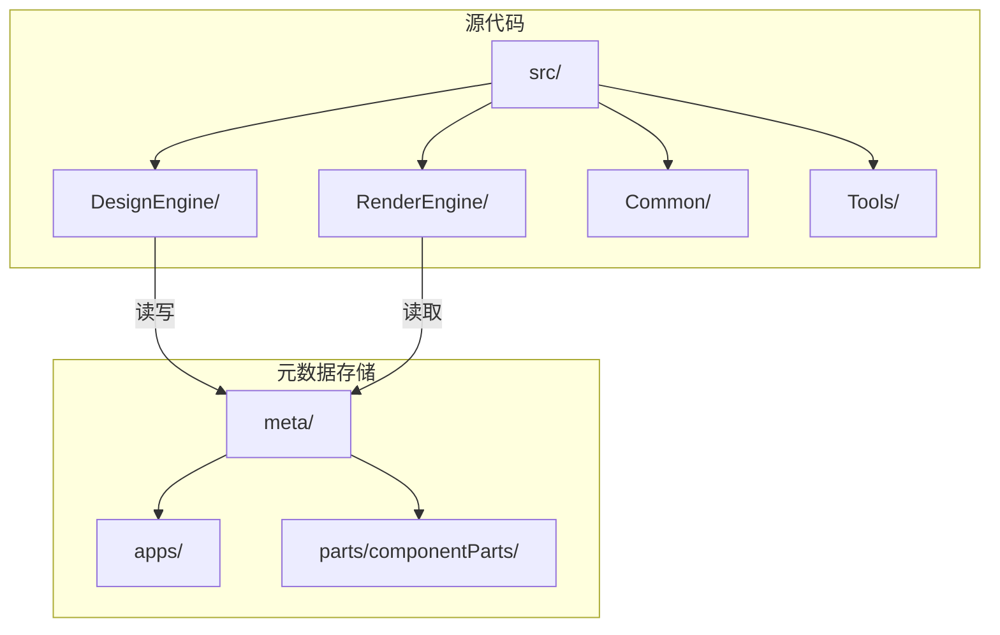
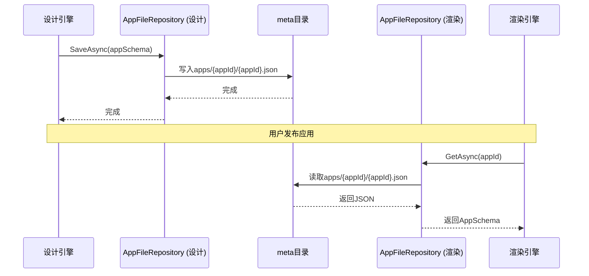
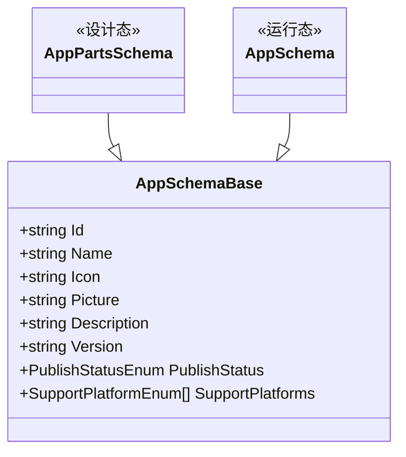
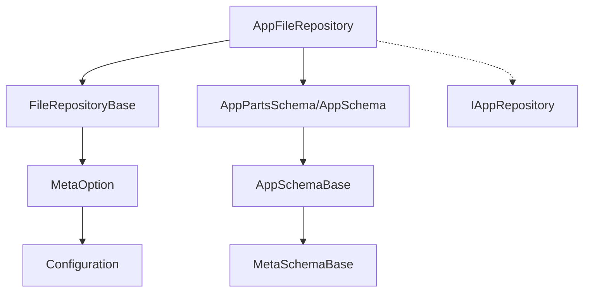

# 元数据同步机制

<cite>
**本文档引用的文件**  
- [AppFileRepository.cs](file://src/DesignEngine/H.LowCode.DesignEngine.Repository.JsonFile/Repositories/AppFileRepository.cs)
- [AppFileRepository.cs](file://src/RenderEngine/H.LowCode.RenderEngine.Repository.JsonFile/Repositories/AppFileRepository.cs)
- [FileRepositoryBase.cs](file://src/DesignEngine/H.LowCode.DesignEngine.Repository.JsonFile/Base/FileRepositoryBase.cs)
- [FileRepositoryBase.cs](file://src/RenderEngine/H.LowCode.RenderEngine.Repository.JsonFile/Base/FileRepositoryBase.cs)
- [AppPartsSchema.cs](file://src/Common/H.LowCode.MetaSchema.DesignEngine/AppPartsSchema.cs)
- [AppSchema.cs](file://src/Common/H.LowCode.MetaSchema.RenderEngine/AppSchema.cs)
- [AppSchemaBase.cs](file://src/Common/H.LowCode.MetaSchema/AppSchemaBase.cs)
- [MetaOption.cs](file://src/Common/H.LowCode.Configuration/Options/MetaOption.cs)
</cite>

## 目录
1. [引言](#引言)
2. [项目结构](#项目结构)
3. [核心组件](#核心组件)
4. [架构概览](#架构概览)
5. [详细组件分析](#详细组件分析)
6. [依赖分析](#依赖分析)
7. [性能考虑](#性能考虑)
8. [结论](#结论)

## 引言
本文档全面解析低代码平台中设计引擎与渲染引擎之间的元数据同步机制。重点阐述当用户在设计引擎中完成应用设计后，元数据（包括应用、页面、组件、数据源等JSON文件）如何从设计态持久化存储导出，并安全传输至渲染引擎的`meta`目录。文档详细说明了`AppFileRepository`等文件存储实现如何支持元数据的读写操作，发布流程中的版本控制、完整性校验与原子更新等关键机制，以及不同部署模式下的同步策略。

## 项目结构
项目采用分层模块化架构，主要分为`meta`元数据存储目录和`src`源代码目录。

`meta`目录是元数据的物理存储位置，其结构清晰：
- `apps`：存放各个应用的元数据，每个应用（如`caseapp`、`testapp`）拥有独立的子目录，内含`datasource`、`menu`、`page`等分类的JSON文件。
- `parts\componentParts\antdesign`：存放组件库的元数据定义。

`src`目录包含多个核心模块：
- `Common`：存放跨引擎共享的基础元数据模型（`MetaSchema`）和配置。
- `DesignEngine`：设计引擎，负责应用的设计与元数据的持久化。
- `RenderEngine`：渲染引擎，负责读取元数据并运行时渲染应用。
- `Tools`：包含数据库迁移和元数据迁移工具。



**Diagram sources**
- [meta](file://meta)
- [src](file://src)

## 核心组件
本节分析实现元数据同步的核心组件，包括文件存储库、元数据模型和配置选项。

**Section sources**
- [AppFileRepository.cs](file://src/DesignEngine/H.LowCode.DesignEngine.Repository.JsonFile/Repositories/AppFileRepository.cs)
- [AppFileRepository.cs](file://src/RenderEngine/H.LowCode.RenderEngine.Repository.JsonFile/Repositories/AppFileRepository.cs)
- [FileRepositoryBase.cs](file://src/DesignEngine/H.LowCode.DesignEngine.Repository.JsonFile/Base/FileRepositoryBase.cs)
- [FileRepositoryBase.cs](file://src/RenderEngine/H.LowCode.RenderEngine.Repository.JsonFile/Base/FileRepositoryBase.cs)
- [AppPartsSchema.cs](file://src/Common/H.LowCode.MetaSchema.DesignEngine/AppPartsSchema.cs)
- [AppSchema.cs](file://src/Common/H.LowCode.MetaSchema.RenderEngine/AppSchema.cs)
- [AppSchemaBase.cs](file://src/Common/H.LowCode.MetaSchema/AppSchemaBase.cs)
- [MetaOption.cs](file://src/Common/H.LowCode.Configuration/Options/MetaOption.cs)

## 架构概览
元数据同步的核心在于设计引擎和渲染引擎对同一`meta`目录的协同访问。两者通过相似的文件存储库模式进行交互，但关注的元数据模型不同。



**Diagram sources**
- [AppFileRepository.cs](file://src/DesignEngine/H.LowCode.DesignEngine.Repository.JsonFile/Repositories/AppFileRepository.cs)
- [AppFileRepository.cs](file://src/RenderEngine/H.LowCode.RenderEngine.Repository.JsonFile/Repositories/AppFileRepository.cs)
- [meta](file://meta)

## 详细组件分析

### 文件存储库分析
`AppFileRepository`是元数据持久化的关键实现，它在设计引擎和渲染引擎中都有对应的版本，均继承自`FileRepositoryBase`。

#### 设计引擎的AppFileRepository
设计引擎的`AppFileRepository`使用`AppPartsSchema`作为数据模型，该模型继承自`AppSchemaBase`，专为设计态的丰富配置而设计。

```csharp
public class AppFileRepository : FileRepositoryBase, IAppRepository
{
    private static string appFileName_Format = @"{0}\{1}\{2}.json";

    public AppFileRepository(IOptions<MetaOption> metaOption) : base(metaOption) { }

    public async Task SaveAsync(AppPartsSchema appSchema)
    {
        // ... 验证和设置修改时间
        string fileName = string.Format(appFileName_Format, _metaBaseDir, appSchema.Id, appSchema.Id);
        string fileDirectory = Path.GetDirectoryName(fileName);
        if (!Directory.Exists(fileDirectory))
            Directory.CreateDirectory(fileDirectory);
        File.WriteAllText(fileName, appSchema.ToJson(), Encoding.UTF8);
        await Task.CompletedTask;
    }
}
```
此实现确保了元数据的原子写入。它首先创建目录（如果不存在），然后直接写入文件。虽然没有显式的事务或临时文件机制，但`File.WriteAllText`在大多数文件系统上是原子操作。

**Section sources**
- [AppFileRepository.cs](file://src/DesignEngine/H.LowCode.DesignEngine.Repository.JsonFile/Repositories/AppFileRepository.cs)

#### 渲染引擎的AppFileRepository
渲染引擎的`AppFileRepository`使用`AppSchema`作为数据模型，该模型同样继承自`AppSchemaBase`，但更侧重于运行时所需的精简信息。

```csharp
public class AppFileRepository : FileRepositoryBase, IAppRepository
{
    private static string appFileName_Format = @"{0}\{1}\{2}.json";

    public AppFileRepository(IOptions<MetaOption> metaOption) : base(metaOption) { }

    public async Task<AppSchema> GetAsync(string appId)
    {
        string fileName = string.Format(appFileName_Format, _metaBaseDir, appId, appId);
        var appSchemaJson = ReadAllText(fileName);
        var appSchema = appSchemaJson.FromJson<AppSchema>();
        return await Task.FromResult(appSchema);
    }
}
```
此实现专注于高效读取。它通过`ReadAllText`方法读取文件内容，并反序列化为`AppSchema`对象。

**Section sources**
- [AppFileRepository.cs](file://src/RenderEngine/H.LowCode.RenderEngine.Repository.JsonFile/Repositories/AppFileRepository.cs)

#### FileRepositoryBase基类
`FileRepositoryBase`为所有文件存储库提供了基础功能，如配置注入和文件读取。

```csharp
public abstract class FileRepositoryBase
{
    protected static string _metaBaseDir;

    public FileRepositoryBase(IOptions<MetaOption> metaOption)
    {
        _metaBaseDir = metaOption.Value.AppsFilePath; // 从配置中获取元数据根路径
        IsChangeTrackingEnabled = false;
    }

    protected static string ReadAllText(string fileName)
    {
        if (!File.Exists(fileName))
            throw new FileNotFoundException(fileName);
        return File.ReadAllText(fileName, Encoding.UTF8);
    }
}
```
该基类通过依赖注入获取`MetaOption`，从而确定`meta`目录的物理路径。

**Section sources**
- [FileRepositoryBase.cs](file://src/DesignEngine/H.LowCode.DesignEngine.Repository.JsonFile/Base/FileRepositoryBase.cs)
- [FileRepositoryBase.cs](file://src/RenderEngine/H.LowCode.RenderEngine.Repository.JsonFile/Base/FileRepositoryBase.cs)

### 元数据模型分析
元数据模型采用继承结构，实现了设计态与运行态的分离与统一。



**Diagram sources**
- [AppPartsSchema.cs](file://src/Common/H.LowCode.MetaSchema.DesignEngine/AppPartsSchema.cs)
- [AppSchema.cs](file://src/Common/H.LowCode.MetaSchema.RenderEngine/AppSchema.cs)
- [AppSchemaBase.cs](file://src/Common/H.LowCode.MetaSchema/AppSchemaBase.cs)

- `AppSchemaBase`：定义了应用元数据的公共基础属性，如ID、名称、图标、版本和发布状态。
- `AppPartsSchema`：设计引擎专用的模型，继承自`AppSchemaBase`，可扩展设计态特有的复杂配置。
- `AppSchema`：渲染引擎专用的模型，继承自`AppSchemaBase`，结构更精简，适合运行时快速加载。

### 配置分析
`MetaOption`类定义了元数据存储的路径配置。

```csharp
public class MetaOption
{
    public const string SectionName = "Meta";
    public string AppsFilePath { get; set; } // 指向meta/apps目录
    public string PartsFilePath { get; set; } // 指向meta/parts目录
}
```
此配置通过依赖注入被`FileRepositoryBase`使用，确保了路径的集中管理。

**Section sources**
- [MetaOption.cs](file://src/Common/H.LowCode.Configuration/Options/MetaOption.cs)

## 依赖分析
系统内各组件的依赖关系清晰，遵循了依赖倒置原则。



设计引擎和渲染引擎的`AppFileRepository`都依赖于`FileRepositoryBase`和各自的元数据模型。`FileRepositoryBase`依赖于`MetaOption`配置。这种分层设计使得文件存储逻辑与具体引擎解耦。

**Diagram sources**
- [AppFileRepository.cs](file://src/DesignEngine/H.LowCode.DesignEngine.Repository.JsonFile/Repositories/AppFileRepository.cs)
- [FileRepositoryBase.cs](file://src/DesignEngine/H.LowCode.DesignEngine.Repository.JsonFile/Base/FileRepositoryBase.cs)
- [MetaOption.cs](file://src/Common/H.LowCode.Configuration/Options/MetaOption.cs)
- [AppPartsSchema.cs](file://src/Common/H.LowCode.MetaSchema.DesignEngine/AppPartsSchema.cs)
- [AppSchema.cs](file://src/Common/H.LowCode.MetaSchema.RenderEngine/AppSchema.cs)

## 性能考虑
1. **增量更新**：当前`SaveAsync`是全量写入。优化方向是实现增量更新，仅保存变更的部分，减少I/O开销。
2. **缓存预热**：渲染引擎在启动时可以预加载所有应用的`AppSchema`到内存缓存中，避免每次请求都读取磁盘。
3. **文件监听**：设计引擎在保存文件后，可以通过文件系统监听（如`FileSystemWatcher`）通知渲染引擎，使其能及时刷新缓存，实现近实时同步。

## 结论
该低代码平台的元数据同步机制通过共享文件系统（`meta`目录）实现，设计简洁。`AppFileRepository`及其基类提供了统一的文件读写接口，而`AppPartsSchema`和`AppSchema`的分离设计则兼顾了设计态的灵活性与运行态的效率。发布流程本质上是设计引擎将`AppPartsSchema`序列化并写入`meta`目录，渲染引擎随后读取并反序列化为`AppSchema`的过程。对于分布式部署，可将直接文件复制替换为通过消息队列触发对象存储的同步，以保证一致性。