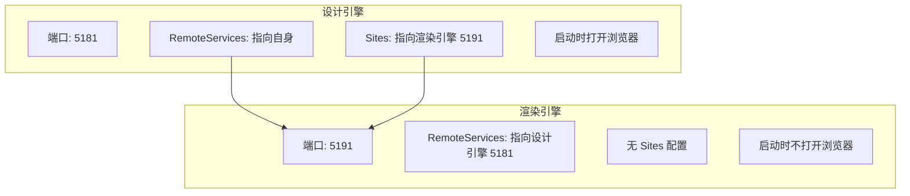
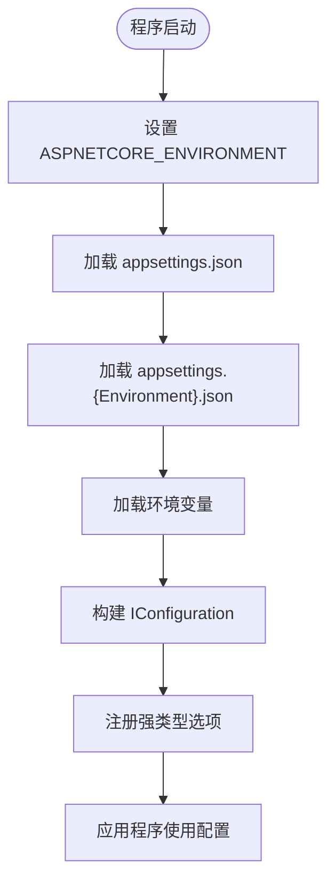

# 多环境配置管理

<cite>
**本文档引用的文件**   
- [appsettings.json](file://src/DesignEngine/H.LowCode.DesignEngine.Host/appsettings.json)
- [appsettings.Development.json](file://src/DesignEngine/H.LowCode.DesignEngine.Host/appsettings.Development.json)
- [launchSettings.json](file://src/DesignEngine/H.LowCode.DesignEngine.Host/Properties/launchSettings.json)
- [appsettings.json](file://src/RenderEngine/H.LowCode.RenderEngine.Host/appsettings.json)
- [appsettings.Development.json](file://src/RenderEngine/H.LowCode.RenderEngine.Host/appsettings.Development.json)
- [launchSettings.json](file://src/RenderEngine/H.LowCode.RenderEngine.Host/Properties/launchSettings.json)
- [Program.cs](file://src/DesignEngine/H.LowCode.DesignEngine.Host/Program.cs)
- [Program.cs](file://src/RenderEngine/H.LowCode.RenderEngine.Host/Program.cs)
- [DesignEngineHostModule.cs](file://src/DesignEngine/H.LowCode.DesignEngine.Host/DesignEngineHostModule.cs)
- [RenderEngineHostModule.cs](file://src/RenderEngine/H.LowCode.RenderEngine.Host/RenderEngineHostModule.cs)
- [MetaOption.cs](file://src/Common/H.LowCode.Configuration/Options/MetaOption.cs)
- [SiteOption.cs](file://src/Common/H.LowCode.Configuration/Options/SiteOption.cs)
- [LowCodeAppState.cs](file://src/Common/H.LowCode.ComponentBase/LowCodeAppState.cs)
</cite>

## 目录
1. [引言](#引言)
2. [基础配置文件作用](#基础配置文件作用)
3. [环境特定配置覆盖机制](#环境特定配置覆盖机制)
4. [启动配置与环境变量](#启动配置与环境变量)
5. [设计引擎与渲染引擎配置对比](#设计引擎与渲染引擎配置对比)
6. [配置加载机制与优先级](#配置加载机制与优先级)
7. [配置项分类管理建议](#配置项分类管理建议)
8. [配置验证与热重载](#配置验证与热重载)

## 引言
本低代码平台采用基于 ASP.NET Core 的多环境配置策略，通过 `appsettings.json` 作为基础配置，结合环境特定文件（如 `appsettings.Development.json`）实现灵活的配置管理。平台包含设计引擎和渲染引擎两个核心模块，分别服务于应用构建和运行时展示。本文详细说明其配置体系结构、加载机制及最佳实践。

## 基础配置文件作用
`appsettings.json` 是平台的核心配置文件，定义了所有环境下的默认配置值。该文件位于各主机项目根目录下，为应用程序提供基础设置。

### 设计引擎基础配置
设计引擎的 `appsettings.json` 包含以下关键配置项：

```json
{
  "AllowedHosts": "*",
  "Logging": {
    "LogLevel": {
      "Default": "Information",
      "Microsoft.AspNetCore": "Warning"
    }
  },
  "ConnectionStrings": {
    "Default": "Server=(localdb)\\MSSQLLocalDB;Database=H_LowCode;Trusted_Connection=True;TrustServerCertificate=True"
  },
  "Meta": {
    "appsFilePath": "../../../meta/apps",
    "partsFilePath": "../../../meta/parts"
  },
  "RemoteServices": {
    "Default": {
      "BaseUrl": "https://localhost:5181"
    }
  },
  "Sites": [
    {
      "AppId": "caseapp",
      "SiteUrl": "https://localhost:5191"
    },
    {
      "AppId": "testapp",
      "SiteUrl": "https://localhost:5191"
    }
  ]
}
```

#### 配置项说明
- **ConnectionStrings**: 定义数据库连接字符串，用于持久化元数据。
- **Meta**: 指定元数据文件存储路径，`appsFilePath` 和 `partsFilePath` 分别指向应用和组件库的 JSON 定义文件。
- **RemoteServices**: 配置远程服务基地址，设计引擎通过此地址调用其他服务。
- **Sites**: 定义站点映射关系，将应用 ID 与运行时 URL 关联。

### 渲染引擎基础配置
渲染引擎的 `appsettings.json` 结构类似，但 `RemoteServices` 的 `BaseUrl` 指向设计引擎：

```json
{
  "RemoteServices": {
    "Default": {
      "BaseUrl": "https://localhost:5191"
    }
  }
}
```

这表明渲染引擎在运行时从设计引擎获取元数据。

**Section sources**
- [appsettings.json](file://src/DesignEngine/H.LowCode.DesignEngine.Host/appsettings.json)
- [appsettings.json](file://src/RenderEngine/H.LowCode.RenderEngine.Host/appsettings.json)

## 环境特定配置覆盖机制
平台使用 ASP.NET Core 内置的配置分层机制，允许环境特定文件覆盖基础配置中的值。

### 开发环境配置
`appsettings.Development.json` 文件仅包含日志级别配置：

```json
{
  "Logging": {
    "LogLevel": {
      "Default": "Information",
      "Microsoft.AspNetCore": "Warning"
    }
  }
}
```

此配置会**合并**到 `appsettings.json` 中，仅当键存在时进行覆盖。例如，日志级别设置会被应用，而数据库连接等其他配置仍沿用基础文件的值。

### 配置覆盖原则
- **层级优先级**：`appsettings.{Environment}.json` > `appsettings.json`
- **深度合并**：对象属性逐层合并，而非完全替换
- **动态加载**：根据 `ASPNETCORE_ENVIRONMENT` 环境变量自动选择配置文件

**Section sources**
- [appsettings.Development.json](file://src/DesignEngine/H.LowCode.DesignEngine.Host/appsettings.Development.json)
- [appsettings.Development.json](file://src/RenderEngine/H.LowCode.RenderEngine.Host/appsettings.Development.json)

## 启动配置与环境变量
`launchSettings.json` 文件定义了开发环境下的启动行为和环境变量，位于 `Properties` 目录中。

### 设计引擎启动配置
```json
{
  "profiles": {
    "DesignEngine": {
      "commandName": "Project",
      "dotnetRunMessages": true,
      "launchBrowser": true,
      "inspectUri": "{wsProtocol}://{url.hostname}:{url.port}/_framework/debug/ws-proxy?browser={browserInspectUri}",
      "applicationUrl": "https://localhost:5181;http://localhost:5180",
      "environmentVariables": {
        "ASPNETCORE_ENVIRONMENT": "Development"
      }
    }
  }
}
```

### 渲染引擎启动配置
```json
{
  "profiles": {
    "RenderEngine": {
      "commandName": "Project",
      "dotnetRunMessages": true,
      "launchBrowser": false,
      "inspectUri": "{wsProtocol}://{url.hostname}:{url.port}/_framework/debug/ws-proxy?browser={browserInspectUri}",
      "applicationUrl": "https://localhost:5191;http://localhost:5190",
      "environmentVariables": {
        "ASPNETCORE_ENVIRONMENT": "Development"
      }
    }
  }
}
```

### 关键配置说明
- **applicationUrl**: 定义服务监听地址，设计引擎使用 5181 端口，渲染引擎使用 5191 端口。
- **launchBrowser**: 设计引擎启动时自动打开浏览器，渲染引擎则不自动打开。
- **ASPNETCORE_ENVIRONMENT**: 明确设置环境为 "Development"，触发加载 `appsettings.Development.json`。

**Section sources**
- [launchSettings.json](file://src/DesignEngine/H.LowCode.DesignEngine.Host/Properties/launchSettings.json)
- [launchSettings.json](file://src/RenderEngine/H.LowCode.RenderEngine.Host/Properties/launchSettings.json)

## 设计引擎与渲染引擎配置对比



**Diagram sources**
- [appsettings.json](file://src/DesignEngine/H.LowCode.DesignEngine.Host/appsettings.json)
- [appsettings.json](file://src/RenderEngine/H.LowCode.RenderEngine.Host/appsettings.json)
- [launchSettings.json](file://src/DesignEngine/H.LowCode.DesignEngine.Host/Properties/launchSettings.json)
- [launchSettings.json](file://src/RenderEngine/H.LowCode.RenderEngine.Host/Properties/launchSettings.json)

### 配置结构异同
| 特性 | 设计引擎 | 渲染引擎 |
|------|--------|--------|
| **核心功能** | 应用设计与构建 | 应用运行时渲染 |
| **RemoteServices** | 指向自身服务 | 指向设计引擎获取元数据 |
| **Sites 配置** | 存在，定义应用部署地址 | 不存在 |
| **启动行为** | 自动打开浏览器 | 不自动打开 |
| **应用状态** | `LowCodeAppState(true)` | `LowCodeAppState(false)` |

**Section sources**
- [DesignEngineHostModule.cs](file://src/DesignEngine/H.LowCode.DesignEngine.Host/DesignEngineHostModule.cs)
- [RenderEngineHostModule.cs](file://src/RenderEngine/H.LowCode.RenderEngine.Host/RenderEngineHostModule.cs)
- [LowCodeAppState.cs](file://src/Common/H.LowCode.ComponentBase/LowCodeAppState.cs)

## 配置加载机制与优先级
平台遵循 ASP.NET Core 标准配置加载流程，优先级从低到高如下：

1. `appsettings.json`
2. `appsettings.{Environment}.json`
3. 环境变量
4. 命令行参数

### 配置加载流程


### 强类型配置绑定
平台使用 `MetaOption` 和 `SiteOption` 类实现强类型配置：

```csharp
public class MetaOption
{
    public const string SectionName = "Meta";
    public string AppsFilePath { get; set; }
    public string PartsFilePath { get; set; }
}

public class SiteOption
{
    public const string SectionName = "Sites";
    public string AppId { get; set; }
    public string SiteUrl { get; set; }
}
```

这些类通过依赖注入在服务中使用，确保类型安全和编译时检查。

**Section sources**
- [MetaOption.cs](file://src/Common/H.LowCode.Configuration/Options/MetaOption.cs)
- [SiteOption.cs](file://src/Common/H.LowCode.Configuration/Options/SiteOption.cs)
- [Program.cs](file://src/DesignEngine/H.LowCode.DesignEngine.Host/Program.cs)

## 配置项分类管理建议
为确保配置安全性和可维护性，建议按以下方式分类管理：

### 敏感信息（如数据库连接字符串）
- **管理方式**：使用环境变量或 Azure Key Vault 等密钥管理服务
- **示例**：
  ```bash
  set ConnectionStrings__Default=Server=prod;Database=H_LowCode;User=sa;Password=***
  ```

### 运行时参数（如 API 地址）
- **管理方式**：保留在 `appsettings.json` 中，通过环境文件覆盖
- **示例**：
  ```json
  // appsettings.Production.json
  {
    "RemoteServices": {
      "Default": {
        "BaseUrl": "https://api.prod.com"
      }
    }
  }
  ```

### 功能开关（如调试模式）
- **管理方式**：使用布尔型配置项，结合环境变量控制
- **示例**：
  ```json
  {
    "Features": {
      "EnableDebugTools": true
    }
  }
  ```

## 配置验证与热重载
### 配置验证机制
建议在 `Program.cs` 中添加配置验证：

```csharp
// 示例代码（未在源码中实现，建议添加）
builder.Services.Configure<MetaOption>(options =>
{
    if (string.IsNullOrEmpty(options.AppsFilePath))
        throw new InvalidOperationException("Meta:appsFilePath 不能为空");
});
```

### 热重载支持
- **开发环境**：启用 `dotnet watch` 可实现配置文件修改后自动重启
- **运行时**：可通过 API 端点触发配置重新加载（需自定义实现）

**Section sources**
- [Program.cs](file://src/DesignEngine/H.LowCode.DesignEngine.Host/Program.cs)
- [Program.cs](file://src/RenderEngine/H.LowCode.RenderEngine.Host/Program.cs)