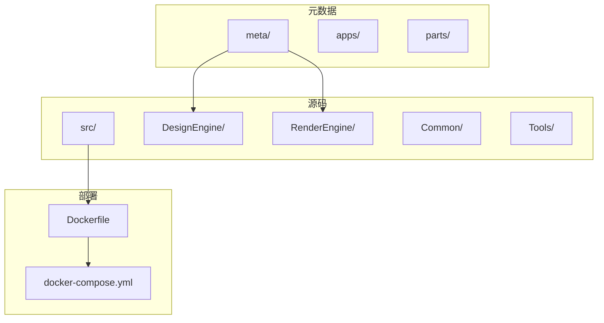
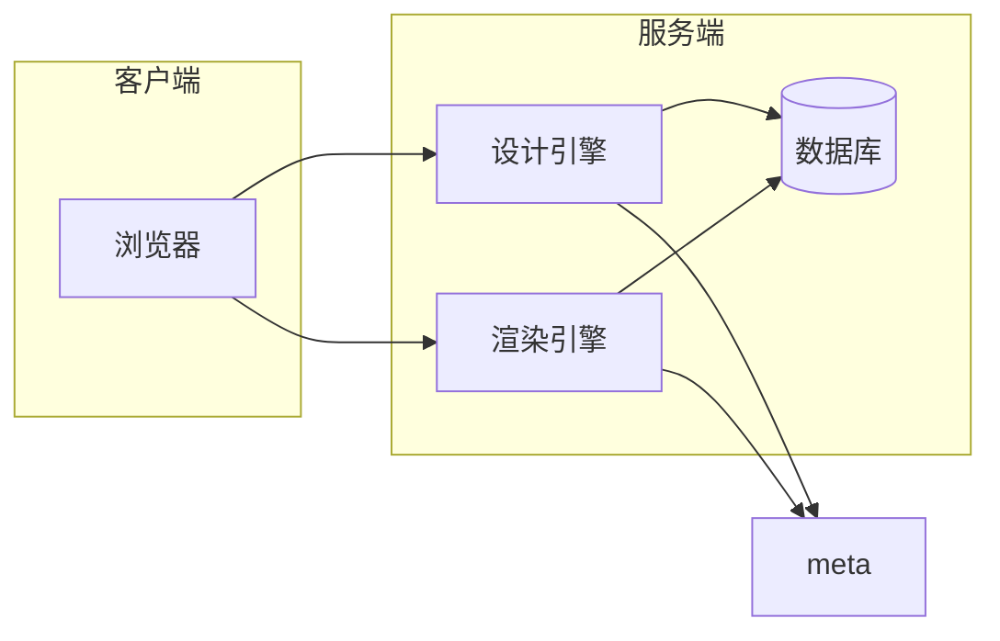
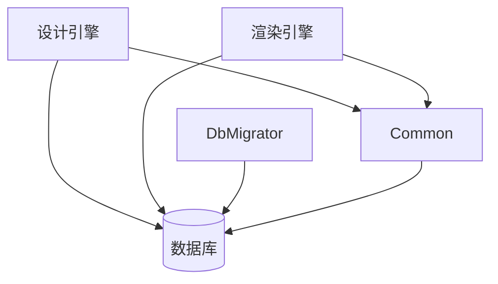

# 容器化部署

<cite>
**本文档中引用的文件**   
- [appsettings.json](file://src/DesignEngine/H.LowCode.DesignEngine.Host/appsettings.json)
- [appsettings.json](file://src/RenderEngine/H.LowCode.RenderEngine.Host/appsettings.json)
- [Program.cs](file://src/DesignEngine/H.LowCode.DesignEngine.Host/Program.cs)
- [Program.cs](file://src/RenderEngine/H.LowCode.RenderEngine.Host/Program.cs)
- [DesignEngineDbContext.cs](file://src/DesignEngine/H.LowCode.DesignEngine.EntityFrameworkCore/EntityFrameworkCore/DesignEngineDbContext.cs)
- [RenderEngineDbContext.cs](file://src/RenderEngine/H.LowCode.RenderEngine.EntityFrameworkCore/EntityFrameworkCore/RenderEngineDbContext.cs)
</cite>

## 目录
1. [简介](#简介)
2. [项目结构](#项目结构)
3. [核心组件](#核心组件)
4. [架构概述](#架构概述)
5. [详细组件分析](#详细组件分析)
6. [依赖分析](#依赖分析)
7. [性能考虑](#性能考虑)
8. [故障排除指南](#故障排除指南)
9. [结论](#结论)

## 简介
本文档提供基于Docker的容器化部署完整指南，涵盖设计引擎和渲染引擎的多阶段构建、配置管理、服务编排及Kubernetes扩展方案。项目采用模块化架构，包含设计引擎（DesignEngine）和渲染引擎（RenderEngine），分别用于低代码应用的设计与运行时渲染。两者均基于ASP.NET Core Blazor Server/WebAssembly混合模式开发，通过Entity Framework Core与数据库交互，并使用JSON文件存储元数据。本文将详细说明如何实现编译与运行环境分离，优化镜像体积，并通过docker-compose和Kubernetes进行服务编排。

## 项目结构
项目采用分层架构，主要分为`meta`、`src`和`Tools`三大目录。`meta`目录存放应用元数据（如页面、菜单、数据源配置），`src`目录包含核心源码，`Tools`目录包含数据库迁移工具。



**Diagram sources**
- [appsettings.json](file://src/DesignEngine/H.LowCode.DesignEngine.Host/appsettings.json)
- [appsettings.json](file://src/RenderEngine/H.LowCode.RenderEngine.Host/appsettings.json)

**Section sources**
- [appsettings.json](file://src/DesignEngine/H.LowCode.DesignEngine.Host/appsettings.json)
- [appsettings.json](file://src/RenderEngine/H.LowCode.RenderEngine.Host/appsettings.json)

## 核心组件
核心组件包括设计引擎和渲染引擎，两者共享`Common`模块中的基础类库。设计引擎提供可视化设计界面，渲染引擎负责应用的运行时展示。两者均通过`Host`项目作为入口点，使用`appsettings.json`进行配置，并通过`DbContext`与数据库交互。

**Section sources**
- [Program.cs](file://src/DesignEngine/H.LowCode.DesignEngine.Host/Program.cs)
- [Program.cs](file://src/RenderEngine/H.LowCode.RenderEngine.Host/Program.cs)

## 架构概述
系统采用微服务架构，设计引擎和渲染引擎作为独立服务运行，共享同一数据库。元数据通过文件系统（`meta`目录）进行管理，支持JSON文件存储。数据库使用SQL Server LocalDB进行本地开发，生产环境可替换为远程SQL Server实例。



**Diagram sources**
- [DesignEngineDbContext.cs](file://src/DesignEngine/H.LowCode.DesignEngine.EntityFrameworkCore/EntityFrameworkCore/DesignEngineDbContext.cs)
- [RenderEngineDbContext.cs](file://src/RenderEngine/H.LowCode.RenderEngine.EntityFrameworkCore/EntityFrameworkCore/RenderEngineDbContext.cs)

## 详细组件分析

### 设计引擎分析
设计引擎负责低代码应用的可视化设计，其核心配置位于`appsettings.json`，包括数据库连接字符串、元数据路径和远程服务地址。

#### 启动流程分析
设计引擎的启动流程在`Program.cs`中定义，主要步骤包括：
1. 创建WebApplicationBuilder。
2. 添加Razor组件、控制器和响应压缩服务。
3. 配置Autofac依赖注入容器。
4. 构建并初始化应用。
5. 配置HTTP请求管道，包括静态文件、HTTPS重定向、路由和控制器映射。

```csharp
var builder = WebApplication.CreateBuilder(args);
builder.Services.AddRazorComponents()
    .AddInteractiveServerComponents()
    .AddInteractiveWebAssemblyComponents();
builder.Services.AddControllers();
builder.Services.AddResponseCompression();
builder.Host.UseAutofac();
await builder.AddApplicationAsync<DesignEngineHostModule>();
var app = builder.Build();
await app.InitializeApplicationAsync();
app.UseStaticFiles();
app.UseHttpsRedirection();
app.UseRouting();
app.MapControllers();
app.MapRazorComponents<App>();
await app.RunAsync();
```

**Section sources**
- [Program.cs](file://src/DesignEngine/H.LowCode.DesignEngine.Host/Program.cs)

### 渲染引擎分析
渲染引擎负责低代码应用的运行时渲染，其配置与设计引擎类似，但不包含`Sites`配置。

#### 配置文件分析
渲染引擎的`appsettings.json`与设计引擎基本一致，但`RemoteServices`的`BaseUrl`指向设计引擎。

#### 启动流程分析
渲染引擎的启动流程与设计引擎几乎完全相同，仅模块类型不同。

```csharp
await builder.AddApplicationAsync<RenderEngineHostModule>();
```

**Section sources**
- [Program.cs](file://src/RenderEngine/H.LowCode.RenderEngine.Host/Program.cs)

### 数据库交互分析
设计引擎和渲染引擎均通过Entity Framework Core与数据库交互，使用`DesignEngineDbContext`和`RenderEngineDbContext`。

#### DbContext分析
`DbContext`类实现了动态实体管理，通过`EntityTypeManager`加载动态实体，并在`OnModelCreating`中配置表映射、属性映射和主键。

```csharp
protected override void OnModelCreating(ModelBuilder modelBuilder)
{
    var dynamicEntities = _entityTypeManager.LoadDynamicEntities();
    foreach (var dynamicEntity in dynamicEntities)
    {
        var entityBuilder = modelBuilder.Entity(dynamicEntity.EntityType)
            .ToTable(dynamicEntity.EntityName);
        ConfigureProperties(entityBuilder, dynamicEntity, dynamicEntity.EntityType);
        entityBuilder.HasKey(dynamicEntity.PrimaryKey);
    }
    base.OnModelCreating(modelBuilder);
}
```

**Section sources**
- [DesignEngineDbContext.cs](file://src/DesignEngine/H.LowCode.DesignEngine.EntityFrameworkCore/EntityFrameworkCore/DesignEngineDbContext.cs)
- [RenderEngineDbContext.cs](file://src/RenderEngine/H.LowCode.RenderEngine.EntityFrameworkCore/EntityFrameworkCore/RenderEngineDbContext.cs)

## 依赖分析
项目依赖关系清晰，设计引擎和渲染引擎独立运行，共享数据库和元数据。`Common`模块提供基础类库，`Tools`模块提供数据库迁移功能。



**Diagram sources**
- [DesignEngineDbContext.cs](file://src/DesignEngine/H.LowCode.DesignEngine.EntityFrameworkCore/EntityFrameworkCore/DesignEngineDbContext.cs)
- [RenderEngineDbContext.cs](file://src/RenderEngine/H.LowCode.RenderEngine.EntityFrameworkCore/EntityFrameworkCore/RenderEngineDbContext.cs)

**Section sources**
- [DesignEngineDbContext.cs](file://src/DesignEngine/H.LowCode.DesignEngine.EntityFrameworkCore/EntityFrameworkCore/DesignEngineDbContext.cs)
- [RenderEngineDbContext.cs](file://src/RenderEngine/H.LowCode.RenderEngine.EntityFrameworkCore/EntityFrameworkCore/RenderEngineDbContext.cs)

## 性能考虑
- **响应压缩**: 启用了Brotli压缩，优化网络传输。
- **静态文件缓存**: 静态文件设置了600秒的缓存。
- **EF Core拦截器**: 使用`QueryWithNoLockDbCommandInterceptor`优化查询性能。
- **动态实体**: 通过动态实体减少数据库表数量，提高灵活性。

## 故障排除指南
- **数据库连接失败**: 检查`ConnectionStrings`配置，确保SQL Server服务运行。
- **元数据加载失败**: 检查`Meta`路径配置，确保`meta`目录存在且可读。
- **API调用失败**: 检查`RemoteServices`的`BaseUrl`，确保服务可达。
- **健康检查失败**: 项目未配置健康检查中间件，需在`Program.cs`中添加`app.MapHealthChecks("/health")`。

**Section sources**
- [appsettings.json](file://src/DesignEngine/H.LowCode.DesignEngine.Host/appsettings.json)
- [appsettings.json](file://src/RenderEngine/H.LowCode.RenderEngine.Host/appsettings.json)

## 结论
本文档详细分析了低代码平台的容器化部署方案。设计引擎和渲染引擎可分别构建为独立Docker镜像，通过`appsettings.json`进行配置管理。建议使用多阶段Docker构建优化镜像体积，并通过`docker-compose.yml`编排服务。在Kubernetes中，可使用ConfigMap管理配置，Secret存储敏感信息，Ingress配置路由。未来可添加健康检查和日志驱动集成以增强运维能力。