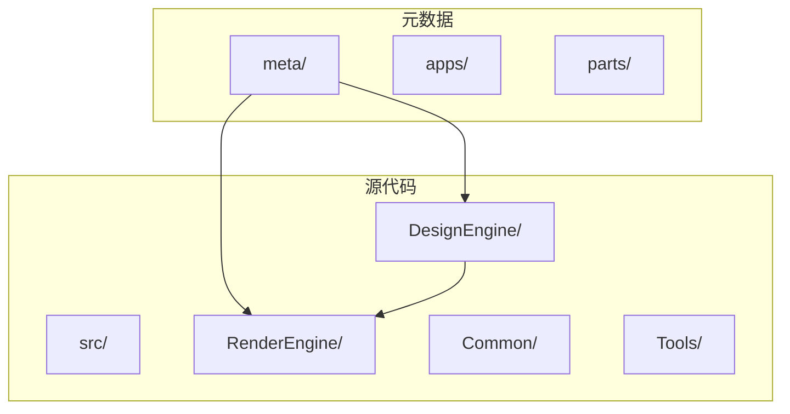
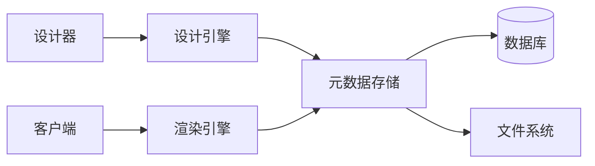
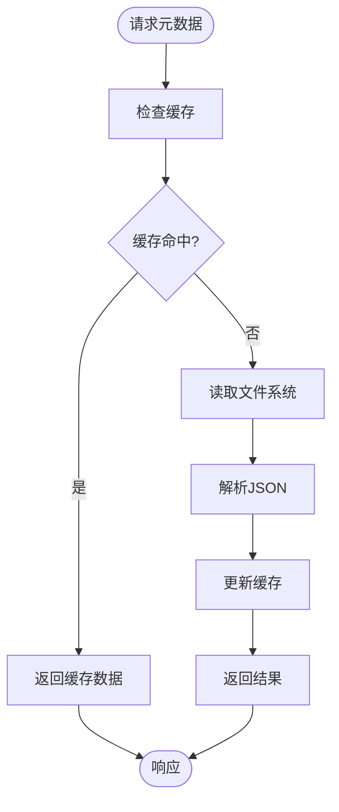
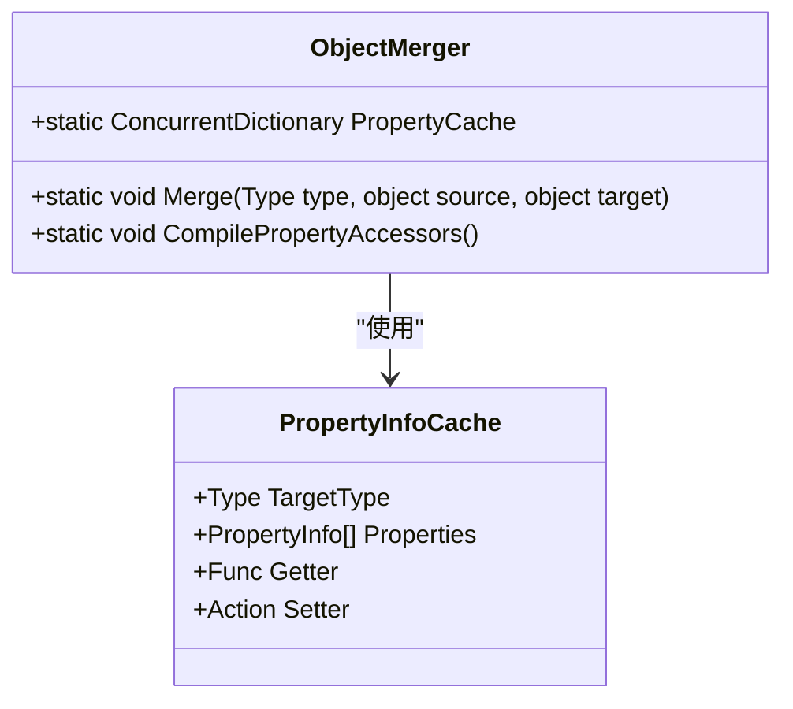
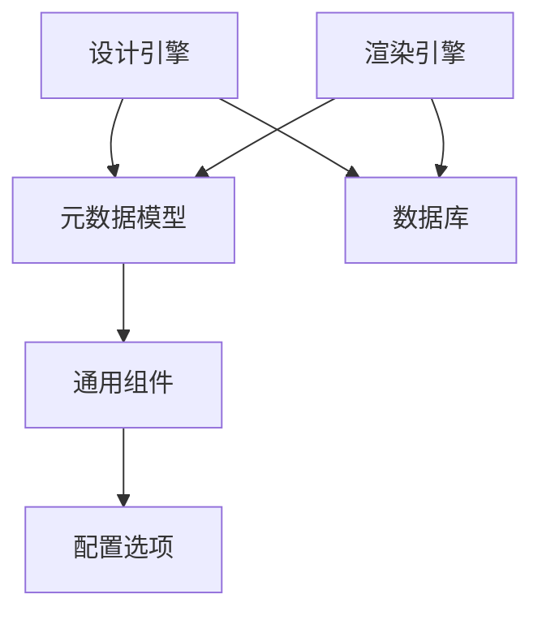

# 性能调优

<cite>
**本文档引用的文件**  
- [appsettings.json](file://src/DesignEngine/H.LowCode.DesignEngine.Host/appsettings.json)
- [appsettings.json](file://src/RenderEngine/H.LowCode.RenderEngine.Host/appsettings.json)
- [ObjectMerger.cs](file://src/Common/H.LowCode.MetaSchema/Utils/ObjectMerger.cs)
- [Program.cs](file://src/DesignEngine/H.LowCode.DesignEngine.Host/Program.cs)
- [Program.cs](file://src/RenderEngine/H.LowCode.RenderEngine.Host/Program.cs)
- [FileRepositoryBase.cs](file://src/DesignEngine/H.LowCode.DesignEngine.Repository.JsonFile/Base/FileRepositoryBase.cs)
- [DesignEngineDbContext.cs](file://src/DesignEngine/H.LowCode.DesignEngine.EntityFrameworkCore/EntityFrameworkCore/DesignEngineDbContext.cs)
- [RenderEngineDynamicComponentBase.cs](file://src/RenderEngine/H.LowCode.RenderEngine.Abstraction/RenderEngineDynamicComponentBase.cs)
</cite>

## 目录
1. [引言](#引言)
2. [项目结构分析](#项目结构分析)
3. [核心组件分析](#核心组件分析)
4. [架构概览](#架构概览)
5. [详细组件分析](#详细组件分析)
6. [依赖分析](#依赖分析)
7. [性能考虑](#性能考虑)
8. [故障排除指南](#故障排除指南)
9. [结论](#结论)

## 引言
本文档旨在为低代码平台提供系统级性能优化建议。通过分析元数据读取、静态资源处理、数据库访问、核心工具类性能以及Web优化技术，提出一系列可实施的性能调优策略。文档将深入探讨缓存策略、压缩技术、连接池配置等关键性能因素，并提供具体的实现建议和基准指标。

## 项目结构分析
该项目采用模块化设计，主要分为`meta`（元数据）、`src`（源代码）和`Tools`（工具）三大目录。`meta`目录存储应用程序的元数据配置，包括应用、菜单、页面和组件等JSON文件。`src`目录包含多个子系统，如设计引擎、渲染引擎和通用组件库，采用分层架构设计。



**图源**  
- [项目结构](file://README.md)

## 核心组件分析
系统的核心组件包括设计引擎、渲染引擎和元数据管理模块。设计引擎负责可视化设计和元数据管理，渲染引擎负责运行时页面渲染，两者共享元数据结构但职责分离。通用组件库提供跨模块的基础功能。

**本节来源**  
- [H.LowCode.ComponentBase.csproj](file://src/Common/H.LowCode.ComponentBase/H.LowCode.ComponentBase.csproj)
- [H.LowCode.MetaSchema.csproj](file://src/Common/H.LowCode.MetaSchema/H.LowCode.MetaSchema.csproj)

## 架构概览
系统采用前后端分离的微服务架构，设计引擎和渲染引擎作为独立的服务运行。元数据通过文件系统或远程服务存储，支持JSON文件和数据库两种存储方式。渲染引擎通过元数据动态生成UI组件，实现低代码的核心功能。



**图源**  
- [appsettings.json](file://src/DesignEngine/H.LowCode.DesignEngine.Host/appsettings.json)
- [appsettings.json](file://src/RenderEngine/H.LowCode.RenderEngine.Host/appsettings.json)

## 详细组件分析

### 元数据缓存策略分析
当前系统在读取元数据时直接从文件系统加载，缺乏有效的缓存机制，导致频繁的I/O操作。所有元数据读取操作均通过`FileRepositoryBase`类实现，该类直接读取JSON文件而没有缓存层。

```csharp
protected static string ReadAllText(string fileName)
{
    if (!File.Exists(fileName))
        throw new FileNotFoundException(fileName);

    return File.ReadAllText(fileName, Encoding.UTF8);
}
```

**建议的缓存策略**：
1. **内存缓存**：使用`MemoryCache`对频繁访问的元数据进行缓存
2. **分布式缓存**：在集群环境下使用Redis实现分布式缓存
3. **缓存失效机制**：基于元数据的`ModifiedTime`字段实现时间戳验证



**图源**  
- [FileRepositoryBase.cs](file://src/DesignEngine/H.LowCode.DesignEngine.Repository.JsonFile/Base/FileRepositoryBase.cs)
- [AppFileRepository.cs](file://src/DesignEngine/H.LowCode.DesignEngine.Repository.JsonFile/Repositories/AppFileRepository.cs)

**本节来源**  
- [FileRepositoryBase.cs](file://src/DesignEngine/H.LowCode.DesignEngine.Repository.JsonFile/Base/FileRepositoryBase.cs)
- [MetaOption.cs](file://src/Common/H.LowCode.Configuration/Options/MetaOption.cs)

### ObjectMerger性能瓶颈分析
`ObjectMerger`类是系统中的核心工具类，用于对象属性的合并操作，但存在多个性能瓶颈：

```csharp
public static void Merge(Type type, object source, object target)
{
    var properties = type.GetProperties(BindingFlags.Public | BindingFlags.Instance);

    foreach (var property in properties)
    {
        var sourcePropertyValue = property.GetValue(source);
        // ... 处理逻辑
    }
}
```

**性能问题分析**：
1. **反射开销**：每次调用都使用反射获取属性信息，没有缓存
2. **递归调用**：深度嵌套对象导致大量递归调用
3. **集合处理**：集合合并算法效率较低，存在不必要的内存分配

**优化方案**：
1. **属性信息缓存**：使用`ConcurrentDictionary<Type, PropertyInfo[]>`缓存属性信息
2. **编译表达式树**：使用`Expression`编译属性访问器，避免反射开销
3. **批量处理优化**：优化集合合并算法，减少迭代次数



**图源**  
- [ObjectMerger.cs](file://src/Common/H.LowCode.MetaSchema/Utils/ObjectMerger.cs)

**本节来源**  
- [ObjectMerger.cs](file://src/Common/H.LowCode.MetaSchema/Utils/ObjectMerger.cs)

### 静态资源优化分析
系统已配置响应压缩和静态文件缓存，但在CDN分发和压缩配置方面仍有优化空间。

```csharp
builder.Services.AddResponseCompression(options =>
{
    options.Providers.Add<BrotliCompressionProvider>();
});
builder.Services.Configure<BrotliCompressionProviderOptions>(options =>
{
    options.Level = CompressionLevel.Optimal;
});

app.UseStaticFiles(new StaticFileOptions
{
    OnPrepareResponse = ctx =>
    {
        ctx.Context.Response.Headers.Append("Cache-Control", "public,max-age=600");
    }
});
```

**优化建议**：
1. **压缩中间件配置**：在`appsettings.json`中配置压缩级别和MIME类型
2. **CDN分发**：将静态资源部署到CDN，减少服务器负载
3. **浏览器缓存优化**：延长缓存时间，添加版本控制

**本节来源**  
- [Program.cs](file://src/DesignEngine/H.LowCode.DesignEngine.Host/Program.cs)
- [Program.cs](file://src/RenderEngine/H.LowCode.RenderEngine.Host/Program.cs)

### 数据库性能优化分析
系统使用Entity Framework Core作为ORM框架，但缺少关键的性能配置。

```csharp
protected override void OnConfiguring(DbContextOptionsBuilder optionsBuilder)
{
    optionsBuilder.AddInterceptors(new QueryWithNoLockDbCommandInterceptor());
    base.OnConfiguring(optionsBuilder);
}
```

**优化建议**：
1. **连接池配置**：在连接字符串中添加连接池参数
   ```
   Server=(localdb)\\MSSQLLocalDB;Database=H_LowCode;Pooling=true;Max Pool Size=100;Min Pool Size=5
   ```
2. **命令超时设置**：配置合理的命令超时时间
3. **查询优化**：使用`WITH (NOLOCK)`提示减少锁争用

**本节来源**  
- [DesignEngineDbContext.cs](file://src/DesignEngine/H.LowCode.DesignEngine.EntityFrameworkCore/EntityFrameworkCore/DesignEngineDbContext.cs)
- [appsettings.json](file://src/DesignEngine/H.LowCode.DesignEngine.Host/appsettings.json)

### 渲染引擎加载策略分析
渲染引擎采用动态组件渲染机制，但缺乏预加载和懒加载的平衡策略。

```csharp
private void RenderComponentRecursive(
    string componentId, bool isSupportDataSource,
    ComponentSchema component,
    ComponentDataSourceSchema dataSource,
    ComponentFragmentSchema componentFragment,
    RenderTreeBuilder builder, int index)
{
    // 递归渲染组件
}
```

**优化建议**：
1. **元数据预加载**：在应用启动时预加载常用元数据
2. **组件懒加载**：对非关键组件实现按需加载
3. **加载优先级管理**：根据组件重要性设置加载优先级

**本节来源**  
- [RenderEngineDynamicComponentBase.cs](file://src/RenderEngine/H.LowCode.RenderEngine.Abstraction/RenderEngineDynamicComponentBase.cs)

## 依赖分析
系统各模块之间的依赖关系清晰，采用依赖注入模式管理服务。设计引擎和渲染引擎共享元数据模型，但通过不同的实现方式分离关注点。



**图源**  
- [H.LowCode.MetaSchema.csproj](file://src/Common/H.LowCode.MetaSchema/H.LowCode.MetaSchema.csproj)
- [H.LowCode.MetaSchema.RenderEngine.csproj](file://src/Common/H.LowCode.MetaSchema.RenderEngine/H.LowCode.MetaSchema.RenderEngine.csproj)

**本节来源**  
- [项目文件](file://src/Common/H.LowCode.MetaSchema/H.LowCode.MetaSchema.csproj)

## 性能考虑
### Web优化技术建议
1. **启用HTTP/2**：提升并发请求性能
2. **Gzip/Brotli压缩**：已实现Brotli压缩，可进一步优化
3. **浏览器缓存**：当前缓存时间为600秒，可延长至24小时
4. **资源预加载**：使用`<link rel="preload">`预加载关键资源

### 性能测试方法
1. **基准测试**：使用JMeter或k6进行压力测试
2. **监控指标**：关注响应时间、吞吐量、错误率
3. **容量规划**：根据业务增长预测资源需求

**本节来源**  
- [Program.cs](file://src/DesignEngine/H.LowCode.DesignEngine.Host/Program.cs)

## 故障排除指南
### 常见性能问题
1. **元数据读取缓慢**：检查文件系统性能，考虑引入缓存
2. **数据库连接耗尽**：检查连接池配置，优化连接使用
3. **内存泄漏**：监控`ObjectMerger`的使用情况，避免循环引用

**本节来源**  
- [ObjectMerger.cs](file://src/Common/H.LowCode.MetaSchema/Utils/ObjectMerger.cs)
- [DesignEngineDbContext.cs](file://src/DesignEngine/H.LowCode.DesignEngine.EntityFrameworkCore/EntityFrameworkCore/DesignEngineDbContext.cs)

## 结论
通过对系统的全面分析，我们识别了多个性能优化机会。建议优先实施元数据缓存策略和`ObjectMerger`类的性能优化，这两项改进将显著提升系统整体性能。同时，完善数据库连接池配置和静态资源优化策略，为系统的可扩展性奠定基础。持续的性能监控和基准测试将是确保系统稳定高效运行的关键。