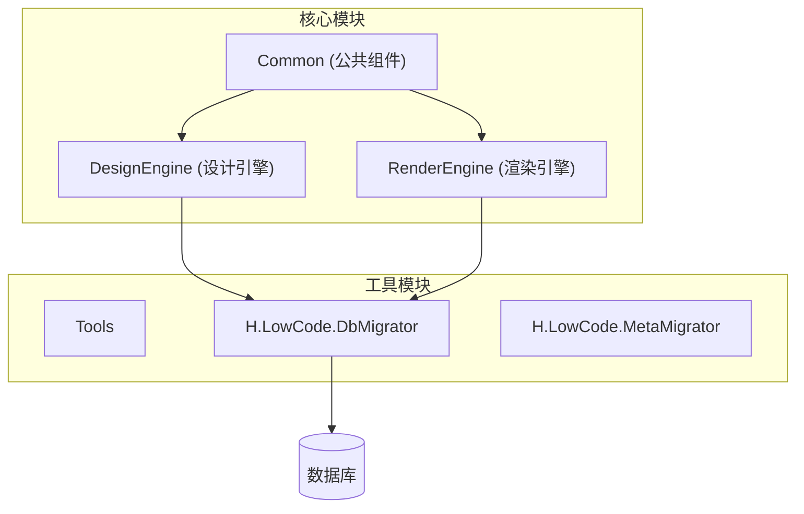
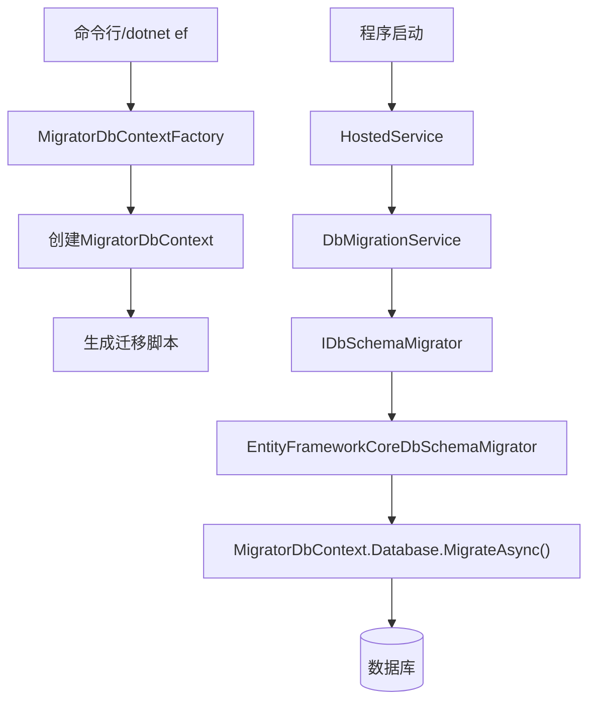
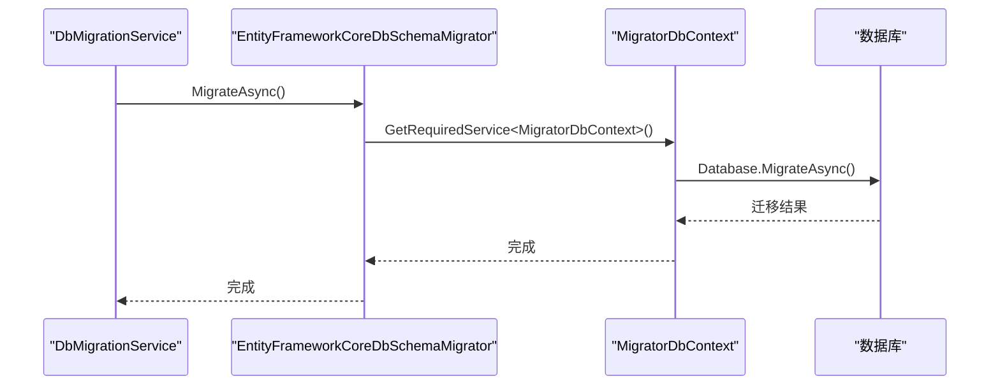
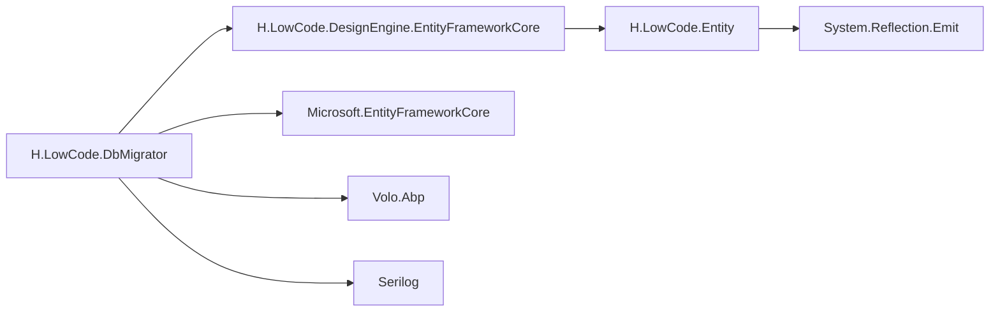

# 数据库迁移流程

<cite>
**本文档引用的文件**
- [IDbSchemaMigrator.cs](file://src/Tools/H.LowCode.DbMigrator/MigrationServices/IDbSchemaMigrator.cs)
- [EntityFrameworkCoreDbSchemaMigrator.cs](file://src/Tools/H.LowCode.DbMigrator/MigrationServices/EntityFrameworkCoreDbSchemaMigrator.cs)
- [MigratorDbContext.cs](file://src/Tools/H.LowCode.DbMigrator/MigrationServices/MigratorDbContext.cs)
- [MigratorDbContextFactory.cs](file://src/Tools/H.LowCode.DbMigrator/MigrationGenerator/MigratorDbContextFactory.cs)
- [DbMigrationService.cs](file://src/Tools/H.LowCode.DbMigrator/DbMigrationService.cs)
- [HostedService.cs](file://src/Tools/H.LowCode.DbMigrator/HostedService.cs)
- [Program.cs](file://src/Tools/H.LowCode.DbMigrator/Program.cs)
- [appsettings.json](file://src/Tools/H.LowCode.DbMigrator/appsettings.json)
- [DesignEngineDbContext.cs](file://src/DesignEngine/H.LowCode.DesignEngine.EntityFrameworkCore/EntityFrameworkCore/DesignEngineDbContext.cs)
- [RenderEngineDbContext.cs](file://src/RenderEngine/H.LowCode.RenderEngine.EntityFrameworkCore/EntityFrameworkCore/RenderEngineDbContext.cs)
</cite>

## 目录
1. [引言](#引言)
2. [项目结构](#项目结构)
3. [核心组件](#核心组件)
4. [架构概述](#架构概述)
5. [详细组件分析](#详细组件分析)
6. [依赖分析](#依赖分析)
7. [性能考虑](#性能考虑)
8. [故障排除指南](#故障排除指南)
9. [结论](#结论)

## 引言
本文档深入讲解基于EF Core的数据库迁移机制，重点分析H.LowCode.DbMigrator工具的职责与实现。该工具通过DesignEngineDbContext和RenderEngineDbContext读取实体模型，生成数据库变更脚本，并支持自动化迁移。文档将详细描述迁移命令（如Add-Migration、Update-Database）的执行流程，以及如何通过代码调用IDbSchemaMigrator接口完成自动化迁移。同时，还将介绍MigratorDbContextFactory在设计时迁移中的作用，并提供从开发到生产环境的迁移最佳实践。

## 项目结构
H.LowCode项目采用模块化设计，主要分为Common、DesignEngine、RenderEngine和Tools四大模块。其中，数据库迁移功能由Tools模块下的H.LowCode.DbMigrator项目实现。该工具独立于主应用运行，专门负责数据库模式的迁移和数据初始化。



**图示来源**
- [项目结构](file://README.md)

**本节来源**
- [项目结构](file://README.md)

## 核心组件
H.LowCode.DbMigrator工具的核心组件包括：
- **IDbSchemaMigrator**: 数据库模式迁移的抽象接口
- **EntityFrameworkCoreDbSchemaMigrator**: EF Core迁移的具体实现
- **MigratorDbContext**: 继承自DesignEngineDbContext的迁移上下文
- **MigratorDbContextFactory**: 设计时上下文工厂，用于生成迁移脚本
- **DbMigrationService**: 协调数据库模式迁移和数据种子的服务
- **HostedService**: 托管服务，启动时自动执行迁移

这些组件共同构成了一个完整的数据库迁移解决方案，支持从开发到生产的全生命周期管理。

**本节来源**
- [IDbSchemaMigrator.cs](file://src/Tools/H.LowCode.DbMigrator/MigrationServices/IDbSchemaMigrator.cs)
- [EntityFrameworkCoreDbSchemaMigrator.cs](file://src/Tools/H.LowCode.DbMigrator/MigrationServices/EntityFrameworkCoreDbSchemaMigrator.cs)
- [MigratorDbContext.cs](file://src/Tools/H.LowCode.DbMigrator/MigrationServices/MigratorDbContext.cs)

## 架构概述
H.LowCode.DbMigrator采用分层架构，将迁移逻辑与执行环境分离。工具通过依赖注入获取所需服务，并利用EF Core的迁移功能实现数据库模式的同步。



**图示来源**
- [MigratorDbContextFactory.cs](file://src/Tools/H.LowCode.DbMigrator/MigrationGenerator/MigratorDbContextFactory.cs)
- [HostedService.cs](file://src/Tools/H.LowCode.DbMigrator/HostedService.cs)

## 详细组件分析

### IDbSchemaMigrator接口分析
`IDbSchemaMigrator`接口定义了数据库模式迁移的核心契约，仅包含一个`MigrateAsync`方法。这种简洁的设计使得迁移逻辑可以被不同实现替换，提高了系统的可扩展性。

```csharp
public interface IDbSchemaMigrator
{
    Task MigrateAsync();
}
```

该接口的单一职责设计符合SOLID原则，使得迁移逻辑可以被轻松地测试和替换。

**本节来源**
- [IDbSchemaMigrator.cs](file://src/Tools/H.LowCode.DbMigrator/MigrationServices/IDbSchemaMigrator.cs)

### EntityFrameworkCoreDbSchemaMigrator实现分析
`EntityFrameworkCoreDbSchemaMigrator`是`IDbSchemaMigrator`接口的具体实现，它通过依赖注入获取`MigratorDbContext`实例，并调用其`Database.MigrateAsync()`方法执行迁移。



**图示来源**
- [EntityFrameworkCoreDbSchemaMigrator.cs](file://src/Tools/H.LowCode.DbMigrator/MigrationServices/EntityFrameworkCoreDbSchemaMigrator.cs)
- [MigratorDbContext.cs](file://src/Tools/H.LowCode.DbMigrator/MigrationServices/MigratorDbContext.cs)

**本节来源**
- [EntityFrameworkCoreDbSchemaMigrator.cs](file://src/Tools/H.LowCode.DbMigrator/MigrationServices/EntityFrameworkCoreDbSchemaMigrator.cs)

### MigratorDbContext分析
`MigratorDbContext`继承自`DesignEngineDbContext`，这是H.LowCode项目设计引擎的数据库上下文。通过继承而非重新实现，迁移工具可以复用所有实体模型配置。

```csharp
public class MigratorDbContext : DesignEngineDbContext
{
    public MigratorDbContext(DbContextOptions<DesignEngineDbContext> options,
        EntityTypeManager entityTypeManager) : base(options, entityTypeManager)
    {
    }
}
```

这种设计的关键优势在于：
1. **模型一致性**：确保迁移使用的模型与运行时完全一致
2. **代码复用**：避免重复定义实体映射逻辑
3. **维护性**：模型变更只需在一处修改

**本节来源**
- [MigratorDbContext.cs](file://src/Tools/H.LowCode.DbMigrator/MigrationServices/MigratorDbContext.cs)
- [DesignEngineDbContext.cs](file://src/DesignEngine/H.LowCode.DesignEngine.EntityFrameworkCore/EntityFrameworkCore/DesignEngineDbContext.cs)

### MigratorDbContextFactory分析
`MigratorDbContextFactory`实现了`IDesignTimeDbContextFactory<MigratorDbContext>`接口，这是EF Core设计时迁移的关键组件。当执行`dotnet ef migrations add`命令时，EF Core工具会调用此工厂创建上下文实例。

```csharp
public class MigratorDbContextFactory : IDesignTimeDbContextFactory<MigratorDbContext>
{
    public MigratorDbContext CreateDbContext(string[] args)
    {
        var configurationBuilder = new ConfigurationBuilder()
            .SetBasePath(Directory.GetCurrentDirectory())
            .AddJsonFile("appsettings.json", optional: false);
        var configuration = configurationBuilder.Build();

        string migrationAssembly = typeof(Program).Namespace;
        var builder = new DbContextOptionsBuilder<DesignEngineDbContext>()
            .UseSqlServer(configuration.GetConnectionString("Default"), 
                b => b.MigrationsAssembly(migrationAssembly));

        var services = new ServiceCollection();
        services.AddApplication<LowCodeDbMigratorModule>();
        services.AddApplication<DesignEngineJsonFileRepositoryModule>();
        var serviceProvider = services.BuildServiceProvider();
        EntityTypeManager entityTypeManager = serviceProvider.GetService<EntityTypeManager>();

        return new MigratorDbContext(builder.Options, entityTypeManager);
    }
}
```

该工厂的关键配置包括：
- **连接字符串**：从appsettings.json读取
- **迁移程序集**：指定迁移文件生成到H.LowCode.DbMigrator程序集
- **服务提供者**：构建包含必要服务的DI容器

**本节来源**
- [MigratorDbContextFactory.cs](file://src/Tools/H.LowCode.DbMigrator/MigrationGenerator/MigratorDbContextFactory.cs)
- [appsettings.json](file://src/Tools/H.LowCode.DbMigrator/appsettings.json)

### DbMigrationService分析
`DbMigrationService`是迁移流程的协调者，负责按顺序执行数据库模式迁移和数据种子操作。

```csharp
public async Task MigrateAsync()
{
    Logger.LogInformation("Started database migrations...");

    await MigrateDatabaseSchemaAsync();
    await SeedDataAsync();

    Logger.LogInformation("Successfully completed all database migrations.");
}
```

该服务的执行流程为：
1. 记录开始日志
2. 执行所有`IDbSchemaMigrator`的迁移
3. 执行数据种子
4. 记录完成日志

这种分阶段的执行策略确保了数据库在数据插入前已具备正确的结构。

**本节来源**
- [DbMigrationService.cs](file://src/Tools/H.LowCode.DbMigrator/DbMigrationService.cs)

### HostedService分析
`HostedService`实现了`IHostedService`接口，作为.NET的托管服务运行。当应用程序启动时，它会自动执行数据库迁移。

```csharp
public async Task StartAsync(CancellationToken cancellationToken)
{
    using (var application = await AbpApplicationFactory.CreateAsync<LowCodeDbMigratorModule>(options =>
    {
        options.Services.ReplaceConfiguration(_configuration);
        options.Services.AddLogging(c => c.AddSerilog());
        options.AddDataMigrationEnvironment();
    }))
    {
        await application.InitializeAsync();

        await application
            .ServiceProvider
            .GetRequiredService<DbMigrationService>()
            .MigrateAsync();

        await application.ShutdownAsync();

        _hostApplicationLifetime.StopApplication();
    }
}
```

该服务的特点包括：
- **自动执行**：应用程序启动时自动运行
- **资源管理**：使用using语句确保资源正确释放
- **优雅退出**：迁移完成后自动停止应用程序

**本节来源**
- [HostedService.cs](file://src/Tools/H.LowCode.DbMigrator/HostedService.cs)

## 依赖分析
H.LowCode.DbMigrator的依赖关系清晰，主要依赖于：
- **H.LowCode.DesignEngine.EntityFrameworkCore**: 提供DesignEngineDbContext
- **Microsoft.EntityFrameworkCore**: EF Core核心库
- **Volo.Abp**: ABP框架，提供依赖注入和模块化支持
- **Serilog**: 日志记录



**图示来源**
- [MigratorDbContext.cs](file://src/Tools/H.LowCode.DbMigrator/MigrationServices/MigratorDbContext.cs)
- [MigratorDbContextFactory.cs](file://src/Tools/H.LowCode.DbMigrator/MigrationGenerator/MigratorDbContextFactory.cs)

**本节来源**
- [MigratorDbContext.cs](file://src/Tools/H.LowCode.DbMigrator/MigrationServices/MigratorDbContext.cs)
- [MigratorDbContextFactory.cs](file://src/Tools/H.LowCode.DbMigrator/MigrationGenerator/MigratorDbContextFactory.cs)

## 性能考虑
数据库迁移工具的性能主要受以下因素影响：
- **模型复杂度**：实体模型越多，迁移生成越慢
- **数据库大小**：大型数据库的模式变更耗时较长
- **网络延迟**：远程数据库的迁移操作受网络影响

最佳实践包括：
- 在非高峰时段执行大型迁移
- 对生产环境迁移进行充分测试
- 使用事务确保迁移的原子性

## 故障排除指南
常见问题及解决方案：

**迁移命令不工作**
- 确保在H.LowCode.DbMigrator项目目录下执行命令
- 使用`--context MigratorDbContext`指定上下文
- 检查appsettings.json中的连接字符串

**模型不一致**
- 确保DesignEngineDbContext的模型定义是最新的
- 清理并重新生成迁移文件
- 检查EntityTypeManager是否正确加载实体

**数据种子失败**
- 确认数据库模式已完全迁移
- 检查种子数据的完整性约束
- 查看详细的错误日志

**本节来源**
- [DbMigrationService.cs](file://src/Tools/H.LowCode.DbMigrator/DbMigrationService.cs)
- [HostedService.cs](file://src/Tools/H.LowCode.DbMigrator/HostedService.cs)

## 结论
H.LowCode.DbMigrator提供了一个完整、可靠的数据库迁移解决方案。通过继承DesignEngineDbContext，工具确保了迁移模型与运行时模型的一致性。MigratorDbContextFactory的设计使得迁移脚本可以在开发时生成，而HostedService则确保了生产环境的自动化迁移。该工具的设计体现了关注点分离、代码复用和自动化运维的最佳实践，为H.LowCode平台的稳定运行提供了坚实的基础。