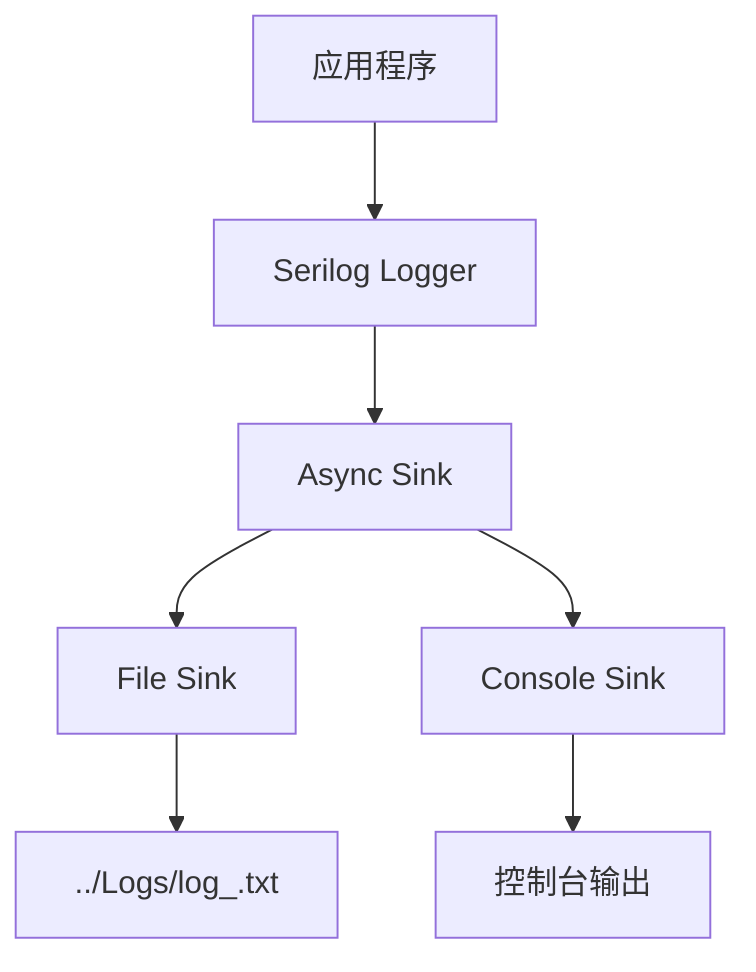
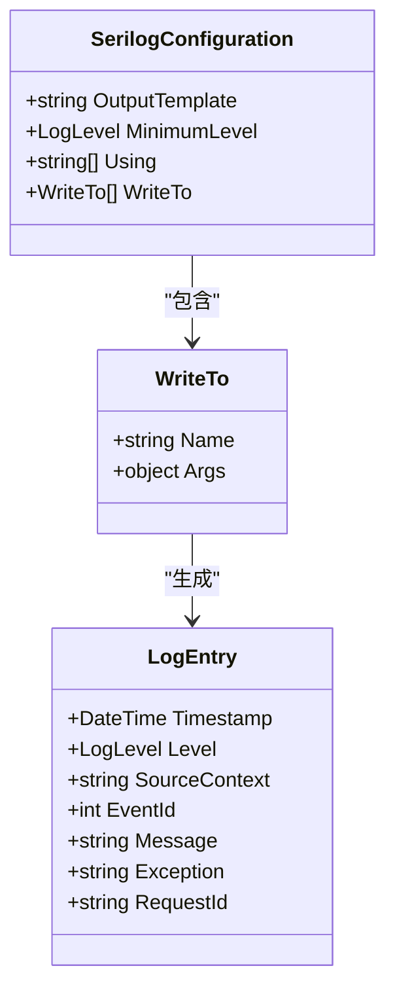
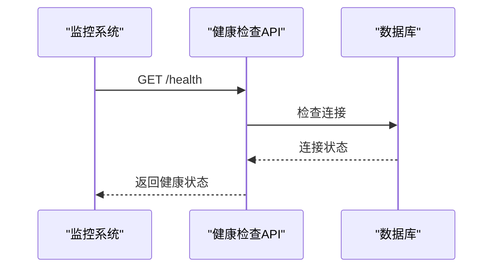
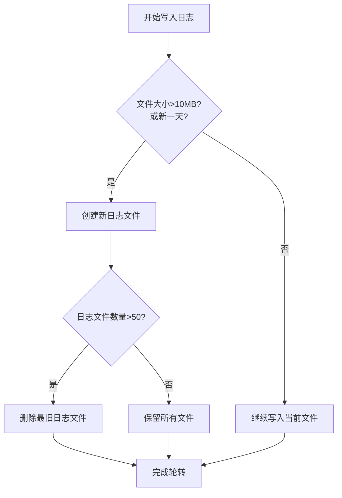

# 监控与日志

<cite>
**本文档引用的文件**   
- [appsettings.serilog.json](file://src/Tools/H.LowCode.DbMigrator/appsettings.serilog.json)
- [Program.cs](file://src/RenderEngine/H.LowCode.RenderEngine.Host/Program.cs)
- [Program.cs](file://src/DesignEngine/H.LowCode.DesignEngine.Host/Program.cs)
- [appsettings.json](file://src/RenderEngine/H.LowCode.RenderEngine.Host/appsettings.json)
- [appsettings.json](file://src/DesignEngine/H.LowCode.DesignEngine.Host/appsettings.json)
- [H.LowCode.DesignEngine.Host.csproj](file://src/DesignEngine/H.LowCode.DesignEngine.Host/H.LowCode.DesignEngine.Host.csproj)
</cite>

## 目录
1. [系统监控与日志管理方案](#系统监控与日志管理方案)
2. [Serilog日志框架集成](#serilog日志框架集成)
3. [日志级别与格式配置](#日志级别与格式配置)
4. [健康检查端点实现](#健康检查端点实现)
5. [日志轮转与清理策略](#日志轮转与清理策略)
6. [安全与审计要求](#安全与审计要求)

## 系统监控与日志管理方案

本方案旨在为LowCode平台建立完善的监控与日志管理体系，确保系统的可观测性、可维护性和安全性。通过集成Serilog框架实现结构化日志记录，配置健康检查端点支持外部监控，并建议使用Prometheus+Grafana进行指标可视化。

**Section sources**
- [appsettings.serilog.json](file://src/Tools/H.LowCode.DbMigrator/appsettings.serilog.json)
- [Program.cs](file://src/RenderEngine/H.LowCode.RenderEngine.Host/Program.cs)

## Serilog日志框架集成

根据项目文件分析，`H.LowCode.DesignEngine.Host.csproj`项目文件中引用了Serilog相关包，确认了Serilog框架的集成。Serilog配置主要通过`appsettings.serilog.json`文件进行管理。

Serilog配置文件指定了多个日志输出目标（WriteTo），包括异步文件写入和控制台输出。配置中使用了Async Sink来包装File Sink，以提高日志写入性能，避免阻塞主线程。



**Diagram sources **
- [appsettings.serilog.json](file://src/Tools/H.LowCode.DbMigrator/appsettings.serilog.json)

**Section sources**
- [appsettings.serilog.json](file://src/Tools/H.LowCode.DbMigrator/appsettings.serilog.json)
- [H.LowCode.DesignEngine.Host.csproj](file://src/DesignEngine/H.LowCode.DesignEngine.Host/H.LowCode.DesignEngine.Host.csproj)

## 日志级别与格式配置

### 日志级别划分

Serilog配置中定义了日志级别策略：
- **默认级别**: Information
- **重写级别**: 
  - System命名空间: Information
  - Microsoft命名空间: Information
  - Microsoft.EntityFrameworkCore: Warning

这符合标准的日志级别划分（Debug、Info、Warning、Error），通过配置实现了精细化的级别控制。

### 日志格式配置

日志输出采用结构化格式，具体配置如下：

**文件输出格式**:
```
{Timestamp:yyyy-MM-dd HH:mm:ss} [{Level}] [{SourceContext}] [{EventId}] {Message}{NewLine}{Exception}
```

**控制台输出格式**:
```
{Timestamp:HH:mm:ss} [{Level}] {Message}  {NewLine}{Exception}
```

文件输出包含时间戳、日志级别、源上下文、事件ID、消息内容和异常信息，为JSON格式的结构化日志，便于后续分析和处理。



**Diagram sources **
- [appsettings.serilog.json](file://src/Tools/H.LowCode.DbMigrator/appsettings.serilog.json)

**Section sources**
- [appsettings.serilog.json](file://src/Tools/H.LowCode.DbMigrator/appsettings.serilog.json)

## 健康检查端点实现

通过对`Program.cs`文件的分析，发现当前代码库中未实现健康检查端点（如/health）。在`H.LowCode.RenderEngine.Host`和`H.LowCode.DesignEngine.Host`的`Program.cs`文件中，均未找到`UseHealthChecks`或`MapHealthChecks`的相关配置。

建议在`Program.cs`中集成健康检查功能：

```csharp
// 建议的健康检查集成代码
builder.Services.AddHealthChecks()
    .AddDbContextCheck<RenderEngineDbContext>("Database");

app.MapHealthChecks("/health");
```

健康检查端点应返回系统关键组件的状态，包括数据库连接、缓存服务等，供外部监控系统轮询。



**Diagram sources **
- [Program.cs](file://src/RenderEngine/H.LowCode.RenderEngine.Host/Program.cs)
- [Program.cs](file://src/DesignEngine/H.LowCode.DesignEngine.Host/Program.cs)

**Section sources**
- [Program.cs](file://src/RenderEngine/H.LowCode.RenderEngine.Host/Program.cs)

## 日志轮转与清理策略

Serilog配置中已实现完善的日志轮转与清理策略：

- **轮转策略**: 按天轮转（rollingInterval: "Day"）
- **文件大小限制**: 10MB（fileSizeLimitBytes: 10485760）
- **保留文件数量**: 50个（retainedFileCountLimit: 50）
- **存储路径**: ../Logs/log_.txt

该策略确保日志文件不会无限增长，当单个日志文件达到10MB或跨越到新的一天时，会自动创建新文件。同时，最多保留50个历史日志文件，超出部分将被自动清理，有效控制磁盘空间使用。



**Diagram sources **
- [appsettings.serilog.json](file://src/Tools/H.LowCode.DbMigrator/appsettings.serilog.json)

**Section sources**
- [appsettings.serilog.json](file://src/Tools/H.LowCode.DbMigrator/appsettings.serilog.json)

## 安全与审计要求

### 异常日志捕获

Serilog配置中通过`{Exception}`模板自动捕获和记录异常堆栈信息，确保所有未处理异常都能被完整记录。结合`{Message}`字段，可以全面了解异常发生时的上下文。

### 敏感信息脱敏

当前配置中未显式实现敏感信息脱敏机制。建议在日志记录前对敏感数据（如密码、身份证号、银行卡号等）进行脱敏处理，可通过自定义Serilog的格式化器或在业务逻辑中预处理日志消息来实现。

### 日志审计

建议实现日志审计功能，记录关键操作（如用户登录、数据修改、权限变更等）的详细信息，包括操作人、操作时间、操作内容和IP地址等。可通过在业务服务中注入日志记录器，并在关键方法中添加审计日志来实现。

### Prometheus指标收集

当前代码库中未发现Prometheus集成。建议安装`Prometheus.AspNetCore`包，并在`Program.cs`中添加相关配置，暴露关键性能指标（响应时间、错误率、数据库连接数等）供Grafana可视化。

```csharp
// 建议的Prometheus集成代码
builder.Services.AddMetrics();
builder.Services.AddMetricsTrackingMiddleware();
builder.Services.AddMetricsEndpoints();

app.UseMetricsAllEndpoints();
```

**Section sources**
- [appsettings.serilog.json](file://src/Tools/H.LowCode.DbMigrator/appsettings.serilog.json)
- [Program.cs](file://src/RenderEngine/H.LowCode.RenderEngine.Host/Program.cs)