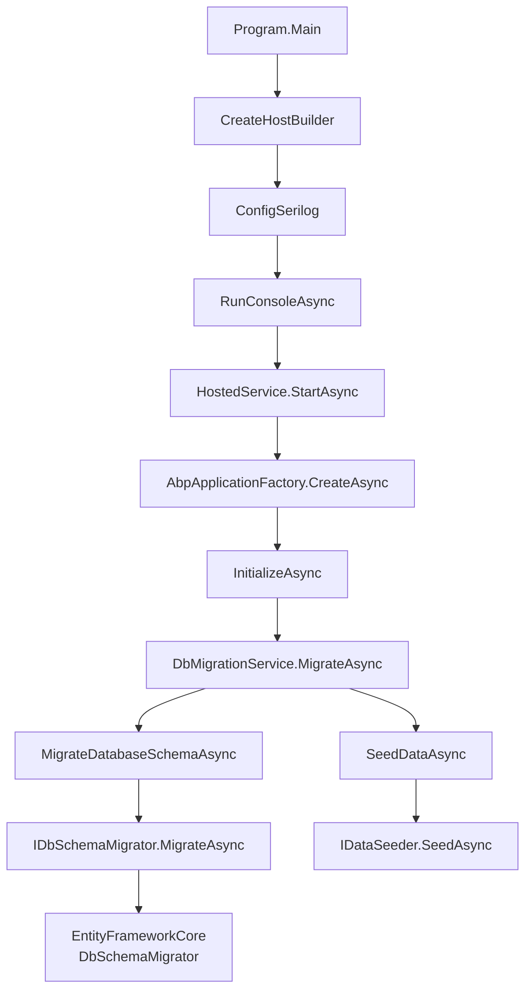

# 部署与运维

<cite>
**本文档引用的文件**   
- [appsettings.json](file://src/DesignEngine/H.LowCode.DesignEngine.Host/appsettings.json)
- [appsettings.Development.json](file://src/DesignEngine/H.LowCode.DesignEngine.Host/appsettings.Development.json)
- [launchSettings.json](file://src/DesignEngine/H.LowCode.DesignEngine.Host/Properties/launchSettings.json)
- [appsettings.json](file://src/RenderEngine/H.LowCode.RenderEngine.Host/appsettings.json)
- [appsettings.Development.json](file://src/RenderEngine/H.LowCode.RenderEngine.Host/appsettings.Development.json)
- [launchSettings.json](file://src/RenderEngine/H.LowCode.RenderEngine.Host/Properties/launchSettings.json)
- [appsettings.json](file://src/Tools/H.LowCode.DbMigrator/appsettings.json)
- [appsettings.serilog.json](file://src/Tools/H.LowCode.DbMigrator/appsettings.serilog.json)
- [Program.cs](file://src/Tools/H.LowCode.DbMigrator/Program.cs)
- [HostedService.cs](file://src/Tools/H.LowCode.DbMigrator/HostedService.cs)
- [DbMigrationService.cs](file://src/Tools/H.LowCode.DbMigrator/DbMigrationService.cs)
- [IDbSchemaMigrator.cs](file://src/Tools/H.LowCode.DbMigrator/MigrationServices/IDbSchemaMigrator.cs)
- [EntityFrameworkCoreDbSchemaMigrator.cs](file://src/Tools/H.LowCode.DbMigrator/MigrationServices/EntityFrameworkCoreDbSchemaMigrator.cs)
- [MigratorDbContext.cs](file://src/Tools/H.LowCode.DbMigrator/MigrationServices/MigratorDbContext.cs)
</cite>

## 目录
1. [多环境配置管理策略](#多环境配置管理策略)
2. [数据库迁移流程](#数据库迁移流程)
3. [应用发布与元数据同步机制](#应用发布与元数据同步机制)
4. [Docker容器化部署方案](#docker容器化部署方案)
5. [监控与日志方案](#监控与日志方案)
6. [性能调优建议](#性能调优建议)

## 数据库迁移流程

系统通过 `H.LowCode.DbMigrator` 工具实现 EF Core 数据库迁移，确保代码模型与数据库结构同步。

### 迁移工具架构

迁移工具基于 .NET Generic Host 构建，采用依赖注入和模块化设计。核心组件包括：

- **HostedService**: 托管服务入口，负责初始化 ABP 应用并触发迁移
- **DbMigrationService**: 迁移协调服务，调用所有注册的 `IDbSchemaMigrator`
- **IDbSchemaMigrator**: 迁移契约接口，支持多数据源迁移
- **EntityFrameworkCoreDbSchemaMigrator**: EF Core 具体实现



**Diagram sources**
- [Program.cs](file://src/Tools/H.LowCode.DbMigrator/Program.cs#L10-L40)
- [HostedService.cs](file://src/Tools/H.LowCode.DbMigrator/HostedService.cs#L15-L45)
- [DbMigrationService.cs](file://src/Tools/H.LowCode.DbMigrator/DbMigrationService.cs#L15-L50)

### 迁移执行流程

1. **日志配置**: 从 `appsettings.json` 和 `appsettings.serilog.json` 加载 Serilog 配置
2. **应用初始化**: 创建 ABP 模块化应用，注入配置和日志服务
3. **模式迁移**: 遍历所有 `IDbSchemaMigrator` 实现，执行数据库结构同步
4. **数据播种**: 调用 `IDataSeeder` 初始化基础数据
5. **应用关闭**: 完成迁移后自动停止托管服务

```csharp
public async Task MigrateAsync()
{
    Logger.LogInformation("Started database migrations...");
    await MigrateDatabaseSchemaAsync(); // 执行EF Core迁移
    await SeedDataAsync();              // 播种初始数据
    Logger.LogInformation("Successfully completed all database migrations.");
}
```

**Section sources**
- [DbMigrationService.cs](file://src/Tools/H.LowCode.DbMigrator/DbMigrationService.cs#L15-L55)
- [IDbSchemaMigrator.cs](file://src/Tools/H.LowCode.DbMigrator/MigrationServices/IDbSchemaMigrator.cs#L1-L13)
- [EntityFrameworkCoreDbSchemaMigrator.cs](file://src/Tools/H.LowCode.DbMigrator/MigrationServices/EntityFrameworkCoreDbSchemaMigrator.cs)

## 应用发布与元数据同步机制

系统采用元数据驱动架构，设计引擎生成的元数据通过文件系统同步到渲染引擎。

### 元数据存储结构

元数据集中存储在项目根目录的 `meta` 文件夹中，采用分层目录结构：

```
meta/
├── apps/           # 应用元数据
│   ├── caseapp/    # 应用ID
│   │   ├── datasource/ # 数据源定义
│   │   ├── menu/       # 菜单配置
│   │   ├── page/       # 页面定义
│   │   └── caseapp.json # 应用配置
├── parts/          # 组件库元数据
```

## Docker容器化部署方案

提供多阶段构建的 Docker 镜像，优化部署体积和安全性。

### Dockerfile 示例

```dockerfile
# 构建阶段
FROM mcr.microsoft.com/dotnet/sdk:9.0 AS build
WORKDIR /app
COPY . .
RUN dotnet restore
RUN dotnet publish -c Release -o out

# 运行阶段
FROM mcr.microsoft.com/dotnet/aspnet:9.0 AS runtime
WORKDIR /app
COPY --from=build /app/out .
COPY meta /app/meta
EXPOSE 80 443
ENTRYPOINT ["dotnet", "H.LowCode.RenderEngine.Host.dll"]
```

### 部署配置

```yaml
# docker-compose.yml
version: '3.8'
services:
  render-engine:
    build: .
    ports:
      - "5191:443"
    environment:
      - ASPNETCORE_ENVIRONMENT=Production
      - ConnectionStrings__Default=Server=sqlserver;Database=H_LowCode;...
    volumes:
      - ./meta:/app/meta
    depends_on:
      - sqlserver

  sqlserver:
    image: mcr.microsoft.com/mssql/server:2022-latest
    environment:
      - SA_PASSWORD=YourStrong@Passw0rd
      - ACCEPT_EULA=Y
    ports:
      - "1433:1433"
```

**Section sources**
- [appsettings.json](file://src/RenderEngine/H.LowCode.RenderEngine.Host/appsettings.json#L5-L9)

## 监控与日志方案

集成 Serilog 实现结构化日志记录，并配置健康检查端点。

### Serilog 配置

通过 `appsettings.serilog.json` 配置多目标日志输出：

```json
{
  "Serilog": {
    "Using": [ "Serilog.Sinks.File", "Serilog.Sinks.Async", "Serilog.Sinks.Console" ],
    "MinimumLevel": {
      "Default": "Information",
      "Override": {
        "Microsoft.EntityFrameworkCore": "Warning"
      }
    },
    "WriteTo": [
      {
        "Name": "Async",
        "Args": {
          "configure": [
            {
              "Name": "File",
              "Args": {
                "path": "../Logs/log_.txt",
                "rollingInterval": "Day",
                "fileSizeLimitBytes": 10485760
              }
            }
          ]
        }
      },
      {
        "Name": "Console",
        "Args": {
          "restrictedToMinimumLevel": "Information"
        }
      }
    ]
  }
}
```

日志特性：
- 按天滚动归档，保留50个历史文件
- 异步写入避免阻塞主线程
- 控制台与文件双输出
- 自定义时间戳和异常格式

### 健康检查

系统自动暴露 `/health` 端点，集成数据库连接、元数据加载等检查项。

**Section sources**
- [appsettings.serilog.json](file://src/Tools/H.LowCode.DbMigrator/appsettings.serilog.json#L1-L42)
- [Program.cs](file://src/Tools/H.LowCode.DbMigrator/Program.cs#L15-L35)

## 性能调优建议

### 元数据缓存策略

在 `RenderEngine` 中实现元数据内存缓存，减少文件系统I/O：

```csharp
services.AddMemoryCache();
services.AddSingleton<IMetaCache, MetaCache>();
```

缓存失效策略：文件修改时间戳检测或手动清除。

### 静态资源压缩

启用 Brotli/Gzip 压缩：

```csharp
services.AddResponseCompression(options =>
{
    options.EnableForHttps = true;
});
```

### 数据库连接池配置

在连接字符串中优化连接池：

```json
"Server=(localdb)\\MSSQLLocalDB;Database=H_LowCode;...;Max Pool Size=100;Min Pool Size=10;Connection Timeout=30"
```

### 其他建议

- 使用 `ReadOnlySaveChangesInterceptor` 优化只读查询性能
- 通过 `QueryWithNoLockDbCommandInterceptor` 减少锁竞争
- 定期执行数据库迁移以保持索引优化

**Section sources**
- [EntityFrameworkCoreDbSchemaMigrator.cs](file://src/Tools/H.LowCode.DbMigrator/MigrationServices/EntityFrameworkCoreDbSchemaMigrator.cs)
- [appsettings.json](file://src/Tools/H.LowCode.DbMigrator/appsettings.json#L1-L10)