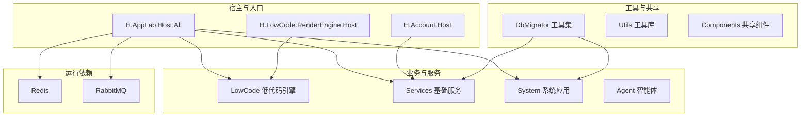
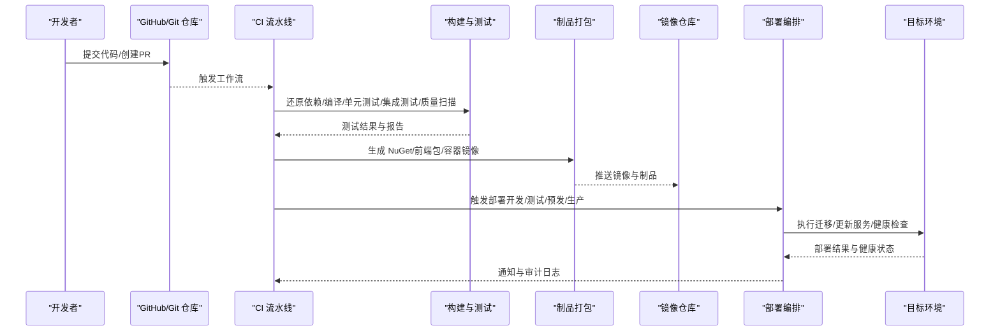
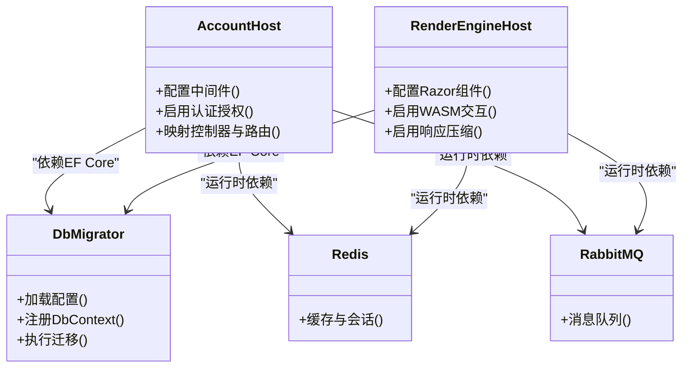

# CI/CD流水线

<cite>
**本文引用的文件**
- [README.md](file://README.md)
- [AppLab.slnx](file://src/AppLab.slnx)
- [common.props](file://src/common.props)
- [global.json](file://src/global.json)
- [docker-compose.yml](file://cd/docker-compose.yml)
- [Program.cs（Account Host）](file://src/Host/Account/H.Account.Host/Program.cs)
- [Program.cs（RenderEngine Host）](file://src/Host/RenderEngine/H.LowCode.RenderEngine.Host/Program.cs)
- [Program.cs（Approval DbMigrator）](file://src/Tools/H.Approval.DbMigrator/Program.cs)
- [Program.cs（Assistant DbMigrator）](file://src/Tools/H.Assistant.DbMigrator/Program.cs)
- [Program.cs（Notification DbMigrator）](file://src/Tools/H.Notification.DbMigrator/Program.cs)
- [Program.cs（Organization DbMigrator）](file://src/Tools/H.Organization.DbMigrator/Program.cs)
- [Program.cs（Enterprise DbMigrator）](file://src/Tools/H.Enterprise.DbMigrator/Program.cs)
</cite>

## 目录
1. [简介](#简介)
2. [项目结构](#项目结构)
3. [核心组件](#核心组件)
4. [架构总览](#架构总览)
5. [详细组件分析](#详细组件分析)
6. [依赖关系分析](#依赖关系分析)
7. [性能考量](#性能考量)
8. [故障排查指南](#故障排查指南)
9. [结论](#结论)
10. [附录](#附录)

## 简介
本文件为 AppLab 平台提供完整的 CI/CD 流水线配置文档，覆盖持续集成与持续部署两大主线：
- 持续集成：代码检查、单元测试、集成测试、代码质量分析、制品打包。
- 持续部署：自动构建、镜像推送、环境部署、灰度发布、回滚策略与部署验证。

同时给出 GitHub Actions、Azure DevOps、Jenkins 三大主流平台的配置要点与示例步骤，并说明多环境差异化配置与最佳实践。

## 项目结构
AppLab 采用模块化架构，支持单体与按服务独立部署。宿主程序负责服务注册与管线配置，业务模块遵循 Application.Contracts / Application / EntityFrameworkCore / Web 分层，工具层包含各服务的数据库迁移程序。

图表来源
- [AppLab.slnx:1-183](file://src/AppLab.slnx#L1-L183)
- [docker-compose.yml:1-32](file://cd/docker-compose.yml#L1-L32)

章节来源
- [README.md:1-74](file://README.md#L1-L74)
- [AppLab.slnx:1-183](file://src/AppLab.slnx#L1-L183)

## 核心组件
- 宿主程序（Blazor Web App + Wasm 客户端）：负责 DI、中间件、静态资源、认证授权、异常处理等。
- 低代码引擎：设计端与渲染端分离，元数据驱动页面与组件动态生成。
- 基础服务：按限界上下文划分，统一分层与契约。
- 工具集：每个服务对应的 DbMigrator 控制台程序，用于数据库迁移。
- 运行依赖：Redis、RabbitMQ 通过 docker-compose 管理。

章节来源
- [Program.cs（Account Host）:1-48](file://src/Host/Account/H.Account.Host/Program.cs#L1-L48)
- [Program.cs（RenderEngine Host）:1-49](file://src/Host/RenderEngine/H.LowCode.RenderEngine.Host/Program.cs#L1-L49)
- [docker-compose.yml:1-32](file://cd/docker-compose.yml#L1-L32)

## 架构总览
下图展示从代码提交到生产部署的端到端流程，涵盖 CI 与 CD 的关键阶段与产物流转。

[该图为概念性流程图，不直接映射具体源码文件]

## 详细组件分析

### 持续集成（CI）流水线
- 触发条件：push、pull_request、release 标签。
- 关键阶段：
  - 环境准备：安装 .NET SDK（版本由 global.json 指定）、Docker、缓存 NuGet 包。
  - 代码检查：Roslyn 分析、格式化校验、安全扫描（可选）。
  - 单元测试：并行执行所有测试项目，收集覆盖率。
  - 集成测试：启动本地依赖（Redis/RabbitMQ），执行接口或端到端用例。
  - 质量门禁：阈值控制（如覆盖率、重复率、漏洞等级）。
  - 制品打包：生成 NuGet 包、前端静态资源、容器镜像。
  - 报告归档：测试报告、覆盖率、质量报告。

章节来源
- [global.json:1-7](file://src/global.json#L1-L7)
- [common.props:1-15](file://src/common.props#L1-L15)
- [docker-compose.yml:1-32](file://cd/docker-compose.yml#L1-L32)

### 持续部署（CD）流水线
- 触发条件：CI 成功、手动审批（生产环境）。
- 关键阶段：
  - 构建镜像：基于 Dockerfile 构建多阶段镜像，最小化体积。
  - 推送镜像：推送到企业镜像仓库（含签名与漏洞扫描）。
  - 环境部署：Kubernetes/Docker Compose 更新，滚动升级。
  - 灰度发布：按权重或用户维度逐步放量。
  - 健康检查：探针探测、冒烟测试、API 校验。
  - 回滚策略：保留上一稳定版本，一键回滚。

章节来源
- [Program.cs（Account Host）:1-48](file://src/Host/Account/H.Account.Host/Program.cs#L1-L48)
- [Program.cs（RenderEngine Host）:1-49](file://src/Host/RenderEngine/H.LowCode.RenderEngine.Host/Program.cs#L1-L49)
- [docker-compose.yml:1-32](file://cd/docker-compose.yml#L1-L32)

### 多环境差异化配置
- 环境变量注入：不同环境通过环境变量覆盖连接串、开关与密钥。
- 配置文件分层：appsettings.Development/Staging/Production。
- 数据库迁移：按环境执行对应 DbMigrator。
- 依赖服务：Redis/RabbitMQ 地址与凭据按环境隔离。

章节来源
- [Program.cs（Approval DbMigrator）:42-57](file://src/Tools/H.Approval.DbMigrator/Program.cs#L42-L57)
- [Program.cs（Assistant DbMigrator）:42-57](file://src/Tools/H.Assistant.DbMigrator/Program.cs#L42-L57)
- [Program.cs（Notification DbMigrator）:42-57](file://src/Tools/H.Notification.DbMigrator/Program.cs#L42-L57)
- [Program.cs（Organization DbMigrator）:42-57](file://src/Tools/H.Organization.DbMigrator/Program.cs#L42-L57)
- [Program.cs（Enterprise DbMigrator）:42-56](file://src/Tools/H.Enterprise.DbMigrator/Program.cs#L42-L56)

### 回滚策略与部署验证
- 版本标记：每次发布打 Tag，镜像带版本号与 Git Commit。
- 蓝绿/金丝雀：先小流量验证，再全量切换。
- 快速回滚：根据 Tag 或镜像版本回退到上一个稳定版本。
- 部署验证：健康检查、冒烟测试、关键 API 调用、错误率监控。

章节来源
- [Program.cs（Account Host）:1-48](file://src/Host/Account/H.Account.Host/Program.cs#L1-L48)
- [Program.cs（RenderEngine Host）:1-49](file://src/Host/RenderEngine/H.LowCode.RenderEngine.Host/Program.cs#L1-L49)

### 平台配置示例（要点）
- GitHub Actions
  - 使用 actions/setup-dotnet 安装 SDK（读取 global.json）。
  - 使用 actions/cache 缓存 NuGet 包。
  - 使用 docker/build-push-action 构建并推送镜像。
  - 使用 kubectl 或 Helm 部署到集群。
- Azure DevOps
  - 使用 .NET Core Tool Installer 任务安装 SDK。
  - 使用 DotNetCoreCLI@2 执行 restore/build/test/publish。
  - 使用 Docker@2 构建镜像并推送 ACR。
  - 使用 Kubernetes@1 或 Helm 任务进行部署。
- Jenkins
  - 使用 Pipeline 脚本定义 stages：checkout、build、test、scan、package、deploy。
  - 使用 Docker 插件或命令行构建镜像。
  - 使用 SSH/Kubernetes 插件执行远程部署。

[本节为通用指导，不直接引用具体源码文件]

## 依赖关系分析
- 宿主程序依赖 Autofac、Razor Components、WASM 渲染模式、响应压缩、认证授权等。
- 各服务通过 EF Core 访问数据库，DbMigrator 作为独立进程执行迁移。
- 运行时依赖 Redis、RabbitMQ，通过 docker-compose 统一管理。

图表来源
- [Program.cs（Account Host）:1-48](file://src/Host/Account/H.Account.Host/Program.cs#L1-L48)
- [Program.cs（RenderEngine Host）:1-49](file://src/Host/RenderEngine/H.LowCode.RenderEngine.Host/Program.cs#L1-L49)
- [Program.cs（Approval DbMigrator）:42-57](file://src/Tools/H.Approval.DbMigrator/Program.cs#L42-L57)
- [docker-compose.yml:1-32](file://cd/docker-compose.yml#L1-L32)

章节来源
- [AppLab.slnx:1-183](file://src/AppLab.slnx#L1-L183)
- [docker-compose.yml:1-32](file://cd/docker-compose.yml#L1-L32)

## 性能考量
- 构建优化：并行还原与编译、增量构建、缓存 NuGet 与 npm 包。
- 镜像优化：多阶段构建、Alpine 基础镜像、裁剪无用依赖。
- 运行时优化：启用 Brotli 压缩、WASM 懒加载、AOT 与裁剪（Release）。
- 测试优化：并行执行测试、隔离依赖、Mock 外部服务。

章节来源
- [Program.cs（RenderEngine Host）:1-49](file://src/Host/RenderEngine/H.LowCode.RenderEngine.Host/Program.cs#L1-L49)
- [README.md:69-74](file://README.md#L69-L74)

## 故障排查指南
- 构建失败
  - 检查 .NET SDK 版本与 global.json 是否一致。
  - 清理缓存后重试还原依赖。
- 测试失败
  - 确认 Redis/RabbitMQ 已启动且端口可达。
  - 查看测试日志与断言输出。
- 部署失败
  - 检查镜像拉取权限与命名空间。
  - 查看健康检查与探针返回码。
- 数据库迁移失败
  - 核对连接字符串与权限。
  - 确认迁移程序集路径正确。

章节来源
- [Program.cs（Approval DbMigrator）:42-57](file://src/Tools/H.Approval.DbMigrator/Program.cs#L42-L57)
- [Program.cs（Assistant DbMigrator）:42-57](file://src/Tools/H.Assistant.DbMigrator/Program.cs#L42-L57)
- [Program.cs（Notification DbMigrator）:42-57](file://src/Tools/H.Notification.DbMigrator/Program.cs#L42-L57)
- [Program.cs（Organization DbMigrator）:42-57](file://src/Tools/H.Organization.DbMigrator/Program.cs#L42-L57)
- [Program.cs（Enterprise DbMigrator）:42-56](file://src/Tools/H.Enterprise.DbMigrator/Program.cs#L42-L56)

## 结论
通过统一的 CI/CD 流水线，AppLab 可实现从代码提交到生产部署的全自动化交付。结合多环境差异化配置、灰度发布与回滚策略，能够显著提升交付效率与稳定性。建议持续完善质量门禁与监控告警，形成闭环反馈。

## 附录
- 环境清单
  - 开发：本地 Docker Compose 启动 Redis/RabbitMQ。
  - 测试：独立测试环境与数据库实例。
  - 预生产：接近生产的配置与网络拓扑。
  - 生产：高可用集群与严格权限管控。
- 制品清单
  - NuGet 包、前端静态资源、容器镜像、迁移脚本。
- 监控与审计
  - 构建与部署日志、测试报告、镜像扫描结果、部署变更审计。

[本节为通用指导，不直接引用具体源码文件]