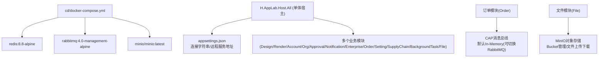
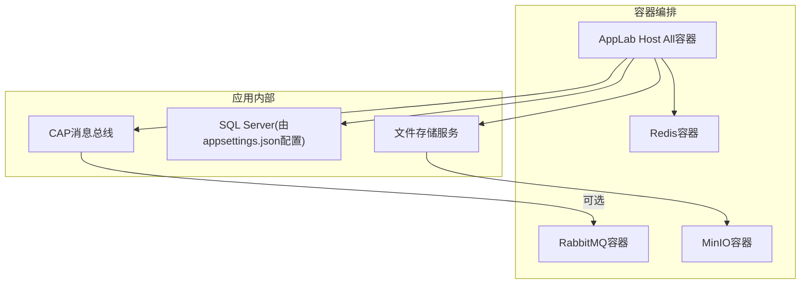
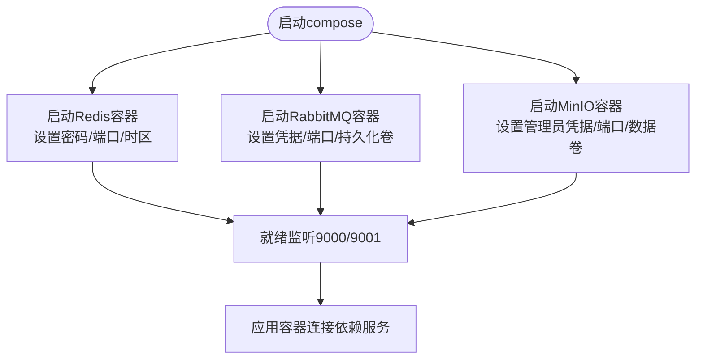
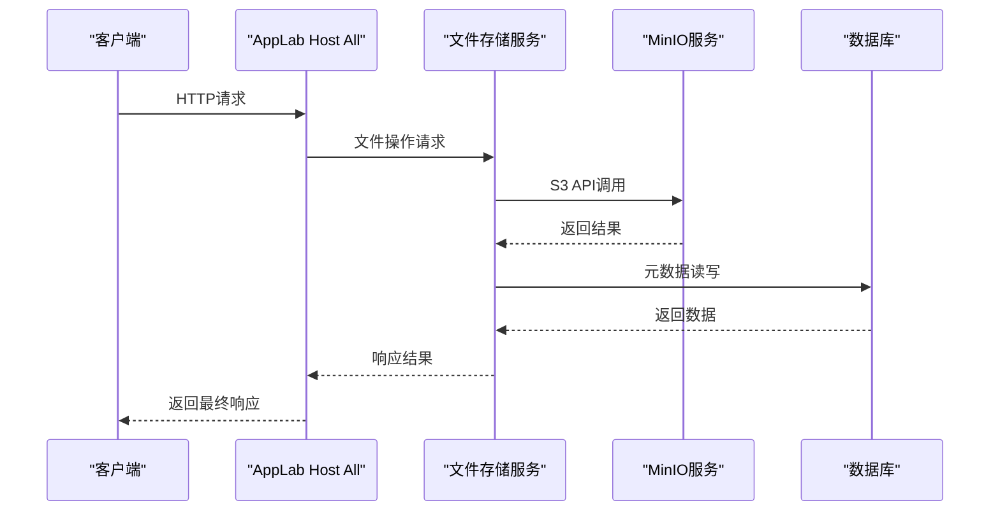
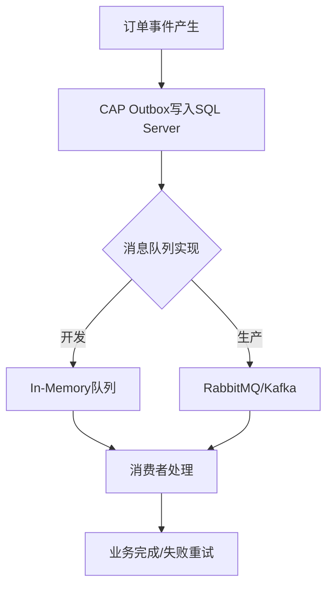
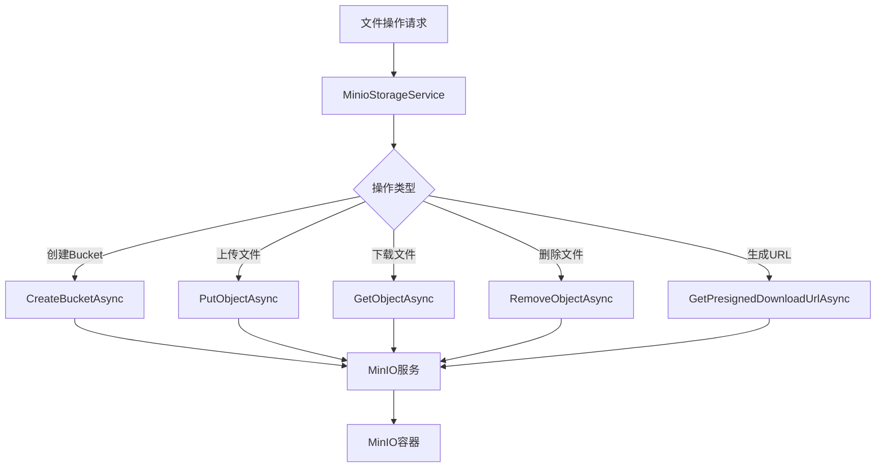
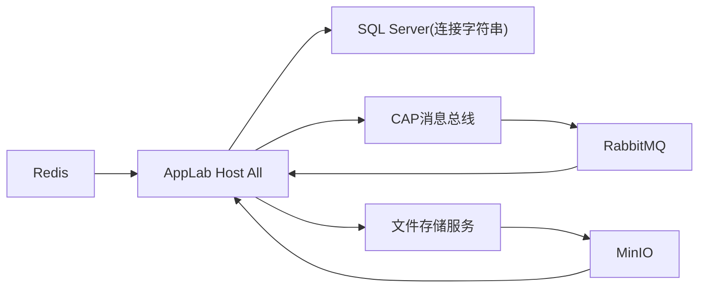

# Docker容器化部署

<cite>
**本文引用的文件**   
- [cd/docker-compose.yml](file://cd/docker-compose.yml)
- [README.md](file://README.md)
- [src/Host/H.AppLab.Host.All/H.AppLab.Host.All/appsettings.json](file://src/Host/H.AppLab.Host.All/H.AppLab.Host.All/appsettings.json)
- [src/Host/H.AppLab.Host.All/H.AppLab.Host.All/H.AppLab.Host.All.csproj](file://src/Host/H.AppLab.Host.All/H.AppLab.Host.All/H.AppLab.Host.All.csproj)
- [src/Host/RenderEngine/H.LowCode.RenderEngine.Host/Program.cs](file://src/Host/RenderEngine/H.LowCode.RenderEngine.Host/Program.cs)
- [src/Services/Order/H.Order.Application/OrderApplicationModule.cs](file://src/Services/Order/H.Order.Application/OrderApplicationModule.cs)
- [src/Services/File/H.File.Application/MinioOptions.cs](file://src/Services/File/H.File.Application/MinioOptions.cs)
- [src/Services/File/H.File.Application/FileApplicationModule.cs](file://src/Services/File/H.File.Application/FileApplicationModule.cs)
- [src/Services/File/H.File.Application/Services/MinioStorageService.cs](file://src/Services/File/H.File.Application/Services/MinioStorageService.cs)
- [src/Host/H.AppLab.Web.Host/H.AppLab.Web.Host/appsettings.json](file://src/Host/H.AppLab.Web.Host/H.AppLab.Web.Host/appsettings.json)
</cite>

## 更新摘要
**所做更改**   
- 在docker-compose.yml中添加了MinIO服务配置，用于文件存储后端集成
- 更新了依赖服务分析，新增MinIO对象存储服务
- 扩展了应用宿主与配置部分，包含MinIO连接配置
- 更新了架构总览图，展示MinIO集成
- 增强了故障排查指南，包含MinIO相关问题的解决方案

## 目录
1. [简介](#简介)
2. [项目结构](#项目结构)
3. [核心组件](#核心组件)
4. [架构总览](#架构总览)
5. [详细组件分析](#详细组件分析)
6. [依赖关系分析](#依赖关系分析)
7. [性能考量](#性能考量)
8. [故障排查指南](#故障排查指南)
9. [结论](#结论)
10. [附录](#附录)

## 简介
本文件面向AppLab平台的Docker容器化部署，聚焦于docker-compose.yml的编排与依赖服务（Redis、RabbitMQ、MinIO）配置，说明各容器的环境变量、端口映射、数据卷挂载等关键设置；同时给出镜像构建最佳实践与自定义Dockerfile编写指南，并补充生产环境下的编排策略（服务发现、负载均衡、健康检查）、网络与安全加固建议。文档内容基于仓库现有配置与说明进行系统化整理，便于开发与生产环境的统一落地。

## 项目结构
- cd/docker-compose.yml：定义本地/开发环境的基础依赖服务（Redis、RabbitMQ、MinIO），包含镜像版本、重启策略、环境变量、端口映射与持久化卷。
- README.md：提供本地开发步骤，包括依赖服务启动、数据库迁移、主程序运行方式与默认端口。
- src/Host/H.AppLab.Host.All/H.AppLab.Host.All/appsettings.json：聚合所有服务的连接字符串、远程服务Base地址、站点配置、日志级别等。
- src/Host/H.AppLab.Host.All/H.AppLab.Host.All/H.AppLab.Host.All.csproj：单体宿主引用了设计引擎、渲染引擎、账号、组织、审批、通知、企业、订单、设置、供应链、后台任务等多个应用模块。
- src/Host/RenderEngine/H.LowCode.RenderEngine.Host/Program.cs：渲染引擎宿主的启动管线，包含响应压缩等优化。
- src/Services/Order/H.Order.Application/OrderApplicationModule.cs：订单模块的消息总线CAP配置（默认使用内存队列，可切换至RabbitMQ/Kafka）。
- src/Services/File/H.File.Application/*：文件存储服务模块，基于MinIO实现对象存储功能。

**图表来源** 
- [cd/docker-compose.yml:1-48](file://cd/docker-compose.yml#L1-L48)
- [src/Host/H.AppLab.Host.All/H.AppLab.Host.All/appsettings.json:1-115](file://src/Host/H.AppLab.Host.All/H.AppLab.Host.All/appsettings.json#L1-L115)
- [src/Host/H.AppLab.Host.All/H.AppLab.Host.All/H.AppLab.Host.All.csproj:1-63](file://src/Host/H.AppLab.Host.All/H.AppLab.Host.All/H.AppLab.Host.All.csproj#L1-L63)
- [src/Services/Order/H.Order.Application/OrderApplicationModule.cs:1-49](file://src/Services/Order/H.Order.Application/OrderApplicationModule.cs#L1-L49)
- [src/Services/File/H.File.Application/MinioOptions.cs:1-15](file://src/Services/File/H.File.Application/MinioOptions.cs#L1-L15)

**章节来源**
- [cd/docker-compose.yml:1-48](file://cd/docker-compose.yml#L1-L48)
- [README.md:38-55](file://README.md#L38-L55)
- [src/Host/H.AppLab.Host.All/H.AppLab.Host.All/appsettings.json:1-115](file://src/Host/H.AppLab.Host.All/H.AppLab.Host.All/appsettings.json#L1-L115)
- [src/Host/H.AppLab.Host.All/H.AppLab.Host.All/H.AppLab.Host.All.csproj:1-63](file://src/Host/H.AppLab.Host.All/H.AppLab.Host.All/H.AppLab.Host.All.csproj#L1-L63)
- [src/Services/Order/H.Order.Application/OrderApplicationModule.cs:1-49](file://src/Services/Order/H.Order.Application/OrderApplicationModule.cs#L1-L49)

## 核心组件
- Redis：用于缓存与会话存储等场景，使用alpine精简镜像，通过环境变量或命令行参数设置密码，暴露标准端口。
- RabbitMQ：作为消息中间件，启用管理界面，持久化数据到命名卷，暴露管理与AMQP端口。
- MinIO：高性能分布式对象存储服务，提供S3兼容API，支持文件上传、下载、Bucket管理等操作，内置Web控制台。
- AppLab Host All：单体宿主聚合多模块，通过appsettings.json集中管理连接字符串与远程服务地址。
- 订单模块CAP：默认使用内存消息队列，便于开发无外部依赖；生产可切换为RabbitMQ/Kafka。
- 文件模块：基于MinIO实现对象存储功能，支持项目隔离、文件上传下载与在线预览。

**章节来源**
- [cd/docker-compose.yml:1-48](file://cd/docker-compose.yml#L1-L48)
- [src/Host/H.AppLab.Host.All/H.AppLab.Host.All/appsettings.json:1-115](file://src/Host/H.AppLab.Host.All/H.AppLab.Host.All/appsettings.json#L1-L115)
- [src/Services/Order/H.Order.Application/OrderApplicationModule.cs:1-49](file://src/Services/Order/H.Order.Application/OrderApplicationModule.cs#L1-L49)
- [src/Services/File/H.File.Application/MinioOptions.cs:1-15](file://src/Services/File/H.File.Application/MinioOptions.cs#L1-L15)

## 架构总览
下图展示了容器编排中的依赖服务与应用宿主的关系，以及消息总线和对象存储的可选实现路径。

**图表来源** 
- [cd/docker-compose.yml:1-48](file://cd/docker-compose.yml#L1-L48)
- [src/Host/H.AppLab.Host.All/H.AppLab.Host.All/appsettings.json:1-115](file://src/Host/H.AppLab.Host.All/H.AppLab.Host.All/appsettings.json#L1-L115)
- [src/Services/Order/H.Order.Application/OrderApplicationModule.cs:1-49](file://src/Services/Order/H.Order.Application/OrderApplicationModule.cs#L1-L49)
- [src/Services/File/H.File.Application/Services/MinioStorageService.cs:1-158](file://src/Services/File/H.File.Application/Services/MinioStorageService.cs#L1-L158)

## 详细组件分析

### docker-compose.yml 详解
- Redis服务
  - 镜像：使用alpine精简版，提升启动速度与体积优势。
  - 容器名与主机名：便于在容器网络中识别。
  - 重启策略：always确保服务异常退出后自动恢复。
  - 环境变量：时区、语言、REDIS_ARGS（推荐方式注入参数）。
  - 端口映射：将容器内6379映射到宿主机，便于调试访问。
  - 命令覆盖：可通过command直接传入redis-server参数（注意与REDIS_ARGS的一致性）。
- RabbitMQ服务
  - 镜像：management-alpine版本，内置Web管理界面。
  - 重启策略：on-failure仅失败时重启，避免不必要的频繁重启。
  - 端口映射：15672（管理界面）、5672（AMQP协议）。
  - 数据卷：持久化到rabbitmq_data卷，保障消息与配置不丢失。
  - 环境变量：默认用户、密码与时区。
- MinIO服务（新增）
  - 镜像：minio/minio:latest，官方最新稳定版本。
  - 容器名：minio，便于容器间通信。
  - 重启策略：on-failure，服务异常时自动重启。
  - 端口映射：9000（API端口）、9001（Web控制台端口）。
  - 数据卷：minio_data:/data，持久化存储对象数据。
  - 环境变量：MINIO_ROOT_USER和MINIO_ROOT_PASSWORD设置管理员凭据，TZ设置时区。
  - 命令：server /data --console-address ":9001"指定数据存储路径和控制台地址。

**图表来源** 
- [cd/docker-compose.yml:1-48](file://cd/docker-compose.yml#L1-L48)

**章节来源**
- [cd/docker-compose.yml:1-48](file://cd/docker-compose.yml#L1-L48)

### 应用宿主与配置
- 单体宿主（H.AppLab.Host.All）
  - 通过appsettings.json集中配置各服务的连接字符串（OrganizationDb、AccountDb、DesignEngineDb、RenderEngineDb、ApprovalDb、NotificationDb、AssistantDb、EnterpriseDb、OrderDb、SettingDb、SupplyChainDb、TestingDb、BackgroundTaskDb）。
  - RemoteServices节点统一管理各子服务的Base URL，便于跨服务调用。
  - Sites节点定义站点映射（AppId与SiteUrl）。
  - Logging节点控制日志级别。
  - ExternalLogin节点配置第三方登录开关与回调路径。
  - **新增Minio配置**：Endpoint、AccessKey、SecretKey、UseSsl、ExternalEndpoint等MinIO连接参数。
- 渲染引擎（RenderEngine Host）
  - Program.cs中启用响应压缩（Brotli），提升传输效率。
  - 使用Autofac与ABP模块化加载。
- 文件存储服务（File Application）
  - FileApplicationModule.cs中注册MinIO客户端和服务。
  - MinioOptions类提供连接配置选项，支持SSL和外部访问端点。
  - MinioStorageService封装MinIO SDK操作，提供Bucket管理和文件操作接口。

**图表来源** 
- [src/Host/H.AppLab.Host.All/H.AppLab.Host.All/appsettings.json:1-115](file://src/Host/H.AppLab.Host.All/H.AppLab.Host.All/appsettings.json#L1-115)
- [src/Host/H.AppLab.Web.Host/H.AppLab.Web.Host/appsettings.json:115-126](file://src/Host/H.AppLab.Web.Host/H.AppLab.Web.Host/appsettings.json#L115-126)
- [src/Host/RenderEngine/H.LowCode.RenderEngine.Host/Program.cs:1-49](file://src/Host/RenderEngine/H.LowCode.RenderEngine.Host/Program.cs#L1-L49)
- [src/Services/File/H.File.Application/FileApplicationModule.cs:1-39](file://src/Services/File/H.File.Application/FileApplicationModule.cs#L1-L39)

**章节来源**
- [src/Host/H.AppLab.Host.All/H.AppLab.Host.All/appsettings.json:1-115](file://src/Host/H.AppLab.Host.All/H.AppLab.Host.All/appsettings.json#L1-115)
- [src/Host/H.AppLab.Web.Host/H.AppLab.Web.Host/appsettings.json:115-126](file://src/Host/H.AppLab.Web.Host/H.AppLab.Web.Host/appsettings.json#L115-126)
- [src/Host/RenderEngine/H.LowCode.RenderEngine.Host/Program.cs:1-49](file://src/Host/RenderEngine/H.LowCode.RenderEngine.Host/Program.cs#L1-L49)
- [src/Services/File/H.File.Application/FileApplicationModule.cs:1-39](file://src/Services/File/H.File.Application/FileApplicationModule.cs#L1-L39)

### 消息总线与RabbitMQ集成
- 订单模块（Order Application）
  - 使用CAP框架，默认配置SqlServer作为Outbox存储，消息队列使用In-Memory（开发环境无需外部MQ）。
  - 生产环境可将UseInMemoryMessageQueue替换为UseRabbitMQ或UseKafka，保持代码一致性。
  - 失败重试次数与间隔可配置，增强可靠性。

**图表来源** 
- [src/Services/Order/H.Order.Application/OrderApplicationModule.cs:1-49](file://src/Services/Order/H.Order.Application/OrderApplicationModule.cs#L1-L49)

**章节来源**
- [src/Services/Order/H.Order.Application/OrderApplicationModule.cs:1-49](file://src/Services/Order/H.Order.Application/OrderApplicationModule.cs#L1-L49)

### MinIO对象存储集成
- 文件存储服务（File Application）
  - MinioOptions配置类提供Endpoint、AccessKey、SecretKey、UseSsl、ExternalEndpoint等连接参数。
  - FileApplicationModule中注册IMinioClient单例，支持SSL连接和外部访问端点。
  - MinioStorageService封装完整的MinIO SDK操作，包括Bucket管理、文件上传下载、预签名URL生成等。
  - 支持Bucket名称自动生成（租户前缀+项目名称），最大63字符限制符合MinIO规范。
  - 提供文件统计信息获取（文件数量、总大小）和批量删除功能。

**图表来源** 
- [src/Services/File/H.File.Application/MinioOptions.cs:1-15](file://src/Services/File/H.File.Application/MinioOptions.cs#L1-L15)
- [src/Services/File/H.File.Application/Services/MinioStorageService.cs:1-158](file://src/Services/File/H.File.Application/Services/MinioStorageService.cs#L1-L158)

**章节来源**
- [src/Services/File/H.File.Application/MinioOptions.cs:1-15](file://src/Services/File/H.File.Application/MinioOptions.cs#L1-L15)
- [src/Services/File/H.File.Application/FileApplicationModule.cs:1-39](file://src/Services/File/H.File.Application/FileApplicationModule.cs#L1-L39)
- [src/Services/File/H.File.Application/Services/MinioStorageService.cs:1-158](file://src/Services/File/H.File.Application/Services/MinioStorageService.cs#L1-L158)

## 依赖关系分析
- 容器层依赖
  - Redis：缓存/会话等轻量级KV存储。
  - RabbitMQ：异步消息与事件驱动（可选，当前默认内存队列）。
  - MinIO：对象存储服务，提供S3兼容API，支持文件上传下载和Bucket管理。
- 应用层依赖
  - 单体宿主聚合多模块，通过appsettings.json集中管理连接字符串与远程服务地址。
  - 订单模块CAP支持多种消息队列实现，便于从开发到生产的平滑过渡。
  - 文件模块依赖MinIO进行对象存储，支持项目隔离和文件管理功能。

**图表来源** 
- [cd/docker-compose.yml:1-48](file://cd/docker-compose.yml#L1-L48)
- [src/Host/H.AppLab.Host.All/H.AppLab.Host.All/appsettings.json:1-115](file://src/Host/H.AppLab.Host.All/H.AppLab.Host.All/appsettings.json#L1-115)
- [src/Services/Order/H.Order.Application/OrderApplicationModule.cs:1-49](file://src/Services/Order/H.Order.Application/OrderApplicationModule.cs#L1-L49)
- [src/Services/File/H.File.Application/Services/MinioStorageService.cs:1-158](file://src/Services/File/H.File.Application/Services/MinioStorageService.cs#L1-L158)

**章节来源**
- [cd/docker-compose.yml:1-48](file://cd/docker-compose.yml#L1-L48)
- [src/Host/H.AppLab.Host.All/H.AppLab.Host.All/appsettings.json:1-115](file://src/Host/H.AppLab.Host.All/H.AppLab.Host.All/appsettings.json#L1-115)
- [src/Services/Order/H.Order.Application/OrderApplicationModule.cs:1-49](file://src/Services/Order/H.Order.Application/OrderApplicationModule.cs#L1-L49)

## 性能考量
- 镜像选择：Redis、RabbitMQ与MinIO均使用精简或官方镜像，减少体积与启动时间。
- 响应压缩：渲染引擎启用Brotli压缩，降低带宽占用，提升前端加载速度。
- 懒加载与AOT：Blazor WebAssembly按需加载程序集，Release模式启用AOT与裁剪，减小下载体积。
- 消息队列：开发使用In-Memory队列，生产切换为RabbitMQ/Kafka，提高吞吐与可靠性。
- 对象存储：MinIO提供高性能对象存储，支持并行上传下载和CDN加速。
- 数据持久化：所有依赖服务均配置数据卷，确保数据安全和备份恢复。

**章节来源**
- [src/Host/RenderEngine/H.LowCode.RenderEngine.Host/Program.cs:1-49](file://src/Host/RenderEngine/H.LowCode.RenderEngine.Host/Program.cs#L1-L49)
- [README.md:69-74](file://README.md#L69-L74)
- [cd/docker-compose.yml:1-48](file://cd/docker-compose.yml#L1-L48)

## 故障排查指南
- 依赖服务未就绪
  - 检查Redis/RabbitMQ/MinIO容器状态与端口映射是否正确。
  - 确认环境变量（如密码、用户）与连接字符串一致。
  - 验证数据卷权限和存储空间是否充足。
- 应用无法连接数据库
  - 核对appsettings.json中的连接字符串是否指向正确的SQL Server实例。
  - 确认防火墙与网络策略允许访问。
- 消息队列问题
  - 开发环境默认In-Memory队列，若切换到RabbitMQ，需确保RabbitMQ容器可用且凭据正确。
  - 查看CAP失败重试记录与日志定位消费失败原因。
- MinIO连接问题
  - 检查MinIO容器是否正常运行，端口9000和9001是否开放。
  - 验证MinioOptions配置中的Endpoint、AccessKey、SecretKey是否正确。
  - 确认防火墙允许访问MinIO服务端口。
  - 通过MinIO Web控制台（http://localhost:9001）验证服务状态。
- 文件上传下载失败
  - 检查MinIO Bucket是否存在，权限设置是否正确。
  - 验证文件大小限制和超时配置。
  - 查看MinIO服务日志定位具体错误原因。
- 端口冲突
  - 修改docker-compose.yml中的端口映射以避免宿主机端口冲突。
  - 确保9000、9001、6379、5672、15672等端口未被占用。

**章节来源**
- [cd/docker-compose.yml:1-48](file://cd/docker-compose.yml#L1-L48)
- [src/Host/H.AppLab.Host.All/H.AppLab.Host.All/appsettings.json:1-115](file://src/Host/H.AppLab.Host.All/H.AppLab.Host.All/appsettings.json#L1-115)
- [src/Host/H.AppLab.Web.Host/H.AppLab.Web.Host/appsettings.json:115-126](file://src/Host/H.AppLab.Web.Host/H.AppLab.Web.Host/appsettings.json#L115-126)
- [src/Services/Order/H.Order.Application/OrderApplicationModule.cs:1-49](file://src/Services/Order/H.Order.Application/OrderApplicationModule.cs#L1-L49)

## 结论
通过docker-compose.yml统一编排Redis、RabbitMQ与MinIO等依赖服务，结合appsettings.json集中管理连接字符串与远程服务地址，AppLab平台实现了从开发到生产的一致部署体验。订单模块的CAP消息总线支持无缝切换消息队列实现，文件模块的MinIO对象存储提供高性能的文件管理能力。建议在后续迭代中完善健康检查、服务发现与负载均衡配置，进一步提升生产环境的稳定性与可观测性。

## 附录
- 镜像构建最佳实践
  - 使用多阶段构建，分离编译与运行时环境，减小最终镜像体积。
  - 固定基础镜像版本，避免不可控更新导致的不兼容。
  - 最小化权限运行，避免以root身份运行应用。
- 自定义Dockerfile编写指南
  - 明确入口点与健康检查端点。
  - 合理设置环境变量与配置文件挂载。
  - 使用.dockerignore排除无关文件，加速构建。
- 生产环境编排策略
  - 服务发现：引入Consul或Kubernetes Service Discovery。
  - 负载均衡：使用Nginx/HAProxy或云厂商LB。
  - 健康检查：为每个服务定义HTTP健康检查端点。
  - 安全加固：限制容器网络访问、启用TLS、最小化端口暴露。
  - 监控告警：集成Prometheus、Grafana等监控工具。
  - 备份恢复：定期备份MinIO数据和数据库，制定灾难恢复计划。

[本节为通用指导，不直接分析具体文件]