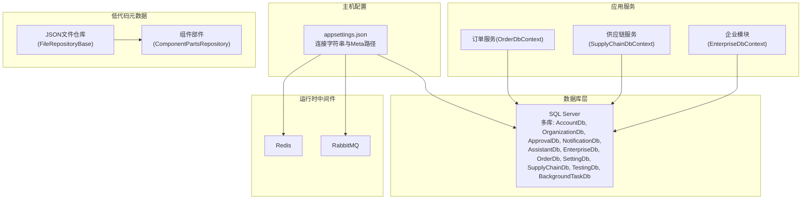
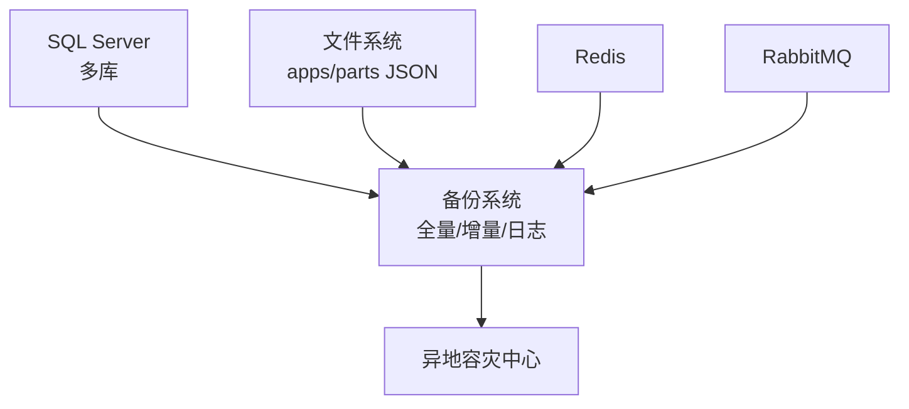
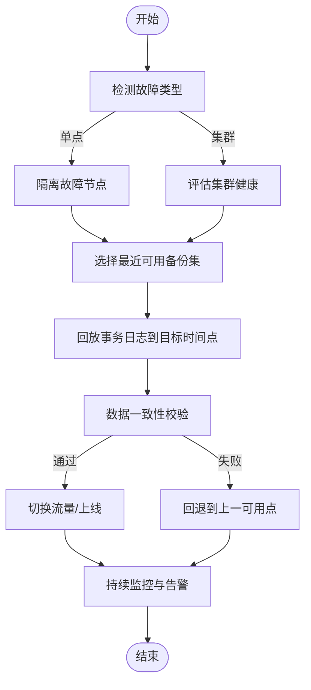
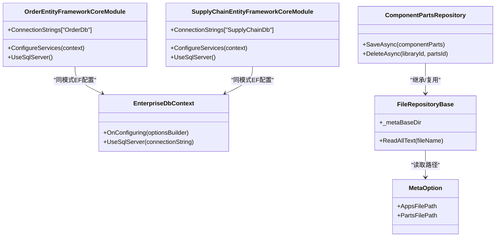

# 备份恢复策略

<cite>
**本文引用的文件**   
- [H.AppLab.Host.All/appsettings.json](file://src/Host/H.AppLab.Host.All/H.AppLab.Host.All/appsettings.json)
- [OrderEntityFrameworkCoreModule.cs](file://src/Services/Order/H.Order.EntityFrameworkCore/OrderEntityFrameworkCoreModule.cs)
- [SupplyChainEntityFrameworkCoreModule.cs](file://src/Services/SupplyChain/H.SupplyChain.EntityFrameworkCore/SupplyChainEntityFrameworkCoreModule.cs)
- [EnterpriseDbContext.cs](file://src/System/Enterprise/H.Enterprise.EntityFrameworkCore/EnterpriseDbContext.cs)
- [FileRepositoryBase.cs](file://src/LowCode/DesignEngine/H.LowCode.DesignEngine.Repository.JsonFile/Base/FileRepositoryBase.cs)
- [ComponentPartsRepository.cs](file://src/LowCode/DesignEngine/H.LowCode.DesignEngine.Repository.JsonFile/PartsRepositories/ComponentPartsRepository.cs)
- [MetaOption.cs](file://src/LowCode/Common/H.LowCode.Configuration/Options/MetaOption.cs)
- [docker-compose.yml](file://cd/docker-compose.yml)
</cite>

## 目录
1. [引言](#引言)
2. [项目结构](#项目结构)
3. [核心组件](#核心组件)
4. [架构总览](#架构总览)
5. [详细组件分析](#详细组件分析)
6. [依赖关系分析](#依赖关系分析)
7. [性能考虑](#性能考虑)
8. [故障排查指南](#故障排查指南)
9. [结论](#结论)
10. [附录](#附录)

## 引言
本文件为 AppLab 平台制定完整的备份与恢复策略，覆盖数据库、文件存储与元数据、缓存与消息队列等关键资产。目标包括：
- 明确全量、增量与事务日志备份策略及执行计划
- 设计文件与元数据的备份方案
- 提供单点故障与多节点集群的灾难恢复流程，确保数据一致性
- 规范备份数据加密与异地容灾
- 建立定期演练与恢复验证的最佳实践

## 项目结构
AppLab 采用多服务模块化架构，各业务域通过独立的 DbContext 连接不同的 SQL Server 数据库；低代码元数据以 JSON 文件形式落盘；运行期依赖 Redis 与 RabbitMQ（由 docker-compose 管理）。

图表来源 
- [H.AppLab.Host.All/appsettings.json:1-115](file://src/Host/H.AppLab.Host.All/H.AppLab.Host.All/appsettings.json#L1-L115)
- [OrderEntityFrameworkCoreModule.cs:1-31](file://src/Services/Order/H.Order.EntityFrameworkCore/OrderEntityFrameworkCoreModule.cs#L1-L31)
- [SupplyChainEntityFrameworkCoreModule.cs:1-31](file://src/Services/SupplyChain/H.SupplyChain.EntityFrameworkCore/SupplyChainEntityFrameworkCoreModule.cs#L1-L31)
- [EnterpriseDbContext.cs:1-44](file://src/System/Enterprise/H.Enterprise.EntityFrameworkCore/EnterpriseDbContext.cs#L1-L44)
- [FileRepositoryBase.cs:1-31](file://src/LowCode/DesignEngine/H.LowCode.DesignEngine.Repository.JsonFile/Base/FileRepositoryBase.cs#L1-L31)
- [ComponentPartsRepository.cs:103-140](file://src/LowCode/DesignEngine/H.LowCode.DesignEngine.Repository.JsonFile/PartsRepositories/ComponentPartsRepository.cs#L103-L140)
- [MetaOption.cs:1-16](file://src/LowCode/Common/H.LowCode.Configuration/Options/MetaOption.cs#L1-L16)
- [docker-compose.yml:1-32](file://cd/docker-compose.yml#L1-L32)

章节来源
- [H.AppLab.Host.All/appsettings.json:1-115](file://src/Host/H.AppLab.Host.All/H.AppLab.Host.All/appsettings.json#L1-L115)
- [OrderEntityFrameworkCoreModule.cs:1-31](file://src/Services/Order/H.Order.EntityFrameworkCore/OrderEntityFrameworkCoreModule.cs#L1-L31)
- [SupplyChainEntityFrameworkCoreModule.cs:1-31](file://src/Services/SupplyChain/H.SupplyChain.EntityFrameworkCore/SupplyChainEntityFrameworkCoreModule.cs#L1-L31)
- [EnterpriseDbContext.cs:1-44](file://src/System/Enterprise/H.Enterprise.EntityFrameworkCore/EnterpriseDbContext.cs#L1-L44)
- [FileRepositoryBase.cs:1-31](file://src/LowCode/DesignEngine/H.LowCode.DesignEngine.Repository.JsonFile/Base/FileRepositoryBase.cs#L1-L31)
- [ComponentPartsRepository.cs:103-140](file://src/LowCode/DesignEngine/H.LowCode.DesignEngine.Repository.JsonFile/PartsRepositories/ComponentPartsRepository.cs#L103-L140)
- [MetaOption.cs:1-16](file://src/LowCode/Common/H.LowCode.Configuration/Options/MetaOption.cs#L1-L16)
- [docker-compose.yml:1-32](file://cd/docker-compose.yml#L1-L32)

## 核心组件
- 数据库连接与上下文
  - 各 EF Core 模块通过 AbpDbContextOptions.UseSqlServer() 与 AbpDbConnectionOptions.ConnectionStrings 注册连接名（如 OrderDb、SupplyChainDb），并在 appsettings.json 中集中配置连接字符串。
- 低代码元数据存储
  - 通过 MetaOption 读取 appsFilePath/partsFilePath，FileRepositoryBase 统一处理 JSON 文件的读写，ComponentPartsRepository 负责具体部件文件的持久化。
- 中间件与外部依赖
  - Redis 与 RabbitMQ 通过 docker-compose 启动并暴露端口，用于缓存与异步任务。

章节来源
- [OrderEntityFrameworkCoreModule.cs:1-31](file://src/Services/Order/H.Order.EntityFrameworkCore/OrderEntityFrameworkCoreModule.cs#L1-L31)
- [SupplyChainEntityFrameworkCoreModule.cs:1-31](file://src/Services/SupplyChain/H.SupplyChain.EntityFrameworkCore/SupplyChainEntityFrameworkCoreModule.cs#L1-L31)
- [H.AppLab.Host.All/appsettings.json:1-115](file://src/Host/H.AppLab.Host.All/H.AppLab.Host.All/appsettings.json#L1-L115)
- [MetaOption.cs:1-16](file://src/LowCode/Common/H.LowCode.Configuration/Options/MetaOption.cs#L1-L16)
- [FileRepositoryBase.cs:1-31](file://src/LowCode/DesignEngine/H.LowCode.DesignEngine.Repository.JsonFile/Base/FileRepositoryBase.cs#L1-L31)
- [ComponentPartsRepository.cs:103-140](file://src/LowCode/DesignEngine/H.LowCode.DesignEngine.Repository.JsonFile/PartsRepositories/ComponentPartsRepository.cs#L103-L140)
- [docker-compose.yml:1-32](file://cd/docker-compose.yml#L1-L32)

## 架构总览
下图展示 AppLab 在备份视角下的关键数据面：多个 SQL Server 数据库实例、本地 JSON 元数据、以及 Redis/RabbitMQ 持久卷。

图表来源 
- [H.AppLab.Host.All/appsettings.json:1-115](file://src/Host/H.AppLab.Host.All/H.AppLab.Host.All/appsettings.json#L1-L115)
- [FileRepositoryBase.cs:1-31](file://src/LowCode/DesignEngine/H.LowCode.DesignEngine.Repository.JsonFile/Base/FileRepositoryBase.cs#L1-L31)
- [docker-compose.yml:1-32](file://cd/docker-compose.yml#L1-L32)

## 详细组件分析

### 数据库备份策略（全量、增量、事务日志）
- 适用对象
  - 所有通过 EF Core 模块注册的数据库（AccountDb、OrganizationDb、ApprovalDb、NotificationDb、AssistantDb、EnterpriseDb、OrderDb、SettingDb、SupplyChainDb、TestingDb、BackgroundTaskDb）。
- 备份类型与频率建议
  - 全量备份：每日一次（业务低峰期），保留周期按合规要求设定（如 30/90 天）。
  - 增量备份：每 4-6 小时一次，降低备份窗口与存储压力。
  - 事务日志备份：每 5-15 分钟一次，保证 RPO 可控。
- 执行要点
  - 使用 SQL Server 原生备份工具或托管服务（如 Azure SQL Backup、云厂商快照/备份代理）。
  - 校验备份完整性（RESTORE VERIFYONLY），记录校验结果。
  - 对关键库（如 OrderDb、EnterpriseDb、AccountDb）优先保障更短 RPO。
- 恢复目标
  - RTO：核心库目标 ≤ 1 小时；非核心库目标 ≤ 4 小时。
  - RPO：核心库目标 ≤ 15 分钟；非核心库目标 ≤ 1 小时。

章节来源
- [OrderEntityFrameworkCoreModule.cs:1-31](file://src/Services/Order/H.Order.EntityFrameworkCore/OrderEntityFrameworkCoreModule.cs#L1-L31)
- [SupplyChainEntityFrameworkCoreModule.cs:1-31](file://src/Services/SupplyChain/H.SupplyChain.EntityFrameworkCore/SupplyChainEntityFrameworkCoreModule.cs#L1-L31)
- [H.AppLab.Host.All/appsettings.json:1-115](file://src/Host/H.AppLab.Host.All/H.AppLab.Host.All/appsettings.json#L1-L115)

### 文件与元数据备份方案
- 覆盖范围
  - 低代码元数据目录：appsFilePath、partsFilePath 指向的 JSON 文件集合。
  - 上传附件：若使用本地磁盘存储，需纳入文件级备份；若使用对象存储，则走对象存储备份策略。
- 备份方式
  - 文件系统快照或增量同步（如 rsync、云盘快照），保持版本化与一致性。
  - 对频繁变更的 parts/componentParts 目录提高备份频率。
- 一致性保证
  - 避免在写入高峰期进行跨目录一致性快照；必要时短暂只读或停止写入窗口。

章节来源
- [MetaOption.cs:1-16](file://src/LowCode/Common/H.LowCode.Configuration/Options/MetaOption.cs#L1-L16)
- [FileRepositoryBase.cs:1-31](file://src/LowCode/DesignEngine/H.LowCode.DesignEngine.Repository.JsonFile/Base/FileRepositoryBase.cs#L1-L31)
- [ComponentPartsRepository.cs:103-140](file://src/LowCode/DesignEngine/H.LowCode.DesignEngine.Repository.JsonFile/PartsRepositories/ComponentPartsRepository.cs#L103-L140)
- [H.AppLab.Host.All/appsettings.json:18-21](file://src/Host/H.AppLab.Host.All/H.AppLab.Host.All/appsettings.json#L18-L21)

### 缓存与消息队列备份
- Redis
  - 启用 AOF 与 RDB 持久化；定期导出 dump.rdb 并同步至异地。
  - 注意：缓存可重建，但会话/限流计数等需评估丢失影响。
- RabbitMQ
  - 使用 volumes 持久化；定期导出镜像或迁移脚本，确保队列与交换器定义可恢复。

章节来源
- [docker-compose.yml:1-32](file://cd/docker-compose.yml#L1-L32)

### 灾难恢复流程（SOP）
- 单点故障恢复
  - 步骤：定位故障源 → 切换备用节点/副本 → 从最近的全量+增量+日志恢复到时间点 → 校验数据一致性与业务可用性 → 回切原节点（可选）。
- 多节点集群恢复
  - 步骤：准备新集群环境 → 恢复主库与只读副本 → 校验复制状态 → 逐步接入流量 → 监控告警收敛。
- 数据一致性保证
  - 使用事务日志恢复到精确时间戳；对关键表执行抽样比对（行数、哈希校验）；业务侧增加幂等与补偿机制。

[本图为概念性流程图，不直接映射具体源码文件]

### 备份数据加密与异地容灾
- 加密存储
  - 传输层：TLS 加密备份通道。
  - 静态数据：对备份文件启用 AES-256 或云服务商 KMS 托管密钥。
  - 密钥管理：集中化管理（KMS/Key Vault），最小权限访问。
- 异地容灾
  - 多地域复制：将备份与快照复制到不同地理区域。
  - 跨区域恢复演练：至少每季度进行一次端到端恢复演练。

[本节为通用指导，不直接引用具体源码文件]

### 定期演练与恢复验证最佳实践
- 演练频率
  - 月度：单库恢复演练（含事务日志回放）。
  - 季度：全链路恢复演练（数据库+文件+缓存+队列）。
- 验证清单
  - 备份完整性校验、恢复耗时统计、数据一致性抽样、业务冒烟测试用例。
- 自动化
  - 将恢复脚本纳入 CI/CD 流水线，生成报告并归档。

[本节为通用指导，不直接引用具体源码文件]

## 依赖关系分析
- 数据库依赖
  - 各 EF Core 模块通过连接字符串名称绑定数据库，便于统一备份策略编排。
- 文件依赖
  - 低代码元数据通过 MetaOption 注入路径，FileRepositoryBase 抽象文件操作，ComponentPartsRepository 实现具体持久化。
- 中间件依赖
  - Redis/RabbitMQ 由 docker-compose 管理，需纳入备份与恢复流程。

图表来源 
- [OrderEntityFrameworkCoreModule.cs:1-31](file://src/Services/Order/H.Order.EntityFrameworkCore/OrderEntityFrameworkCoreModule.cs#L1-L31)
- [SupplyChainEntityFrameworkCoreModule.cs:1-31](file://src/Services/SupplyChain/H.SupplyChain.EntityFrameworkCore/SupplyChainEntityFrameworkCoreModule.cs#L1-L31)
- [EnterpriseDbContext.cs:1-44](file://src/System/Enterprise/H.Enterprise.EntityFrameworkCore/EnterpriseDbContext.cs#L1-L44)
- [FileRepositoryBase.cs:1-31](file://src/LowCode/DesignEngine/H.LowCode.DesignEngine.Repository.JsonFile/Base/FileRepositoryBase.cs#L1-L31)
- [ComponentPartsRepository.cs:103-140](file://src/LowCode/DesignEngine/H.LowCode.DesignEngine.Repository.JsonFile/PartsRepositories/ComponentPartsRepository.cs#L103-L140)
- [MetaOption.cs:1-16](file://src/LowCode/Common/H.LowCode.Configuration/Options/MetaOption.cs#L1-L16)

章节来源
- [OrderEntityFrameworkCoreModule.cs:1-31](file://src/Services/Order/H.Order.EntityFrameworkCore/OrderEntityFrameworkCoreModule.cs#L1-L31)
- [SupplyChainEntityFrameworkCoreModule.cs:1-31](file://src/Services/SupplyChain/H.SupplyChain.EntityFrameworkCore/SupplyChainEntityFrameworkCoreModule.cs#L1-L31)
- [EnterpriseDbContext.cs:1-44](file://src/System/Enterprise/H.Enterprise.EntityFrameworkCore/EnterpriseDbContext.cs#L1-L44)
- [FileRepositoryBase.cs:1-31](file://src/LowCode/DesignEngine/H.LowCode.DesignEngine.Repository.JsonFile/Base/FileRepositoryBase.cs#L1-L31)
- [ComponentPartsRepository.cs:103-140](file://src/LowCode/DesignEngine/H.LowCode.DesignEngine.Repository.JsonFile/PartsRepositories/ComponentPartsRepository.cs#L103-L140)
- [MetaOption.cs:1-16](file://src/LowCode/Common/H.LowCode.Configuration/Options/MetaOption.cs#L1-L16)

## 性能考虑
- 备份窗口
  - 全量备份安排在业务低峰期；增量与日志备份缩短间隔以降低 RPO。
- I/O 影响
  - 使用专用备份设备或云快照，避免与应用争用磁盘 I/O。
- 并发与锁
  - 对高写库（如 OrderDb）在备份期间减少长事务；必要时设置只读副本进行备份。
- 网络带宽
  - 异地容灾压缩与去重传输，限制峰值带宽占用。

[本节为通用指导，不直接引用具体源码文件]

## 故障排查指南
- 常见备份问题
  - 连接字符串错误导致无法连接数据库：核对 appsettings.json 中的 ConnectionStrings。
  - 文件路径不存在：检查 MetaOption 的 AppsFilePath/PartsFilePath 与实际部署路径是否一致。
  - 权限不足：确认备份进程对数据库与文件系统具备读写权限。
- 快速定位
  - 查看备份作业日志与返回码；对关键库执行 RESTORE VERIFYONLY。
  - 校验 Redis dump.rdb 与 RabbitMQ 卷挂载状态。

章节来源
- [H.AppLab.Host.All/appsettings.json:1-115](file://src/Host/H.AppLab.Host.All/H.AppLab.Host.All/appsettings.json#L1-L115)
- [MetaOption.cs:1-16](file://src/LowCode/Common/H.LowCode.Configuration/Options/MetaOption.cs#L1-L16)
- [FileRepositoryBase.cs:1-31](file://src/LowCode/DesignEngine/H.LowCode.DesignEngine.Repository.JsonFile/Base/FileRepositoryBase.cs#L1-L31)
- [docker-compose.yml:1-32](file://cd/docker-compose.yml#L1-L32)

## 结论
通过分层备份策略（数据库全量/增量/日志、文件与元数据、缓存与消息队列）、严格的恢复流程与演练机制，结合加密与异地容灾，AppLab 可在多种故障场景下实现快速、可靠的数据恢复与业务连续性保障。

[本节为总结性内容，不直接引用具体源码文件]

## 附录
- 恢复验证清单（示例）
  - 备份集完整性校验通过
  - 恢复耗时满足 RTO 目标
  - 关键表数据抽样一致
  - 业务冒烟用例全部通过
  - 监控指标正常无异常告警

[本节为通用指导，不直接引用具体源码文件]