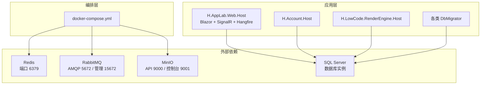
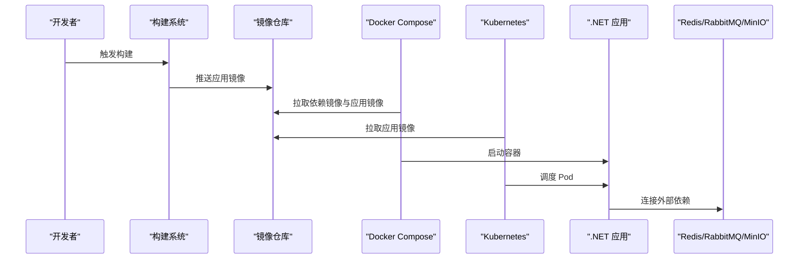
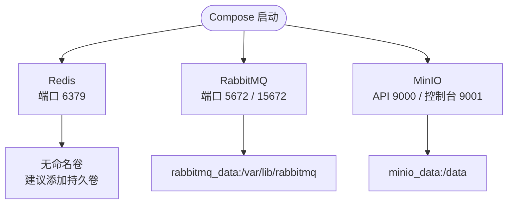
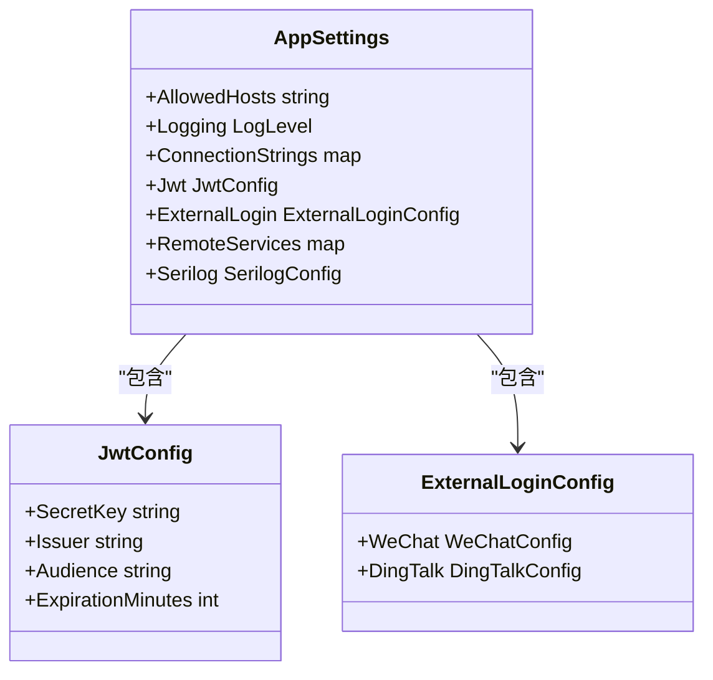
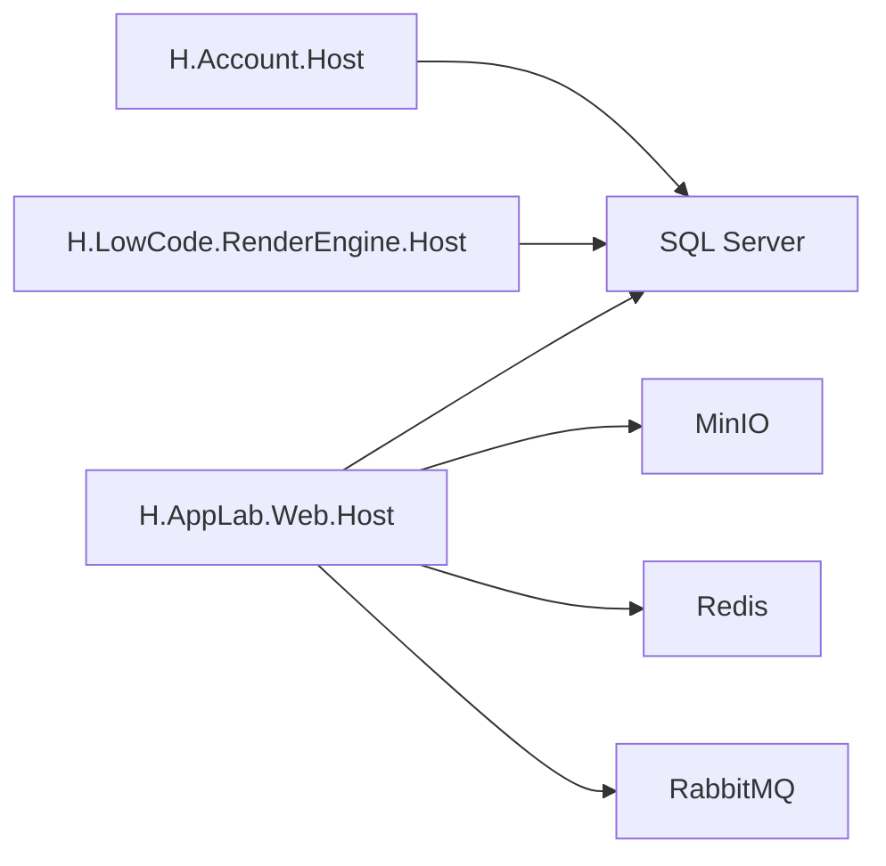
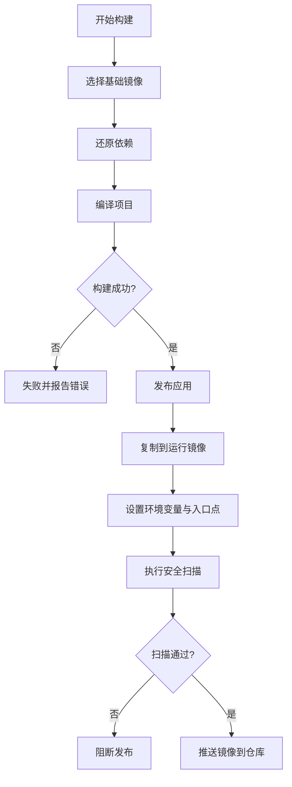
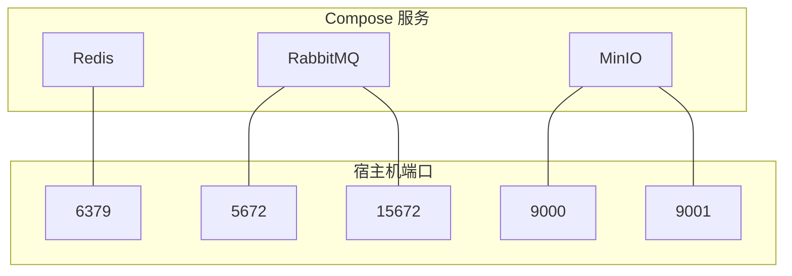
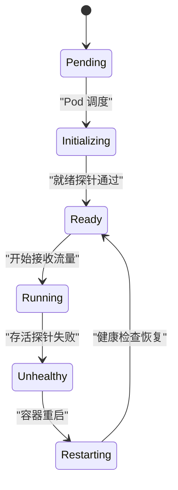
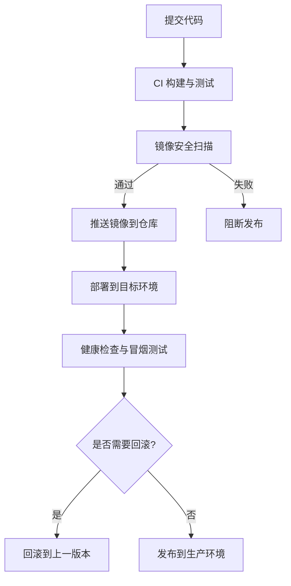

# 容器化部署

<cite>
**本文引用的文件**   
- [README.md](file://README.md)
- [cd/docker-compose.yml](file://cd/docker-compose.yml)
- [src/global.json](file://src/global.json)
- [src/AppLab.slnLaunch](file://src/AppLab.slnLaunch)
- [src/Host/H.AppLab.Web.Host/H.AppLab.Web.Host/appsettings.json](file://src/Host/H.AppLab.Web.Host/H.AppLab.Web.Host/appsettings.json)
- [src/Host/Account/H.Account.Host/appsettings.json](file://src/Host/Account/H.Account.Host/appsettings.json)
- [src/Host/RenderEngine/H.LowCode.RenderEngine.Host/appsettings.json](file://src/Host/RenderEngine/H.LowCode.RenderEngine.Host/appsettings.json)
- [src/Tools/H.Account.DbMigrator/appsettings.json](file://src/Tools/H.Account.DbMigrator/appsettings.json)
</cite>

## 目录
1. [引言](#引言)
2. [项目结构](#项目结构)
3. [核心组件](#核心组件)
4. [架构总览](#架构总览)
5. [详细组件分析](#详细组件分析)
6. [依赖关系分析](#依赖关系分析)
7. [.NET 应用镜像构建指南](#net-应用镜像构建指南)
8. [Docker Compose 编排说明](#docker-compose-编排说明)
9. [Kubernetes 集群部署方案](#kubernetes-集群部署方案)
10. [环境隔离、资源限制与健康检查](#环境隔离资源限制与健康检查)
11. [DevOps 流程：推送、版本管理与回滚](#devops-流程推送版本管理与回滚)
12. [性能考虑与优化建议](#性能考虑与优化建议)
13. [故障排查指南](#故障排查指南)
14. [结论](#结论)

## 引言
H.AppLab 是一个基于 .NET 与 Blazor 的应用开发实验平台，采用模块化架构，支持单体部署与按服务独立部署。当前仓库已提供 Redis、RabbitMQ、MinIO 等外部依赖的 Docker Compose 编排配置，但未包含 .NET 应用的 Dockerfile 或 Kubernetes 清单。本文在严格依据现有代码结构的前提下，给出面向 H.AppLab 平台的容器化部署方案，包括镜像构建最佳实践、Compose 编排解读、Kubernetes 资源配置建议、运维策略以及故障排查方法。

## 项目结构
从容器化视角看，H.AppLab 由以下层次组成：
- 外部依赖层：Redis、RabbitMQ、MinIO，通过 `cd/docker-compose.yml` 管理。
- 运行时应用层：Web 宿主程序（Blazor Web App）、数据库迁移工具、低代码渲染引擎、账号服务等。
- 配置层：各 Host 与 DbMigrator 使用 `appsettings.json` 注入连接字符串、JWT、远程服务地址等配置。
- 基础设施层：SQL Server、对象存储、消息队列、缓存等。

图表来源
- [cd/docker-compose.yml:1-48](file://cd/docker-compose.yml#L1-L48)
- [src/Host/H.AppLab.Web.Host/H.AppLab.Web.Host/appsettings.json](file://src/Host/H.AppLab.Web.Host/H.AppLab.Web.Host/appsettings.json)
- [src/Host/Account/H.Account.Host/appsettings.json](file://src/Host/Account/H.Account.Host/appsettings.json)
- [src/Host/RenderEngine/H.LowCode.RenderEngine.Host/appsettings.json](file://src/Host/RenderEngine/H.LowCode.RenderEngine.Host/appsettings.json)

章节来源
- [README.md:1-73](file://README.md#L1-L73)
- [cd/docker-compose.yml:1-48](file://cd/docker-compose.yml#L1-L48)

## 核心组件
- 容器编排：Redis、RabbitMQ、MinIO 三个依赖服务由 `cd/docker-compose.yml` 统一定义。
- Web 宿主：Blazor Web App，默认通过 IIS Express 或 Kestrel 启动；本地开发中可通过解决方案启动配置运行。
- 低代码渲染引擎：负责根据元数据动态渲染可运行的应用，并暴露远程服务接口供客户端调用。
- 账号服务：提供用户认证、登录、JWT 签发等能力。
- 数据库迁移工具：每个服务对应一个 DbMigrator 控制台程序，用于创建和更新数据库结构。
- 外部依赖：Redis 作为缓存，RabbitMQ 作为消息队列，MinIO 作为对象存储。

章节来源
- [README.md:1-73](file://README.md#L1-L73)
- [src/AppLab.slnLaunch:1-82](file://src/AppLab.slnLaunch#L1-L82)

## 架构总览
H.AppLab 的容器化架构围绕“外部依赖容器化 + .NET 应用容器化”展开。当前仓库仅包含依赖服务的 Compose 编排，未包含 .NET 应用的 Dockerfile；因此生产部署需要先补充 .NET 应用镜像构建产物，再通过 Compose 或 Kubernetes 调度。

图表来源
- [cd/docker-compose.yml:1-48](file://cd/docker-compose.yml#L1-L48)
- [src/global.json:1-6](file://src/global.json#L1-L6)

## 详细组件分析

### 依赖服务与运行参数
- Redis
  - 镜像：redis:8.8-alpine
  - 容器名：redis
  - 端口映射：宿主机 6379 到容器 6379
  - 环境变量：时区 Asia/Shanghai、语言 en_US.UTF-8
  - 安全注意：同时定义了 REDIS_ARGS 与 command 两种设置密码的方式，存在冲突风险；应以最终生效的 command 为准，并避免明文密码泄露。
- RabbitMQ
  - 镜像：rabbitmq:4.0-management-alpine
  - 容器名：rabbitmq
  - 端口映射：AMQP 5672、管理界面 15672
  - 数据卷：rabbitmq_data 持久化至 /var/lib/rabbitmq
  - 环境变量：默认用户 root、密码 123456、时区 Asia/Shanghai
- MinIO
  - 镜像：minio/minio:latest
  - 容器名：minio
  - 端口映射：API 9000、控制台 9001（映射为宿主机 9010、9011）
  - 数据卷：minio_data 持久化至 /data
  - 环境变量：根用户名/密码均为 minioadmin、时区 Asia/Shanghai
  - 命令：server /data --console-address ":9001"

图表来源
- [cd/docker-compose.yml:1-48](file://cd/docker-compose.yml#L1-L48)

章节来源
- [cd/docker-compose.yml:1-48](file://cd/docker-compose.yml#L1-L48)

### .NET 应用运行时配置
- Web 宿主 appsettings.json
  - AllowedHosts 允许所有主机
  - Logging 日志级别
  - ConnectionStrings 数据库连接字符串
  - Jwt JWT 密钥、签发者、受众、过期时间
  - ExternalLogin 第三方登录开关与回调路径
- 渲染引擎 appsettings.json
  - ConnectionStrings.Default 低代码数据库连接字符串
  - Meta.appsFilePath、Meta.partsFilePath 元数据文件路径
  - RemoteServices.RenderEngine.BaseUrl 渲染引擎远程服务地址
  - Serilog 日志输出到文件与控制台，支持滚动与大小限制
- 账号服务 appsettings.json
  - ConnectionStrings.AccountDb 账号库连接字符串
  - Jwt.SecretKey 等认证相关配置
- DbMigrator appsettings.json
  - ConnectionStrings 指定要迁移的数据库连接字符串

图表来源
- [src/Host/H.AppLab.Web.Host/H.AppLab.Web.Host/appsettings.json](file://src/Host/H.AppLab.Web.Host/H.AppLab.Web.Host/appsettings.json)
- [src/Host/Account/H.Account.Host/appsettings.json](file://src/Host/Account/H.Account.Host/appsettings.json)
- [src/Host/RenderEngine/H.LowCode.RenderEngine.Host/appsettings.json](file://src/Host/RenderEngine/H.LowCode.RenderEngine.Host/appsettings.json)
- [src/Tools/H.Account.DbMigrator/appsettings.json](file://src/Tools/H.Account.DbMigrator/appsettings.json)

章节来源
- [src/Host/H.AppLab.Web.Host/H.AppLab.Web.Host/appsettings.json](file://src/Host/H.AppLab.Web.Host/H.AppLab.Web.Host/appsettings.json)
- [src/Host/Account/H.Account.Host/appsettings.json](file://src/Host/Account/H.Account.Host/appsettings.json)
- [src/Host/RenderEngine/H.LowCode.RenderEngine.Host/appsettings.json](file://src/Host/RenderEngine/H.LowCode.RenderEngine.Host/appsettings.json)
- [src/Tools/H.Account.DbMigrator/appsettings.json](file://src/Tools/H.Account.DbMigrator/appsettings.json)

## 依赖关系分析
- 外部依赖
  - Redis：通常用于缓存与会话状态，Compose 中已定义但应用侧未在提供的配置文件中显式引用连接字符串。
  - RabbitMQ：Compose 中已定义，但当前提供的 .NET 配置未直接出现 RabbitMQ 客户端集成；是否使用以实际代码为准。
  - MinIO：作为对象存储后端，需在应用侧通过 MinIO 客户端 SDK 配置 Endpoint、AccessKey、SecretKey、UseSsl。
- 数据库
  - SQL Server：多个 Host 与 DbMigrator 均使用 ConnectionStrings 指向数据库实例；本地开发默认使用 LocalDB，生产需替换为真实 SQL Server。
- 远程服务
  - RenderEngine.BaseUrl：渲染引擎通过 RemoteServices 节点暴露远程服务地址，供前端或下游服务调用。

图表来源
- [src/Host/H.AppLab.Web.Host/H.AppLab.Web.Host/appsettings.json](file://src/Host/H.AppLab.Web.Host/H.AppLab.Web.Host/appsettings.json)
- [src/Host/Account/H.Account.Host/appsettings.json](file://src/Host/Account/H.Account.Host/appsettings.json)
- [src/Host/RenderEngine/H.LowCode.RenderEngine.Host/appsettings.json](file://src/Host/RenderEngine/H.LowCode.RenderEngine.Host/appsettings.json)
- [cd/docker-compose.yml:1-48](file://cd/docker-compose.yml#L1-L48)

章节来源
- [src/Host/H.AppLab.Web.Host/H.AppLab.Web.Host/appsettings.json](file://src/Host/H.AppLab.Web.Host/H.AppLab.Web.Host/appsettings.json)
- [src/Host/Account/H.Account.Host/appsettings.json](file://src/Host/Account/H.Account.Host/appsettings.json)
- [src/Host/RenderEngine/H.LowCode.RenderEngine.Host/appsettings.json](file://src/Host/RenderEngine/H.LowCode.RenderEngine.Host/appsettings.json)
- [cd/docker-compose.yml:1-48](file://cd/docker-compose.yml#L1-L48)

## .NET 应用镜像构建指南
当前仓库未包含 .NET 应用的 Dockerfile。针对 H.AppLab 的模块化架构，推荐采用多阶段构建策略，将编译环境与发布产物分离，减少镜像体积并提升安全性。

- 基础镜像选择
  - 构建阶段：使用官方 .NET SDK 镜像，版本以 src/global.json 中的 SDK 10.0.0 为准。
  - 运行阶段：使用精简版 .NET Runtime 镜像，如 alpine 或 distroless，降低漏洞面。
- 多阶段构建流程
  - 第一阶段：安装依赖、还原 NuGet 包、恢复项目引用。
  - 第二阶段：编译并发布应用，生成自包含或框架依赖型发布包。
  - 第三阶段：复制发布产物到精简运行镜像，设置工作目录与入口点。
- 镜像分层策略
  - 将易变代码与稳定依赖分阶段写入，提高构建缓存命中率。
  - 避免将源代码、调试符号、测试代码打包进生产镜像。
- 安全扫描与加固
  - 在 CI 中集成镜像安全扫描，检测高危漏洞。
  - 使用非 root 用户运行容器进程，最小化权限。
  - 定期更新基础镜像，锁定具体镜像标签而非 latest。
- 构建输入与输出
  - 输入：解决方案、项目文件、配置文件、NuGet 源。
  - 输出：应用镜像、镜像摘要、制品元数据。

[此图为概念流程图，不直接映射具体源码文件]

## Docker Compose 编排说明
当前 `cd/docker-compose.yml` 仅定义了 Redis、RabbitMQ、MinIO 三个依赖服务。建议在后续迭代中补充 .NET 应用服务定义，实现一键拉起完整栈。

- 服务定义要点
  - 镜像：明确版本标签，避免使用 latest。
  - 端口映射：仅暴露必要端口，内部通信通过容器网络。
  - 环境变量：敏感信息使用 Secrets 或外部密钥管理服务。
  - 数据卷：对需要持久化的数据使用命名卷或绑定挂载。
  - 健康检查：为关键服务添加健康检查，确保依赖就绪。
- 当前依赖服务总结
  - Redis：缓存服务，端口 6379。
  - RabbitMQ：消息队列，端口 5672 与 15672。
  - MinIO：对象存储，端口 9000 与 9001。

图表来源
- [cd/docker-compose.yml:1-48](file://cd/docker-compose.yml#L1-L48)

章节来源
- [cd/docker-compose.yml:1-48](file://cd/docker-compose.yml#L1-L48)

## Kubernetes 集群部署方案
由于仓库未提供 Kubernetes 清单，本节给出适配 H.AppLab 的推荐资源配置，便于在集群环境中部署。

- Deployment
  - 名称：applab-web-host、account-host、render-engine-host、dbmigrator-job。
  - 副本数：根据负载与高可用需求调整。
  - 资源限制：CPU、内存请求与上限。
  - 镜像：使用带版本标签的镜像。
  - 探针：就绪探针与存活探针，结合 HTTP 健康检查端点。
- Service
  - ClusterIP：对外部不可见，供集群内服务发现。
  - NodePort/LoadBalancer：如需外部访问，建议使用 Ingress。
- ConfigMap
  - 存放非敏感配置：AllowedHosts、日志级别、远程服务地址等。
- Secret
  - 存放敏感信息：数据库连接字符串、JWT 密钥、MinIO 密钥等。
- PersistentVolume/PersistentVolumeClaim
  - 为 MinIO、RabbitMQ、数据库等持久化数据。
- Ingress
  - 统一管理外部域名、TLS、路由规则。
- HorizontalPodAutoscaler
  - 根据 CPU、内存或自定义指标自动扩缩容。

```mermaid
graph TB
    subgraph "Kubernetes 命名空间"
        deploy_web["Deployment: Web 宿主"]
        deploy_account["Deployment: 账号服务"]
        deploy_render["Deployment: 渲染引擎"]
        svc_web["Service: Web 宿主"]
        svc_account["Service: 账号服务"]
        svc_render["Service: 渲染引擎"]
        cm["ConfigMap: 非敏感配置"]
        secret["Secret: 敏感配置"]
        pv_minio["PV/PVC: MinIO 数据"]
        pv_rabbit["PV/PVC: RabbitMQ 数据"]
        pv_sql["PV/PVC: 数据库数据"]
        ingress["Ingress: 外部入口"]
    end

    ingress --> svc_web
    deploy_web --> svc_web
    deploy_account --> svc_account
    deploy_render --> svc_render
    deploy_web -.-> cm
    deploy_web -.-> secret
    deploy_account -.-> cm
    deploy_account -.-> secret
    deploy_render -.-> cm
    deploy_render -.-> secret
    pv_minio --> svc_minio["StatefulSet: MinIO"]
    pv_rabbit --> svc_rabbit["StatefulSet: RabbitMQ"]
    pv_sql --> svc_sql["StatefulSet: SQL Server"]
```

[此图为概念架构图，不直接映射具体源码文件]

## 环境隔离、资源限制与健康检查
- 环境隔离
  - 使用不同命名空间区分开发、测试、生产环境。
  - 使用 ConfigMap 与 Secret 隔离配置与敏感信息。
  - 使用 NetworkPolicy 控制服务间访问权限。
- 资源限制
  - 为每个 Pod 设置 requests 与 limits，防止资源争用。
  - 使用 LimitRange 与 ResourceQuota 控制命名空间级资源配额。
- 健康检查
  - 就绪探针：确保应用完成初始化后再接收流量。
  - 存活探针：检测应用是否正常运行，异常时自动重启。
  -  readinessProbe 与 livenessProbe 使用 HTTP GET 或 TCP Socket 探测。

[此图为概念状态图，不直接映射具体源码文件]

## DevOps 流程：推送、版本管理与回滚
- 镜像推送
  - CI 构建成功后推送镜像到私有仓库，使用语义化版本标签。
  - 同时推送最新稳定版本标签，便于快速验证。
- 版本管理
  - 使用 Git 标签与镜像标签一一对应。
  - 记录镜像摘要，保证部署可追溯。
- 回滚策略
  - 保留历史镜像与配置快照。
  - 使用 Helm Chart 或 Kustomize 管理版本化部署清单。
  - 支持灰度发布与蓝绿切换，降低回滚风险。

[此图为概念流程图，不直接映射具体源码文件]

## 性能考虑与优化建议
- 镜像体积优化
  - 使用多阶段构建，仅复制发布产物。
  - 清理构建缓存与临时文件。
  - 使用精简基础镜像。
- 运行时性能
  - 启用响应压缩与静态资源缓存。
  - 合理设置连接池与超时参数。
  - 使用反向代理与 CDN 加速静态资源。
- 资源利用率
  - 调整副本数与水平扩展策略。
  - 监控 CPU、内存、磁盘、网络使用率。
  - 使用 Profiling 工具定位热点路径。

[本节为通用指导，无需特定源码引用]

## 故障排查指南
- 常见问题
  - 数据库连接失败：检查 ConnectionStrings、网络连通性、防火墙规则。
  - JWT 校验失败：确认 SecretKey、Issuer、Audience 一致。
  - MinIO 上传失败：检查 Endpoint、AccessKey、SecretKey、UseSsl 配置。
  - RabbitMQ 消息丢失：检查队列声明、持久化配置、消费者消费逻辑。
  - Redis 缓存失效：检查连接字符串、密码配置、网络策略。
- 日志与监控
  - 查看应用日志：Serilog 输出到文件与控制台。
  - 查看容器日志：kubectl logs 或 docker logs。
  - 监控依赖健康状态：Redis CLI、RabbitMQ Management、MinIO Console。
- 排障步骤
  - 逐步缩小范围：先验证依赖服务，再验证应用配置，最后验证业务逻辑。
  - 复现问题：在测试环境模拟生产配置。
  - 收集证据：日志、指标、事件、变更记录。

章节来源
- [src/Host/RenderEngine/H.LowCode.RenderEngine.Host/appsettings.json:1-65](file://src/Host/RenderEngine/H.LowCode.RenderEngine.Host/appsettings.json#L1-L65)
- [src/Host/Account/H.Account.Host/appsettings.json:1-32](file://src/Host/Account/H.Account.Host/appsettings.json#L1-L32)
- [src/Tools/H.Account.DbMigrator/appsettings.json:1-5](file://src/Tools/H.Account.DbMigrator/appsettings.json#L1-L5)

## 结论
H.AppLab 当前已具备外部依赖的 Docker Compose 编排，但未包含 .NET 应用的 Dockerfile 与 Kubernetes 清单。按照本文给出的镜像构建、Compose 扩展、Kubernetes 资源配置、运维策略与故障排查建议，团队可以逐步完善容器化部署体系，实现更安全、更稳定、更易扩展的生产环境。