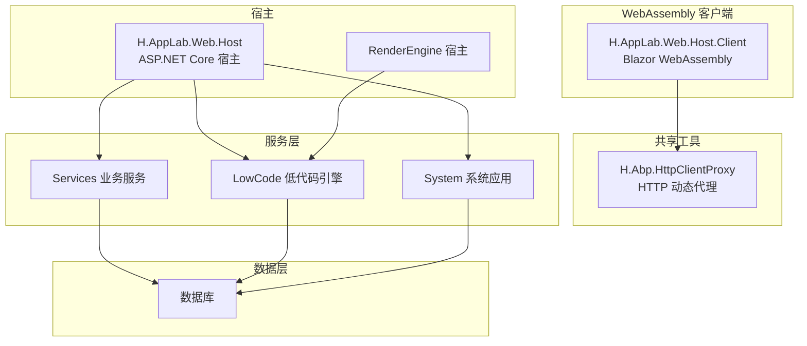
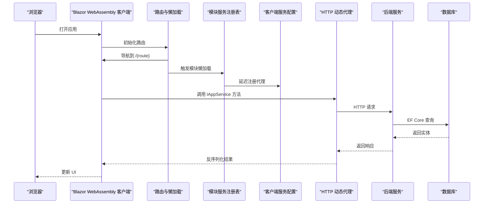
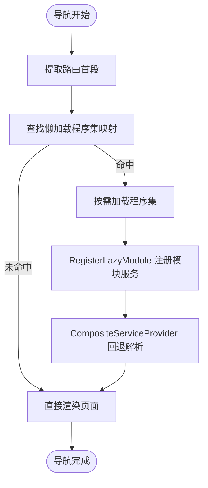
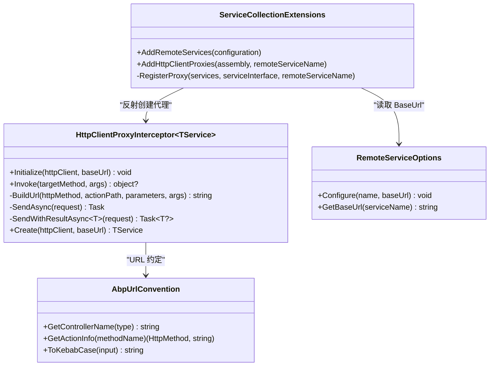
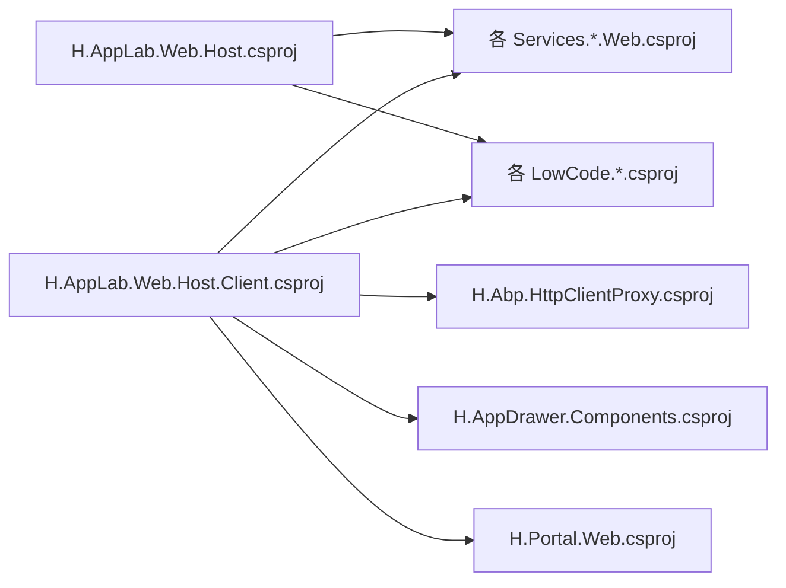

# 性能调优

<cite>
**本文引用的文件**   
- [README.md](file://README.md)
- [H.AppLab.Web.Host.csproj](file://src/Host/H.AppLab.Web.Host/H.AppLab.Web.Host/H.AppLab.Web.Host.csproj)
- [H.AppLab.Web.Host.Client.csproj](file://src/Host/H.AppLab.Web.Host/H.AppLab.Web.Host.Client/H.AppLab.Web.Host.Client.csproj)
- [ClientServices.cs](file://src/Host/H.AppLab.Web.Host/H.AppLab.Web.Host.Client/ClientServices.cs)
- [LazyModuleServices.cs](file://src/Host/H.AppLab.Web.Host/H.AppLab.Web.Host.Client/LazyModuleServices.cs)
- [Routes.razor](file://src/Host/H.AppLab.Web.Host/H.AppLab.Web.Host.Client/Routes.razor)
- [Program.cs](file://src/Host/H.AppLab.Web.Host/H.AppLab.Web.Host.Client/Program.cs)
- [ServiceCollectionExtensions.cs](file://src/Utils/H.Abp.HttpClientProxy/ServiceCollectionExtensions.cs)
- [HttpClientProxyInterceptor.cs](file://src/Utils/H.Abp.HttpClientProxy/HttpClientProxyInterceptor.cs)
- [AbpUrlConvention.cs](file://src/Utils/H.Abp.HttpClientProxy/AbpUrlConvention.cs)
- [RemoteServiceOptions.cs](file://src/Utils/H.Abp.HttpClientProxy/RemoteServiceOptions.cs)
- [appsettings.json（宿主）](file://src/Host/H.AppLab.Web.Host/H.AppLab.Web.Host/appsettings.json)
- [appsettings.json（渲染引擎宿主）](file://src/Host/RenderEngine/H.LowCode.RenderEngine.Host/appsettings.json)
- [appsettings.serilog.json（低代码迁移工具）](file://src/Tools/H.LowCode.DbMigrator/appsettings.serilog.json)
</cite>

## 目录
1. [引言](#引言)
2. [项目结构](#项目结构)
3. [核心组件](#核心组件)
4. [架构总览](#架构总览)
5. [详细组件分析](#详细组件分析)
6. [依赖关系分析](#依赖关系分析)
7. [性能优化策略](#性能优化策略)
8. [数据库性能优化](#数据库性能优化)
9. [前端性能优化](#前端性能优化)
10. [HTTP 客户端性能优化](#http-客户端性能优化)
11. [性能监控与分析](#性能监控与分析)
12. [瓶颈识别与调优案例](#瓶颈识别与调优案例)
13. [故障排查指南](#故障排查指南)
14. [结论](#结论)

## 引言
本性能调优文档面向 H.AppLab 平台，围绕 ASP.NET Core 应用、Blazor WebAssembly 前端、EF Core 数据访问以及 HTTP 客户端代理等关键路径，给出可落地的优化方案。文档结合仓库中的宿主工程、客户端工程、HTTP 动态代理和配置中心，提供从中间件到内存、GC、线程池、连接池、查询、索引、缓存、静态资源压缩、CDN、重试与超时、遥测与诊断工具的完整视角。

## 项目结构
H.AppLab 采用模块化架构：Host 作为宿主程序负责服务注册；LowCode 提供设计与渲染能力；Services 按限界上下文拆分业务模块；System 提供系统级应用；Tools 提供各服务的数据库迁移工具；Utils 提供共享基础库，包括基于 ABP 约定的 HTTP 客户端代理。

**图示来源**
- [H.AppLab.Web.Host.csproj:1-64](file://src/Host/H.AppLab.Web.Host/H.AppLab.Web.Host/H.AppLab.Web.Host.csproj#L1-L64)
- [H.AppLab.Web.Host.Client.csproj:1-147](file://src/Host/H.AppLab.Web.Host/H.AppLab.Web.Host.Client/H.AppLab.Web.Host.Client.csproj#L1-L147)
- [ServiceCollectionExtensions.cs:1-63](file://src/Utils/H.Abp.HttpClientProxy/ServiceCollectionExtensions.cs#L1-L63)

**章节来源**
- [README.md:1-73](file://README.md#L1-L73)

## 核心组件
- 宿主启动与服务注册：宿主工程通过多个 Application 层引用聚合所有业务模块，并使用 ABP Autofac 与多租户中间件。
- Blazor WebAssembly 客户端：默认启用 AOT 编译，减少 WASM 启动时间；通过路由导航触发程序集懒加载；使用组合式容器支持模块延迟服务注册。
- HTTP 动态代理：基于 IAppService 接口自动生成 HttpClient 调用，统一远程服务 BaseUrl、Cookie 携带与头部注入。
- 配置中心：RemoteServices 节点集中管理远程服务地址；ConnectionStrings 为各服务定义数据库连接字符串；Serilog 输出日志。

**章节来源**
- [H.AppLab.Web.Host.csproj:1-64](file://src/Host/H.AppLab.Web.Host/H.AppLab.Web.Host/H.AppLab.Web.Host.csproj#L1-L64)
- [H.AppLab.Web.Host.Client.csproj:1-147](file://src/Host/H.AppLab.Web.Host/H.AppLab.Web.Host.Client/H.AppLab.Web.Host.Client.csproj#L1-L147)
- [ClientServices.cs:1-193](file://src/Host/H.AppLab.Web.Host/H.AppLab.Web.Host.Client/ClientServices.cs#L1-L193)
- [appsettings.json（宿主）:1-128](file://src/Host/H.AppLab.Web.Host/H.AppLab.Web.Host/appsettings.json#L1-L128)

## 架构总览
下图展示请求在 Blazor WebAssembly 客户端中经过 HTTP 动态代理，转发至后端服务的链路。

**图示来源**
- [Routes.razor:1-145](file://src/Host/H.AppLab.Web.Host/H.AppLab.Web.Host.Client/Routes.razor#L1-L145)
- [LazyModuleServices.cs:1-141](file://src/Host/H.AppLab.Web.Host/H.AppLab.Web.Host.Client/LazyModuleServices.cs#L1-L141)
- [ClientServices.cs:1-193](file://src/Host/H.AppLab.Web.Host/H.AppLab.Web.Host.Client/ClientServices.cs#L1-L193)
- [ServiceCollectionExtensions.cs:1-63](file://src/Utils/H.Abp.HttpClientProxy/ServiceCollectionExtensions.cs#L1-L63)
- [HttpClientProxyInterceptor.cs:1-234](file://src/Utils/H.Abp.HttpClientProxy/HttpClientProxyInterceptor.cs#L1-L234)

## 详细组件分析

### Blazor WebAssembly 懒加载与组合式容器
- 懒加载程序集映射：Routes.razor 维护路由首段到程序集的映射，首次进入路由时按需下载 .dll 与 .pdb。
- 模块服务延迟注册：ClientServices.RegisterLazyModule 在程序集加载后，将对应 IAppService 代理与模块状态注册进 LazyModuleRegistry 的模块子容器。
- 组合式 ServiceProvider：CompositeServiceProviderFactory 包装内部容器，实现“根容器 + 模块子容器”的回退解析，避免 MEDI 根容器构建后不可追加注册的限制。

**图示来源**
- [Routes.razor:1-145](file://src/Host/H.AppLab.Web.Host/H.AppLab.Web.Host.Client/Routes.razor#L1-L145)
- [ClientServices.cs:1-193](file://src/Host/H.AppLab.Web.Host/H.AppLab.Web.Host.Client/ClientServices.cs#L1-L193)
- [LazyModuleServices.cs:1-141](file://src/Host/H.AppLab.Web.Host/H.AppLab.Web.Host.Client/LazyModuleServices.cs#L1-L141)

**章节来源**
- [Routes.razor:1-145](file://src/Host/H.AppLab.Web.Host/H.AppLab.Web.Host.Client/Routes.razor#L1-L145)
- [ClientServices.cs:1-193](file://src/Host/H.AppLab.Web.Host/H.AppLab.Web.Host.Client/ClientServices.cs#L1-L193)
- [LazyModuleServices.cs:1-141](file://src/Host/H.AppLab.Web.Host/H.AppLab.Web.Host.Client/LazyModuleServices.cs#L1-L141)
- [Program.cs:1-13](file://src/Host/H.AppLab.Web.Host/H.AppLab.Web.Host.Client/Program.cs#L1-L13)

### HTTP 动态代理与 URL 约定
- 代理注册：AddHttpClientProxies 扫描程序集中继承 IAppService 的接口，并批量注册代理实现。
- URL 生成：AbpUrlConvention 根据接口名与方法名推导控制器名称、HTTP 动词与 action 路径，保持与 ABP 服务端一致。
- 参数处理：HttpClientProxyInterceptor 将简单参数放入查询字符串，复杂参数在 POST/PUT 时序列化为 JSON body，GET/DELETE 时将复杂对象属性展开为查询参数。
- 远程服务配置：RemoteServiceOptions 从 RemoteServices 节点读取 BaseUrl，并由 AddRemoteServices 注入容器。

**图示来源**
- [ServiceCollectionExtensions.cs:1-63](file://src/Utils/H.Abp.HttpClientProxy/ServiceCollectionExtensions.cs#L1-L63)
- [AbpUrlConvention.cs:1-86](file://src/Utils/H.Abp.HttpClientProxy/AbpUrlConvention.cs#L1-L86)
- [HttpClientProxyInterceptor.cs:1-234](file://src/Utils/H.Abp.HttpClientProxy/HttpClientProxyInterceptor.cs#L1-L234)
- [RemoteServiceOptions.cs:1-33](file://src/Utils/H.Abp.HttpClientProxy/RemoteServiceOptions.cs#L1-L33)

**章节来源**
- [ServiceCollectionExtensions.cs:1-63](file://src/Utils/H.Abp.HttpClientProxy/ServiceCollectionExtensions.cs#L1-L63)
- [AbpUrlConvention.cs:1-86](file://src/Utils/H.Abp.HttpClientProxy/AbpUrlConvention.cs#L1-L86)
- [HttpClientProxyInterceptor.cs:1-234](file://src/Utils/H.Abp.HttpClientProxy/HttpClientProxyInterceptor.cs#L1-L234)
- [RemoteServiceOptions.cs:1-33](file://src/Utils/H.Abp.HttpClientProxy/RemoteServiceOptions.cs#L1-L33)

## 依赖关系分析
宿主工程引用大量 Application 与 EntityFrameworkCore 项目，体现单体部署时的强耦合；WebAssembly 客户端则通过 BlazorWebAssemblyLazyLoad 声明程序集懒加载，降低初始包体大小。

**图示来源**
- [H.AppLab.Web.Host.csproj:1-64](file://src/Host/H.AppLab.Web.Host/H.AppLab.Web.Host/H.AppLab.Web.Host.csproj#L1-L64)
- [H.AppLab.Web.Host.Client.csproj:1-147](file://src/Host/H.AppLab.Web.Host/H.AppLab.Web.Host.Client/H.AppLab.Web.Host.Client.csproj#L1-L147)

**章节来源**
- [H.AppLab.Web.Host.csproj:1-64](file://src/Host/H.AppLab.Web.Host/H.AppLab.Web.Host/H.AppLab.Web.Host.csproj#L1-L64)
- [H.AppLab.Web.Host.Client.csproj:1-147](file://src/Host/H.AppLab.Web.Host/H.AppLab.Web.Host.Client/H.AppLab.Web.Host.Client.csproj#L1-L147)

## 性能优化策略

### ASP.NET Core 中间件优化
- 控制中间件数量与顺序：仅启用必要的中间件，避免冗余管道开销。
- 启用响应缓存与静态资源缓存：对频繁访问且变化少的 API 与静态文件设置合适的 Cache-Control。
- 启用 HTTPS 与 HTTP/2：提升传输效率与连接复用。
- 启用 Gzip/Brotli 压缩：减小响应体积，尤其对 JSON 与大文本。
- 限制请求体大小与并发：防止大文件上传拖垮服务器。

[本节为通用建议，不直接分析具体文件]

### 内存管理与 GC 调优
- 合理分配长生命周期对象：避免在短生命周期请求中创建大型对象，减少 Gen2 收集压力。
- 使用数组池与对象池：减少频繁分配导致的 GC 抖动。
- 调整 GC 模式与阈值：在高吞吐场景考虑 Server GC 与 Constrained GC 模式。
- 监控托管堆增长与分配热点：结合 dotnet-counters 与 PerfView 定位问题。

[本节为通用建议，不直接分析具体文件]

### 线程池配置
- 提高最小工作线程数：在高 IO 绑定场景中避免线程饥饿。
- 限制最大并发度：防止线程风暴导致上下文切换开销。
- 避免长时间阻塞操作：将同步阻塞转为异步，减少线程占用。

[本节为通用建议，不直接分析具体文件]

## 数据库性能优化

### 连接池配置
- 使用 ConnectionStrings 统一管理连接字符串，确保连接池复用。
- 根据并发量调整 Max Pool Size、Min Pool Size、Connect Timeout、Command Timeout。
- 避免跨连接执行耗时事务，缩短事务持有时间。

**章节来源**
- [appsettings.json（宿主）:1-128](file://src/Host/H.AppLab.Web.Host/H.AppLab.Web.Host/appsettings.json#L1-L128)

### 查询优化
- 使用 AsNoTracking 读取只读数据，减少变更跟踪开销。
- 分页与投影：只取必要字段，避免全表扫描与 N+1 查询。
- 合理使用 Include 与显式加载，避免过度 eager loading。

[本节为通用建议，不直接分析具体文件]

### 索引设计
- 为高频过滤与排序列建立合适索引，覆盖常用查询谓词。
- 关注复合索引顺序与选择性，避免过多低效索引。
- 定期重建或重组索引，保持统计信息准确。

[本节为通用建议，不直接分析具体文件]

### 缓存策略
- 应用层缓存：对热点配置与元数据使用内存缓存。
- 分布式缓存：在多实例部署时使用 Redis 等缓存共享数据。
- 缓存失效：结合版本号或时间戳保证一致性。

[本节为通用建议，不直接分析具体文件]

## 前端性能优化

### Blazor WebAssembly 优化
- 启用 AOT 编译：Release 模式下 RunAOTCompilation=true，显著减少 WASM 启动时间与 JIT 开销。
- 裁剪与保留类型：通过 TrimmerRootAssembly 保留运行时反射需要的类型，避免不必要的裁剪。
- 程序集懒加载：通过 BlazorWebAssemblyLazyLoad 将非首页模块程序集延迟下载，减少初始包体。
- 路由驱动加载：Routes.razor 根据路由首段按需加载程序集与模块服务。

**章节来源**
- [H.AppLab.Web.Host.Client.csproj:1-147](file://src/Host/H.AppLab.Web.Host/H.AppLab.Web.Host.Client/H.AppLab.Web.Host.Client.csproj#L1-L147)
- [Routes.razor:1-145](file://src/Host/H.AppLab.Web.Host/H.AppLab.Web.Host.Client/Routes.razor#L1-L145)

### 资源懒加载
- 将非关键第三方库（如 Markdig、Sqids）纳入懒加载程序集，仅在相关模块加载。
- 调试符号（.pdb）也延迟下载，开发体验与性能兼顾。

**章节来源**
- [H.AppLab.Web.Host.Client.csproj:1-147](file://src/Host/H.AppLab.Web.Host/H.AppLab.Web.Host.Client/H.AppLab.Web.Host.Client.csproj#L1-L147)

### 静态资源压缩与 CDN
- 启用 Brotli/Gzip 压缩静态资源。
- 将静态资源托管至 CDN，减少主站带宽压力，提升全球用户访问速度。
- 设置长期缓存与版本化文件名，提高浏览器缓存命中率。

[本节为通用建议，不直接分析具体文件]

## HTTP 客户端性能优化

### 连接复用与超时配置
- 使用 IHttpClientFactory 管理 HttpClient 实例，避免 socket 耗尽与 DNS 刷新问题。
- 为不同远程服务命名客户端，分别配置超时、重试与处理器链。
- 测试服务使用无限超时以避免长时间运行的用例被取消。

**章节来源**
- [ClientServices.cs:1-193](file://src/Host/H.AppLab.Web.Host/H.AppLab.Web.Host.Client/ClientServices.cs#L1-L193)

### Cookie 与头部注入
- 通过自定义 HttpMessageHandler（如 CookieHandler、AppIdHeaderHandler）统一注入认证 Cookie 与应用标识头，保证会话一致性与追踪能力。

**章节来源**
- [ClientServices.cs:1-193](file://src/Host/H.AppLab.Web.Host/H.AppLab.Web.Host.Client/ClientServices.cs#L1-L193)

### 重试机制
- 结合 Polly 或自定义 Handler 实现指数退避重试，应对短暂网络波动与远端限流。
- 区分幂等与非幂等请求，谨慎重试。

[本节为通用建议，不直接分析具体文件]

## 性能监控与分析

### Serilog 日志
- 使用 Serilog 输出结构化日志，支持异步写入、文件滚动与控制台输出。
- 调整 MinimumLevel 与 SourceContext，避免高噪声日志影响性能。

**章节来源**
- [appsettings.serilog.json（低代码迁移工具）:1-41](file://src/Tools/H.LowCode.DbMigrator/appsettings.serilog.json#L1-L41)
- [appsettings.json（渲染引擎宿主）:1-65](file://src/Host/RenderEngine/H.LowCode.RenderEngine.Host/appsettings.json#L1-L65)

### ABP Telemetry
- 渲染引擎宿主中关闭 ABP Telemetry，减少遥测开销。

**章节来源**
- [appsettings.json（渲染引擎宿主）:1-65](file://src/Host/RenderEngine/H.LowCode.RenderEngine.Host/appsettings.json#L1-L65)

### 其他监控工具
- Application Insights：接入 SDK 采集请求、依赖、异常与自定义指标。
- dotnet-counters：实时观察 CPU、GC、线程池与进程内存。
- PerfView：深入分析托管堆分配、GC 与线程竞争。

[本节为通用建议，不直接分析具体文件]

## 瓶颈识别与调优案例

### 典型瓶颈
- 初始包体过大：WASM 启动慢，表现为首次加载时间长。
- 路由懒加载缺失：非必要模块随首页加载，浪费带宽与内存。
- HTTP 代理反射开销：IAppService 方法调用涉及反射与 JSON 序列化。
- 数据库连接不足：高并发下出现连接池耗尽与查询排队。
- 日志过多：高频率日志写入阻塞请求线程。

### 调优案例
- 启用 AOT 与裁剪：显著提升 WASM 启动速度与运行效率。
- 程序集懒加载：将业务模块与第三方库延迟加载，首页仅加载必要程序集。
- 组合式容器延迟注册服务：避免启动时扫描与注册大量代理。
- 测试服务超时放开：避免因默认超时中断长时间测试任务。
- 关闭遥测与降低日志级别：在生产环境减少额外开销。

**章节来源**
- [H.AppLab.Web.Host.Client.csproj:1-147](file://src/Host/H.AppLab.Web.Host/H.AppLab.Web.Host.Client/H.AppLab.Web.Host.Client.csproj#L1-L147)
- [Routes.razor:1-145](file://src/Host/H.AppLab.Web.Host/H.AppLab.Web.Host.Client/Routes.razor#L1-L145)
- [ClientServices.cs:1-193](file://src/Host/H.AppLab.Web.Host/H.AppLab.Web.Host.Client/ClientServices.cs#L1-L193)
- [appsettings.json（渲染引擎宿主）:1-65](file://src/Host/RenderEngine/H.LowCode.RenderEngine.Host/appsettings.json#L1-L65)

## 故障排查指南

### 常见问题
- 模块服务无法解析：确认 LazyModuleRegistry 已初始化且模块程序集已加载。
- 代理调用失败：检查 RemoteServices.BaseUrl 与命名客户端是否匹配。
- 导航异常：BlazorDisableThrowNavigationException 已开启，需结合日志定位。
- 数据库连接失败：核对 ConnectionStrings 与权限、防火墙。

**章节来源**
- [LazyModuleServices.cs:1-141](file://src/Host/H.AppLab.Web.Host/H.AppLab.Web.Host.Client/LazyModuleServices.cs#L1-L141)
- [ClientServices.cs:1-193](file://src/Host/H.AppLab.Web.Host/H.AppLab.Web.Host.Client/ClientServices.cs#L1-L193)
- [appsettings.json（宿主）:1-128](file://src/Host/H.AppLab.Web.Host/H.AppLab.Web.Host/appsettings.json#L1-L128)

### 诊断步骤
- 查看 Serilog 文件与控制台输出，定位错误源与堆栈。
- 使用 dotnet-counters 观察 GC、线程池与 CPU 使用率。
- 使用 PerfView 抓取 ETW 事件，分析托管堆分配与 GC 行为。
- 在网络层抓包确认 Cookie 与 Header 是否正确传递。

**章节来源**
- [appsettings.serilog.json（低代码迁移工具）:1-41](file://src/Tools/H.LowCode.DbMigrator/appsettings.serilog.json#L1-L41)
- [appsettings.json（渲染引擎宿主）:1-65](file://src/Host/RenderEngine/H.LowCode.RenderEngine.Host/appsettings.json#L1-L65)

## 结论
H.AppLab 平台在宿主与客户端层面均提供了良好的可扩展性与性能基础。通过启用 AOT、程序集懒加载、组合式容器延迟注册、HTTP 动态代理与远程服务配置，可以在保证功能完整性的同时显著降低启动时间与资源占用。生产环境中应结合连接池、查询与索引优化、缓存策略、日志与遥测调优，配合监控工具持续定位瓶颈并迭代优化。