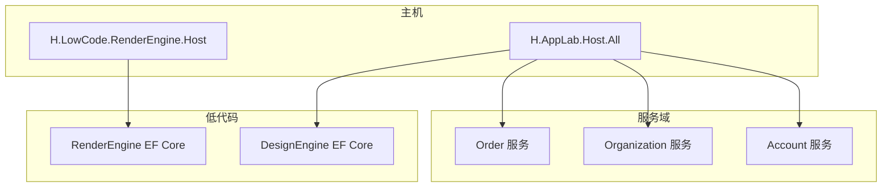
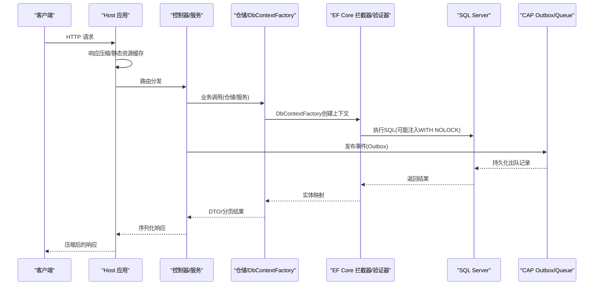
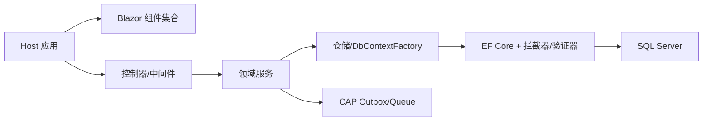

# 性能调优指南

<cite>
**本文引用的文件**   
- [Program.cs](file://src/Host/H.AppLab.Host.All/H.AppLab.Host.All/Program.cs)
- [appsettings.json](file://src/Host/H.AppLab.Host.All/H.AppLab.Host.All/appsettings.json)
- [Program.cs](file://src/Host/RenderEngine/H.LowCode.RenderEngine.Host/Program.cs)
- [OrderApplicationModule.cs](file://src/Services/Order/H.Order.Application/OrderApplicationModule.cs)
- [OrderEntityFrameworkCoreModule.cs](file://src/Services/Order/H.Order.EntityFrameworkCore/OrderEntityFrameworkCoreModule.cs)
- [OrganizationEntityFrameworkCoreModule.cs](file://src/Services/Organization/H.Organization.EntityFrameworkCore/OrganizationEntityFrameworkCoreModule.cs)
- [AccountEntityFrameworkCoreModule.cs](file://src/Services/Account/H.Account.EntityFrameworkCore/AccountEntityFrameworkCoreModule.cs)
- [QueryWithNoLockDbCommandInterceptor.cs](file://src/LowCode/RenderEngine/H.LowCode.RenderEngine.EntityFrameworkCore/Extensions/QueryWithNoLockDbCommandInterceptor.cs)
- [CustomizeRelationalModelValidator.cs](file://src/LowCode/RenderEngine/H.LowCode.RenderEngine.EntityFrameworkCore/Extensions/CustomizeRelationalModelValidator.cs)
- [FormDataRepository.cs](file://src/LowCode/RenderEngine/H.LowCode.RenderEngine.EntityFrameworkCore/DataRepositories/FormDataRepository.cs)
- [ExecutionAndBatchDtos.cs](file://src/Services/Testing/H.Testing.Application.Contracts/Dtos/ExecutionAndBatchDtos.cs)
- [execution-records.json](file://src/Services/Testing/data/catering/execution-records.json)
</cite>

## 目录
1. [简介](#简介)
2. [项目结构](#项目结构)
3. [核心组件](#核心组件)
4. [架构总览](#架构总览)
5. [详细组件分析](#详细组件分析)
6. [依赖关系分析](#依赖关系分析)
7. [性能考量与优化建议](#性能考量与优化建议)
8. [故障排查指南](#故障排查指南)
9. [结论](#结论)
10. [附录](#附录)

## 简介
本指南面向AppLab平台，聚焦ASP.NET Core应用的性能调优，涵盖内存管理、线程池、连接池、EF Core查询优化、索引设计、批量操作、缓存策略（分布式缓存、响应缓存、数据缓存）、数据库慢查询与执行计划优化、锁机制调优，以及负载测试与基准测试方法。文档结合仓库中现有实现（如响应压缩、SignalR配置、CAP消息总线、EF Core拦截器、DbContext工厂等）给出可落地的优化建议与最佳实践。

## 项目结构
- Host层：提供Web应用入口、中间件管线、静态资源与压缩、认证授权、Hangfire仪表盘等。
- Services层：按领域划分（订单、组织、账户、通知、审批等），每个服务包含Application、Contracts、EntityFrameworkCore、Web等模块。
- LowCode层：设计与渲染引擎，包含EF Core扩展、拦截器、仓储实现等。
- Tools层：各服务的迁移工具与初始化程序。

**图表来源** 
- [Program.cs:1-115](file://src/Host/H.AppLab.Host.All/H.AppLab.Host.All/Program.cs#L1-L115)
- [Program.cs:1-80](file://src/Host/RenderEngine/H.LowCode.RenderEngine.Host/Program.cs#L1-L80)

**章节来源**
- [Program.cs:1-115](file://src/Host/H.AppLab.Host.All/H.AppLab.Host.All/Program.cs#L1-L115)
- [Program.cs:1-80](file://src/Host/RenderEngine/H.LowCode.RenderEngine.Host/Program.cs#L1-L80)

## 核心组件
- ASP.NET Core管道与中间件：启用响应压缩、Brotli/Gzip、WASM静态资源缓存、HSTS、异常处理、状态码页面、路由、认证授权、反CSRF、Hangfire仪表盘等。
- SignalR：最大接收消息大小、开发环境详细错误输出。
- JSON序列化：驼峰命名策略。
- EF Core：多库连接字符串、SqlServer提供程序、默认仓储、模型验证器定制、命令拦截器（NOLOCK）。
- CAP消息总线：Outbox+InMemory队列（开发），失败重试次数与间隔。
- 仓储与DbContext工厂：按需创建DbContext，避免长生命周期导致的上下文污染。

**章节来源**
- [Program.cs:1-115](file://src/Host/H.AppLab.Host.All/H.AppLab.Host.All/Program.cs#L1-L115)
- [Program.cs:1-80](file://src/Host/RenderEngine/H.LowCode.RenderEngine.Host/Program.cs#L1-L80)
- [OrderApplicationModule.cs:1-49](file://src/Services/Order/H.Order.Application/OrderApplicationModule.cs#L1-L49)
- [OrderEntityFrameworkCoreModule.cs:1-31](file://src/Services/Order/H.Order.EntityFrameworkCore/OrderEntityFrameworkCoreModule.cs#L1-L31)
- [OrganizationEntityFrameworkCoreModule.cs:1-32](file://src/Services/Organization/H.Organization.EntityFrameworkCore/OrganizationEntityFrameworkCoreModule.cs#L1-L32)
- [AccountEntityFrameworkCoreModule.cs:1-40](file://src/Services/Account/H.Account.EntityFrameworkCore/AccountEntityFrameworkCoreModule.cs#L1-L40)
- [QueryWithNoLockDbCommandInterceptor.cs:1-36](file://src/LowCode/RenderEngine/H.LowCode.RenderEngine.EntityFrameworkCore/Extensions/QueryWithNoLockDbCommandInterceptor.cs#L1-L36)
- [CustomizeRelationalModelValidator.cs:1-33](file://src/LowCode/RenderEngine/H.LowCode.RenderEngine.EntityFrameworkCore/Extensions/CustomizeRelationalModelValidator.cs#L1-L33)
- [FormDataRepository.cs:1-42](file://src/LowCode/RenderEngine/H.LowCode.RenderEngine.EntityFrameworkCore/DataRepositories/FormDataRepository.cs#L1-L42)

## 架构总览
下图展示请求从Web入口到EF Core与数据库的调用链，以及关键性能相关点（压缩、缓存、拦截器、消息总线）。

**图表来源** 
- [Program.cs:1-115](file://src/Host/H.AppLab.Host.All/H.AppLab.Host.All/Program.cs#L1-L115)
- [Program.cs:1-80](file://src/Host/RenderEngine/H.LowCode.RenderEngine.Host/Program.cs#L1-L80)
- [OrderApplicationModule.cs:1-49](file://src/Services/Order/H.Order.Application/OrderApplicationModule.cs#L1-L49)
- [QueryWithNoLockDbCommandInterceptor.cs:1-36](file://src/LowCode/RenderEngine/H.LowCode.RenderEngine.EntityFrameworkCore/Extensions/QueryWithNoLockDbCommandInterceptor.cs#L1-L36)

## 详细组件分析

### ASP.NET Core 运行时与I/O优化
- 响应压缩：启用Brotli与Gzip，针对WASM与DLL类型进行压缩，提升传输效率。
- 静态资源缓存：对静态文件设置Cache-Control，配合MapStaticAssets实现指纹化资源的长效缓存。
- SignalR：限制最大接收消息大小，开发模式开启详细错误便于定位问题。
- JSON序列化：统一使用驼峰命名，减少序列化开销与前后端不一致风险。

优化建议
- 生产环境评估是否启用HTTP/2或HTTP/3以进一步提升并发与头部压缩效果。
- 根据CPU与带宽权衡Brotli级别，避免过度压缩导致CPU瓶颈。
- 合理设置静态资源缓存策略，确保更新时文件名变化触发浏览器重新拉取。

**章节来源**
- [Program.cs:1-115](file://src/Host/H.AppLab.Host.All/H.AppLab.Host.All/Program.cs#L1-L115)
- [Program.cs:1-80](file://src/Host/RenderEngine/H.LowCode.RenderEngine.Host/Program.cs#L1-L80)

### EF Core 查询与连接池优化
- 连接字符串：各服务通过AbpDbConnectionOptions配置独立连接串，支持多库隔离。
- 提供程序：统一使用SqlServer，迁移装配指向对应DbMigrator程序集。
- 命令拦截器：在ReaderExecuting阶段为FROM/JOIN表别名追加WITH (NOLOCK)，降低读锁竞争，提高吞吐。
- 模型验证器：自定义SqlServerModelValidator，允许表重复注册，适配动态场景。
- DbContext工厂：仓储通过IDbContextFactory按需创建DbContext，避免跨请求共享上下文带来的状态污染。

优化建议
- 谨慎使用NOLOCK，仅在纯读且可接受脏读的场景启用；写路径务必保持强一致性。
- 调整连接池参数（Min Pool Size、Max Pool Size、Connection Timeout、Command Timeout）以匹配工作负载。
- 使用AsNoTracking()进行只读查询，减少变更跟踪开销。
- 分页与投影：仅选择必要字段，避免Select(*)；使用Skip/Take控制页大小。
- 批量操作：优先使用批量插入/更新（如EF Core批量扩展或存储过程），减少往返与事务开销。

**章节来源**
- [OrderEntityFrameworkCoreModule.cs:1-31](file://src/Services/Order/H.Order.EntityFrameworkCore/OrderEntityFrameworkCoreModule.cs#L1-L31)
- [OrganizationEntityFrameworkCoreModule.cs:1-32](file://src/Services/Organization/H.Organization.EntityFrameworkCore/OrganizationEntityFrameworkCoreModule.cs#L1-L32)
- [AccountEntityFrameworkCoreModule.cs:1-40](file://src/Services/Account/H.Account.EntityFrameworkCore/AccountEntityFrameworkCoreModule.cs#L1-L40)
- [QueryWithNoLockDbCommandInterceptor.cs:1-36](file://src/LowCode/RenderEngine/H.LowCode.RenderEngine.EntityFrameworkCore/Extensions/QueryWithNoLockDbCommandInterceptor.cs#L1-L36)
- [CustomizeRelationalModelValidator.cs:1-33](file://src/LowCode/RenderEngine/H.LowCode.RenderEngine.EntityFrameworkCore/Extensions/CustomizeRelationalModelValidator.cs#L1-L33)
- [FormDataRepository.cs:1-42](file://src/LowCode/RenderEngine/H.LowCode.RenderEngine.EntityFrameworkCore/DataRepositories/FormDataRepository.cs#L1-L42)

### 异步与消息总线（CAP）
- CAP Outbox：将事件写入数据库作为Outbox，保证最终一致性与幂等性。
- InMemory队列：开发环境无需外部MQ，生产可替换为RabbitMQ/Kafka。
- 失败重试：配置重试次数与间隔，增强可靠性。

优化建议
- 消费者侧采用批处理与限流，避免雪崩。
- 监控Outbox积压与消费延迟，设置告警阈值。
- 事件幂等键设计，防止重复处理。

**章节来源**
- [OrderApplicationModule.cs:1-49](file://src/Services/Order/H.Order.Application/OrderApplicationModule.cs#L1-L49)

### 缓存策略
- 响应缓存：利用静态资源指纹化与Cache-Control实现浏览器级缓存。
- 分布式缓存：建议在热点数据（字典、配置、元数据）引入Redis缓存，结合版本号或哈希失效。
- 数据缓存：在服务内使用IMemoryCache缓存短生命周期、非敏感数据，注意过期策略与内存上限。

优化建议
- 区分读写热点，读多写少场景优先考虑缓存。
- 缓存穿透保护（布隆过滤器）、击穿保护（互斥锁）、雪崩保护（随机过期时间）。
- 缓存预热与灰度发布结合，避免冷启动抖动。

**章节来源**
- [Program.cs:1-115](file://src/Host/H.AppLab.Host.All/H.AppLab.Host.All/Program.cs#L1-L115)
- [Program.cs:1-80](file://src/Host/RenderEngine/H.LowCode.RenderEngine.Host/Program.cs#L1-L80)

### 数据库性能调优
- 索引设计：基于高频查询条件与排序字段建立合适索引，覆盖常用查询；避免过多索引影响写性能。
- 慢查询分析：启用SQL Server Profiler/Extended Events，收集慢查询与执行计划，关注Table Scan、Key Lookup、高CPU/IO。
- 执行计划优化：统计信息更新、索引重建/重组、查询重写（避免函数列、隐式转换）。
- 锁机制调优：合理使用NOLOCK（读）、行版本控制（快照隔离）、最小化事务范围、避免大事务。

优化建议
- 定期维护索引碎片，重建或重组。
- 使用分区表与归档策略处理历史数据。
- 读写分离与只读副本分担压力。

**章节来源**
- [QueryWithNoLockDbCommandInterceptor.cs:1-36](file://src/LowCode/RenderEngine/H.LowCode.RenderEngine.EntityFrameworkCore/Extensions/QueryWithNoLockDbCommandInterceptor.cs#L1-L36)

### 负载测试与基准测试
- 工具与方法：使用JMeter/k6/Locust模拟并发用户，定义场景（登录、列表查询、批量提交）。
- 指标采集：TPS、P95/P99延迟、错误率、CPU/内存、GC、线程池、连接池、数据库等待事件。
- 压测流程：基线测试→单点瓶颈定位→容量规划→回归验证。

仓库内已有测试数据结构（执行记录、批次结果），可用于构建自动化用例与结果分析。

**章节来源**
- [ExecutionAndBatchDtos.cs:1-96](file://src/Services/Testing/H.Testing.Application.Contracts/Dtos/ExecutionAndBatchDtos.cs#L1-L96)
- [execution-records.json:119-1311](file://src/Services/Testing/data/catering/execution-records.json#L119-L1311)

## 依赖关系分析
- Host聚合多个Web模块，通过AddAdditionalAssemblies加载Blazor组件。
- 各服务通过AbpModule解耦，EF Core模块负责DbContext与连接串配置。
- CAP依赖SqlServer与消息队列（InMemory/RabbitMQ/Kafka）。
- EF Core扩展（拦截器、验证器）位于LowCode子模块，被渲染引擎使用。

**图表来源** 
- [Program.cs:1-115](file://src/Host/H.AppLab.Host.All/H.AppLab.Host.All/Program.cs#L1-L115)
- [OrderApplicationModule.cs:1-49](file://src/Services/Order/H.Order.Application/OrderApplicationModule.cs#L1-L49)
- [QueryWithNoLockDbCommandInterceptor.cs:1-36](file://src/LowCode/RenderEngine/H.LowCode.RenderEngine.EntityFrameworkCore/Extensions/QueryWithNoLockDbCommandInterceptor.cs#L1-L36)

**章节来源**
- [Program.cs:1-115](file://src/Host/H.AppLab.Host.All/H.AppLab.Host.All/Program.cs#L1-L115)
- [OrderApplicationModule.cs:1-49](file://src/Services/Order/H.Order.Application/OrderApplicationModule.cs#L1-L49)

## 性能考量与优化建议
- 内存管理
  - 启用Server GC（服务器模式）以提升吞吐；合理设置LOH阈值与GC模式。
  - 避免长时间持有大对象引用，及时释放临时对象；使用ArrayPool/BufferPool。
  - 监控GC次数与停顿时间，必要时调整Gen2阈值。
- 线程池
  - 调整最小线程数与任务并行度，避免饥饿；监控线程池队列长度与超时。
  - I/O密集场景使用async/await，避免阻塞线程；CPU密集任务考虑专用线程池。
- 连接池
  - 根据并发与数据库能力设置Min/Max Pool Size、Timeout；避免连接泄漏。
  - 使用连接池监控（SQL Server DMV）观察等待与瓶颈。
- EF Core
  - 只读查询使用AsNoTracking；分页与投影；避免N+1查询。
  - 批量操作优先；事务边界最小化。
- 缓存
  - 分层缓存：浏览器→CDN→反向代理→服务端内存→分布式缓存。
  - 缓存一致性：版本号/哈希失效；写后失效或延迟双删。
- 数据库
  - 索引与统计信息维护；执行计划分析与改写。
  - 锁与隔离级别选择；读写分离与分库分表。

[本节为通用指导，不直接分析具体文件]

## 故障排查指南
- 常见问题
  - WASM加载失败：检查静态资源缓存策略，避免误用immutable导致清单过期。
  - 响应过大：确认压缩是否生效，检查MIME类型与Provider配置。
  - 数据库慢查询：查看执行计划与等待事件，定位索引缺失或扫描。
  - 消息积压：监控CAP Outbox与队列，检查消费者处理能力。
- 诊断手段
  - 启用Serilog异步日志，集中收集与滚动。
  - 使用Hangfire Dashboard监控后台任务。
  - 使用APM工具（Application Insights/Seq）追踪请求链路。

**章节来源**
- [Program.cs:1-115](file://src/Host/H.AppLab.Host.All/H.AppLab.Host.All/Program.cs#L1-L115)
- [Program.cs:1-80](file://src/Host/RenderEngine/H.LowCode.RenderEngine.Host/Program.cs#L1-L80)

## 结论
通过对ASP.NET Core运行时、EF Core、CAP与缓存策略的系统性优化，结合数据库索引与执行计划调优，以及完善的负载测试与监控体系，AppLab平台可在高并发与大数据量场景下保持稳定与高性能。建议持续度量与迭代，围绕真实业务负载进行容量规划与瓶颈治理。

[本节为总结性内容，不直接分析具体文件]

## 附录
- 关键配置文件位置
  - Host应用配置：appsettings.json（连接串、远程服务、站点等）
  - 各服务EF Core模块：用于连接串与提供程序配置
- 参考实现
  - 响应压缩与静态资源缓存：Host Program
  - CAP Outbox与队列：OrderApplicationModule
  - EF Core拦截器与验证器：RenderEngine EF Core Extensions
  - 仓储与DbContext工厂：RenderEngine FormDataRepository

**章节来源**
- [appsettings.json:1-115](file://src/Host/H.AppLab.Host.All/H.AppLab.Host.All/appsettings.json#L1-L115)
- [OrderApplicationModule.cs:1-49](file://src/Services/Order/H.Order.Application/OrderApplicationModule.cs#L1-L49)
- [QueryWithNoLockDbCommandInterceptor.cs:1-36](file://src/LowCode/RenderEngine/H.LowCode.RenderEngine.EntityFrameworkCore/Extensions/QueryWithNoLockDbCommandInterceptor.cs#L1-L36)
- [CustomizeRelationalModelValidator.cs:1-33](file://src/LowCode/RenderEngine/H.LowCode.RenderEngine.EntityFrameworkCore/Extensions/CustomizeRelationalModelValidator.cs#L1-L33)
- [FormDataRepository.cs:1-42](file://src/LowCode/RenderEngine/H.LowCode.RenderEngine.EntityFrameworkCore/DataRepositories/FormDataRepository.cs#L1-L42)