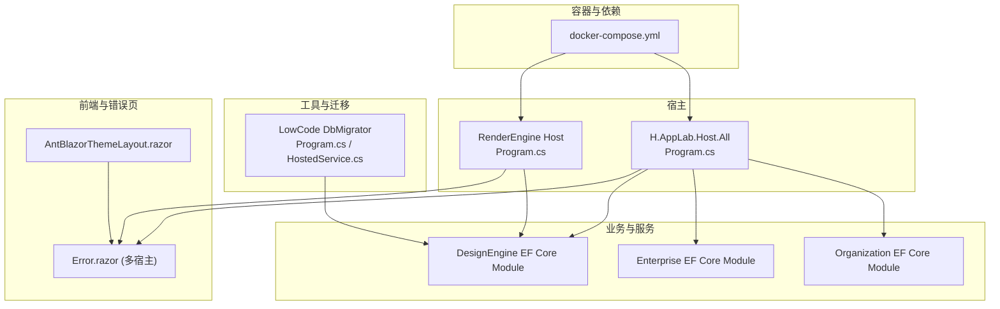
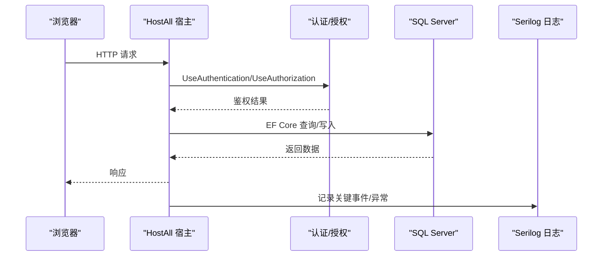
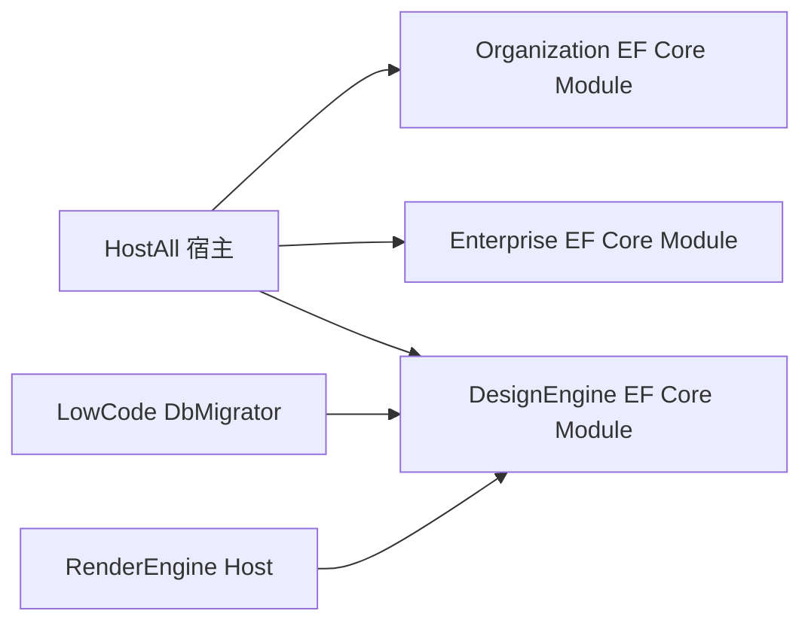

# 故障排查手册

<cite>
**本文引用的文件**   
- [README.md](file://README.md)
- [docker-compose.yml](file://cd/docker-compose.yml)
- [HostAll Program.cs](file://src/Host/H.AppLab.Host.All/H.AppLab.Host.All/Program.cs)
- [HostAll appsettings.json](file://src/Host/H.AppLab.Host.All/H.AppLab.Host.All/appsettings.json)
- [RenderEngine Host Program.cs](file://src/Host/RenderEngine/H.LowCode.RenderEngine.Host/Program.cs)
- [RenderEngine Host appsettings.json](file://src/Host/RenderEngine/H.LowCode.RenderEngine.Host/appsettings.json)
- [RenderEngine Client appsettings.json](file://src/Host/RenderEngine/H.LowCode.RenderEngine.Host.Client/wwwroot/appsettings.json)
- [LowCode DbMigrator Program.cs](file://src/Tools/H.LowCode.DbMigrator/Program.cs)
- [LowCode DbMigrator Serilog 配置](file://src/Tools/H.LowCode.DbMigrator/appsettings.serilog.json)
- [LowCode DbMigrator HostedService.cs](file://src/Tools/H.LowCode.DbMigrator/HostedService.cs)
- [Organization EF Core Module](file://src/services/Organization/H.Organization.EntityFrameworkCore/OrganizationEntityFrameworkCoreModule.cs)
- [Enterprise EF Core Module](file://src/System/Enterprise/H.Enterprise.EntityFrameworkCore/EnterpriseEntityFrameworkCoreModule.cs)
- [DesignEngine EF Core Module](file://src/LowCode/DesignEngine/H.LowCode.DesignEngine.EntityFrameworkCore/DesignEngineEntityFrameworkCoreModule.cs)
- [Error.razor (HostAll)](file://src/Host/H.AppLab.Host.All/H.AppLab.Host.All/Components/Pages/Error.razor)
- [Error.razor (Account)](file://src/Host/Account/H.Account.Host/Components/Pages/Error.razor)
- [Error.razor (RenderEngine)](file://src/Host/RenderEngine/H.LowCode.RenderEngine.Host/Components/Pages/Error.razor)
- [AntBlazorThemeLayout.razor](file://src/LowCode/RenderEngine/H.LowCode.RenderEngine/Layout/AntBlazorThemeLayout.razor)
</cite>

## 目录
1. [简介](#简介)
2. [项目结构](#项目结构)
3. [核心组件](#核心组件)
4. [架构总览](#架构总览)
5. [详细组件分析](#详细组件分析)
6. [依赖关系分析](#依赖关系分析)
7. [性能注意事项](#性能注意事项)
8. [故障排查指南](#故障排查指南)
9. [结论](#结论)
10. [附录](#附录)

## 简介
本手册面向 AppLab 平台的运维与开发人员，聚焦于常见问题的诊断方法与解决步骤，涵盖启动失败、连接超时、内存泄漏、死锁等典型场景；同时提供日志分析与调试工具使用指南（Serilog、dotnet CLI、Hangfire 仪表盘等），并给出容器环境下的排障技巧（容器日志、网络连通性、资源监控）。此外，还包含数据库连接问题、消息队列异常、第三方服务集成故障的排查方法，以及性能瓶颈定位与内存分析的工具使用建议。

## 项目结构
AppLab 采用模块化架构，支持单体部署与按服务独立部署。宿主程序负责服务注册与中间件管线搭建，业务模块按限界上下文划分，低代码引擎分为设计端与渲染端，工具集包含各服务的迁移程序。

**图表来源** 
- [HostAll Program.cs:1-115](file://src/Host/H.AppLab.Host.All/H.AppLab.Host.All/Program.cs#L1-L115)
- [RenderEngine Host Program.cs:44-79](file://src/Host/RenderEngine/H.LowCode.RenderEngine.Host/Program.cs#L44-L79)
- [Organization EF Core Module:1-32](file://src/services/Organization/H.Organization.EntityFrameworkCore/OrganizationEntityFrameworkCoreModule.cs#L1-L32)
- [Enterprise EF Core Module:1-29](file://src/System/Enterprise/H.Enterprise.EntityFrameworkCore/EnterpriseEntityFrameworkCoreModule.cs#L1-L29)
- [DesignEngine EF Core Module:1-26](file://src/LowCode/DesignEngine/H.LowCode.DesignEngine.EntityFrameworkCore/DesignEngineEntityFrameworkCoreModule.cs#L1-L26)
- [LowCode DbMigrator Program.cs:1-40](file://src/Tools/H.LowCode.DbMigrator/Program.cs#L1-L40)
- [LowCode DbMigrator HostedService.cs:1-49](file://src/Tools/H.LowCode.DbMigrator/HostedService.cs#L1-L49)
- [Error.razor (HostAll):1-36](file://src/Host/H.AppLab.Host.All/H.AppLab.Host.All/Components/Pages/Error.razor#L1-L36)
- [AntBlazorThemeLayout.razor:9-60](file://src/LowCode/RenderEngine/H.LowCode.RenderEngine/Layout/AntBlazorThemeLayout.razor#L9-L60)
- [docker-compose.yml:1-32](file://cd/docker-compose.yml#L1-L32)

**章节来源**
- [README.md:1-74](file://README.md#L1-L74)

## 核心组件
- 宿主程序：统一注册 Blazor、SignalR、响应压缩、认证授权、路由与控制器映射，并提供 Hangfire 仪表盘。
- 数据访问：各 EF Core Module 通过 Abp 模块注入 DbContext，读取连接字符串并启用 SQL Server。
- 迁移工具：DbMigrator 控制台应用基于 Serilog 输出日志，执行迁移后自动退出。
- 错误处理：各宿主提供 Error.razor 页面，开发环境显示详细错误信息，生产环境启用异常处理器与 HSTS。
- 前端主题：AntBlazor 主题布局组件封装菜单与错误边界，便于统一 UI 与错误恢复。

**章节来源**
- [HostAll Program.cs:1-115](file://src/Host/H.AppLab.Host.All/H.AppLab.Host.All/Program.cs#L1-L115)
- [Organization EF Core Module:1-32](file://src/services/Organization/H.Organization.EntityFrameworkCore/OrganizationEntityFrameworkCoreModule.cs#L1-L32)
- [Enterprise EF Core Module:1-29](file://src/System/Enterprise/H.Enterprise.EntityFrameworkCore/EnterpriseEntityFrameworkCoreModule.cs#L1-L29)
- [DesignEngine EF Core Module:1-26](file://src/LowCode/DesignEngine/H.LowCode.DesignEngine.EntityFrameworkCore/DesignEngineEntityFrameworkCoreModule.cs#L1-L26)
- [LowCode DbMigrator Program.cs:1-40](file://src/Tools/H.LowCode.DbMigrator/Program.cs#L1-L40)
- [LowCode DbMigrator HostedService.cs:1-49](file://src/Tools/H.LowCode.DbMigrator/HostedService.cs#L1-L49)
- [Error.razor (HostAll):1-36](file://src/Host/H.AppLab.Host.All/H.AppLab.Host.All/Components/Pages/Error.razor#L1-L36)
- [AntBlazorThemeLayout.razor:9-60](file://src/LowCode/RenderEngine/H.LowCode.RenderEngine/Layout/AntBlazorThemeLayout.razor#L9-L60)

## 架构总览
下图展示请求从浏览器到宿主、再到 EF Core 与数据库的典型路径，以及错误处理与日志落盘的关键节点。

**图表来源** 
- [HostAll Program.cs:57-115](file://src/Host/H.AppLab.Host.All/H.AppLab.Host.All/Program.cs#L57-L115)
- [Organization EF Core Module:12-31](file://src/services/Organization/H.Organization.EntityFrameworkCore/OrganizationEntityFrameworkCoreModule.cs#L12-L31)
- [LowCode DbMigrator Serilog 配置:1-41](file://src/Tools/H.LowCode.DbMigrator/appsettings.serilog.json#L1-L41)

## 详细组件分析

### 启动失败排查
- 现象：应用无法启动或卡在加载阶段。
- 关键点：
  - 检查 HostAll 与 RenderEngine 的 Program 中中间件顺序与配置（异常处理、HSTS、静态资源、路由、认证授权）。
  - 确认 appsettings.json 中的连接字符串与 RemoteServices 地址是否正确。
  - 若为 WASM 模式，确保 MapStaticAssets 未被误改导致清单缓存失效。
- 操作步骤：
  - 在开发环境启用 WebAssembly 调试与详细错误。
  - 查看 Error.razor 页面显示的 RequestId 与异常详情。
  - 核对 docker-compose 中 Redis/RabbitMQ 端口与环境变量。

**章节来源**
- [HostAll Program.cs:57-115](file://src/Host/H.AppLab.Host.All/H.AppLab.Host.All/Program.cs#L57-L115)
- [RenderEngine Host Program.cs:44-79](file://src/Host/RenderEngine/H.LowCode.RenderEngine.Host/Program.cs#L44-L79)
- [HostAll appsettings.json:1-115](file://src/Host/H.AppLab.Host.All/H.AppLab.Host.All/appsettings.json#L1-L115)
- [Error.razor (HostAll):1-36](file://src/Host/H.AppLab.Host.All/H.AppLab.Host.All/Components/Pages/Error.razor#L1-L36)
- [docker-compose.yml:1-32](file://cd/docker-compose.yml#L1-L32)

### 连接超时排查
- 现象：HTTP 调用或数据库连接超时。
- 关键点：
  - RemoteServices BaseUrl 是否指向正确的服务地址。
  - SignalR 最大接收消息大小与详细错误开关。
  - 数据库连接字符串与服务器可达性。
- 操作步骤：
  - 检查 RenderEngine Client 的 appsettings.json 中 RemoteServices 设置。
  - 在 HostAll 中确认 SignalR 配置与 JSON 序列化策略。
  - 使用 ping/端口探测验证依赖服务可用性。

**章节来源**
- [RenderEngine Client appsettings.json:1-40](file://src/Host/RenderEngine/H.LowCode.RenderEngine.Host.Client/wwwroot/appsettings.json#L1-L40)
- [HostAll Program.cs:14-25](file://src/Host/H.AppLab.Host.All/H.AppLab.Host.All/Program.cs#L14-L25)
- [HostAll appsettings.json:22-68](file://src/Host/H.AppLab.Host.All/H.AppLab.Host.All/appsettings.json#L22-L68)

### 内存泄漏排查
- 现象：进程内存持续增长，GC 回收效果不佳。
- 关键点：
  - 长生命周期对象持有短生命周期引用。
  - 事件订阅未取消、定时器未释放。
  - 大量静态集合或全局缓存未清理。
- 操作步骤：
  - 使用 dotnet dump 生成转储文件，配合 dotnet-gc 与 Visual Studio 分析。
  - 关注 Blazor 组件状态持久化与 ErrorBoundary 恢复逻辑。
  - 检查 AntBlazor 主题布局中的菜单与状态管理。

**章节来源**
- [AntBlazorThemeLayout.razor:22-40](file://src/LowCode/RenderEngine/H.LowCode.RenderEngine/Layout/AntBlazorThemeLayout.razor#L22-L40)

### 死锁排查
- 现象：线程阻塞，请求长时间无响应。
- 关键点：
  - 数据库事务跨多个资源锁定。
  - 同步阻塞调用异步方法（ConfigureAwait(false）缺失）。
  - 信号量或互斥锁使用不当。
- 操作步骤：
  - 启用 EF Core 详细日志，观察慢查询与锁等待。
  - 使用 dotnet-counters 监控线程与锁竞争。
  - 审查中间件与业务层同步调用点。

**章节来源**
- [Organization EF Core Module:12-31](file://src/services/Organization/H.Organization.EntityFrameworkCore/OrganizationEntityFrameworkCoreModule.cs#L12-L31)

### 日志分析与调试工具
- Serilog：集中式日志输出，支持文件滚动与控制台输出。
- dotnet CLI：用于运行迁移、生成转储、性能计数器等。
- Hangfire 仪表盘：后台任务可视化与重试机制。
- 错误页：Error.razor 提供 RequestId 与开发环境详细堆栈。

**章节来源**
- [LowCode DbMigrator Serilog 配置:1-41](file://src/Tools/H.LowCode.DbMigrator/appsettings.serilog.json#L1-L41)
- [LowCode DbMigrator Program.cs:28-39](file://src/Tools/H.LowCode.DbMigrator/Program.cs#L28-L39)
- [HostAll Program.cs:90-91](file://src/Host/H.AppLab.Host.All/H.AppLab.Host.All/Program.cs#L90-L91)
- [Error.razor (HostAll):9-25](file://src/Host/H.AppLab.Host.All/H.AppLab.Host.All/Components/Pages/Error.razor#L9-L25)

### 容器环境故障排查
- 容器日志：docker logs 查看 Redis/RabbitMQ 启动与错误。
- 网络连通性：docker exec 进入容器测试端口与 DNS。
- 资源监控：docker stats 观察 CPU/内存/IO 使用。
- 环境变量：检查密码、时区、语言等配置。

**章节来源**
- [docker-compose.yml:1-32](file://cd/docker-compose.yml#L1-L32)

### 数据库连接问题
- 现象：EF Core 无法连接或迁移失败。
- 关键点：
  - ConnectionStrings 名称与值正确。
  - SQL Server 实例可达且权限足够。
  - 迁移程序 StartupProject 指向正确。
- 操作步骤：
  - 核对各 EF Core Module 的连接字符串读取方式。
  - 使用 DbMigrator 单独执行迁移并查看日志。

**章节来源**
- [HostAll appsettings.json:3-17](file://src/Host/H.AppLab.Host.All/H.AppLab.Host.All/appsettings.json#L3-L17)
- [Organization EF Core Module:12-31](file://src/services/Organization/H.Organization.EntityFrameworkCore/OrganizationEntityFrameworkCoreModule.cs#L12-L31)
- [Enterprise EF Core Module:11-20](file://src/System/Enterprise/H.Enterprise.EntityFrameworkCore/EnterpriseEntityFrameworkCoreModule.cs#L11-L20)
- [DesignEngine EF Core Module:20-25](file://src/LowCode/DesignEngine/H.LowCode.DesignEngine.EntityFrameworkCore/DesignEngineEntityFrameworkCoreModule.cs#L20-L25)
- [LowCode DbMigrator HostedService.cs:23-43](file://src/Tools/H.LowCode.DbMigrator/HostedService.cs#L23-L43)

### 消息队列异常
- 现象：RabbitMQ 连接失败或消息丢失。
- 关键点：
  - 端口映射与默认用户密码配置。
  - 客户端连接字符串与虚拟主机设置。
- 操作步骤：
  - 检查 docker-compose 中 RabbitMQ 的环境变量与端口。
  - 使用 Management 界面查看队列与消费者状态。

**章节来源**
- [docker-compose.yml:17-32](file://cd/docker-compose.yml#L17-L32)

### 第三方服务集成故障
- 现象：外部 API 调用失败或鉴权错误。
- 关键点：
  - ExternalLogin 配置（微信/钉钉）是否启用与参数正确。
  - YunXiao 组织 ID、令牌与 Endpoint。
- 操作步骤：
  - 核对 appsettings.json 中相关节点。
  - 使用日志与错误页 RequestId 追踪调用链。

**章节来源**
- [HostAll appsettings.json:95-113](file://src/Host/H.AppLab.Host.All/H.AppLab.Host.All/appsettings.json#L95-L113)

## 依赖关系分析
下图展示宿主与各 EF Core 模块及迁移工具的依赖关系。

**图表来源** 
- [HostAll Program.cs:48-51](file://src/Host/H.AppLab.Host.All/H.AppLab.Host.All/Program.cs#L48-L51)
- [Organization EF Core Module:12-31](file://src/services/Organization/H.Organization.EntityFrameworkCore/OrganizationEntityFrameworkCoreModule.cs#L12-L31)
- [Enterprise EF Core Module:11-20](file://src/System/Enterprise/H.Enterprise.EntityFrameworkCore/EnterpriseEntityFrameworkCoreModule.cs#L11-L20)
- [DesignEngine EF Core Module:20-25](file://src/LowCode/DesignEngine/H.LowCode.DesignEngine.EntityFrameworkCore/DesignEngineEntityFrameworkCoreModule.cs#L20-L25)
- [LowCode DbMigrator Program.cs:23-26](file://src/Tools/H.LowCode.DbMigrator/Program.cs#L23-L26)

**章节来源**
- [HostAll Program.cs:48-51](file://src/Host/H.AppLab.Host.All/H.AppLab.Host.All/Program.cs#L48-L51)

## 性能注意事项
- 响应压缩：启用 Brotli/Gzip 压缩 WASM 资源，减少传输体积。
- 静态资源缓存：MapStaticAssets 自动处理指纹化与重新校验，避免手动覆盖导致静默 404。
- SignalR 配置：调整最大接收消息大小与详细错误开关以平衡性能与可观测性。
- 日志级别：在生产环境降低系统日志级别，聚焦关键信息与异常。

**章节来源**
- [HostAll Program.cs:27-46](file://src/Host/H.AppLab.Host.All/H.AppLab.Host.All/Program.cs#L27-L46)
- [HostAll Program.cs:73-79](file://src/Host/H.AppLab.Host.All/H.AppLab.Host.All/Program.cs#L73-L79)
- [HostAll Program.cs:14-19](file://src/Host/H.AppLab.Host.All/H.AppLab.Host.All/Program.cs#L14-L19)
- [HostAll appsettings.json:87-94](file://src/Host/H.AppLab.Host.All/H.AppLab.Host.All/appsettings.json#L87-L94)

## 故障排查指南

### 启动失败
- 检查中间件顺序与配置（异常处理、HSTS、静态资源、路由、认证授权）。
- 确认连接字符串与 RemoteServices 地址。
- 查看 Error.razor 页面与 Serilog 日志。

**章节来源**
- [HostAll Program.cs:57-115](file://src/Host/H.AppLab.Host.All/H.AppLab.Host.All/Program.cs#L57-L115)
- [RenderEngine Host Program.cs:44-79](file://src/Host/RenderEngine/H.LowCode.RenderEngine.Host/Program.cs#L44-L79)
- [HostAll appsettings.json:1-115](file://src/Host/H.AppLab.Host.All/H.AppLab.Host.All/appsettings.json#L1-L115)
- [Error.razor (HostAll):1-36](file://src/Host/H.AppLab.Host.All/H.AppLab.Host.All/Components/Pages/Error.razor#L1-L36)

### 连接超时
- 核对 RemoteServices BaseUrl 与 SignalR 配置。
- 验证依赖服务端口与防火墙规则。
- 使用 dotnet CLI 与浏览器开发者工具定位网络问题。

**章节来源**
- [RenderEngine Client appsettings.json:9-13](file://src/Host/RenderEngine/H.LowCode.RenderEngine.Host.Client/wwwroot/appsettings.json#L9-L13)
- [HostAll Program.cs:14-25](file://src/Host/H.AppLab.Host.All/H.AppLab.Host.All/Program.cs#L14-L25)

### 内存泄漏
- 使用 dotnet dump 与 Visual Studio 分析对象生命周期。
- 检查组件状态持久化与错误边界恢复逻辑。
- 避免长生命周期对象持有短生命周期引用。

**章节来源**
- [AntBlazorThemeLayout.razor:22-40](file://src/LowCode/RenderEngine/H.LowCode.RenderEngine/Layout/AntBlazorThemeLayout.razor#L22-L40)

### 死锁
- 启用 EF Core 详细日志，观察慢查询与锁等待。
- 使用 dotnet-counters 监控线程与锁竞争。
- 审查同步阻塞调用与异步最佳实践。

**章节来源**
- [Organization EF Core Module:12-31](file://src/services/Organization/H.Organization.EntityFrameworkCore/OrganizationEntityFrameworkCoreModule.cs#L12-L31)

### 日志分析与调试
- 配置 Serilog 输出至文件与控制台，设置滚动策略。
- 使用 dotnet CLI 运行迁移与生成转储。
- 启用 Hangfire 仪表盘监控后台任务。

**章节来源**
- [LowCode DbMigrator Serilog 配置:1-41](file://src/Tools/H.LowCode.DbMigrator/appsettings.serilog.json#L1-L41)
- [LowCode DbMigrator Program.cs:28-39](file://src/Tools/H.LowCode.DbMigrator/Program.cs#L28-L39)
- [HostAll Program.cs:90-91](file://src/Host/H.AppLab.Host.All/H.AppLab.Host.All/Program.cs#L90-L91)

### 容器环境
- 使用 docker logs 查看依赖服务日志。
- 通过 docker exec 进行网络连通性测试。
- 使用 docker stats 监控资源使用。

**章节来源**
- [docker-compose.yml:1-32](file://cd/docker-compose.yml#L1-L32)

### 数据库连接
- 核对 ConnectionStrings 名称与值。
- 使用 DbMigrator 单独执行迁移并查看日志。
- 检查 SQL Server 实例可达性与权限。

**章节来源**
- [HostAll appsettings.json:3-17](file://src/Host/H.AppLab.Host.All/H.AppLab.Host.All/appsettings.json#L3-L17)
- [Organization EF Core Module:12-31](file://src/services/Organization/H.Organization.EntityFrameworkCore/OrganizationEntityFrameworkCoreModule.cs#L12-L31)
- [Enterprise EF Core Module:11-20](file://src/System/Enterprise/H.Enterprise.EntityFrameworkCore/EnterpriseEntityFrameworkCoreModule.cs#L11-L20)
- [DesignEngine EF Core Module:20-25](file://src/LowCode/DesignEngine/H.LowCode.DesignEngine.EntityFrameworkCore/DesignEngineEntityFrameworkCoreModule.cs#L20-L25)
- [LowCode DbMigrator HostedService.cs:23-43](file://src/Tools/H.LowCode.DbMigrator/HostedService.cs#L23-L43)

### 消息队列
- 检查 RabbitMQ 环境变量与端口映射。
- 使用 Management 界面查看队列与消费者状态。
- 验证客户端连接字符串与虚拟主机设置。

**章节来源**
- [docker-compose.yml:17-32](file://cd/docker-compose.yml#L17-L32)

### 第三方服务集成
- 核对 ExternalLogin 与 YunXiao 配置。
- 使用日志与错误页 RequestId 追踪调用链。
- 验证签名与证书配置。

**章节来源**
- [HostAll appsettings.json:95-113](file://src/Host/H.AppLab.Host.All/H.AppLab.Host.All/appsettings.json#L95-L113)

## 结论
本手册系统化梳理了 AppLab 平台在启动、连接、内存、死锁、日志、容器、数据库、消息队列与第三方集成等方面的故障排查方法。通过结合代码级配置与工具链（Serilog、dotnet CLI、Hangfire），可有效定位与解决问题，提升系统稳定性与可维护性。

## 附录
- 常用命令：
  - 运行迁移：dotnet run --project src/Tools/H.Xxx.DbMigrator
  - 生成转储：dotnet-dump collect -p <pid>
  - 监控计数器：dotnet-counters monitor
- 参考文档：
  - README.md 中的本地开发与启动说明
  - docker-compose.yml 中的依赖服务配置

**章节来源**
- [README.md:38-55](file://README.md#L38-L55)
- [docker-compose.yml:1-32](file://cd/docker-compose.yml#L1-L32)