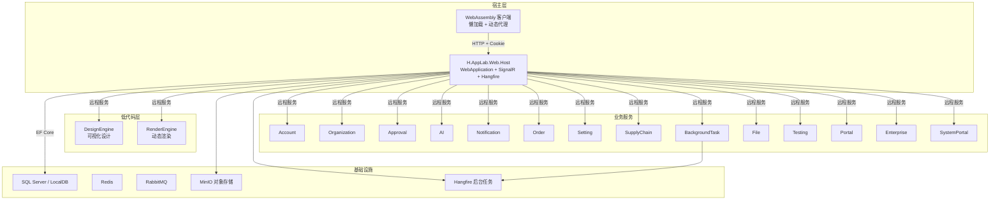
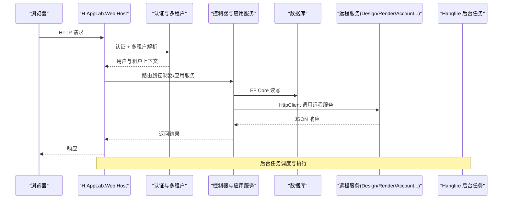
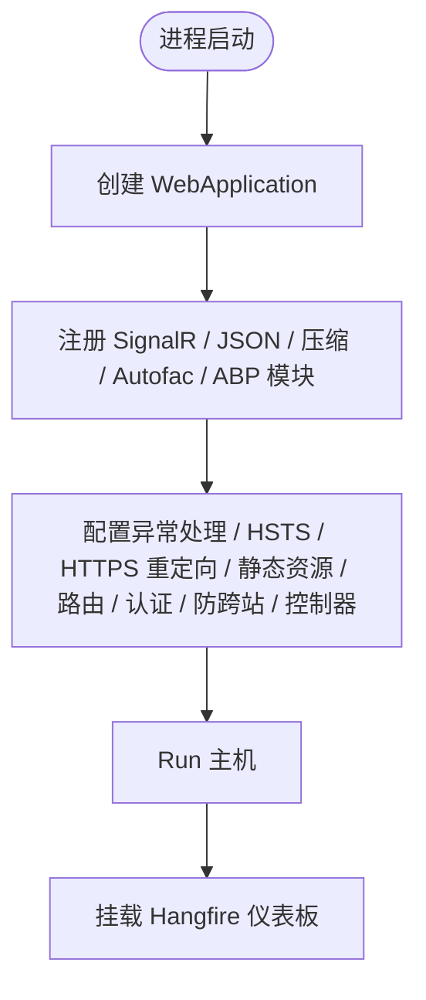
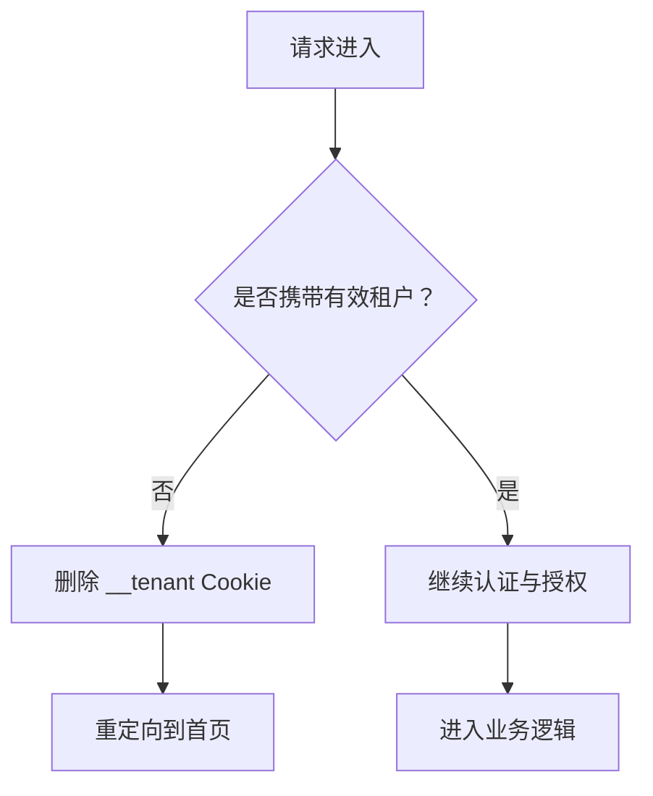
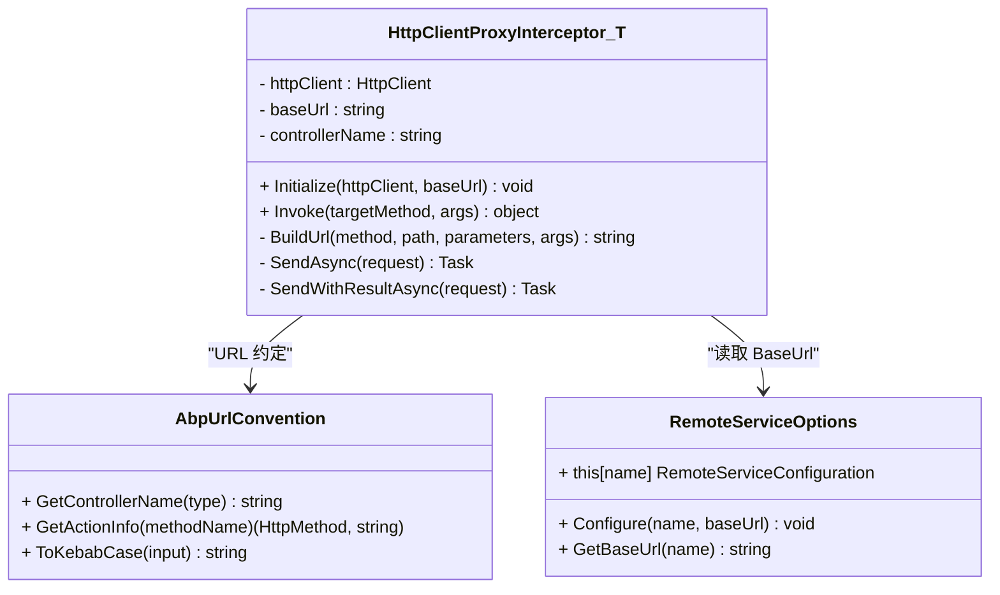
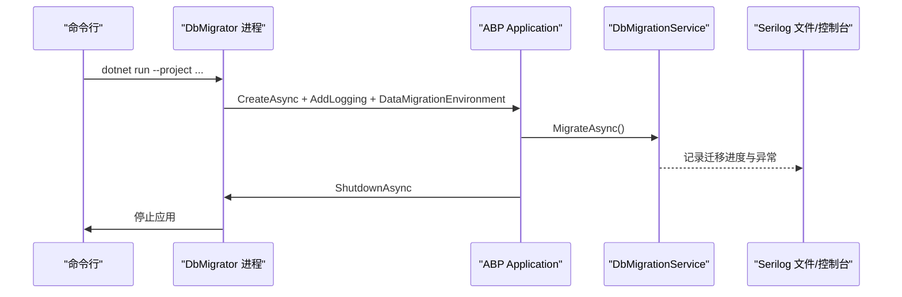
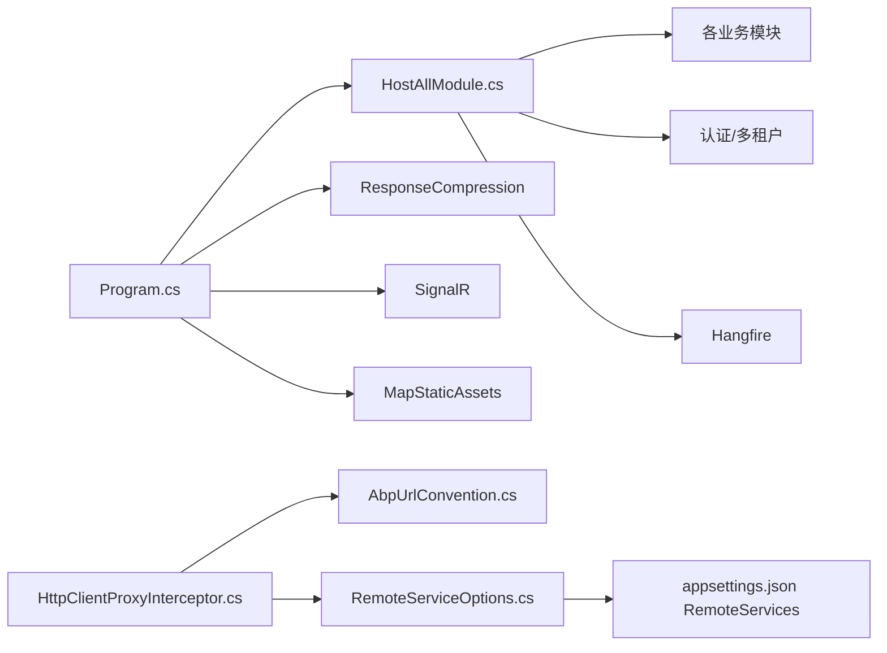

# 故障排查指南

<cite>
**本文引用的文件**   
- [README.md](file://README.md)
- [docker-compose.yml](file://cd/cd\docker-compose.yml)
- [Program.cs](file://src/Host/H.AppLab.Web.Host/H.AppLab.Web.Host/Program.cs)
- [appsettings.json](file://src/Host/H.AppLab.Web.Host/H.AppLab.Web.Host/appsettings.json)
- [HostAllModule.cs](file://src/Host/H.AppLab.Web.Host/H.AppLab.Web.Host/HostAllModule.cs)
- [HttpClientProxyInterceptor.cs](file://src/Utils/H.Abp.HttpClientProxy/HttpClientProxyInterceptor.cs)
- [AbpUrlConvention.cs](file://src/Utils/H.Abp.HttpClientProxy/AbpUrlConvention.cs)
- [RemoteServiceOptions.cs](file://src/Utils/H.Abp.HttpClientProxy/RemoteServiceOptions.cs)
- [H.LowCode.DbMigrator appsettings.serilog.json](file://src/Tools/H.LowCode.DbMigrator/appsettings.serilog.json)
- [HostedService.cs](file://src/Tools/H.LowCode.DbMigrator/HostedService.cs)
- [H.Account.DbMigrator appsettings.json](file://src/Tools/H.Account.DbMigrator/appsettings.json)
</cite>

## 目录
1. [引言](#引言)
2. [项目结构](#项目结构)
3. [核心组件](#核心组件)
4. [架构总览](#架构总览)
5. [详细组件分析](#详细组件分析)
6. [依赖关系分析](#依赖关系分析)
7. [性能注意事项](#性能注意事项)
8. [故障排查手册](#故障排查手册)
9. [结论](#结论)
10. [附录：常用命令与检查清单](#附录常用命令与检查清单)

## 引言
本指南面向 H.AppLab 平台的运维、开发与平台管理员，聚焦于部署、运行、网络、数据库、日志、性能以及系统级问题的定位与恢复。文档以仓库中的宿主程序、配置、客户端代理、迁移工具等真实实现为依据，提供可操作的诊断流程、常见错误定位方法、性能瓶颈分析思路与应急预案。

## 项目结构
H.AppLab 采用模块化架构，支持单体部署与按服务独立部署。关键结构包括：
- Host：宿主程序，负责 Blazor Web App 启动、中间件管线、认证授权、多租户、静态资源、Hangfire 仪表盘等。
- LowCode：低代码核心，包含设计引擎与渲染引擎，并支持多种元数据仓储实现。
- Services：按限界上下文划分的业务服务，每个模块遵循 Application.Contracts / Application / EntityFrameworkCore / Web 分层。
- System：系统级应用，与企业服务隔离。
- Tools：各服务的 DbMigrator 控制台程序，用于数据库初始化与迁移。
- Utils：共享工具库，包含 ABP 风格 HTTP 动态代理、Blazor 工具、ID 生成器等。

图表来源
- [Program.cs:1-112](file://src/Host/H.AppLab.Web.Host/H.AppLab.Web.Host/Program.cs#L1-L112)
- [appsettings.json:1-128](file://src/Host/H.AppLab.Web.Host/H.AppLab.Web.Host/appsettings.json#L1-L128)
- [HostAllModule.cs:1-207](file://src/Host/H.AppLab.Web.Host/H.AppLab.Web.Host/HostAllModule.cs#L1-L207)

章节来源
- [README.md:1-73](file://README.md#L1-L73)

## 核心组件
- 宿主启动与中间件管线：Program.cs 构建 WebApplication，注册 SignalR、JSON 序列化、响应压缩、Autofac、ABP 应用模块；在开发环境启用 WASM 调试与异常页面，在生产环境启用 HTTPS 重定向、HSTS、异常处理与状态码页面；统一静态资源映射与路由；挂载 Hangfire 仪表盘；注册所有 Blazor 交互程序集。
- 模块装配与认证授权：HostAllModule.cs 聚合多个应用模块，注册 HttpClient、HttpContextAccessor、Cookie 认证（含系统 Cookie Scheme）、自动 API 控制器、外部登录、多租户（从企业库读取租户、Claims 解析租户、无效租户清理 Cookie 并重定向）。
- 前端到后端的服务调用：通过 H.Abp.HttpClientProxy 将 IAppService 接口转换为 HTTP 请求，依据 AbpUrlConvention 将方法名映射为 HTTP 动词与路径，BaseUrl 来自 RemoteServices 配置。
- 数据库迁移：Tools 下各 DbMigrator 使用 EF Core 迁移；LowCode.DbMigrator 通过 Serilog 输出结构化日志，并使用 HostedService 执行迁移后退出。

章节来源
- [Program.cs:1-112](file://src/Host/H.AppLab.Web.Host/H.AppLab.Web.Host/Program.cs#L1-L112)
- [HostAllModule.cs:1-207](file://src/Host/H.AppLab.Web.Host/H.AppLab.Web.Host/HostAllModule.cs#L1-L207)
- [HttpClientProxyInterceptor.cs:1-234](file://src/Utils/H.Abp.HttpClientProxy/HttpClientProxyInterceptor.cs#L1-L234)
- [AbpUrlConvention.cs:1-86](file://src/Utils/H.Abp.HttpClientProxy/AbpUrlConvention.cs#L1-L86)
- [RemoteServiceOptions.cs:1-33](file://src/Utils/H.Abp.HttpClientProxy/RemoteServiceOptions.cs#L1-L33)
- [HostedService.cs:1-47](file://src/Tools/H.LowCode.DbMigrator/HostedService.cs#L1-L47)

## 架构总览
H.AppLab 的运行时由以下链路组成：浏览器发起请求 → ASP.NET Core 管道 → 认证与多租户中间件 → MVC/Razor/SignalR 控制器 → 应用服务 → EF Core 访问数据库；同时通过 HttpClient 调用远程服务（DesignEngine、RenderEngine、Account 等），并由 Hangfire 管理后台任务。

图表来源
- [Program.cs:1-112](file://src/Host/H.AppLab.Web.Host/H.AppLab.Web.Host/Program.cs#L1-L112)
- [HostAllModule.cs:1-207](file://src/Host/H.AppLab.Web.Host/H.AppLab.Web.Host/HostAllModule.cs#L1-L207)

## 详细组件分析

### 宿主启动与中间件管线
- 关键点：
  - SignalR 最大消息大小与详细错误开关影响实时通信与调试。
  - ResponseCompression 启用 Brotli/Gzip，对 WASM 包体积优化显著。
  - UseExceptionHandler、UseHsts、UseHttpsRedirection 决定生产环境的错误与安全性行为。
  - MapStaticAssets 注释明确说明不要将整个 /_framework 标记为 immutable，否则会导致静默 404 和页面卡住。
  - Hangfire 仪表板路径为 /hangfire。

图表来源
- [Program.cs:1-112](file://src/Host/H.AppLab.Web.Host/H.AppLab.Web.Host/Program.cs#L1-L112)

章节来源
- [Program.cs:1-112](file://src/Host/H.AppLab.Web.Host/H.AppLab.Web.Host/Program.cs#L1-L112)

### 认证、授权与多租户
- 关键点：
  - Cookie 认证默认 Scheme 与系统 Cookie Scheme（.AspNetCore.SystemCookies）分别对应普通登录与系统登录。
  - 多租户启用，ITenantStore 从 Enterprise 数据库读取租户，ClaimsTenantResolveContributor 优先解析 TenantId。
  - 无效租户时删除 __tenant Cookie 并重定向首页，避免 404 阻断所有请求。

图表来源
- [HostAllModule.cs:119-207](file://src/Host/H.AppLab.Web.Host/H.AppLab.Web.Host/HostAllModule.cs#L119-L207)

章节来源
- [HostAllModule.cs:1-207](file://src/Host/H.AppLab.Web.Host/H.AppLab.Web.Host/HostAllModule.cs#L1-L207)

### 前端到后端 HTTP 动态代理
- 关键点：
  - HttpClientProxyInterceptor<T> 基于 DispatchProxy 拦截接口方法调用，构造 HttpRequestMessage。
  - AbpUrlConvention 将接口名与方法名转为 kebab-case 路径与 HTTP 动词。
  - BaseUrl 来自 RemoteServiceOptions，最终由 appsettings.json 的 RemoteServices 节点注入。

图表来源
- [HttpClientProxyInterceptor.cs:1-234](file://src/Utils/H.Abp.HttpClientProxy/HttpClientProxyInterceptor.cs#L1-L234)
- [AbpUrlConvention.cs:1-86](file://src/Utils/H.Abp.HttpClientProxy/AbpUrlConvention.cs#L1-L86)
- [RemoteServiceOptions.cs:1-33](file://src/Utils/H.Abp.HttpClientProxy/RemoteServiceOptions.cs#L1-L33)

章节来源
- [HttpClientProxyInterceptor.cs:1-234](file://src/Utils/H.Abp.HttpClientProxy/HttpClientProxyInterceptor.cs#L1-L234)
- [AbpUrlConvention.cs:1-86](file://src/Utils/H.Abp.HttpClientProxy/AbpUrlConvention.cs#L1-L86)
- [RemoteServiceOptions.cs:1-33](file://src/Utils/H.Abp.HttpClientProxy/RemoteServiceOptions.cs#L1-L33)

### 数据库迁移与日志
- 关键点：
  - LowCode.DbMigrator 通过 Serilog 写入异步文件与控制台，文件轮转策略限制大小与保留数量。
  - HostedService 启动 ABP 应用、初始化、执行 DbMigrationService.MigrateAsync，完成后关闭应用。
  - 其他 DbMigrator 如 H.Account.DbMigrator 使用 ConnectionStrings 连接数据库。

图表来源
- [HostedService.cs:1-47](file://src/Tools/H.LowCode.DbMigrator/HostedService.cs#L1-L47)
- [H.LowCode.DbMigrator appsettings.serilog.json:1-41](file://src/Tools/H.LowCode.DbMigrator/appsettings.serilog.json#L1-L41)
- [H.Account.DbMigrator appsettings.json:1-5](file://src/Tools/H.Account.DbMigrator/appsettings.json#L1-L5)

章节来源
- [HostedService.cs:1-47](file://src/Tools/H.LowCode.DbMigrator/HostedService.cs#L1-L47)
- [H.LowCode.DbMigrator appsettings.serilog.json:1-41](file://src/Tools/H.LowCode.DbMigrator/appsettings.serilog.json#L1-L41)
- [H.Account.DbMigrator appsettings.json:1-5](file://src/Tools/H.Account.DbMigrator/appsettings.json#L1-L5)

## 依赖关系分析
- 宿主依赖：
  - ABP 框架（Autofac、Mvc、MultiTenancy、AntiForgery）。
  - SignalR、ResponseCompression、Hangfire。
  - 各业务模块 Application 与 EntityFrameworkCore。
  - 外部登录（WeChat/DingTalk）与 MinIO 对象存储。
- 前端依赖：
  - H.Abp.HttpClientProxy 与 AbpUrlConvention。
  - RemoteServices 配置驱动远程服务地址。
- 数据库依赖：
  - 多个数据库连接字符串（LocalDB 或 SQL Server）。
  - 迁移工具与 EF Core。

图表来源
- [Program.cs:1-112](file://src/Host/H.AppLab.Web.Host/H.AppLab.Web.Host/Program.cs#L1-L112)
- [HostAllModule.cs:1-207](file://src/Host/H.AppLab.Web.Host/H.AppLab.Web.Host/HostAllModule.cs#L1-L207)
- [HttpClientProxyInterceptor.cs:1-234](file://src/Utils/H.Abp.HttpClientProxy/HttpClientProxyInterceptor.cs#L1-L234)
- [AbpUrlConvention.cs:1-86](file://src/Utils/H.Abp.HttpClientProxy/AbpUrlConvention.cs#L1-L86)
- [RemoteServiceOptions.cs:1-33](file://src/Utils/H.Abp.HttpClientProxy/RemoteServiceOptions.cs#L1-L33)
- [appsettings.json:1-128](file://src/Host/H.AppLab.Web.Host/H.AppLab.Web.Host/appsettings.json#L1-L128)

章节来源
- [Program.cs:1-112](file://src/Host/H.AppLab.Web.Host/H.AppLab.Web.Host/Program.cs#L1-L112)
- [HostAllModule.cs:1-207](file://src/Host/H.AppLab.Web.Host/H.AppLab.Web.Host/HostAllModule.cs#L1-L207)
- [HttpClientProxyInterceptor.cs:1-234](file://src/Utils/H.Abp.HttpClientProxy/HttpClientProxyInterceptor.cs#L1-L234)
- [AbpUrlConvention.cs:1-86](file://src/Utils/H.Abp.HttpClientProxy/AbpUrlConvention.cs#L1-L86)
- [RemoteServiceOptions.cs:1-33](file://src/Utils/H.Abp.HttpClientProxy/RemoteServiceOptions.cs#L1-L33)
- [appsettings.json:1-128](file://src/Host/H.AppLab.Web.Host/H.AppLab.Web.Host/appsettings.json#L1-L128)

## 性能注意事项
- WASM 资源传输：
  - ResponseCompression 已启用 Brotli/Gzip，有助于减少初始下载体积。
  - 注意不要将 /_framework 整体标记为 immutable，以避免静默 404 导致页面无法启动。
- SignalR：
  - MaximumReceiveMessageSize 设置为 1MB，适合较大消息场景；开启 EnableDetailedErrors 仅在开发环境。
- 序列化：
  - JSON 命名策略为 camelCase，前后端保持一致。
- 后台任务：
  - Hangfire 用于任务调度与监控，需关注任务队列积压与失败重试策略。
- 远程服务调用：
  - HttpClientProxyInterceptor 使用 HttpClientFactory 生成的 HttpClient，建议关注连接池与超时配置；Base URL 错误会直接导致调用失败。

章节来源
- [Program.cs:1-112](file://src/Host/H.AppLab.Web.Host/H.AppLab.Web.Host/Program.cs#L1-L112)
- [HttpClientProxyInterceptor.cs:1-234](file://src/Utils/H.Abp.HttpClientProxy/HttpClientProxyInterceptor.cs#L1-L234)

## 故障排查手册

### 端口冲突与服务无法启动
- 现象：
  - 启动时报端口占用或无法绑定。
  - README 中默认地址为 http://localhost:5045（https: 7065）。
- 诊断步骤：
  - 检查宿主进程是否已在目标端口监听。
  - 检查 Docker 依赖服务（Redis、RabbitMQ、MinIO）是否占用相同端口。
  - 确认 appsettings.json 与 LaunchProfile 未指向被占用的端口。
- 解决建议：
  - 释放冲突端口或调整宿主与依赖服务的端口映射。
  - 确保 docker-compose.yml 暴露的端口与宿主配置一致。

章节来源
- [README.md:1-73](file://README.md#L1-L73)
- [appsettings.json:1-128](file://src/Host/H.AppLab.Web.Host/H.AppLab.Web.Host/appsettings.json#L1-L128)
- [docker-compose.yml](file://cd/cd\docker-compose.yml)

### 权限问题与文件系统访问失败
- 现象：
  - 迁移工具无法写入 Logs 目录或配置文件。
  - MinIO 上传/下载失败。
- 诊断步骤：
  - 检查运行账户对日志目录、模板目录、Meta 目录的读写权限。
  - 检查容器内映射卷权限与 SELinux/AppArmor 策略。
- 解决建议：
  - 授予运行账户相应目录的读写权限。
  - 在容器中调整卷挂载权限或使用具备足够权限的运行账户。
  - 校验 MinIO Endpoint、AccessKey、SecretKey、UseSsl、ExternalEndpoint 配置。

章节来源
- [H.LowCode.DbMigrator appsettings.serilog.json:1-41](file://src/Tools/H.LowCode.DbMigrator/appsettings.serilog.json#L1-L41)
- [appsettings.json:1-128](file://src/Host/H.AppLab.Web.Host/H.AppLab.Web.Host/appsettings.json#L1-L128)

### 网络连接异常与远程服务不可达
- 现象：
  - 前端调用后端接口失败，出现 404/502/超时。
  - 远程服务 BaseUrl 配置错误导致代理无法找到目标服务。
- 诊断步骤：
  - 检查 RemoteServices 各服务 BaseUrl 是否正确（协议、域名、端口）。
  - 检查 HttpClientProxyInterceptor 生成的 URL 是否符合 AbpUrlConvention。
  - 使用 curl 或浏览器直接访问远程服务 API 验证连通性。
  - 检查反向代理、负载均衡器与防火墙规则。
- 解决建议：
  - 修正 RemoteServices 配置，确保 BaseUrl 无多余斜杠且协议正确。
  - 校验接口命名与 HTTP 动词映射，必要时调整控制器方法命名。
  - 在网络层放行必要端口与域名。

章节来源
- [HttpClientProxyInterceptor.cs:1-234](file://src/Utils/H.Abp.HttpClientProxy/HttpClientProxyInterceptor.cs#L1-L234)
- [AbpUrlConvention.cs:1-86](file://src/Utils/H.Abp.HttpClientProxy/AbpUrlConvention.cs#L1-L86)
- [RemoteServiceOptions.cs:1-33](file://src/Utils/H.Abp.HttpClientProxy/RemoteServiceOptions.cs#L1-L33)
- [appsettings.json:1-128](file://src/Host/H.AppLab.Web.Host/H.AppLab.Web.Host/appsettings.json#L1-L128)

### DNS 解析与证书问题
- 现象：
  - 远程服务域名无法解析或 HTTPS 证书报错。
- 诊断步骤：
  - 使用 nslookup/dig 验证 DNS 解析结果。
  - 检查服务器时间与时区，确保证书链有效。
  - 若使用自签证书，确认客户端信任该证书。
- 解决建议：
  - 修复 DNS 配置或添加正确的 hosts 条目。
  - 更新或替换证书，确保根证书与中间证书完整。

[本节为通用网络诊断方法，不直接分析具体源码文件]

### 防火墙与安全组配置
- 现象：
  - 宿主机或服务间无法互相访问。
- 诊断步骤：
  - 检查操作系统防火墙（Windows Firewall、iptables/firewalld）与云安全组规则。
  - 检查容器网络模式与端口映射。
- 解决建议：
  - 开放必要端口（如 5045、7065、Redis、RabbitMQ、MinIO）。
  - 在容器编排文件中正确映射端口。

[本节为通用系统配置方法，不直接分析具体源码文件]

### 数据库连接失败
- 现象：
  - 启动时报数据库连接错误，迁移失败。
- 诊断步骤：
  - 检查 appsettings.json 中 ConnectionStrings 的 Server、Database、Trusted_Connection、TrustServerCertificate。
  - 确认 SQL Server 或 LocalDB 实例存在并可连接。
  - 检查防火墙与 SQL Server 远程连接设置。
- 解决建议：
  - 修正连接字符串，确保实例名与数据库名正确。
  - 启用 SQL Server 远程连接与 TCP/IP 协议。
  - 在容器中部署 SQL Server 并确保持久化卷可用。

章节来源
- [appsettings.json:1-128](file://src/Host/H.AppLab.Web.Host/H.AppLab.Web.Host/appsettings.json#L1-L128)
- [H.Account.DbMigrator appsettings.json:1-5](file://src/Tools/H.Account.DbMigrator/appsettings.json#L1-L5)

### 死锁与数据库性能下降
- 现象：
  - 高并发下请求卡顿、事务超时。
- 诊断步骤：
  - 启用数据库死锁跟踪与查询计划缓存分析。
  - 检查长事务、缺少索引、锁粒度过大。
  - 查看 Hangfire 任务是否阻塞关键表。
- 解决建议：
  - 优化 SQL 语句与索引，拆分大事务。
  - 调整连接池与超时参数。
  - 合理设计后台任务执行窗口与重试策略。

[本节为通用数据库性能分析方法，不直接分析具体源码文件]

### 内存泄漏与 CPU 占用过高
- 现象：
  - 进程内存持续增长、CPU 持续高位。
- 诊断步骤：
  - 使用 .NET 性能分析工具采集堆快照与线程栈。
  - 检查是否存在大量临时对象、未释放订阅、循环引用。
  - 关注 SignalR 大消息与频繁广播。
- 解决建议：
  - 优化算法与数据结构，避免不必要的对象分配。
  - 控制 SignalR 消息大小与频率。
  - 调整 GC 参数与托管堆大小。

[本节为通用性能分析方法，不直接分析具体源码文件]

### 响应缓慢与 WASM 加载卡住
- 现象：
  - 页面长时间“加载中”，WASM 运行时无法完成启动。
- 诊断步骤：
  - 检查浏览器开发者工具的网络面板，确认 boot manifest 与 wasm/dll 是否全部成功加载。
  - 检查是否误将 /_framework 标记为 immutable，导致旧清单与新程序集不匹配。
  - 检查响应压缩与 CDN 缓存策略。
- 解决建议：
  - 移除对 /_framework 的 immutable 全局缓存策略，仅对指纹化资源启用长缓存。
  - 确保构建产物与清单一致性。
  - 调整 CDN 与代理缓存规则。

章节来源
- [Program.cs:1-112](file://src/Host/H.AppLab.Web.Host/H.AppLab.Web.Host/Program.cs#L1-L112)

### 认证与多租户相关故障
- 现象：
  - 登录后跳转异常、提示未授权或重复登录。
  - 切换租户后仍访问旧租户数据或报 404。
- 诊断步骤：
  - 检查 Cookie 名称、过期时间、滑动过期配置。
  - 检查 ClaimsTenantResolveContributor 是否正确解析 TenantId。
  - 检查无效租户时的 Cookie 清理与重定向逻辑。
- 解决建议：
  - 校准 Cookie 配置与跨域策略。
  - 修正租户数据来源与解析逻辑。
  - 清理陈旧 __tenant Cookie 后重新选择租户。

章节来源
- [HostAllModule.cs:119-207](file://src/Host/H.AppLab.Web.Host/H.AppLab.Web.Host/HostAllModule.cs#L119-L207)

### 日志分析与排错
- 现象：
  - 需要定位错误、性能瓶颈与业务流程。
- 诊断步骤：
  - 查看 Serilog 文件日志（滚动策略：单文件 10MB，最多保留 50 个，按天滚动）。
  - 控制台日志包含时间戳、级别、消息与异常信息。
  - 结合 Hangfire 仪表板查看任务执行情况。
- 解决建议：
  - 根据 SourceContext 与 EventId 快速定位模块与事件。
  - 针对 Exception 字段进行堆栈追踪。
  - 对高频错误进行分类与告警。

章节来源
- [H.LowCode.DbMigrator appsettings.serilog.json:1-41](file://src/Tools/H.LowCode.DbMigrator/appsettings.serilog.json#L1-L41)
- [HostedService.cs:1-47](file://src/Tools/H.LowCode.DbMigrator/HostedService.cs#L1-L47)
- [Program.cs:1-112](file://src/Host/H.AppLab.Web.Host/H.AppLab.Web.Host/Program.cs#L1-L112)

### 系统级问题排查
- 操作系统配置：
  - 检查 .NET SDK 版本与 global.json 要求。
  - 检查 WSL、Docker Engine、Compose 状态。
- 硬件资源限制：
  - 检查 CPU、内存、磁盘 I/O 与网络带宽。
  - 在容器中设置合理的资源限制与请求上限。
- 容器环境问题：
  - 检查镜像基础版本、环境变量、卷挂载与网络模式。
  - 确认依赖服务（Redis、RabbitMQ、MinIO、SQL Server）健康状态。

章节来源
- [README.md:1-73](file://README.md#L1-L73)
- [docker-compose.yml](file://cd/cd\docker-compose.yml)

### 故障恢复与应急预案
- 快速回滚：
  - 使用容器编排一键回滚到上一版本镜像。
  - 数据库迁移失败时，回滚迁移脚本并恢复备份。
- 服务降级：
  - 远程服务不可用时，切换到只读模式或展示友好提示。
  - 关闭非核心功能（如通知、审批流）保障主流程。
- 数据恢复：
  - 定期备份数据库与对象存储。
  - 制定 RPO/RTO 指标并进行演练。
- 监控与告警：
  - 对关键指标（CPU、内存、GC、请求延迟、错误率、Hangfire 任务失败率）设置阈值告警。
  - 建立值班流程与应急联系人机制。

[本节为通用运维实践，不直接分析具体源码文件]

## 结论
通过对宿主启动、认证授权、多租户、HTTP 动态代理、数据库迁移与日志系统的深入分析，可以形成一套覆盖端口、权限、网络、数据库、性能、系统与恢复的完整故障排查体系。在实际运维中，应结合日志、监控与变更管理，持续优化配置与架构，降低故障概率与恢复成本。

## 附录：常用命令与检查清单
- 启动与默认地址：
  - 参考 README 中本地开发与启动说明。
- 数据库迁移：
  - 运行对应 DbMigrator 项目初始化或升级数据库。
- 依赖服务：
  - 使用 docker-compose 启动 Redis、RabbitMQ、MinIO 等。
- 日志位置：
  - Serilog 文件输出路径与滚动策略参见 LowCode.DbMigrator 配置。
- 远程服务配置：
  - 检查 appsettings.json 的 RemoteServices 节点与各服务 BaseUrl。

章节来源
- [README.md:1-73](file://README.md#L1-L73)
- [H.LowCode.DbMigrator appsettings.serilog.json:1-41](file://src/Tools/H.LowCode.DbMigrator/appsettings.serilog.json#L1-L41)
- [appsettings.json:1-128](file://src/Host/H.AppLab.Web.Host/H.AppLab.Web.Host/appsettings.json#L1-L128)