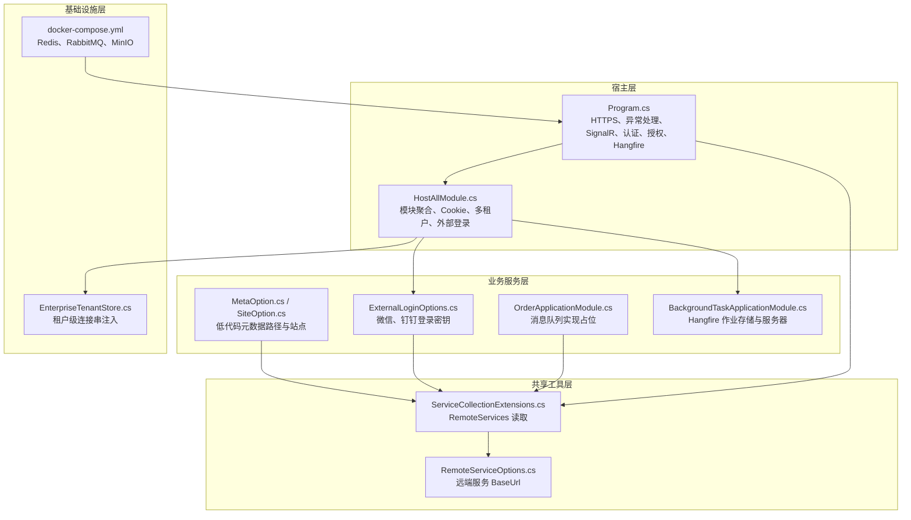
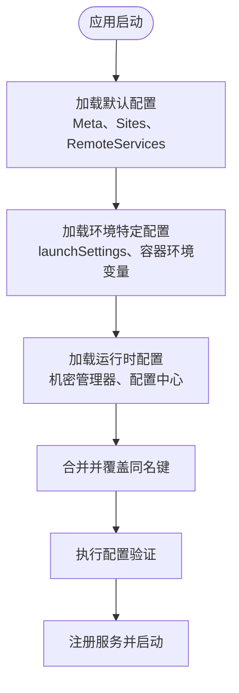
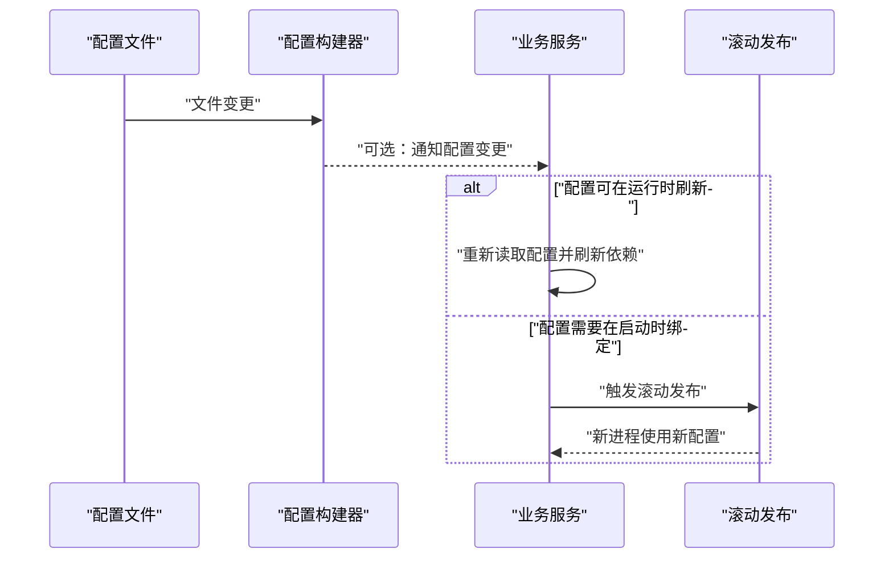

# 生产环境配置

<cite>
**本文引用的文件**   
- [README.md](file://README.md)
- [docker-compose.yml](file://cd/docker-compose.yml)
- [Program.cs（主宿主）](file://src/Host/H.AppLab.Web.Host/H.AppLab.Web.Host/Program.cs)
- [HostAllModule.cs](file://src/Host/H.AppLab.Web.Host/H.AppLab.Web.Host/HostAllModule.cs)
- [ServiceCollectionExtensions.cs（远程服务扩展）](file://src/Utils/H.Abp.HttpClientProxy/ServiceCollectionExtensions.cs)
- [RemoteServiceOptions.cs](file://src/Utils/H.Abp.HttpClientProxy/RemoteServiceOptions.cs)
- [ExternalLoginOptions.cs](file://src/Services/Account/H.Account.Application/ExternalLogin/ExternalLoginOptions.cs)
- [MetaOption.cs](file://src/LowCode/Common/H.LowCode.Configuration/Options/MetaOption.cs)
- [SiteOption.cs](file://src/LowCode/Common/H.LowCode.Configuration/Options/SiteOption.cs)
- [appsettings.json（低代码迁移工具）](file://src/Tools/H.LowCode.DbMigrator/appsettings.json)
- [appsettings.json（账户迁移工具）](file://src/Tools/H.Account.DbMigrator/appsettings.json)
- [OrderApplicationModule.cs（消息队列注释）](file://src/Services/Order/H.Order.Application/OrderApplicationModule.cs)
- [BackgroundTaskApplicationModule.cs（Hangfire 配置）](file://src/Services/BackgroundTask/H.BackgroundTask.Application/BackgroundTaskApplicationModule.cs)
- [EnterpriseTenantStore.cs](file://src/System/Enterprise/H.Enterprise.EntityFrameworkCore/EnterpriseTenantStore.cs)
</cite>

## 目录
1. [简介](#简介)
2. [项目结构与配置边界](#项目结构与配置边界)
3. [配置层次与优先级](#配置层次与优先级)
4. [关键配置项总览](#关键配置项总览)
5. [敏感信息加密存储与密钥管理](#敏感信息加密存储与密钥管理)
6. [安全配置最佳实践](#安全配置最佳实践)
7. [配置热更新机制](#配置热更新机制)
8. [配置验证规则](#配置验证规则)
9. [自动化脚本与配置审计](#自动化脚本与配置审计)
10. [故障诊断与调试方法](#故障诊断与调试方法)
11. [结论](#结论)

## 简介
H.AppLab 平台是一个基于 .NET 与 Blazor 的模块化应用开发实验性项目，支持单体部署和按服务独立部署。其运行时依赖 Redis、RabbitMQ、MinIO 等基础设施，并通过多个数据库为各业务限界上下文提供持久化能力。该平台在宿主机上统一注册所有应用模块，同时为前端提供基于 IAppService 的动态 HTTP 代理调用能力；后台任务通过 Hangfire 调度，外部登录支持微信与钉钉，远端服务地址通过 `RemoteServices` 节点集中管理。

从生产环境视角看，H.AppLab 的配置管理围绕以下目标展开：
- 将连接字符串、第三方 API 密钥、Redis/RabbitMQ/MinIO 参数等敏感信息从源码中剥离。
- 明确基础配置、环境特定配置、运行时配置的加载顺序与覆盖关系。
- 在现有 ABP、Autofac、ASP.NET Core 配置体系基础上，补充安全加固、热更新策略、验证规则和审计能力。
- 为运维人员提供可操作的配置检查清单、诊断方法和回滚流程。

**章节来源**
- [README.md:1-73](file://README.md#L1-L73)

## 项目结构与配置边界
H.AppLab 的配置主要分布在以下几类位置：

| 配置类别 | 典型位置或来源 | 用途 | 生产建议 |
|---|---|---|---|
| 宿主启动配置 | 主宿主 `Program.cs` | 启用 HTTPS、异常处理、响应压缩、SignalR、认证授权、静态资源、Hangfire 仪表盘 | 仅保留非敏感运行开关；证书、端口、日志级别由环境变量或外部配置注入 |
| 模块级配置 | `HostAllModule.cs` 及各业务模块的 Module | 多租户、Cookie 认证、外部登录、自动控制器注册、Hangfire 作业服务器 | 只绑定配置节名称，不硬编码密码或密钥 |
| 远程服务地址 | `RemoteServiceOptions.cs`、`ServiceCollectionExtensions.cs` | 定义远端服务基地址，供前端 HttpClient 动态代理使用 | 使用环境变量或受管密钥库注入 |
| 第三方登录密钥 | `ExternalLoginOptions.cs` | 微信、钉钉客户端 ID 与密钥、回调路径 | 必须加密存储，禁止提交到版本库 |
| 低代码元数据路径 | `MetaOption.cs`、`SiteOption.cs` | 指定应用与组件元数据文件路径、站点列表 | 仅配置路径与站点标识，不包含业务数据 |
| 数据库连接串 | 各 DbMigrator 的 `appsettings.json`、各 EFCore Module | 连接各业务数据库 | 生产环境使用机密管理器或容器环境变量 |
| 基础设施 | `cd/docker-compose.yml` | Redis、RabbitMQ、MinIO 本地开发容器 | 生产环境改用托管服务或带凭据的环境变量 |

**图表来源**
- [Program.cs（主宿主）:1-112](file://src/Host/H.AppLab.Web.Host/H.AppLab.Web.Host/Program.cs#L1-L112)
- [HostAllModule.cs:1-200](file://src/Host/H.AppLab.Web.Host/H.AppLab.Web.Host/HostAllModule.cs#L1-L200)
- [ServiceCollectionExtensions.cs:1-63](file://src/Utils/H.Abp.HttpClientProxy/ServiceCollectionExtensions.cs#L1-L63)
- [RemoteServiceOptions.cs:1-33](file://src/Utils/H.Abp.HttpClientProxy/RemoteServiceOptions.cs#L1-L33)
- [ExternalLoginOptions.cs:1-21](file://src/Services/Account/H.Account.Application/ExternalLogin/ExternalLoginOptions.cs#L1-L21)
- [MetaOption.cs:1-10](file://src/LowCode/Common/H.LowCode.Configuration/Options/MetaOption.cs#L1-L10)
- [SiteOption.cs:1-10](file://src/LowCode/Common/H.LowCode.Configuration/Options/SiteOption.cs#L1-L10)
- [OrderApplicationModule.cs:30-35](file://src/Services/Order/H.Order.Application/OrderApplicationModule.cs#L30-L35)
- [BackgroundTaskApplicationModule.cs:23-53](file://src/Services/BackgroundTask/H.BackgroundTask.Application/BackgroundTaskApplicationModule.cs#L23-L53)
- [docker-compose.yml:1-48](file://cd/docker-compose.yml#L1-L48)
- [EnterpriseTenantStore.cs:70-82](file://src/System/Enterprise/H.Enterprise.EntityFrameworkCore/EnterpriseTenantStore.cs#L70-L82)

**章节来源**
- [README.md:1-73](file://README.md#L1-L73)
- [Program.cs（主宿主）:1-112](file://src/Host/H.AppLab.Web.Host/H.AppLab.Web.Host/Program.cs#L1-L112)
- [HostAllModule.cs:1-200](file://src/Host/H.AppLab.Web.Host/H.AppLab.Web.Host/HostAllModule.cs#L1-L200)
- [docker-compose.yml:1-48](file://cd/docker-compose.yml#L1-L48)

## 配置层次与优先级
当前仓库中的配置加载模式可以归纳为三个层次：

| 层次 | 说明 | 示例 | 覆盖优先级 |
|---|---|---|---|
| 基础配置 | 随程序集发布的默认配置文件 | 迁移工具的 `appsettings.json`、低代码元数据路径 | 最低 |
| 环境特定配置 | 开发、测试、生产环境的差异配置 | 本地 `launchSettings.json`、Docker Compose 环境变量、容器运行时环境变量 | 中等 |
| 运行时配置 | 应用启动后注入的外部配置源 | 机密管理器、配置中心、环境变量、挂载卷中的机密文件 | 最高 |

在当前代码中，迁移工具普遍采用如下方式构建配置：
- 使用 `ConfigurationBuilder` 添加 `appsettings.json`。
- 部分迁移程序设置 `reloadOnChange: true`，以便调试时观察配置变化对迁移过程的影响。
- 业务 EFCore 模块通过 `IConfiguration.GetConnectionString("xxxDb")` 获取连接串。
- 远程服务地址通过 `RemoteServices` 节点加载，并以服务名为键维护 BaseUrl。
- 外部登录配置通过 `Configure<ExternalLoginOptions>(configuration.GetSection("ExternalLogin"))` 绑定。
- 低代码元数据路径通过 `MetaOption.SectionName = "Meta"` 绑定。
- 站点列表通过 `SiteOption.SectionName = "Sites"` 以集合形式绑定。

因此，推荐的生产环境合并规则为：
1. 先加载内置默认配置，例如低代码元数据默认路径。
2. 再加载环境特定配置，例如测试环境的连接串副本、开发环境的调试开关。
3. 最后注入运行时配置，包括环境变量、机密管理器、配置中心等。
4. 若同一键出现在多个层次，高优先级覆盖低优先级。
5. 对于连接字符串，优先使用命名连接串键，例如 `AccountDb`、`LowCodeDb`、`Default`，避免硬编码数据库名。

[本图为概念流程图，不对应单一具体文件，故无图表来源]

**章节来源**
- [ServiceCollectionExtensions.cs:14-63](file://src/Utils/H.Abp.HttpClientProxy/ServiceCollectionExtensions.cs#L14-L63)
- [RemoteServiceOptions.cs:12-33](file://src/Utils/H.Abp.HttpClientProxy/RemoteServiceOptions.cs#L12-L33)
- [HostAllModule.cs:160-175](file://src/Host/H.AppLab.Web.Host/H.AppLab.Web.Host/HostAllModule.cs#L160-L175)
- [MetaOption.cs:1-10](file://src/LowCode/Common/H.LowCode.Configuration/Options/MetaOption.cs#L1-L10)
- [SiteOption.cs:1-10](file://src/LowCode/Common/H.LowCode.Configuration/Options/SiteOption.cs#L1-L10)
- [OrderApplicationModule.cs:30-35](file://src/Services/Order/H.Order.Application/OrderApplicationModule.cs#L30-L35)

## 关键配置项总览
### 数据库连接字符串
当前仓库展示了多种数据库连接串的使用方式：
- 低代码迁移工具配置中包含 `ConnectionStrings.LowCodeDb`。
- 账户迁移工具配置中包含 `ConnectionStrings.AccountDb`。
- 各 EFCore 模块通过 `GetConnectionString("xxxDb")` 读取对应数据库。
- 渲染引擎与设计引擎模块在未找到专用连接串时会回退到 `Default`。
- 企业租户存储会按租户注入 `Default`、`OrganizationDb`、`ApprovalDb` 等连接串。

| 配置键 | 含义 | 使用位置 | 生产建议 |
|---|---|---|---|
| `ConnectionStrings.Default` | 默认数据库连接串 | 设计引擎、渲染引擎回退逻辑 | 作为兜底连接串，避免空值 |
| `ConnectionStrings.LowCodeDb` | 低代码领域数据库 | 低代码迁移工具、低代码相关模块 | 单独隔离 |
| `ConnectionStrings.AccountDb` | 账户数据库 | 账户模块、ABP Identity | 与身份认证强关联 |
| `ConnectionStrings.OrganizationDb` | 组织数据库 | 组织模块、企业租户存储 | 按限界上下文拆分 |
| `ConnectionStrings.ApprovalDb` | 审批数据库 | 审批模块、企业租户存储 | 按限界上下文拆分 |
| `ConnectionStrings.XxxDb` | 其他业务数据库 | 各服务 EFCore Module | 一域一库 |

**章节来源**
- [appsettings.json（低代码迁移工具）:1-8](file://src/Tools/H.LowCode.DbMigrator/appsettings.json#L1-L8)
- [appsettings.json（账户迁移工具）:1-5](file://src/Tools/H.Account.DbMigrator/appsettings.json#L1-L5)
- [EnterpriseTenantStore.cs:70-82](file://src/System/Enterprise/H.Enterprise.EntityFrameworkCore/EnterpriseTenantStore.cs#L70-L82)

### Redis 配置
Docker Compose 中定义了 Redis 容器，包含用户名、密码、时区、端口等参数。当前仓库未直接展示应用层 Redis 配置类，但 README 明确指出需要启动 Redis 作为依赖服务。生产环境中应：
- 使用环境变量注入 Redis 连接字符串或凭据。
- 禁用默认弱口令。
- 将 Redis 暴露给应用容器网络，而不是直接暴露公网。
- 为缓存、会话、分布式锁等不同用途配置不同数据库索引。

**章节来源**
- [docker-compose.yml:1-20](file://cd/docker-compose.yml#L1-L20)
- [README.md:1-73](file://README.md#L1-L73)

### RabbitMQ 配置
Docker Compose 中定义了 RabbitMQ 容器，包含默认用户、密码、管理界面端口和消息端口。订单服务中存在关于消息队列实现的注释，表明当前可以使用内存队列，而生产环境应替换为 RabbitMQ 或 Kafka。生产环境中应：
- 使用环境变量或密钥管理器注入 RabbitMQ 连接信息。
- 启用 TLS。
- 创建最小权限账号，而非使用默认管理员账号。
- 将队列、交换机、路由键纳入基础设施即代码管理。

**章节来源**
- [docker-compose.yml:21-35](file://cd/docker-compose.yml#L21-L35)
- [OrderApplicationModule.cs:30-35](file://src/Services/Order/H.Order.Application/OrderApplicationModule.cs#L30-L35)

### MinIO 配置
Docker Compose 中定义了 MinIO，包含根用户、根密码、API 端口与控制台端口。文件服务通常依赖对象存储，因此 MinIO 是 H.AppLab 文件能力的重要基础设施。生产环境中应：
- 修改默认 root 账号与密码。
- 启用 HTTPS。
- 限制控制台访问来源 IP。
- 将桶策略、生命周期规则纳入配置管理。

**章节来源**
- [docker-compose.yml:36-48](file://cd/docker-compose.yml#L36-L48)

### 第三方服务 API 密钥
第三方登录密钥通过 `ExternalLoginOptions` 管理，包括微信与钉钉的客户端 ID、客户端密钥和回调路径。远程服务地址通过 `RemoteServices` 节点统一管理。生产环境中应：
- 将 ClientId、ClientSecret、CallbackPath 放入机密管理器或环境变量。
- 不在 `appsettings.json` 中提交真实密钥。
- 区分不同环境的第三方服务地址。
- 对第三方服务请求增加超时、重试熔断策略。

**章节来源**
- [ExternalLoginOptions.cs:1-21](file://src/Services/Account/H.Account.Application/ExternalLogin/ExternalLoginOptions.cs#L1-L21)
- [ServiceCollectionExtensions.cs:14-63](file://src/Utils/H.Abp.HttpClientProxy/ServiceCollectionExtensions.cs#L14-L63)
- [RemoteServiceOptions.cs:12-33](file://src/Utils/H.Abp.HttpClientProxy/RemoteServiceOptions.cs#L12-L33)

### Hangfire 后台任务配置
主宿主启用了 Hangfire 仪表盘，后台任务模块注册了 Hangfire 作业服务器，并使用 SQL Server 作为作业存储。生产环境中应：
- 将 `/hangfire` 仪表盘置于内网访问范围。
- 为 Hangfire 使用独立数据库或至少独立 Schema。
- 限制仪表盘的访问认证与授权。
- 监控作业失败率、延迟与积压。

**章节来源**
- [Program.cs（主宿主）:81-90](file://src/Host/H.AppLab.Web.Host/H.AppLab.Web.Host/Program.cs#L81-L90)
- [BackgroundTaskApplicationModule.cs:23-53](file://src/Services/BackgroundTask/H.BackgroundTask.Application/BackgroundTaskApplicationModule.cs#L23-L53)

## 敏感信息加密存储与密钥管理
H.AppLab 当前仓库中仍存在明文示例配置，例如本地数据库连接串、Redis 密码、RabbitMQ 默认密码、MinIO 默认账号。这些内容不适合直接进入生产环境。推荐采用以下加密与密钥管理方案：

| 场景 | 推荐方案 | 理由 |
|---|---|---|
| 本地开发 | 使用 `.env`、`launchSettings.json`、本地机密管理器 | 便于开发者快速启动 |
| 容器化部署 | 使用 Kubernetes Secret、Docker Secrets、环境变量 | 避免镜像携带敏感信息 |
| 云平台 | 使用云厂商密钥管理服务，如 Azure Key Vault、AWS Secrets Manager | 支持轮换、审计、最小权限 |
| 配置文件 | 使用 ASP.NET Core 机密管理器或外部配置中心 | 支持热更新与版本控制 |
| 数据库连接串 | 使用命名连接串键，由运行时注入 | 便于多租户和多环境切换 |
| 第三方密钥 | 使用独立密钥条目，按服务隔离 | 降低泄露影响面 |

在实际集成中，可将 `ExternalLoginOptions`、`RemoteServiceOptions`、连接串等敏感字段改为从运行时配置读取，并在部署阶段由编排系统注入。对于旧版 `appsettings.json`，应先完成清理与脱敏，再将其作为模板或默认值引入配置体系。

**章节来源**
- [appsettings.json（低代码迁移工具）:1-8](file://src/Tools/H.LowCode.DbMigrator/appsettings.json#L1-L8)
- [appsettings.json（账户迁移工具）:1-5](file://src/Tools/H.Account.DbMigrator/appsettings.json#L1-L5)
- [docker-compose.yml:1-48](file://cd/docker-compose.yml#L1-L48)
- [ExternalLoginOptions.cs:1-21](file://src/Services/Account/H.Account.Application/ExternalLogin/ExternalLoginOptions.cs#L1-L21)

## 安全配置最佳实践
### HTTPS 与传输安全
主宿主已启用 HTTPS 重定向，并在非开发环境启用异常处理和 HSTS。生产环境应进一步：
- 使用有效且受信任的 TLS 证书。
- 启用强制 HTTPS。
- 配置 HSTS、HTTP 严格转发头、X-Content-Type-Options 等安全头。
- 关闭不必要的调试输出。

**章节来源**
- [Program.cs（主宿主）:60-70](file://src/Host/H.AppLab.Web.Host/H.AppLab.Web.Host/Program.cs#L60-L70)
- [Program.cs（主宿主）:68-68](file://src/Host/H.AppLab.Web.Host/H.AppLab.Web.Host/Program.cs#L68-L68)

### CORS 设置
当前仓库未发现显式的 CORS 配置。由于前端使用 Blazor WebAssembly 并依赖动态 HTTP 代理，生产环境应根据实际域名严格配置 CORS：
- 仅允许已知的前端域名。
- 仅暴露必要的 API 路径。
- 不允许通配符来源与凭证组合滥用。
- 结合 Cookie 认证时注意 SameSite 与安全标志。

### 请求大小限制
当前 SignalR 配置设置了最大接收消息大小为 1MB。对于文件上传、批量导入等场景，应分别配置：
- Kestrel 请求体大小限制。
- 反序列化大小限制。
- 静态资源与 WASM 包大小限制。
- 文件服务上传大小限制。

### SQL 注入防护
项目使用 Entity Framework Core 作为数据访问层，这能显著降低手写 SQL 带来的注入风险。但仍需注意：
- 避免拼接用户输入构造查询。
- 对跨服务调用的数据源进行校验。
- 对远端返回数据进行类型校验与长度限制。
- 使用参数化查询和 ORM 提供的安全 API。

### 认证与授权
主宿主启用了 Cookie 认证、多租户、授权管道以及 CSRF 防抖选项。生产环境应：
- 限制 Cookie 作用域与过期时间。
- 启用强随机 Cookie 名称与前缀。
- 对敏感操作启用二次确认或权限校验。
- 对多租户数据访问增加租户隔离校验。

**章节来源**
- [Program.cs（主宿主）:10-26](file://src/Host/H.AppLab.Web.Host/H.AppLab.Web.Host/Program.cs#L10-L26)
- [Program.cs（主宿主）:60-90](file://src/Host/H.AppLab.Web.Host/H.AppLab.Web.Host/Program.cs#L60-L90)
- [HostAllModule.cs:70-110](file://src/Host/H.AppLab.Web.Host/H.AppLab.Web.Host/HostAllModule.cs#L70-L110)
- [HostAllModule.cs:110-200](file://src/Host/H.AppLab.Web.Host/H.AppLab.Web.Host/HostAllModule.cs#L110-L200)

## 配置热更新机制
当前仓库中，部分迁移程序在构建配置时启用了 `reloadOnChange: true`，这意味着配置文件变更后，配置对象会在后续读取时反映最新值。但需要注意：
- 热更新不等于服务重启。
- 某些配置只在服务启动时绑定一次，例如 Autofac 容器、EFCore 连接工厂、HttpClient 工厂。
- 只有重新解析配置或显式刷新服务的模块才能感知变更。
- 对于连接串、Redis、RabbitMQ、第三方密钥等核心配置，建议优先采用进程重启或滚动发布策略，而非完全依赖热更新。

[本图为概念流程图，不对应单一具体文件，故无图表来源]

**章节来源**
- [OrderApplicationModule.cs:30-35](file://src/Services/Order/H.Order.Application/OrderApplicationModule.cs#L30-L35)

## 配置验证规则
当前仓库没有统一的配置验证入口。建议在应用启动前增加配置验证层，规则包括：

| 配置类别 | 必填项 | 校验规则 | 失败行为 |
|---|---|---|---|
| 数据库连接串 | `Default` 或各业务 `xxxDb` | 非空、合法连接串格式 | 启动失败 |
| Redis | 连接地址、密码 | 非空、可达性探测 | 启动失败或降级 |
| RabbitMQ | 连接地址、虚拟主机、凭据 | 非空、可达性探测 | 启动失败或降级 |
| MinIO | 端点、AccessKey、SecretKey | 非空、桶存在性探测 | 启动失败或降级 |
| 第三方登录 | ClientId、ClientSecret、CallbackPath | 非空、回调路径合法 | 启动失败或禁用该提供者 |
| 远程服务 | 每个服务的 BaseUrl | 非空、URL 格式合法 | 启动失败或拒绝远端调用 |
| 低代码元数据路径 | AppsFilePath、PartsFilePath | 路径存在或可创建 | 启动失败或切换到远程仓储 |

推荐实现方式：
- 使用 ASP.NET Core 的 `IValidateOptions` 或自定义验证中间件。
- 在 `HostAllModule` 或主宿主启动阶段执行验证。
- 将验证结果写入结构化日志，便于审计。
- 对可降级依赖（如缓存、消息队列）提供健康检查与健康端点。

**章节来源**
- [HostAllModule.cs:160-200](file://src/Host/H.AppLab.Web.Host/H.AppLab.Web.Host/HostAllModule.cs#L160-L200)
- [MetaOption.cs:1-10](file://src/LowCode/Common/H.LowCode.Configuration/Options/MetaOption.cs#L1-L10)
- [SiteOption.cs:1-10](file://src/LowCode/Common/H.LowCode.Configuration/Options/SiteOption.cs#L1-L10)
- [ExternalLoginOptions.cs:1-21](file://src/Services/Account/H.Account.Application/ExternalLogin/ExternalLoginOptions.cs#L1-L21)

## 自动化脚本与配置审计
### 自动化脚本
建议提供以下自动化脚本：

| 脚本 | 职责 | 输入 | 输出 |
|---|---|---|---|
| 配置生成脚本 | 根据模板生成各环境配置 | 环境名、密钥引用 | `appsettings.{env}.json`、环境变量清单 |
| 配置校验脚本 | 检查必填项、格式、密钥是否缺失 | 配置目录、密钥库 | 校验报告 |
| 配置审计脚本 | 扫描源码与配置中的敏感信息 | 仓库路径 | 告警清单 |
| 配置对比脚本 | 比较两个环境配置差异 | 两份配置 | 差异报告 |
| 部署准备脚本 | 将配置转换为容器环境变量或 Secret | 配置 JSON | YAML、环境变量文件 |

### 配置审计要点
- 禁止提交明文密码、Token、私钥到版本库。
- 检查 `appsettings.json` 是否包含真实连接串或第三方密钥。
- 检查 Docker Compose 中的默认密码是否被替换。
- 检查远程服务地址是否指向公网或内部不可达地址。
- 检查 Hangfire 仪表盘是否暴露在公网。
- 检查 CORS 是否过于宽松。
- 检查多租户配置是否与生产租户一致。

**章节来源**
- [docker-compose.yml:1-48](file://cd/docker-compose.yml#L1-L48)
- [Program.cs（主宿主）:81-90](file://src/Host/H.AppLab.Web.Host/H.AppLab.Web.Host/Program.cs#L81-L90)

## 故障诊断与调试方法
### 常见问题定位
| 现象 | 可能原因 | 排查步骤 | 处理方式 |
|---|---|---|---|
| 无法连接数据库 | 连接串错误、网络不通、权限不足 | 检查 `ConnectionStrings.*`、数据库防火墙、SQL 账号权限 | 修正连接串、开放必要端口、授予最小权限 |
| Redis 连接失败 | 密码错误、网络隔离、未启用认证 | 检查 Redis 容器配置、环境变量、防火墙 | 同步密码、调整网络策略 |
| RabbitMQ 连接失败 | 默认账号未修改、虚拟主机错误 | 检查 RabbitMQ 环境变量、Management 界面 | 修改默认凭据、确认虚拟主机 |
| MinIO 无法上传 | AccessKey/SecretKey 错误、桶不存在 | 检查 MinIO 环境变量、控制台桶列表 | 修正凭据、创建桶并设置策略 |
| 远端服务调用失败 | `RemoteServices` 地址错误或域名不可解析 | 检查 `RemoteServices` 配置、DNS、反向代理 | 修正 BaseUrl、配置 DNS 或网关 |
| 第三方登录失败 | ClientId/ClientSecret 错误、回调路径不一致 | 检查 `ExternalLogin` 配置、第三方平台回调设置 | 同步密钥与回调路径 |
| Hangfire 任务不执行 | 作业存储未初始化、进程未启动作业服务器 | 检查 Hangfire 表、应用日志、进程状态 | 初始化数据库、重启服务 |
| 多租户访问异常 | 租户 Cookie 无效、租户存储未正确注入 | 检查 Cookie、`EnterpriseTenantStore`、租户配置 | 清理 Cookie、修复租户数据 |

### 调试建议
- 开发环境保留详细错误输出，生产环境关闭详细错误并记录结构化日志。
- 对关键配置变更增加部署变更记录。
- 对依赖服务增加健康检查端点。
- 对远程服务调用增加超时、重试、熔断与链路追踪。
- 对数据库操作增加慢查询日志。
- 对文件上传与下载增加大小限制与病毒扫描。

**章节来源**
- [Program.cs（主宿主）:40-70](file://src/Host/H.AppLab.Web.Host/H.AppLab.Web.Host/Program.cs#L40-L70)
- [BackgroundTaskApplicationModule.cs:23-53](file://src/Services/BackgroundTask/H.BackgroundTask.Application/BackgroundTaskApplicationModule.cs#L23-L53)
- [EnterpriseTenantStore.cs:70-82](file://src/System/Enterprise/H.Enterprise.EntityFrameworkCore/EnterpriseTenantStore.cs#L70-L82)

## 结论
H.AppLab 的生产环境配置应以“默认配置 + 环境配置 + 运行时机密”的分层模型为基础，将数据库连接串、Redis、RabbitMQ、MinIO、第三方登录密钥、远端服务地址等敏感信息全部从源码中剥离，并通过环境变量、机密管理器或配置中心注入。当前仓库已具备 ABP 模块、Autofac、ASP.NET Core 配置、SignalR、Hangfire、多租户、Cookie 认证等能力，但在生产安全方面仍需补充严格的 HTTPS、CORS、请求大小限制、SQL 注入防护、配置验证、热更新治理与配置审计机制。

建议下一步优先完成：
1. 清理源码中的明文敏感信息。
2. 建立标准配置模板与环境变量清单。
3. 接入机密管理器或配置中心。
4. 增加配置验证与健康检查。
5. 完善 CORS、HTTPS、请求大小限制等安全配置。
6. 将 Redis、RabbitMQ、MinIO 从开发容器迁移至生产托管服务。
7. 建立配置变更审计与回滚流程。