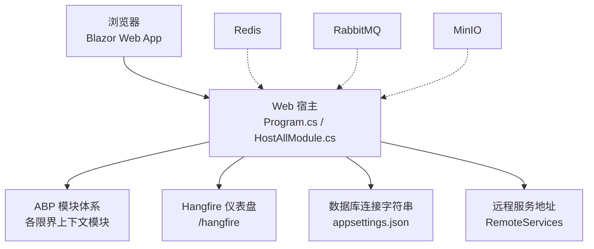
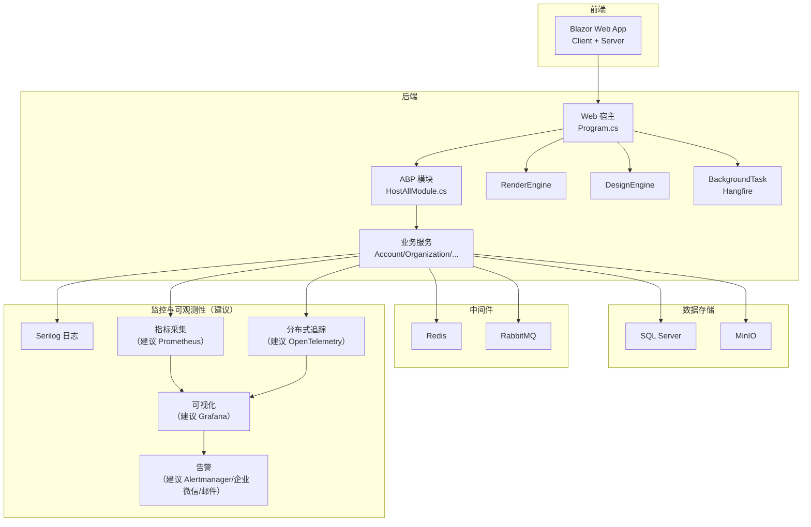
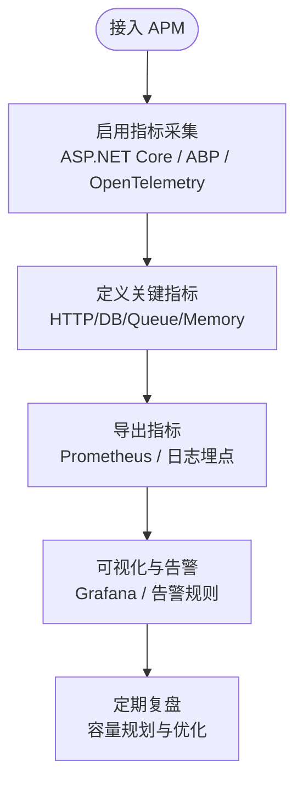
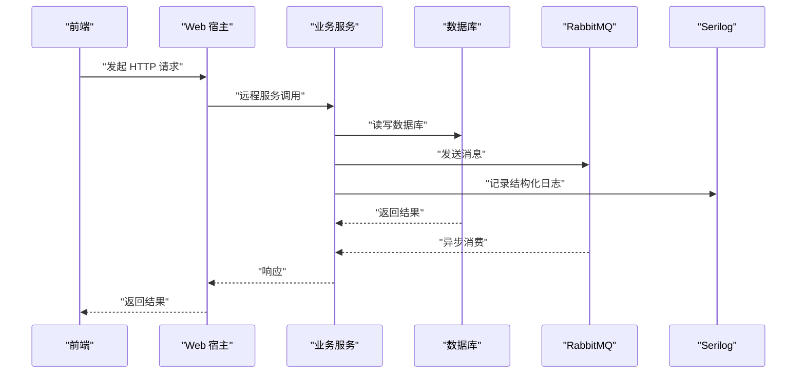
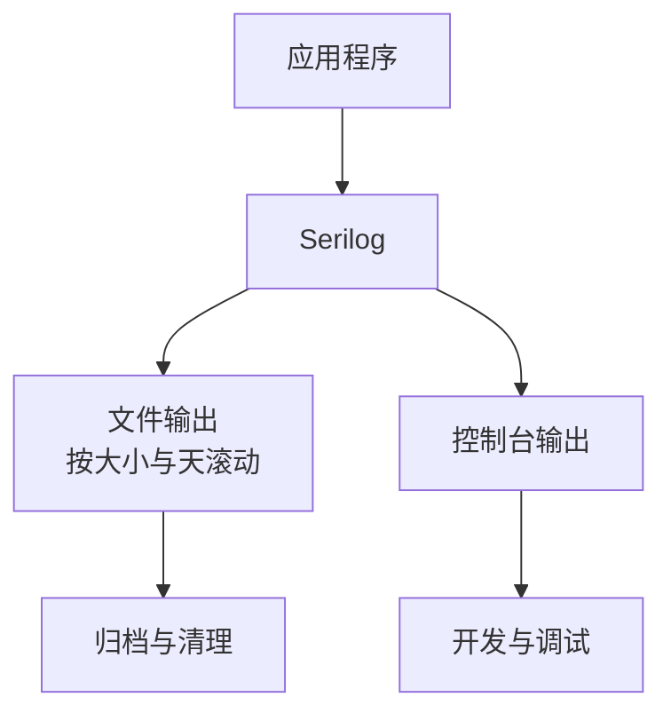
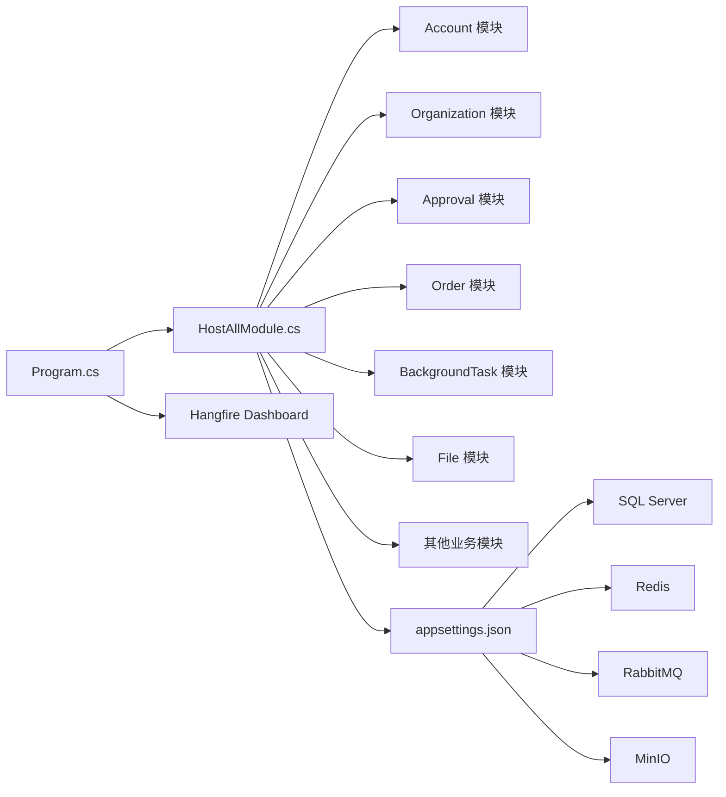

# 监控告警

<cite>
**本文引用的文件**   
- [README.md](file://README.md)
- [HostAllModule.cs](file://src/Host/H.AppLab.Web.Host/H.AppLab.Web.Host/HostAllModule.cs)
- [Program.cs](file://src/Host/H.AppLab.Web.Host/H.AppLab.Web.Host/Program.cs)
- [appsettings.json（Web 宿主）](file://src/Host/H.AppLab.Web.Host/H.AppLab.Web.Host/appsettings.json)
- [BackgroundTaskApplicationModule.cs](file://src/Services/BackgroundTask/H.BackgroundTask.Application/BackgroundTaskApplicationModule.cs)
- [docker-compose.yml](file://cd/cd\docker-compose.yml)
- [H.LowCode.RenderEngine.Host.csproj](file://src/Host/RenderEngine/H.LowCode.RenderEngine.Host/H.LowCode.RenderEngine.Host.csproj)
- [H.LowCode.DbMigrator.csproj](file://src/Tools/H.LowCode.DbMigrator/H.LowCode.DbMigrator.csproj)
- [appsettings.json（渲染引擎宿主）](file://src/Host/RenderEngine/H.LowCode.RenderEngine.Host/appsettings.json)
- [Program.cs（LowCode DbMigrator）](file://src/Tools/H.LowCode.DbMigrator/Program.cs)
- [appsettings.serilog.json（LowCode DbMigrator）](file://src/Tools/H.LowCode.DbMigrator/appsettings.serilog.json)
</cite>

## 目录
1. [引言](#引言)
2. [项目结构](#项目结构)
3. [核心组件](#核心组件)
4. [架构总览](#架构总览)
5. [详细组件分析](#详细组件分析)
6. [依赖关系分析](#依赖关系分析)
7. [性能与容量规划建议](#性能与容量规划建议)
8. [故障排查指南](#故障排查指南)
9. [结论](#结论)
10. [附录：监控体系落地清单](#附录监控体系落地清单)

## 引言
本文件为 H.AppLab 平台提供一套“基于现有代码能力、可逐步演进”的监控告警体系设计。当前仓库已经具备以下基础：
- 模块化 .NET + ABP 应用，支持单体与按服务独立部署。
- Web 宿主使用 Blazor Web App（Server + WebAssembly），并集成 Hangfire 后台任务仪表盘。
- 部分程序集已引入 Serilog 日志框架，用于结构化日志输出到文件和控制台。
- 依赖服务通过 docker-compose 启动 Redis、RabbitMQ、MinIO。
- 多租户、Cookie 认证、外部登录、远程服务配置等均已就绪。

因此，本文在尊重现有实现的前提下，给出应用性能监控（APM）、调用链追踪、错误监控、日志收集与分析、基础设施监控、告警规则与通知渠道、监控仪表板搭建、数据分析与容量规划，以及系统维护与故障处理方案。

## 项目结构
从监控视角看，关键位置如下：
- Web 宿主入口和模块装配：`src/Host/H.AppLab.Web.Host/H.AppLab.Web.Host/Program.cs`、`HostAllModule.cs`。
- 运行时配置：`src/Host/H.AppLab.Web.Host/H.AppLab.Web.Host/appsettings.json`。
- 后台任务与调度：`src/Services/BackgroundTask/H.BackgroundTask.Application/BackgroundTaskApplicationModule.cs`。
- 依赖服务编排：`cd/cd\docker-compose.yml`。
- 已有日志能力：`src/Host/RenderEngine/H.LowCode.RenderEngine.Host/appsettings.json`、`src/Tools/H.LowCode.DbMigrator/appsettings.serilog.json`、对应 Program 和 csproj。

图表来源
- [Program.cs:1-112](file://src/Host/H.AppLab.Web.Host/H.AppLab.Web.Host/Program.cs#L1-L112)
- [HostAllModule.cs:1-207](file://src/Host/H.AppLab.Web.Host/H.AppLab.Web.Host/HostAllModule.cs#L1-L207)
- [appsettings.json（Web 宿主）:1-128](file://src/Host/H.AppLab.Web.Host/H.AppLab.Web.Host/appsettings.json#L1-L128)
- [docker-compose.yml:1-48](file://cd/cd\docker-compose.yml#L1-L48)

章节来源
- [README.md:1-73](file://README.md#L1-L73)
- [Program.cs:1-112](file://src/Host/H.AppLab.Web.Host/H.AppLab.Web.Host/Program.cs#L1-L112)
- [HostAllModule.cs:1-207](file://src/Host/H.AppLab.Web.Host/H.AppLab.Web.Host/HostAllModule.cs#L1-L207)
- [appsettings.json（Web 宿主）:1-128](file://src/Host/H.AppLab.Web.Host/H.AppLab.Web.Host/appsettings.json#L1-L128)
- [docker-compose.yml:1-48](file://cd/cd\docker-compose.yml#L1-L48)

## 核心组件
本节聚焦监控告警体系需要直接使用的平台能力。

### Web 宿主与请求管道
- 使用 `WebApplication.CreateBuilder` 构建 ASP.NET Core 应用。
- 启用 Blazor Server + WebAssembly 交互组件、SignalR、JSON 序列化、响应压缩（Brotli/Gzip）。
- 注册 Autofac、ABP 模块、中间件（认证、多租户、授权、防跨站请求伪造）。
- 挂载 Hangfire Dashboard 到 `/hangfire`，便于观察后台任务执行情况。

章节来源
- [Program.cs:1-112](file://src/Host/H.AppLab.Web.Host/H.AppLab.Web.Host/Program.cs#L1-L112)

### 模块装配与业务边界
- `HostAllModule` 聚合所有业务模块：Account、Organization、Approval、AI、Notification、Order、Portal、SystemPortal、Enterprise、Setting、SupplyChain、BackgroundTask、File、DesignEngine、RenderEngine、Testing 等。
- 每个模块遵循 Application.Contracts / Application / EntityFrameworkCore / Web 分层，天然适合按限界上下文建立指标与告警。

章节来源
- [HostAllModule.cs:1-207](file://src/Host/H.AppLab.Web.Host/H.AppLab.Web.Host/HostAllModule.cs#L1-L207)

### 后台任务与调度
- BackgroundTask 模块通过 Hangfire 管理异步作业，作业存储使用 SQL Server。
- Hangfire 服务器作为托管服务随宿主运行，支持作业调度、失败重试、执行历史查看。

章节来源
- [BackgroundTaskApplicationModule.cs:1-55](file://src/Services/BackgroundTask/H.BackgroundTask.Application/BackgroundTaskApplicationModule.cs#L1-L55)

### 依赖服务与容器化
- Redis：分布式缓存与会话扩展的基础。
- RabbitMQ：消息队列，支撑 CAP、事件总线、异步解耦。
- MinIO：对象存储，承载文件上传下载。
- 容器编排由 docker-compose 管理端口、环境变量、数据卷。

章节来源
- [docker-compose.yml:1-48](file://cd/cd\docker-compose.yml#L1-L48)

## 架构总览
下图展示 H.AppLab 平台在监控告警视角下的整体架构。当前仓库已具备日志、后台任务仪表盘、HTTP API、数据库与中间件；APM、分布式追踪、Prometheus/Grafana 尚未直接集成，可在不破坏现有结构的前提下逐步接入。

图表来源
- [Program.cs:1-112](file://src/Host/H.AppLab.Web.Host/H.AppLab.Web.Host/Program.cs#L1-L112)
- [HostAllModule.cs:1-207](file://src/Host/H.AppLab.Web.Host/H.AppLab.Web.Host/HostAllModule.cs#L1-L207)
- [BackgroundTaskApplicationModule.cs:1-55](file://src/Services/BackgroundTask/H.BackgroundTask.Application/BackgroundTaskApplicationModule.cs#L1-L55)
- [docker-compose.yml:1-48](file://cd/cd\docker-compose.yml#L1-L48)

## 详细组件分析

### 应用性能监控（APM）
#### 现状
- 仓库中未发现显式的 APM SDK 或性能指标采集器。
- 已有 ABP Telemetry 开关位于渲染引擎宿主的 appsettings 中，但处于关闭状态。

#### 建议方案
- 在 Web 宿主和各服务宿主中启用 ASP.NET Core 内置性能计数器，并结合 ABP Metrics 或 OpenTelemetry 暴露指标。
- 关键指标建议：
  - HTTP 请求速率、延迟、错误率。
  - 数据库连接池、慢查询次数、事务耗时。
  - 后台任务队列积压、失败率、执行时长。
  - 内存、GC、线程池等待。
  - 第三方依赖调用耗时与错误率（Redis、RabbitMQ、MinIO）。

图表来源
- [appsettings.json（渲染引擎宿主）:1-65](file://src/Host/RenderEngine/H.LowCode.RenderEngine.Host/appsettings.json#L1-L65)

章节来源
- [appsettings.json（渲染引擎宿主）:1-65](file://src/Host/RenderEngine/H.LowCode.RenderEngine.Host/appsettings.json#L1-L65)

### 调用链追踪
#### 现状
- 未找到分布式追踪相关代码。
- 远程服务通过 RemoteServices 配置多个后端服务 BaseUrl。

#### 建议方案
- 采用 OpenTelemetry 对 HTTP 客户端与服务端进行自动注入，生成 TraceId/SpanId。
- 在 ABP 的 HttpClient 代理层、EF Core 访问层、RabbitMQ 发布订阅处增加上下文传播。
- 将 TraceId 写入结构化日志，使日志与链路关联。

图表来源
- [appsettings.json（Web 宿主）:1-128](file://src/Host/H.AppLab.Web.Host/H.AppLab.Web.Host/appsettings.json#L1-L128)

章节来源
- [appsettings.json（Web 宿主）:1-128](file://src/Host/H.AppLab.Web.Host/H.AppLab.Web.Host/appsettings.json#L1-L128)

### 错误监控
#### 现状
- Web 宿主在非开发环境启用异常处理器、HSTS、状态码重定向。
- SignalR 允许在开发环境输出详细错误。

#### 建议方案
- 统一错误分类：业务异常、基础设施异常、第三方接口异常。
- 将错误级别提升到 Error/Critical，并附加 CorrelationId、TraceId、TenantId、UserId、ApiPath、StatusCode。
- 结合 Hangfire 失败作业统计，建立“任务失败率”“重复失败”告警。

章节来源
- [Program.cs:1-112](file://src/Host/H.AppLab.Web.Host/H.AppLab.Web.Host/Program.cs#L1-L112)

### 日志收集与分析
#### 现状
- RenderEngine 宿主与 LowCode DbMigrator 已引入 Serilog，并配置 File、Async、Console 目标。
- 日志模板包含时间戳、级别、SourceContext、EventId、消息与异常。
- 文件轮转策略：按大小与天数滚动，保留固定数量文件。

图表来源
- [H.LowCode.RenderEngine.Host.csproj:11-15](file://src/Host/RenderEngine/H.LowCode.RenderEngine.Host/H.LowCode.RenderEngine.Host.csproj#L11-L15)
- [H.LowCode.DbMigrator.csproj:7-11](file://src/Tools/H.LowCode.DbMigrator/H.LowCode.DbMigrator.csproj#L7-L11)
- [appsettings.serilog.json（LowCode DbMigrator）:1-41](file://src/Tools/H.LowCode.DbMigrator/appsettings.serilog.json#L1-L41)
- [Program.cs（LowCode DbMigrator）:1-38](file://src/Tools/H.LowCode.DbMigrator/Program.cs#L1-L38)

#### 建议增强
- 在所有 Web 宿主和服务宿主中统一接入 Serilog。
- 新增结构化字段：CorrelationId、TraceId、TenantId、UserId、ModuleName、Endpoint。
- 生产环境建议将日志输出到集中式日志系统（如 Elasticsearch、OpenSearch、阿里云日志服务），并通过 Kibana/可视化工具查询。
- 对敏感信息做脱敏处理，避免在日志中泄露密码、令牌、用户隐私。

章节来源
- [H.LowCode.RenderEngine.Host.csproj:11-15](file://src/Host/RenderEngine/H.LowCode.RenderEngine.Host/H.LowCode.RenderEngine.Host.csproj#L11-L15)
- [H.LowCode.DbMigrator.csproj:7-11](file://src/Tools/H.LowCode.DbMigrator/H.LowCode.DbMigrator.csproj#L7-L11)
- [appsettings.json（渲染引擎宿主）:1-65](file://src/Host/RenderEngine/H.LowCode.RenderEngine.Host/appsettings.json#L1-L65)
- [Program.cs（LowCode DbMigrator）:1-38](file://src/Tools/H.LowCode.DbMigrator/Program.cs#L1-L38)
- [appsettings.serilog.json（LowCode DbMigrator）:1-41](file://src/Tools/H.LowCode.DbMigrator/appsettings.serilog.json#L1-L41)

### 基础设施监控
#### 服务器资源
- 建议在容器或虚拟机层面采集 CPU、内存、磁盘、网络 IO。
- 若使用 Kubernetes，可通过 Node Exporter + cAdvisor 采集节点与 Pod 指标。

#### 数据库监控
- SQL Server：连接数、锁等待、慢查询、备份状态、表空间增长。
- EF Core：命令执行时间、重试次数、超时。

#### 中间件监控
- Redis：连接数、命中率、内存使用、持久化状态。
- RabbitMQ：队列长度、消息吞吐、消费者数量、死信队列。
- MinIO：桶大小、对象数量、上传下载带宽、错误率。

#### 容器编排
- docker-compose 中 Redis、RabbitMQ、MinIO 已暴露端口，便于本地监控。
- 生产环境建议使用容器监控系统（Prometheus + Node Exporter + cAdvisor）统一采集。

章节来源
- [docker-compose.yml:1-48](file://cd/cd\docker-compose.yml#L1-L48)
- [appsettings.json（Web 宿主）:1-128](file://src/Host/H.AppLab.Web.Host/H.AppLab.Web.Host/appsettings.json#L1-L128)

### 告警规则与通知渠道
#### 告警规则建议
- 可用性类：
  - HTTP 5xx 比例超过阈值。
  - 服务健康检查失败。
  - 数据库连接失败或慢查询激增。
- 性能类：
  - P95/P99 延迟上升。
  - 内存持续增长、GC 频繁。
  - 队列积压超过阈值。
- 业务类：
  - 订单创建失败率上升。
  - 审批流程长时间未完成。
  - 后台任务失败率上升。

#### 通知渠道
- 邮件：适用于低优先级、汇总型告警。
- 短信：适用于严重故障、需快速响应的告警。
- 企业微信：适用于团队即时通知，支持机器人 webhook。
- 电话：适用于最高优先级故障，建议配合值班系统与升级策略。

#### 当前可复用能力
- Hangfire Dashboard 可作为任务执行的可视化入口。
- Serilog 日志可作为告警判断依据之一，尤其是错误日志量突增时触发告警。

章节来源
- [Program.cs:1-112](file://src/Host/H.AppLab.Web.Host/H.AppLab.Web.Host/Program.cs#L1-L112)
- [BackgroundTaskApplicationModule.cs:1-55](file://src/Services/BackgroundTask/H.BackgroundTask.Application/BackgroundTaskApplicationModule.cs#L1-L55)

### 监控仪表板与可视化
#### 建议面板
- 应用健康概览：请求量、错误率、延迟分布。
- 数据库面板：连接数、慢查询、事务成功率。
- 队列面板：消息堆积、消费速度、失败任务。
- 资源面板：CPU、内存、磁盘、网络。
- 业务面板：订单、审批、文件上传、低代码元数据操作。

#### 工具建议
- Prometheus 采集指标。
- Grafana 展示面板。
- Loki 或 Elasticsearch 检索日志。
- Jaeger 或 Tempo 展示分布式追踪。

章节来源
- [Program.cs:1-112](file://src/Host/H.AppLab.Web.Host/H.AppLab.Web.Host/Program.cs#L1-L112)

## 依赖关系分析
下图展示 Web 宿主、模块、Hangfire、配置与依赖服务的依赖关系，有助于理解监控数据采集点。

图表来源
- [Program.cs:1-112](file://src/Host/H.AppLab.Web.Host/H.AppLab.Web.Host/Program.cs#L1-L112)
- [HostAllModule.cs:1-207](file://src/Host/H.AppLab.Web.Host/H.AppLab.Web.Host/HostAllModule.cs#L1-L207)
- [appsettings.json（Web 宿主）:1-128](file://src/Host/H.AppLab.Web.Host/H.AppLab.Web.Host/appsettings.json#L1-L128)

章节来源
- [Program.cs:1-112](file://src/Host/H.AppLab.Web.Host/H.AppLab.Web.Host/Program.cs#L1-L112)
- [HostAllModule.cs:1-207](file://src/Host/H.AppLab.Web.Host/H.AppLab.Web.Host/HostAllModule.cs#L1-L207)
- [appsettings.json（Web 宿主）:1-128](file://src/Host/H.AppLab.Web.Host/H.AppLab.Web.Host/appsettings.json#L1-L128)

## 性能与容量规划建议
- 压测基线：对关键 API 建立 QPS、延迟、错误率的基线，区分不同租户规模与并发模型。
- 指标阈值：根据基线设定动态阈值，避免静态阈值造成误报或漏报。
- 扩容策略：
  - 水平扩展 Web 宿主实例，配合负载均衡。
  - 数据库主从或分库分表，缓解热点表压力。
  - Redis 集群化，提升缓存吞吐。
  - RabbitMQ 增加队列分区与消费者数量。
- 成本与容量：
  - 根据日志量评估存储成本，设置合理的保留策略。
  - 根据指标采样频率评估存储与计算成本。
  - 对高频读取数据进行冷热分层。

[本节为通用指导，不直接分析具体源码文件]

## 故障排查指南
### 常见症状与定位路径
- 页面加载缓慢：
  - 检查 Web 宿主是否启用响应压缩与 WASM 懒加载。
  - 查看 HTTP 延迟指标与数据库慢查询。
  - 检查 CDN 或静态资源缓存策略。
- 后台任务失败：
  - 打开 Hangfire Dashboard 查看失败作业。
  - 检查 SQL Server 连接与事务超时配置。
  - 检查依赖服务（Redis、RabbitMQ、MinIO）可用性。
- 日志缺失或过大：
  - 检查 Serilog 配置文件是否生效。
  - 检查文件轮转策略与磁盘空间。
  - 调整日志级别，减少无关日志。

章节来源
- [Program.cs:1-112](file://src/Host/H.AppLab.Web.Host/H.AppLab.Web.Host/Program.cs#L1-L112)
- [BackgroundTaskApplicationModule.cs:1-55](file://src/Services/BackgroundTask/H.BackgroundTask.Application/BackgroundTaskApplicationModule.cs#L1-L55)
- [appsettings.serilog.json（LowCode DbMigrator）:1-41](file://src/Tools/H.LowCode.DbMigrator/appsettings.serilog.json#L1-L41)

### 恢复步骤
- 临时降级：关闭非核心功能，降低负载。
- 重启服务：在确认依赖服务可用后重启异常服务。
- 回滚版本：如果问题由新版本引起，优先回滚。
- 修复配置：修正错误的连接串、权限、限流参数。
- 补充监控：针对新发现的故障模式增加指标与告警。

[本节为通用指导，不直接分析具体源码文件]

## 结论
H.AppLab 平台当前已具备模块化架构、Web 宿主、后台任务仪表盘、Serilog 日志基础与依赖服务容器化能力。在此基础上，应优先补齐 APM 指标采集、分布式追踪、集中式日志、可视化面板与告警通知，形成完整的可观测性与运维闭环。通过明确的指标定义、合理的告警阈值、稳定的通知渠道与完善的排障流程，平台可以在复杂业务场景下保持稳定、可控、可持续演进。

[本节为总结性内容，不直接分析具体源码文件]

## 附录：监控体系落地清单
- APM 与指标
  - 启用 ASP.NET Core 性能计数。
  - 接入 ABP Metrics 或 OpenTelemetry。
  - 定义关键指标与标签（模块、租户、接口、状态码）。
- 分布式追踪
  - 启用 OpenTelemetry 自动注入。
  - 在 HTTP 客户端、EF Core、消息队列中传播 TraceId。
- 日志
  - 全量接入 Serilog。
  - 结构化字段标准化。
  - 集中式日志存储与查询。
- 基础设施监控
  - 服务器、数据库、中间件指标采集。
  - 容器与编排层监控。
- 告警与通知
  - 定义可用性、性能、业务告警规则。
  - 配置邮件、短信、企业微信等通知渠道。
- 可视化
  - 搭建 Grafana 面板。
  - 提供应用、数据库、队列、资源、业务视图。
- 容量规划
  - 压测与基线。
  - 扩缩容策略与成本评估。
- 运维与排障
  - 标准排障流程。
  - 回滚与降级预案。
  - 监控自身健康检查。

[本节为清单式内容，不直接分析具体源码文件]