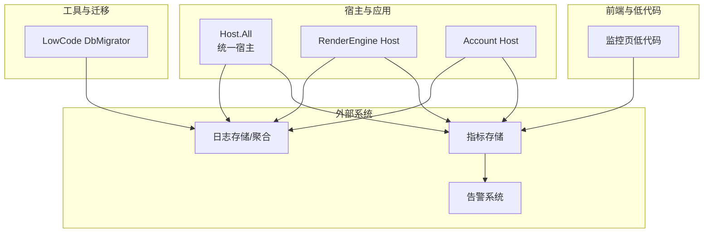
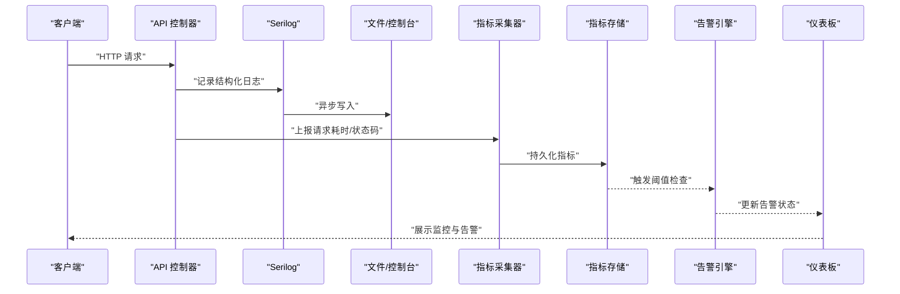
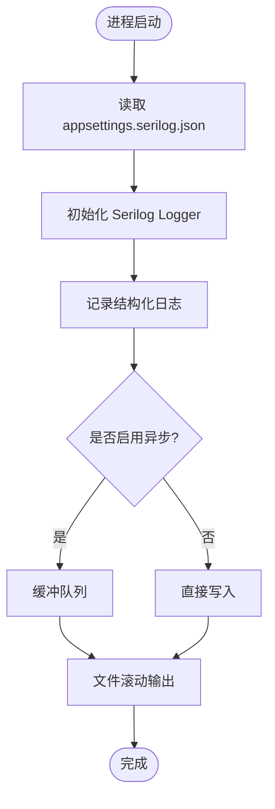
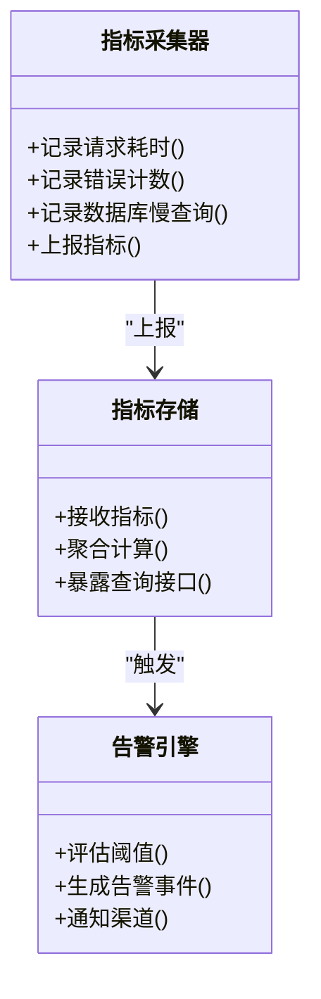
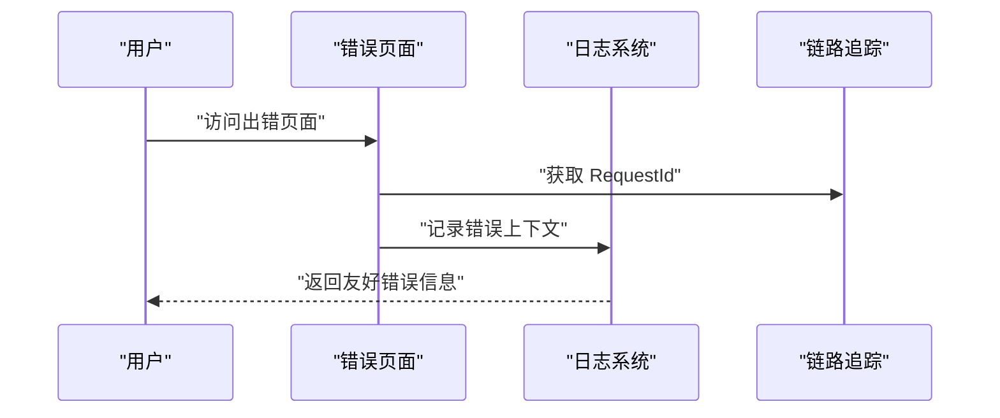
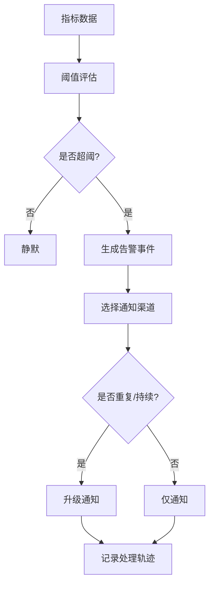
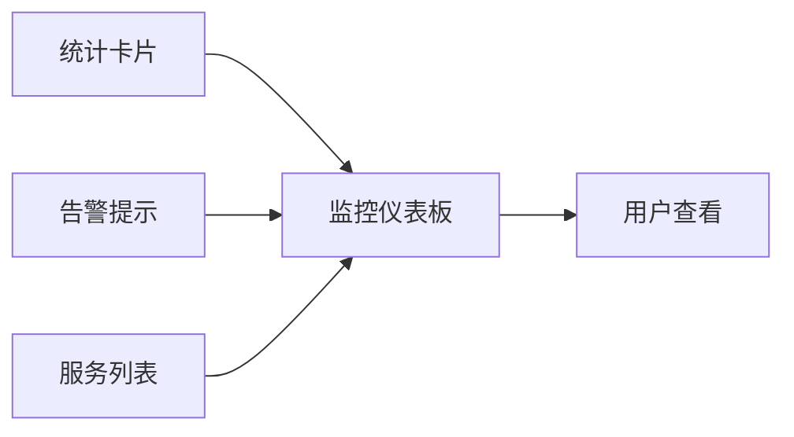
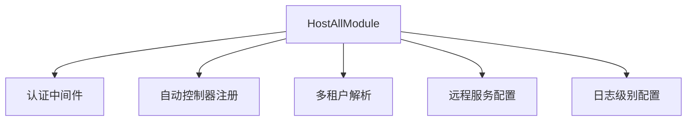

# 监控告警体系

<cite>
**本文引用的文件**   
- [Program.cs](file://src/Tools/H.LowCode.DbMigrator/Program.cs)
- [appsettings.serilog.json](file://src/Tools/H.LowCode.DbMigrator/appsettings.serilog.json)
- [appsettings.json（Host.All）](file://src/Host/H.AppLab.Host.All/H.AppLab.Host.All/appsettings.json)
- [appsettings.json（RenderEngine Host）](file://src/Host/RenderEngine/H.LowCode.RenderEngine.Host/appsettings.json)
- [Error.razor（Host.All）](file://src/Host/H.AppLab.Host.All/H.AppLab.Host.All/Components/Pages/Error.razor)
- [Error.razor（Account Host）](file://src/Host/Account/H.Account.Host/Components/Pages/Error.razor)
- [Error.razor（RenderEngine Host）](file://src/Host/RenderEngine/H.LowCode.RenderEngine.Host/Components/Pages/Error.razor)
- [HostAllModule.cs](file://src/Host/H.AppLab.Host.All/H.AppLab.Host.All/HostAllModule.cs)
- [uwz9o94b0.json（监控页）](file://src/LowCode/meta/apps/caseapp/page/uwz9o94b0.json)
- [ExecutionAndBatchDtos.cs](file://src/Services/Testing/H.Testing.Application.Contracts/Dtos/ExecutionAndBatchDtos.cs)
</cite>

## 目录
1. [简介](#简介)
2. [项目结构](#项目结构)
3. [核心组件](#核心组件)
4. [架构总览](#架构总览)
5. [详细组件分析](#详细组件分析)
6. [依赖关系分析](#依赖关系分析)
7. [性能考量](#性能考量)
8. [故障排查指南](#故障排查指南)
9. [结论](#结论)
10. [附录](#附录)

## 简介
本文件为 AppLab 平台构建“监控告警体系”的完整方案，覆盖日志收集与聚合、结构化日志格式、应用/数据库/消息队列等关键指标采集、错误追踪与异常监控、告警规则配置与管理、以及监控仪表板搭建与可视化。方案基于现有代码库中的 Serilog 日志配置、统一宿主模块、错误页面与低代码监控页面等基础能力进行扩展设计，确保可落地、可扩展、可运维。

## 项目结构
AppLab 采用多模块 ABP 模块化架构，包含多个 Host 与 Service 模块。监控相关的基础设施主要分布在：
- 工具程序（DbMigrator）中已集成 Serilog 并输出到文件与控制台
- 各 Host 应用通过 appsettings.json 配置 Logging 级别与连接串
- 统一宿主模块 HostAllModule 负责服务装配与中间件配置
- 前端低代码页面提供监控展示样例（统计卡片、告警提示、表格）

**图表来源** 
- [appsettings.json（Host.All）:1-115](file://src/Host/H.AppLab.Host.All/H.AppLab.Host.All/appsettings.json#L1-L115)
- [appsettings.json（RenderEngine Host）:1-47](file://src/Host/RenderEngine/H.LowCode.RenderEngine.Host/appsettings.json#L1-L47)
- [Program.cs:1-41](file://src/Tools/H.LowCode.DbMigrator/Program.cs#L1-L41)
- [uwz9o94b0.json（监控页）:1-1](file://src/LowCode/meta/apps/caseapp/page/uwz9o94b0.json#L1-L1)

**章节来源**
- [appsettings.json（Host.All）:1-115](file://src/Host/H.AppLab.Host.All/H.AppLab.Host.All/appsettings.json#L1-L115)
- [appsettings.json（RenderEngine Host）:1-47](file://src/Host/RenderEngine/H.LowCode.RenderEngine.Host/appsettings.json#L1-L47)
- [Program.cs:1-41](file://src/Tools/H.LowCode.DbMigrator/Program.cs#L1-L41)

## 核心组件
- 日志基础设施（Serilog）
  - 在工具程序中通过配置文件启用异步文件与控制台输出，支持按大小滚动与保留策略
  - 在 Host 应用中可通过 appsettings.json 调整默认日志级别
- 错误追踪
  - 各 Host 的错误页面会显示请求 ID，便于关联日志与链路追踪
- 监控展示（低代码）
  - 使用统计卡片、告警提示与表格展示 CPU、内存、在线服务数与服务状态列表

**章节来源**
- [appsettings.serilog.json:1-41](file://src/Tools/H.LowCode.DbMigrator/appsettings.serilog.json#L1-L41)
- [Program.cs:1-41](file://src/Tools/H.LowCode.DbMigrator/Program.cs#L1-L41)
- [appsettings.json（Host.All）:87-94](file://src/Host/H.AppLab.Host.All/H.AppLab.Host.All/appsettings.json#L87-L94)
- [Error.razor（Host.All）:1-36](file://src/Host/H.AppLab.Host.All/H.AppLab.Host.All/Components/Pages/Error.razor#L1-L36)
- [Error.razor（Account Host）:1-36](file://src/Host/Account/H.Account.Host/Components/Pages/Error.razor#L1-L36)
- [Error.razor（RenderEngine Host）:1-36](file://src/Host/RenderEngine/H.LowCode.RenderEngine.Host/Components/Pages/Error.razor#L1-L36)
- [uwz9o94b0.json（监控页）:1-1](file://src/LowCode/meta/apps/caseapp/page/uwz9o94b0.json#L1-L1)

## 架构总览
整体监控告警体系分为四层：
- 采集层：应用内结构化日志（Serilog）、HTTP 请求指标、数据库执行指标、业务事件指标
- 传输层：异步写入与缓冲（Serilog.Async），可选消息队列（如 RabbitMQ/Kafka）
- 存储与分析层：日志聚合（Elasticsearch/文件索引）、指标存储（Prometheus/时序数据库）
- 展示与告警层：Grafana/自定义仪表板、告警引擎（阈值、升级、多渠道通知）

**图表来源** 
- [appsettings.serilog.json:1-41](file://src/Tools/H.LowCode.DbMigrator/appsettings.serilog.json#L1-L41)
- [appsettings.json（Host.All）:87-94](file://src/Host/H.AppLab.Host.All/H.AppLab.Host.All/appsettings.json#L87-L94)

## 详细组件分析

### 日志收集与结构化日志
- 目标
  - 统一日志格式，包含时间戳、级别、来源上下文、事件ID、消息与异常
  - 异步写入避免阻塞主流程，支持文件滚动与保留策略
- 实现要点
  - 在工具程序中加载 appsettings.serilog.json，初始化全局 Logger
  - 在 Host 应用中通过 appsettings.json 控制日志级别
- 建议扩展
  - 增加 JSON 结构化输出以便聚合
  - 接入集中式日志平台（ELK/EFK）或对象存储

**图表来源** 
- [Program.cs:28-39](file://src/Tools/H.LowCode.DbMigrator/Program.cs#L28-L39)
- [appsettings.serilog.json:1-41](file://src/Tools/H.LowCode.DbMigrator/appsettings.serilog.json#L1-L41)

**章节来源**
- [Program.cs:1-41](file://src/Tools/H.LowCode.DbMigrator/Program.cs#L1-L41)
- [appsettings.serilog.json:1-41](file://src/Tools/H.LowCode.DbMigrator/appsettings.serilog.json#L1-L41)
- [appsettings.json（Host.All）:87-94](file://src/Host/H.AppLab.Host.All/H.AppLab.Host.All/appsettings.json#L87-L94)

### 性能监控指标定义与采集
- 应用性能指标
  - HTTP 请求速率、延迟分布（P50/P95/P99）、错误率、并发数、线程池/GC 指标
- 数据库性能指标
  - 连接池使用率、慢查询数量、事务回滚率、锁等待时长
- 消息队列状态（建议）
  - 入队/出队速率、积压量、消费者滞后、重试次数
- 采集方式
  - 在 API 层埋点（请求开始/结束计时、状态码计数）
  - 使用 EF Core 诊断事件捕获 SQL 执行信息
  - 引入第三方指标库（如 OpenTelemetry/Prometheus）

**图表来源** 
- [ExecutionAndBatchDtos.cs:51-96](file://src/Services/Testing/H.Testing.Application.Contracts/Dtos/ExecutionAndBatchDtos.cs#L51-L96)

**章节来源**
- [ExecutionAndBatchDtos.cs:51-96](file://src/Services/Testing/H.Testing.Application.Contracts/Dtos/ExecutionAndBatchDtos.cs#L51-L96)

### 错误追踪与异常监控
- 错误页面
  - 各 Host 的错误页面会显示 RequestId，便于关联日志与分布式追踪
- 建议增强
  - 将 RequestId 注入日志上下文
  - 统一异常处理中间件，记录堆栈与上下文
  - 对接 APM 工具（如 Application Insights/Sentry）

**图表来源** 
- [Error.razor（Host.All）:1-36](file://src/Host/H.AppLab.Host.All/H.AppLab.Host.All/Components/Pages/Error.razor#L1-L36)
- [Error.razor（Account Host）:1-36](file://src/Host/Account/H.Account.Host/Components/Pages/Error.razor#L1-L36)
- [Error.razor（RenderEngine Host）:1-36](file://src/Host/RenderEngine/H.LowCode.RenderEngine.Host/Components/Pages/Error.razor#L1-L36)

**章节来源**
- [Error.razor（Host.All）:1-36](file://src/Host/H.AppLab.Host.All/H.AppLab.Host.All/Components/Pages/Error.razor#L1-L36)
- [Error.razor（Account Host）:1-36](file://src/Host/Account/H.Account.Host/Components/Pages/Error.razor#L1-L36)
- [Error.razor（RenderEngine Host）:1-36](file://src/Host/RenderEngine/H.LowCode.RenderEngine.Host/Components/Pages/Error.razor#L1-L36)

### 告警规则配置与管理
- 阈值设置
  - 应用错误率 > X%、P99 延迟 > Y ms、数据库慢查询 > Z
- 通知渠道
  - 邮件、企业微信、钉钉、短信、电话
- 升级策略
  - 首次告警通知值班人员，持续未恢复则升级至主管/负责人
- 管理方式
  - 通过配置中心动态更新规则，支持灰度与版本化管理

[此图为概念流程图，不映射具体源码文件]

### 监控仪表板搭建与可视化
- 低代码监控页
  - 使用统计卡片展示 CPU、内存、在线服务数
  - 使用告警组件展示当前告警摘要
  - 使用表格展示服务状态与最近检测时间
- 建议扩展
  - 接入时序数据库，实时刷新指标
  - 增加趋势图、热力图、拓扑图

**图表来源** 
- [uwz9o94b0.json（监控页）:1-1](file://src/LowCode/meta/apps/caseapp/page/uwz9o94b0.json#L1-L1)

**章节来源**
- [uwz9o94b0.json（监控页）:1-1](file://src/LowCode/meta/apps/caseapp/page/uwz9o94b0.json#L1-L1)

## 依赖关系分析
- 宿主模块 HostAllModule 负责装配所有应用模块与中间件
- 各 Host 应用通过 appsettings.json 配置日志级别与连接串
- 工具程序通过 Serilog 配置文件初始化日志输出

**图表来源** 
- [HostAllModule.cs:1-203](file://src/Host/H.AppLab.Host.All/H.AppLab.Host.All/HostAllModule.cs#L1-L203)
- [appsettings.json（Host.All）:1-115](file://src/Host/H.AppLab.Host.All/H.AppLab.Host.All/appsettings.json#L1-L115)

**章节来源**
- [HostAllModule.cs:1-203](file://src/Host/H.AppLab.Host.All/H.AppLab.Host.All/HostAllModule.cs#L1-L203)
- [appsettings.json（Host.All）:1-115](file://src/Host/H.AppLab.Host.All/H.AppLab.Host.All/appsettings.json#L1-L115)

## 性能考量
- 日志写入应异步化，避免阻塞主线程
- 指标上报需批量与去重，降低网络开销
- 数据库慢查询与连接池监控有助于识别瓶颈
- 告警规则应避免频繁抖动，加入冷却与抑制机制

[本节为通用指导，不引用具体文件]

## 故障排查指南
- 定位问题
  - 通过错误页面的 RequestId 关联日志与链路
  - 检查 Serilog 输出文件与控制台日志
  - 查看指标存储中的异常与延迟峰值
- 常见场景
  - 高错误率：检查 API 控制器异常处理与依赖服务可用性
  - 高延迟：检查数据库慢查询与外部接口超时
  - 告警风暴：检查阈值与冷却策略

**章节来源**
- [Error.razor（Host.All）:1-36](file://src/Host/H.AppLab.Host.All/H.AppLab.Host.All/Components/Pages/Error.razor#L1-L36)
- [appsettings.serilog.json:1-41](file://src/Tools/H.LowCode.DbMigrator/appsettings.serilog.json#L1-L41)

## 结论
本方案以现有 Serilog 日志与错误页面为基础，结合低代码监控页，构建了可扩展的监控告警体系。后续建议引入集中式日志平台、APM 与指标存储，完善告警规则与通知渠道，提升系统的可观测性与稳定性。

[本节为总结性内容，不引用具体文件]

## 附录
- 术语表
  - 结构化日志：包含固定字段与上下文的机器可读日志
  - 指标：可量化的系统行为数据（如延迟、错误率）
  - 告警：当指标超过阈值时触发的通知
- 参考路径
  - 日志配置：[appsettings.serilog.json:1-41](file://src/Tools/H.LowCode.DbMigrator/appsettings.serilog.json#L1-L41)
  - 宿主装配：[HostAllModule.cs:1-203](file://src/Host/H.AppLab.Host.All/H.AppLab.Host.All/HostAllModule.cs#L1-L203)
  - 监控页：[uwz9o94b0.json:1-1](file://src/LowCode/meta/apps/caseapp/page/uwz9o94b0.json#L1-L1)

[本节为补充信息，不引用具体文件]