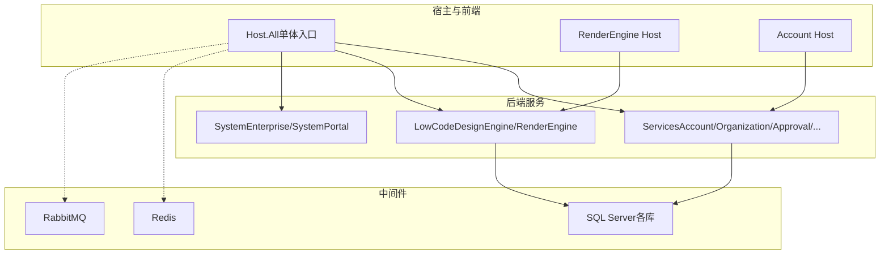
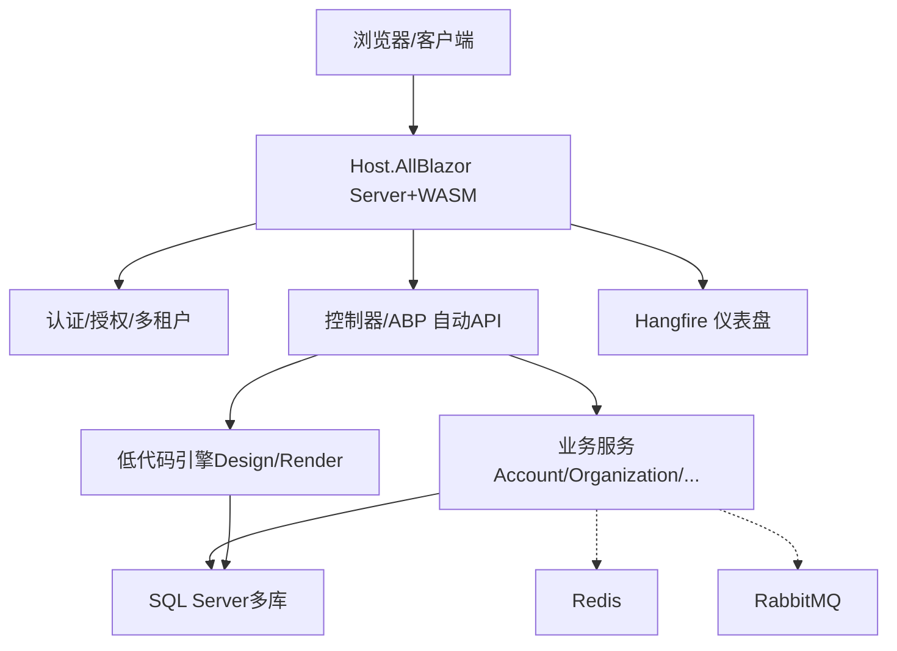
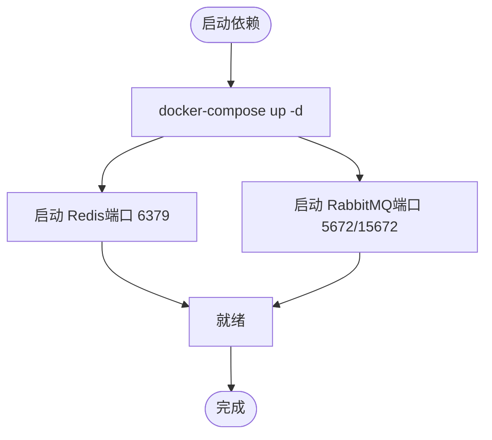
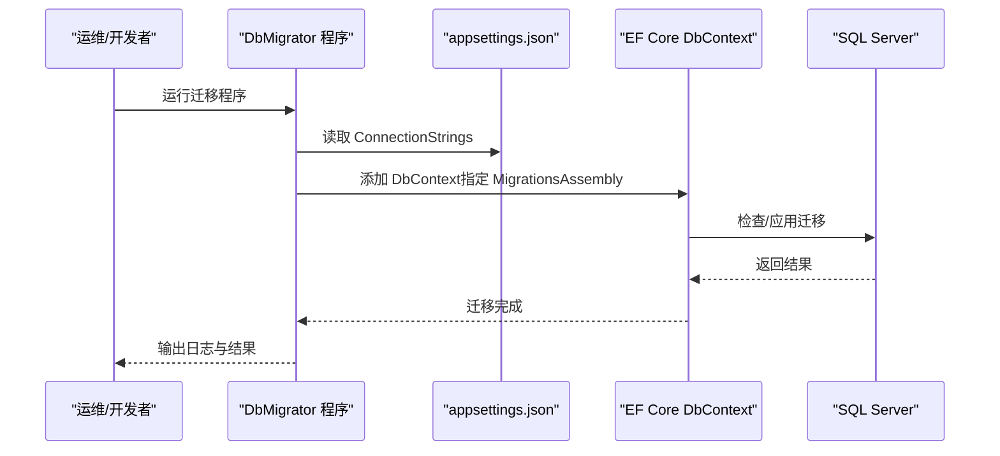
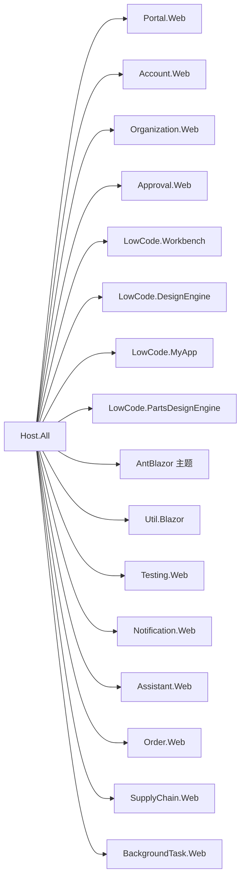

# 部署运维

<cite>
**本文引用的文件**   
- [README.md](file://README.md)
- [docker-compose.yml](file://cd/docker-compose.yml)
- [Program.cs（Host.All）](file://src/Host/H.AppLab.Host.All/H.AppLab.Host.All/Program.cs)
- [appsettings.json（Host.All）](file://src/Host/H.AppLab.Host.All/H.AppLab.Host.All/appsettings.json)
- [Program.cs（RenderEngine Host）](file://src/Host/RenderEngine/H.LowCode.RenderEngine.Host/Program.cs)
- [Program.cs（Account Host）](file://src/Host/Account/H.Account.Host/Program.cs)
- [Program.cs（Notification DbMigrator）](file://src/Tools/H.Notification.DbMigrator/Program.cs)
- [Program.cs（Organization DbMigrator）](file://src/Tools/H.Organization.DbMigrator/Program.cs)
- [Program.cs（Approval DbMigrator）](file://src/Tools/H.Approval.DbMigrator/Program.cs)
- [Program.cs（Assistant DbMigrator）](file://src/Tools/H.Assistant.DbMigrator/Program.cs)
- [appsettings.json（LowCode DbMigrator）](file://src/Tools/H.LowCode.DbMigrator/appsettings.json)
- [global.json](file://src/global.json)
</cite>

## 目录
1. [简介](#简介)
2. [项目结构](#项目结构)
3. [核心组件](#核心组件)
4. [架构总览](#架构总览)
5. [详细组件分析](#详细组件分析)
6. [依赖关系分析](#依赖关系分析)
7. [性能考虑](#性能考虑)
8. [故障排查指南](#故障排查指南)
9. [结论](#结论)
10. [附录](#附录)

## 简介
本文件为 AppLab 平台的部署与运维手册，面向生产环境，覆盖容器化编排、镜像构建、环境变量配置、监控告警、备份恢复、性能调优、容量规划、CI/CD 流水线与自动化部署等主题。平台基于 .NET + Blazor，支持单体与按服务独立部署两种模式，内置 Redis、RabbitMQ 等中间件，并提供多数据库迁移工具。

## 项目结构
- 宿主程序：H.AppLab.Host.All 提供单体入口；各业务域（如 Account、RenderEngine）可独立宿主运行。
- 低代码引擎：DesignEngine 负责可视化设计，RenderEngine 负责运行时渲染。
- 企业级服务：Services 下按限界上下文划分多个子系统。
- 系统应用：System 下的 Enterprise、SystemPortal 面向平台运营侧。
- 工具：Tools 下包含各服务的 DbMigrator 控制台程序，用于数据库初始化与升级。
- 依赖：Redis、RabbitMQ 通过 docker-compose 管理。

图表来源 
- [Program.cs（Host.All）:1-115](file://src/Host/H.AppLab.Host.All/H.AppLab.Host.All/Program.cs#L1-L115)
- [Program.cs（RenderEngine Host）:1-79](file://src/Host/RenderEngine/H.LowCode.RenderEngine.Host/Program.cs#L1-L79)
- [Program.cs（Account Host）:1-48](file://src/Host/Account/H.Account.Host/Program.cs#L1-L48)

章节来源
- [README.md:1-74](file://README.md#L1-L74)

## 核心组件
- 宿主与管道
  - Host.All：注册 Blazor、SignalR、响应压缩、认证授权、Hangfire 仪表盘、静态资源与路由映射。
  - RenderEngine Host：启用 WASM 调试、异常处理、HSTS、响应压缩、静态资源缓存策略。
  - Account Host：启用 HSTS、状态码重定向、HTTPS 重定向、认证授权与反伪造。
- 配置与连接
  - appsettings.json（Host.All）集中定义数据库连接串、远程服务 BaseUrl、站点映射、日志级别、第三方集成（如云效）与外部登录。
  - global.json 锁定 SDK 版本，保证构建一致性。
- 数据迁移
  - Tools 下各 DbMigrator 读取 appsettings.json 中的 ConnectionStrings，使用 EF Core 执行迁移。

章节来源
- [Program.cs（Host.All）:1-115](file://src/Host/H.AppLab.Host.All/H.AppLab.Host.All/Program.cs#L1-L115)
- [Program.cs（RenderEngine Host）:1-79](file://src/Host/RenderEngine/H.LowCode.RenderEngine.Host/Program.cs#L1-L79)
- [Program.cs（Account Host）:1-48](file://src/Host/Account/H.Account.Host/Program.cs#L1-L48)
- [appsettings.json（Host.All）:1-115](file://src/Host/H.AppLab.Host.All/H.AppLab.Host.All/appsettings.json#L1-L115)
- [Program.cs（Notification DbMigrator）:42-57](file://src/Tools/H.Notification.DbMigrator/Program.cs#L42-L57)
- [Program.cs（Organization DbMigrator）:42-57](file://src/Tools/H.Organization.DbMigrator/Program.cs#L42-L57)
- [Program.cs（Approval DbMigrator）:42-57](file://src/Tools/H.Approval.DbMigrator/Program.cs#L42-L57)
- [Program.cs（Assistant DbMigrator）:42-57](file://src/Tools/H.Assistant.DbMigrator/Program.cs#L42-L57)
- [appsettings.json（LowCode DbMigrator）:1-9](file://src/Tools/H.LowCode.DbMigrator/appsettings.json#L1-L9)
- [global.json:1-7](file://src/global.json#L1-L7)

## 架构总览
AppLab 采用模块化架构，支持单体与微服务两种形态。Host.All 作为统一入口聚合各 Web 模块与服务；RenderEngine 与 DesignEngine 分别承担运行时与设计时职责；各业务域服务共享通用契约与基础设施。中间件层由 Redis、RabbitMQ、SQL Server 组成，支撑缓存、消息与持久化。

图表来源 
- [Program.cs（Host.All）:1-115](file://src/Host/H.AppLab.Host.All/H.AppLab.Host.All/Program.cs#L1-L115)
- [Program.cs（RenderEngine Host）:1-79](file://src/Host/RenderEngine/H.LowCode.RenderEngine.Host/Program.cs#L1-L79)
- [Program.cs（Account Host）:1-48](file://src/Host/Account/H.Account.Host/Program.cs#L1-L48)

## 详细组件分析

### Docker 容器化与编排
- 依赖服务
  - Redis：精简镜像，设置时区、语言与密码（可通过 REDIS_ARGS 或命令参数）。
  - RabbitMQ：Management 插件、默认用户/密码、数据卷持久化。
- 启动方式
  - 将 cd/docker-compose.yml 复制到 WSL，执行 docker-compose up -d 启动依赖。
- 注意事项
  - 端口映射需避免冲突；敏感信息建议通过环境变量注入而非硬编码。

图表来源 
- [docker-compose.yml:1-32](file://cd/docker-compose.yml#L1-L32)

章节来源
- [README.md:38-56](file://README.md#L38-L56)
- [docker-compose.yml:1-32](file://cd/docker-compose.yml#L1-L32)

### 镜像构建与发布（推荐实践）
- 构建目标
  - 为每个宿主（Host.All、RenderEngine Host、Account Host）生成最小化镜像。
- 构建步骤（概念性说明）
  - 使用 .NET SDK 镜像进行还原与编译。
  - 使用 ASP.NET Runtime 镜像运行，仅拷贝发布产物。
  - 启用 AOT 与裁剪（Release 模式），减少体积。
- 发布产物
  - 静态资源与 WASM 程序集由 MapStaticAssets 统一处理，注意不要对 /_framework 整体标记 immutable，以免清单与指纹不一致导致加载失败。

章节来源
- [Program.cs（Host.All）:27-46](file://src/Host/H.AppLab.Host.All/H.AppLab.Host.All/Program.cs#L27-L46)
- [Program.cs（Host.All）:71-79](file://src/Host/H.AppLab.Host.All/H.AppLab.Host.All/Program.cs#L71-L79)
- [Program.cs（RenderEngine Host）:21-29](file://src/Host/RenderEngine/H.LowCode.RenderEngine.Host/Program.cs#L21-L29)
- [Program.cs（RenderEngine Host）:57-64](file://src/Host/RenderEngine/H.LowCode.RenderEngine.Host/Program.cs#L57-L64)

### 环境变量与配置管理
- 应用配置
  - Host.All 的 appsettings.json 集中管理数据库连接串、RemoteServices 基址、Sites 映射、日志级别、第三方集成与外部登录开关。
- 运行时配置
  - 生产环境建议通过环境变量或挂载配置文件覆盖敏感项（如连接串、令牌、回调路径）。
- 迁移配置
  - DbMigrator 读取自身 appsettings.json 的 ConnectionStrings，确保迁移目标库正确。

章节来源
- [appsettings.json（Host.All）:1-115](file://src/Host/H.AppLab.Host.All/H.AppLab.Host.All/appsettings.json#L1-L115)
- [appsettings.json（LowCode DbMigrator）:1-9](file://src/Tools/H.LowCode.DbMigrator/appsettings.json#L1-L9)

### 数据库迁移流程
- 迁移入口
  - 各 DbMigrator 程序通过 AddDbContext 指定 MigrationsAssembly，从 appsettings.json 获取连接串并执行迁移。
- 执行顺序
  - 先执行基础库（如 OrganizationDb、AccountDb），再执行业务库（Approval、Notification、Order、SupplyChain、BackgroundTask 等）。
- 常见问题
  - 连接串错误、权限不足、迁移程序集未正确引用。

图表来源 
- [Program.cs（Notification DbMigrator）:42-57](file://src/Tools/H.Notification.DbMigrator/Program.cs#L42-L57)
- [Program.cs（Organization DbMigrator）:42-57](file://src/Tools/H.Organization.DbMigrator/Program.cs#L42-L57)
- [Program.cs（Approval DbMigrator）:42-57](file://src/Tools/H.Approval.DbMigrator/Program.cs#L42-L57)
- [Program.cs（Assistant DbMigrator）:42-57](file://src/Tools/H.Assistant.DbMigrator/Program.cs#L42-L57)
- [appsettings.json（LowCode DbMigrator）:1-9](file://src/Tools/H.LowCode.DbMigrator/appsettings.json#L1-L9)

章节来源
- [Program.cs（Notification DbMigrator）:42-57](file://src/Tools/H.Notification.DbMigrator/Program.cs#L42-L57)
- [Program.cs（Organization DbMigrator）:42-57](file://src/Tools/H.Organization.DbMigrator/Program.cs#L42-L57)
- [Program.cs（Approval DbMigrator）:42-57](file://src/Tools/H.Approval.DbMigrator/Program.cs#L42-L57)
- [Program.cs（Assistant DbMigrator）:42-57](file://src/Tools/H.Assistant.DbMigrator/Program.cs#L42-L57)
- [appsettings.json（LowCode DbMigrator）:1-9](file://src/Tools/H.LowCode.DbMigrator/appsettings.json#L1-L9)

### 认证与授权
- Cookie 认证
  - Host.All 配置了主系统与系统侧两套 Cookie 认证方案，含登录路径、过期时间与滑动过期。
- 安全头
  - RenderEngine Host 与 Account Host 在非开发环境启用 HSTS 与异常处理器。
- 反伪造
  - 所有 Host 均启用 Antiforgery，防止 CSRF 攻击。

章节来源
- [Program.cs（Host.All）:82-85](file://src/Host/H.AppLab.Host.All/H.AppLab.Host.All/Program.cs#L82-L85)
- [Program.cs（Account Host）:20-31](file://src/Host/Account/H.Account.Host/Program.cs#L20-L31)
- [Program.cs（RenderEngine Host）:44-52](file://src/Host/RenderEngine/H.LowCode.RenderEngine.Host/Program.cs#L44-L52)

### 后台任务与监控面板
- Hangfire
  - Host.All 暴露 /hangfire 仪表盘，便于查看任务队列与执行历史。
- 信号量与并发
  - SignalR 最大接收消息大小与详细错误仅在开发环境开启。

章节来源
- [Program.cs（Host.All）:14-19](file://src/Host/H.AppLab.Host.All/H.AppLab.Host.All/Program.cs#L14-L19)
- [Program.cs（Host.All）:90-92](file://src/Host/H.AppLab.Host.All/H.AppLab.Host.All/Program.cs#L90-L92)

## 依赖关系分析
- 宿主依赖
  - Host.All 依赖各 Web 模块的 _Imports 程序集以启用交互式 WASM 渲染。
  - RenderEngine Host 通过 LowCodeGlobalVariables 动态扩展额外程序集。
- 中间件依赖
  - Redis、RabbitMQ 通过环境变量或连接串注入到服务中（具体连接由服务配置决定）。
- 数据库依赖
  - 各服务 DbContext 对应独立数据库，迁移程序与宿主分离。

图表来源 
- [Program.cs（Host.All）:93-112](file://src/Host/H.AppLab.Host.All/H.AppLab.Host.All/Program.cs#L93-L112)

章节来源
- [Program.cs（Host.All）:93-112](file://src/Host/H.AppLab.Host.All/H.AppLab.Host.All/Program.cs#L93-L112)

## 性能考虑
- 响应压缩
  - Host.All 与 RenderEngine Host 均启用 Brotli/Gzip 压缩，提升 WASM 资源传输效率。
- 静态资源缓存
  - MapStaticAssets 对带指纹的程序集启用不可变缓存；避免对 /_framework 整体标记 immutable，防止清单与指纹不一致。
- JSON 序列化
  - 统一使用驼峰命名策略，减少前后端键名差异带来的解析开销。
- 调试与优化
  - 开发环境开启 WASM 调试；生产环境关闭详细错误，启用 HSTS。

章节来源
- [Program.cs（Host.All）:27-46](file://src/Host/H.AppLab.Host.All/H.AppLab.Host.All/Program.cs#L27-L46)
- [Program.cs（Host.All）:71-79](file://src/Host/H.AppLab.Host.All/H.AppLab.Host.All/Program.cs#L71-L79)
- [Program.cs（RenderEngine Host）:21-29](file://src/Host/RenderEngine/H.LowCode.RenderEngine.Host/Program.cs#L21-L29)
- [Program.cs（RenderEngine Host）:57-64](file://src/Host/RenderEngine/H.LowCode.RenderEngine.Host/Program.cs#L57-L64)

## 故障排查指南
- 常见症状
  - 页面卡在“加载中...”：通常因 /_framework 缓存策略不当导致清单与指纹不匹配。
  - 认证失败：检查 Cookie 配置、登录路径与跨域设置。
  - 迁移失败：核对连接串、权限与 MigrationsAssembly。
- 诊断步骤
  - 查看 Hangfire 仪表盘确认后台任务执行情况。
  - 检查 SignalR 详细错误（仅开发环境）。
  - 验证静态资源是否被正确压缩与缓存。
  - 使用浏览器开发者工具观察网络请求与资源加载。
- 工具与命令
  - docker-compose logs 查看依赖服务日志。
  - dotnet run --project <DbMigrator> 执行迁移并查看输出。
  - 访问 /hangfire 查看任务队列与错误堆栈。

章节来源
- [Program.cs（Host.All）:14-19](file://src/Host/H.AppLab.Host.All/H.AppLab.Host.All/Program.cs#L14-L19)
- [Program.cs（Host.All）:90-92](file://src/Host/H.AppLab.Host.All/H.AppLab.Host.All/Program.cs#L90-L92)
- [Program.cs（RenderEngine Host）:44-52](file://src/Host/RenderEngine/H.LowCode.RenderEngine.Host/Program.cs#L44-L52)
- [Program.cs（Account Host）:20-31](file://src/Host/Account/H.Account.Host/Program.cs#L20-L31)

## 结论
AppLab 提供了清晰的模块化架构与完善的宿主配置，结合 docker-compose 与 EF Core 迁移工具，可实现从本地开发到生产部署的完整闭环。建议在生产环境中严格区分配置与环境变量，启用压缩与安全头，完善监控与备份策略，并通过 CI/CD 实现自动化构建与发布。

## 附录

### 生产环境部署流程（建议）
- 准备阶段
  - 安装 .NET SDK（版本见 global.json）、Docker Engine+Compose。
  - 准备 SQL Server、Redis、RabbitMQ 实例或容器。
- 构建与发布
  - 使用 Release 模式构建各宿主与依赖库，启用 AOT 与裁剪。
  - 生成最小化镜像，仅包含运行时与发布产物。
- 配置与启动
  - 通过环境变量或挂载配置文件注入连接串、BaseUrls、密钥等。
  - 启动依赖服务（docker-compose up -d），执行各 DbMigrator 完成迁移。
  - 启动宿主镜像，暴露必要端口，启用 HTTPS 与 HSTS。
- 上线与验证
  - 访问 Host.All 入口，验证认证、菜单与核心功能。
  - 检查 Hangfire 仪表盘与日志，确认无异常。

章节来源
- [README.md:38-56](file://README.md#L38-L56)
- [global.json:1-7](file://src/global.json#L1-L7)
- [docker-compose.yml:1-32](file://cd/docker-compose.yml#L1-L32)
- [Program.cs（Host.All）:1-115](file://src/Host/H.AppLab.Host.All/H.AppLab.Host.All/Program.cs#L1-L115)

### 监控告警体系（建议）
- 日志收集
  - 集中采集应用日志（Serilog 或类似方案），输出至文件或远端存储。
  - 采集容器标准输出与错误流，统一接入日志平台。
- 性能监控
  - 采集 CPU、内存、磁盘、网络指标；监控 HTTP 请求延迟与错误率。
  - 针对关键接口与数据库查询建立慢查询监控。
- 错误追踪
  - 集成错误上报（如 Application Insights 或自建中心），关联请求 ID 与用户上下文。
  - 对 Hangfire 任务失败设置告警阈值。

[本节为通用指导，不直接分析具体文件]

### 备份恢复与灾难恢复（建议）
- 数据备份
  - 定期全量与增量备份 SQL Server 各库；保留至少 N 份历史副本。
  - 备份 Redis 快照与 RabbitMQ 持久化数据卷。
- 恢复演练
  - 制定恢复 SOP，定期进行恢复演练，验证 RTO/RPO 目标。
- 高可用
  - 数据库主从或集群；中间件集群化部署；应用多副本与负载均衡。

[本节为通用指导，不直接分析具体文件]

### 容量规划（建议）
- 计算资源
  - 根据峰值 QPS、并发会话数与 WASM 下载带宽估算 CPU/内存/带宽。
- 存储资源
  - 预估数据库增长速率与静态资源体积，预留扩容空间。
- 弹性伸缩
  - 基于指标触发水平扩缩容；冷启动时间纳入 SLA 评估。

[本节为通用指导，不直接分析具体文件]

### CI/CD 流水线（建议）
- 触发条件
  - 推送分支或合并 PR 触发构建；标签触发生产发布。
- 构建阶段
  - 还原、编译、单元测试、静态分析。
- 打包与镜像
  - 生成发布包，构建最小化镜像并推送到镜像仓库。
- 部署阶段
  - 更新 docker-compose 或编排平台配置，滚动重启服务。
- 验证与回滚
  - 健康检查与冒烟测试；失败自动回滚。

[本节为通用指导，不直接分析具体文件]