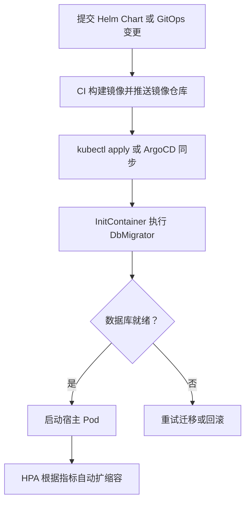
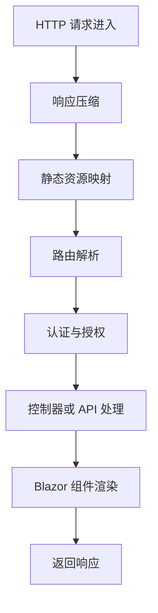

# 部署运维

<cite>
**本文引用的文件**   
- [README.md](file://README.md)
- [docker-compose.yml](file://cd/cd\docker-compose.yml)
- [Program.cs（主宿主）](file://src/Host/H.AppLab.Web.Host/H.AppLab.Web.Host/Program.cs)
- [Program.cs（账户宿主）](file://src/Host/Account/H.Account.Host/Program.cs)
- [Program.cs（渲染引擎宿主）](file://src/Host/RenderEngine/H.LowCode.RenderEngine.Host/Program.cs)
- [Program.cs（低代码数据库迁移工具）](file://src/Tools/H.LowCode.DbMigrator/Program.cs)
- [Program.cs（账户数据库迁移工具）](file://src/Tools/H.Account.DbMigrator/Program.cs)
- [appsettings.json（主宿主）](file://src/Host/H.AppLab.Web.Host/H.AppLab.Web.Host/appsettings.json)
- [appsettings.json（账户宿主）](file://src/Host/Account/H.Account.Host/appsettings.json)
- [appsettings.json（渲染引擎宿主）](file://src/Host/RenderEngine/H.LowCode.RenderEngine.Host/appsettings.json)
- [appsettings.json（低代码数据库迁移工具）](file://src/Tools/H.LowCode.DbMigrator/appsettings.json)
- [appsettings.json（账户数据库迁移工具）](file://src/Tools/H.Account.DbMigrator/appsettings.json)
</cite>

## 目录
1. [引言](#引言)
2. [项目结构与部署边界](#项目结构与部署边界)
3. [容器化与编排方案](#容器化与编排方案)
4. [生产环境配置管理](#生产环境配置管理)
5. [性能调优指南](#性能调优指南)
6. [监控、日志与告警体系](#监控日志与告警体系)
7. [故障排查手册](#故障排查手册)
8. [结论](#结论)

## 引言
H.AppLab 是一个基于 .NET 与 Blazor 的模块化应用平台，支持单体部署和按服务独立部署。平台包含宿主程序、低代码设计引擎与渲染引擎、多个企业级业务服务、系统门户以及数据库迁移工具。文档面向运维人员，说明如何在本地、Docker Compose、Kubernetes 等环境中完成 H.AppLab 的部署、配置、优化、监控与排障。

## 项目结构与部署边界
从仓库结构看，H.AppLab 由以下部署边界组成：

- Web 宿主层
  - 主宿主：聚合多模块的 Blazor Web App，作为统一入口。
  - 账户宿主：账户服务的独立宿主。
  - 渲染引擎宿主：低代码渲染引擎的独立宿主。
- 业务服务层
  - Account、Organization、Approval、AI、Notification、Order、Portal、Setting、SupplyChain、BackgroundTask、Testing 等服务，均遵循 Application.Contracts / Application / EntityFrameworkCore / Web 分层。
- 低代码核心
  - Common：元数据 Schema、组件基类、默认组件库、实体与应用契约。
  - DesignEngine：可视化设计端。
  - RenderEngine：根据元数据动态渲染应用。
- 系统级应用
  - Enterprise、SystemPortal，面向平台运营侧。
- 工具
  - 各服务的 DbMigrator 控制台程序，用于初始化或更新数据库结构。

```mermaid
graph TB
    subgraph "Web 宿主"
        HostAll["主宿主<br/>H.AppLab.Web.Host"]
        HostAccount["账户宿主<br/>H.Account.Host"]
        HostRender["渲染引擎宿主<br/>H.LowCode.RenderEngine.Host"]
    end

    subgraph "业务服务"
        SAccount["Account"]
        SOrg["Organization"]
        SApproval["Approval"]
        SAi["AI"]
        SNotify["Notification"]
        SOrder["Order"]
        SPortal["Portal"]
        SSetting["Setting"]
        SSupply["SupplyChain"]
        SBackground["BackgroundTask"]
        STesting["Testing"]
    end

    subgraph "低代码核心"
        LCommon["Common"]
        LDesign["DesignEngine"]
        LRender["RenderEngine"]
    end

    subgraph "系统级应用"
        SysEnterprise["Enterprise"]
        SysPortal["SystemPortal"]
    end

    subgraph "工具"
        ToolsLowCode["H.LowCode.DbMigrator"]
        ToolsAccount["H.Account.DbMigrator"]
    end

    subgraph "外部依赖"
        DB["数据库"]
        Redis["缓存"]
        MQ["消息队列"]
        Minio["对象存储"]
    end

    HostAll --> SAccount
    HostAll --> SOrg
    HostAll --> SApproval
    HostAll --> SAi
    HostAll --> SNotify
    HostAll --> SOrder
    HostAll --> SPortal
    HostAll --> SSetting
    HostAll --> SSupply
    HostAll --> SBackground
    HostAll --> STesting

    HostRender --> LRender
    HostAccount --> SAccount

    LDesign --> LCommon
    LRender --> LCommon

    ToolsLowCode --> DB
    ToolsAccount --> DB

    SAccount --> DB
    SOrg --> DB
    SApproval --> DB
    SAi --> DB
    SNotify --> DB
    SOrder --> DB
    SSetting --> DB
    SSupply --> DB
    SBackground --> DB
    STesting --> DB
    SysEnterprise --> DB
    SysPortal --> DB

    SBackground --> Redis
    SBackground --> MQ
    SNotify --> MQ
    SAccount --> Redis
    SOrg --> Redis
    SApproval --> Redis
    SAi --> Redis
    SNotify --> Redis
    SOrder --> Redis
    SSetting --> Redis
    SSupply --> Redis
    STesting --> Redis
    SysEnterprise --> Redis
    SysPortal --> Redis

    SFile["File"] --> Minio
```

**图表来源**
- [README.md:1-73](file://README.md#L1-L73)

**章节来源**
- [README.md:1-73](file://README.md#L1-L73)

## 容器化与编排方案

### Docker 镜像构建建议
仓库中未提供显式 Dockerfile，但所有宿主和工具均为 .NET 应用，适合采用多阶段构建镜像。推荐做法：

- 基础镜像
  - 使用官方 .NET SDK 镜像进行编译，再使用 .NET ASP.NET Core Runtime 镜像运行。
  - 若启用 AOT 或裁剪，需选择对应 runtime 镜像。
- 构建阶段
  - 安装 .NET SDK，恢复 NuGet 包，编译解决方案。
  - 针对 Release 模式构建，确保启用了响应压缩、Brotli/Gzip 压缩及静态资源指纹化。
- 运行阶段
  - 复制发布产物到运行时镜像。
  - 暴露端口：默认 HTTP 5045，HTTPS 7065。
  - 设置工作目录为发布目录。
  - 通过环境变量注入连接字符串、远程服务地址、密钥等敏感信息。
- 最小化镜像
  - 使用 `dotnet publish --self-contained=false` 配合公共运行时镜像。
  - 仅复制必要文件和 wwwroot 静态资源。
  - 非 root 用户运行容器。

示例构建命令（概念性步骤）：
- 在根目录执行 .NET 发布命令，输出到 `bin/Release/netX.X/publish`。
- 将发布目录复制到运行时镜像的工作目录。
- 设置 `ASPNETCORE_URLS=https://+:7065;http://+:5045` 与 `ASPNETCORE_ENVIRONMENT=Production`。

### Docker Compose 编排
仓库提供了 `cd/cd/docker-compose.yml`，用于启动依赖服务。典型编排应包含：

- 基础设施服务
  - SQL Server：持久化数据库卷。
  - Redis：缓存与会话。
  - RabbitMQ：异步任务与通知。
  - MinIO：文件对象存储。
- 应用服务
  - 主宿主：映射 5045/7065。
  - 账户宿主：映射独立端口。
  - 渲染引擎宿主：映射独立端口。
  - 各业务服务：按需独立部署。
- 网络与卷
  - 使用自定义网络隔离应用与依赖。
  - 为数据库、Redis、MinIO 创建命名卷。
- 健康检查
  - 为每个服务添加健康检查，避免启动顺序问题。
- 环境变量
  - 通过 `.env` 或 compose 的 `environment` 注入连接字符串、密钥、外部端点等。

参考文件位置：
- [docker-compose.yml](file://cd/cd\docker-compose.yml)

**章节来源**
- [docker-compose.yml](file://cd/cd\docker-compose.yml)

### Kubernetes 集群部署
推荐采用 Helm Chart 或 Kustomize 管理资源清单，关键要素如下：

- Deployment
  - 每个宿主与服务一个 Deployment。
  - 副本数按负载调整；主宿主要求高可用。
- Service
  - ClusterIP 内部访问，NodePort/LoadBalancer 对外暴露。
  - HTTPS 建议使用 Ingress + TLS。
- ConfigMap 与 Secret
  - ConfigMap：非敏感配置，如日志级别、远端服务基础地址。
  - Secret：连接字符串、JWT 密钥、第三方应用 ClientSecret、MinIO 密钥等。
- PersistentVolumeClaim
  - 数据库、MinIO 数据持久化。
- HorizontalPodAutoscaler
  - 基于 CPU、内存或自定义指标自动扩缩容。
- InitContainer
  - 先执行 DbMigrator，确保数据库结构就绪后再启动宿主。
- LivenessProbe 与 ReadinessProbe
  - 使用 `/healthz` 或内置健康端点。
- NetworkPolicy
  - 限制跨命名空间访问，仅允许网关与后端通信。

概念流程：

```mermaid
flowchart TD
    Start["提交 Helm Chart 或 GitOps 变更"] --> Build["CI 构建镜像并推送镜像仓库"]
    Build --> Apply["kubectl apply 或 ArgoCD 同步"]
    Apply --> InitDb["InitContainer 执行 DbMigrator"]
    InitDb --> Ready{"数据库就绪？"}
    Ready -->|是| RunApp["启动宿主 Pod"]
    Ready -->|否| Retry["重试迁移或回滚"]
    RunApp --> Scale["HPA 根据指标自动扩缩容"]
```

[本图为概念流程图，不直接映射具体源码文件]

## 生产环境配置管理

### 配置文件与环境变量
宿主和服务通过 ASP.NET Core 的配置系统加载 `appsettings.json`，并在运行时可被环境变量覆盖。关键配置项包括：

- 连接字符串
  - 主宿主定义了多个数据库连接：OrganizationDb、AccountDb、DesignEngineDb、RenderEngineDb、ApprovalDb、NotificationDb、AIDb、EnterpriseDb、OrderDb、SettingDb、SupplyChainDb、TestingDb、BackgroundTaskDb、FileDb。
  - 渲染引擎宿主定义了 Default 连接。
  - 数据库迁移工具各自定义对应的连接字符串。
- 远端服务地址
  - 主宿主的 `RemoteServices` 节点统一管理各服务的 BaseUrl，例如 DesignEngine、RenderEngine、Account、Organization、Approval、Testing、Portal、Notification、AI、Enterprise、Order、Setting、SupplyChain、SystemPortal、BackgroundTask、File。
- 站点与路由
  - 主宿主的 `Sites` 节点配置应用 ID 与站点 URL。
- 第三方集成
  - YunXiao：组织 ID、个人令牌、端点。
  - ExternalLogin：微信、钉钉登录开关与凭据。
  - MinIO：Endpoint、AccessKey、SecretKey、UseSsl、ExternalEndpoint。

生产环境建议：

- 使用 ConfigMap 挂载非敏感配置。
- 使用 Secret 注入敏感信息，并通过环境变量或 Kubernetes Secret 卷挂载。
- 禁止将密钥写入镜像或代码仓库。
- 使用不同环境的配置区分：Development、Staging、Production。
- 对连接字符串使用托管身份或云厂商提供的密钥管理服务（如 Azure Key Vault、AWS Secrets Manager）。

参考文件位置：
- [appsettings.json（主宿主）](file://src/Host/H.AppLab.Web.Host/H.AppLab.Web.Host/appsettings.json)
- [appsettings.json（账户宿主）](file://src/Host/Account/H.Account.Host/appsettings.json)
- [appsettings.json（渲染引擎宿主）](file://src/Host/RenderEngine/H.LowCode.RenderEngine.Host/appsettings.json)
- [appsettings.json（低代码数据库迁移工具）](file://src/Tools/H.LowCode.DbMigrator/appsettings.json)
- [appsettings.json（账户数据库迁移工具）](file://src/Tools/H.Account.DbMigrator/appsettings.json)

**章节来源**
- [appsettings.json（主宿主）](file://src/Host/H.AppLab.Web.Host/H.AppLab.Web.Host/appsettings.json)
- [appsettings.json（账户宿主）](file://src/Host/Account/H.Account.Host/appsettings.json)
- [appsettings.json（渲染引擎宿主）](file://src/Host/RenderEngine/H.LowCode.RenderEngine.Host/appsettings.json)
- [appsettings.json（低代码数据库迁移工具）](file://src/Tools/H.LowCode.DbMigrator/appsettings.json)
- [appsettings.json（账户数据库迁移工具）](file://src/Tools/H.Account.DbMigrator/appsettings.json)

### 安全最佳实践
- JWT 密钥
  - 账户宿主的 `Jwt.SecretKey` 必须替换为高强度随机值，并通过 Secret 注入。
- 外部登录凭据
  - 微信、钉钉的 `ClientId`、`ClientSecret` 必须保密，仅在生产环境启用。
- HTTPS 与 HSTS
  - 生产环境强制 HTTPS，启用 HSTS。
- CORS 与 CSRF
  - 严格配置跨域策略，启用反伪造请求保护。
- 最小权限原则
  - 数据库账号仅授予所需权限；MinIO 使用最小权限策略。
- 审计与日志脱敏
  - 日志中不得记录密码、令牌、完整请求体等敏感信息。

**章节来源**
- [appsettings.json（账户宿主）](file://src/Host/Account/H.Account.Host/appsettings.json)
- [Program.cs（主宿主）](file://src/Host/H.AppLab.Web.Host/H.AppLab.Web.Host/Program.cs)

## 性能调优指南

### ASP.NET Core 与 Blazor 优化
- 响应压缩
  - 主宿主已启用 Brotli 与 Gzip 压缩，并扩展 MIME 类型以支持 WASM 程序集传输。
  - 渲染引擎宿主启用 Brotli 压缩。
- 静态资源缓存
  - 主宿主使用 `MapStaticAssets`，利用 Blazor 内容哈希机制实现长缓存。
  - 渲染引擎宿主为静态文件设置 `Cache-Control: public, max-age=600`。
- 信号量与 WebSocket
  - 主宿主配置 SignalR，最大接收消息大小为 1MB。
- 中间件顺序
  - 错误处理、HSTS、状态码页面、HTTPS 重定向、响应压缩、静态资源、路由、认证、授权、防伪造、控制器、Blazor 组件映射顺序需保持合理。

```mermaid
flowchart TD
    Request["HTTP 请求进入"] --> Compression["响应压缩"]
    Compression --> StaticAssets["静态资源映射"]
    StaticAssets --> Routing["路由解析"]
    Routing --> Auth["认证与授权"]
    Auth --> Controllers["控制器或 API 处理"]
    Controllers --> RazorComponents["Blazor 组件渲染"]
    RazorComponents --> Response["返回响应"]
```

**图表来源**
- [Program.cs（主宿主）](file://src/Host/H.AppLab.Web.Host/H.AppLab.Web.Host/Program.cs)
- [Program.cs（渲染引擎宿主）](file://src/Host/RenderEngine/H.LowCode.RenderEngine.Host/Program.cs)

**章节来源**
- [Program.cs（主宿主）](file://src/Host/H.AppLab.Web.Host/H.AppLab.Web.Host/Program.cs)
- [Program.cs（渲染引擎宿主）](file://src/Host/RenderEngine/H.LowCode.RenderEngine.Host/Program.cs)

### 数据库连接池与查询优化
- 连接字符串
  - 生产环境应使用服务器实例名或 IP，禁用 LocalDB。
  - 启用连接池参数，如 `Connection Timeout`、`Max Pool Size`、`Min Pool Size`。
- EF Core 优化
  - 启用 AsNoTracking 读多写少场景。
  - 分页查询避免全表扫描。
  - 索引设计与慢查询分析。
- 分库分表
  - 按限界上下文拆分数据库，降低单库压力。

参考连接字符串位置：
- [appsettings.json（主宿主）](file://src/Host/H.AppLab.Web.Host/H.AppLab.Web.Host/appsettings.json)
- [appsettings.json（渲染引擎宿主）](file://src/Host/RenderEngine/H.LowCode.RenderEngine.Host/appsettings.json)
- [appsettings.json（低代码数据库迁移工具）](file://src/Tools/H.LowCode.DbMigrator/appsettings.json)
- [appsettings.json（账户数据库迁移工具）](file://src/Tools/H.Account.DbMigrator/appsettings.json)

**章节来源**
- [appsettings.json（主宿主）](file://src/Host/H.AppLab.Web.Host/H.AppLab.Web.Host/appsettings.json)
- [appsettings.json（渲染引擎宿主）](file://src/Host/RenderEngine/H.LowCode.RenderEngine.Host/appsettings.json)
- [appsettings.json（低代码数据库迁移工具）](file://src/Tools/H.LowCode.DbMigrator/appsettings.json)
- [appsettings.json（账户数据库迁移工具）](file://src/Tools/H.Account.DbMigrator/appsettings.json)

### 缓存策略
- Redis
  - 使用 Redis 做会话缓存、热点数据缓存、分布式锁。
  - 设置过期时间，避免脏数据长期驻留。
  - 使用缓存穿透、击穿、雪崩防护策略。
- 浏览器缓存
  - 利用 Blazor 内容哈希与静态资源指纹化，减少重复下载。
  - CDN 加速静态资源与 WASM 程序集。

**章节来源**
- [Program.cs（主宿主）](file://src/Host/H.AppLab.Web.Host/H.AppLab.Web.Host/Program.cs)

### CDN 加速
- 将静态资源、WASM 程序集、主题资源部署到 CDN。
- 配置 CDN 缓存规则，结合版本号或内容哈希提高命中率。
- 对大文件启用 Brotli/Gzip 压缩。

[本节为通用指导，不直接分析具体源码文件]

## 监控、日志与告警体系

### 应用监控
- 健康检查
  - 为每个宿主暴露健康端点，供 Kubernetes 探针与负载均衡器探测。
- 性能指标
  - 启用 ASP.NET Core 指标采集，导出到 Prometheus。
  - 收集请求延迟、错误率、吞吐量、连接池使用率。
- 后台任务监控
  - 主宿主启用 Hangfire 仪表盘，路径为 `/hangfire`，可用于查看后台任务执行情况。

参考文件位置：
- [Program.cs（主宿主）](file://src/Host/H.AppLab.Web.Host/H.AppLab.Web.Host/Program.cs)

**章节来源**
- [Program.cs（主宿主）](file://src/Host/H.AppLab.Web.Host/H.AppLab.Web.Host/Program.cs)

### 日志收集
- Serilog
  - 渲染引擎宿主配置了 Serilog，输出到文件与控制台，支持文件大小滚动与保留数量。
- 结构化日志
  - 建议在业务服务中使用结构化日志，便于 ELK 或 Loki 分析。
- 日志分级
  - 生产环境降低调试日志级别，仅保留 Error 与 Warning。

参考文件位置：
- [appsettings.json（渲染引擎宿主）](file://src/Host/RenderEngine/H.LowCode.RenderEngine.Host/appsettings.json)
- [Program.cs（低代码数据库迁移工具）](file://src/Tools/H.LowCode.DbMigrator/Program.cs)

**章节来源**
- [appsettings.json（渲染引擎宿主）](file://src/Host/RenderEngine/H.LowCode.RenderEngine.Host/appsettings.json)
- [Program.cs（低代码数据库迁移工具）](file://src/Tools/H.LowCode.DbMigrator/Program.cs)

### 告警规则配置
- 关键指标阈值
  - 请求错误率超过阈值。
  - 平均响应时间超过阈值。
  - 数据库连接池耗尽。
  - Redis 连接失败或内存不足。
  - MinIO 上传失败。
- 告警渠道
  - 邮件、企业微信、钉钉、Slack、PagerDuty。
- 告警降噪
  - 合并重复告警，设置静默期。

[本节为通用指导，不直接分析具体源码文件]

## 故障排查手册

### 常见部署问题
- 数据库连接失败
  - 检查连接字符串是否正确，是否指向生产数据库而非 LocalDB。
  - 确认防火墙与安全组允许数据库端口访问。
  - 使用 DbMigrator 验证迁移是否成功。
- 远端服务不可达
  - 检查 `RemoteServices` 中的 BaseUrl 是否指向正确域名与端口。
  - 确认反向代理或 Ingress 已配置相应路由。
- 静态资源 404
  - 主宿主的 `MapStaticAssets` 顺序很重要，不要手动将整个 `/_framework` 标记为 immutable。
  - 重新构建后，确保浏览器能获取新的启动清单。

参考文件位置：
- [Program.cs（主宿主）](file://src/Host/H.AppLab.Web.Host/H.AppLab.Web.Host/Program.cs)
- [appsettings.json（主宿主）](file://src/Host/H.AppLab.Web.Host/H.AppLab.Web.Host/appsettings.json)

**章节来源**
- [Program.cs（主宿主）](file://src/Host/H.AppLab.Web.Host/H.AppLab.Web.Host/Program.cs)
- [appsettings.json（主宿主）](file://src/Host/H.AppLab.Web.Host/H.AppLab.Web.Host/appsettings.json)

### 性能瓶颈诊断
- 响应时间长
  - 检查响应压缩是否生效。
  - 检查数据库慢查询与索引缺失。
  - 检查 Redis 与 MQ 的可用性。
- 内存占用高
  - 检查是否有未释放的对象或循环引用。
  - 调整 GC 参数与连接池大小。
- WASM 加载缓慢
  - 检查 CDN 与浏览器缓存策略。
  - 确认 Brotli/Gzip 压缩已启用。

参考文件位置：
- [Program.cs（主宿主）](file://src/Host/H.AppLab.Web.Host/H.AppLab.Web.Host/Program.cs)
- [Program.cs（渲染引擎宿主）](file://src/Host/RenderEngine/H.LowCode.RenderEngine.Host/Program.cs)

**章节来源**
- [Program.cs（主宿主）](file://src/Host/H.AppLab.Web.Host/H.AppLab.Web.Host/Program.cs)
- [Program.cs（渲染引擎宿主）](file://src/Host/RenderEngine/H.LowCode.RenderEngine.Host/Program.cs)

### 安全漏洞排查
- JWT 密钥泄露
  - 立即轮换密钥，撤销旧令牌，强制用户重新登录。
- 外部登录未启用
  - 检查 `ExternalLogin.Enabled` 是否为 false。
- MinIO 凭据泄露
  - 轮换 AccessKey 与 SecretKey，检查对象存储权限策略。

参考文件位置：
- [appsettings.json（账户宿主）](file://src/Host/Account/H.Account.Host/appsettings.json)
- [appsettings.json（主宿主）](file://src/Host/H.AppLab.Web.Host/H.AppLab.Web.Host/appsettings.json)

**章节来源**
- [appsettings.json（账户宿主）](file://src/Host/Account/H.Account.Host/appsettings.json)
- [appsettings.json（主宿主）](file://src/Host/H.AppLab.Web.Host/H.AppLab.Web.Host/appsettings.json)

### 数据库迁移问题
- 迁移失败
  - 检查迁移工具的连接字符串是否正确。
  - 查看迁移日志与异常堆栈。
- 模型不一致
  - 确认 DbContextFactory 与 MigratorDbContext 的配置一致。
  - 重新生成迁移并应用到目标数据库。

参考文件位置：
- [Program.cs（账户数据库迁移工具）](file://src/Tools/H.Account.DbMigrator/Program.cs)
- [Program.cs（低代码数据库迁移工具）](file://src/Tools/H.LowCode.DbMigrator/Program.cs)
- [appsettings.json（低代码数据库迁移工具）](file://src/Tools/H.LowCode.DbMigrator/appsettings.json)
- [appsettings.json（账户数据库迁移工具）](file://src/Tools/H.Account.DbMigrator/appsettings.json)

**章节来源**
- [Program.cs（账户数据库迁移工具）](file://src/Tools/H.Account.DbMigrator/Program.cs)
- [Program.cs（低代码数据库迁移工具）](file://src/Tools/H.LowCode.DbMigrator/Program.cs)
- [appsettings.json（低代码数据库迁移工具）](file://src/Tools/H.LowCode.DbMigrator/appsettings.json)
- [appsettings.json（账户数据库迁移工具）](file://src/Tools/H.Account.DbMigrator/appsettings.json)

## 结论
H.AppLab 的部署运维应以模块化架构为基础，优先采用容器化与编排方式，结合 Kubernetes 实现高可用与弹性伸缩。生产环境应严格管理配置与密钥，启用 HTTPS、HSTS、响应压缩、缓存与 CDN，完善监控、日志与告警体系，并建立完善的故障排查流程。通过合理的性能调优与安全检查，可保障平台在生产环境中的稳定、高效与安全运行。