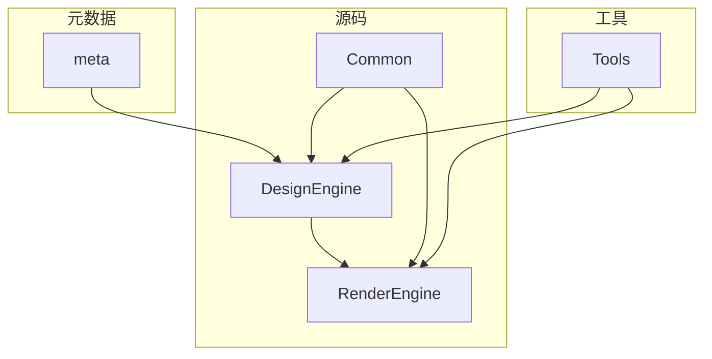
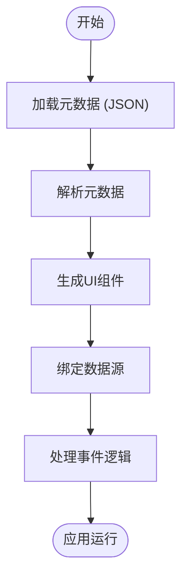
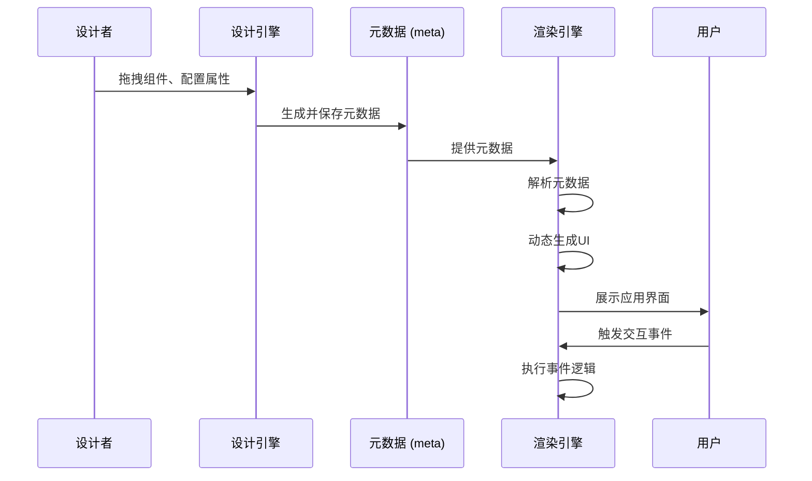
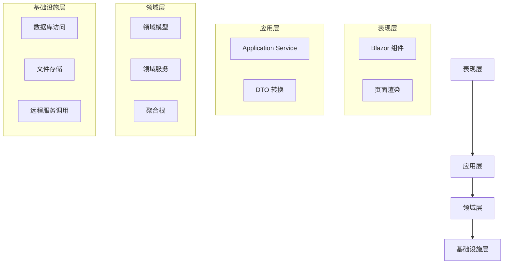
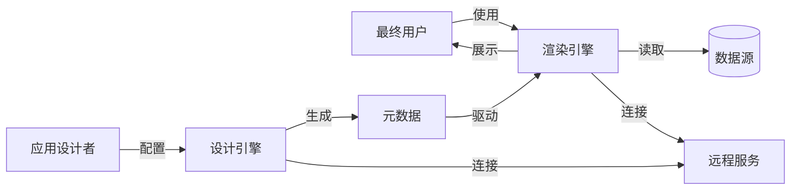
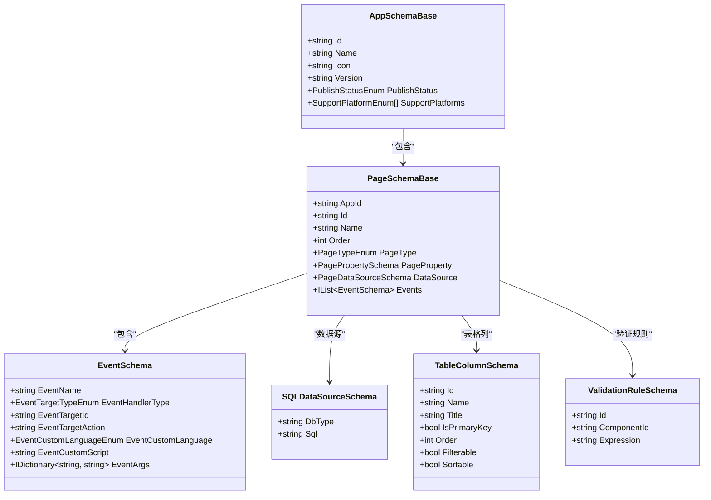

# 项目概述

<cite>
**本文档引用的文件**  
- [README.md](file://README.md)
- [AppSchemaBase.cs](file://src/Common/H.LowCode.MetaSchema/AppSchemaBase.cs)
- [PageSchemaBase.cs](file://src/Common/H.LowCode.MetaSchema/PageSchemaBase.cs)
- [SQLDataSourceSchema.cs](file://src/Common/H.LowCode.MetaSchema/DataSourceSchemas/SQLDataSourceSchema.cs)
- [EventSchema.cs](file://src/Common/H.LowCode.MetaSchema/PropertySchemas/EventSchema.cs)
- [TableColumnSchema.cs](file://src/Common/H.LowCode.MetaSchema/PropertySchemas/TableSchemas/TableColumnSchema.cs)
- [PageTypeEnum.cs](file://src/Common/H.LowCode.MetaSchema/Enums/PageTypeEnum.cs)
- [ComponentValueTypeEnum.cs](file://src/Common/H.LowCode.MetaSchema/Enums/ComponentValueTypeEnum.cs)
- [ValidationRuleSchema.cs](file://src/Common/H.LowCode.MetaSchema/PropertySchemas/ValidationRuleSchema.cs)
- [ComponentStyleSchema.cs](file://src/Common/H.LowCode.MetaSchema/PropertySchemas/ComponentStyleSchema.cs)
- [meta/apps/caseapp/caseapp.json](file://meta/apps/caseapp/caseapp.json)
- [meta/apps/testapp/testapp.json](file://meta/apps/testapp/testapp.json)
</cite>

## 目录
1. [项目概述](#项目概述)
2. [项目结构](#项目结构)
3. [核心架构与设计目标](#核心架构与设计目标)
4. [元数据驱动机制](#元数据驱动机制)
5. [设计引擎与渲染引擎协作](#设计引擎与渲染引擎协作)
6. [模块化分层架构](#模块化分层架构)
7. [Common模块共享功能](#common模块共享功能)
8. [元数据组织方式](#元数据组织方式)
9. [学习路径与扩展能力](#学习路径与扩展能力)
10. [系统上下文图](#系统上下文图)
11. [核心组件交互图](#核心组件交互图)

## 项目结构

本项目采用模块化分层架构，主要由 `meta`（元数据）、`src`（源码）和 `Tools`（工具）三大目录构成。`src` 目录下包含 `Common`（公共模块）、`DesignEngine`（设计引擎）、`RenderEngine`（渲染引擎）等核心组件。



**图示来源**  
- [README.md](file://README.md)
- 项目根目录结构

## 核心架构与设计目标

该项目是一个基于 .NET 8.0 和 Blazor 的可视化低代码平台，旨在通过元数据驱动的方式实现应用的快速构建与渲染。其核心设计目标是将应用的结构、行为和样式抽象为可配置的元数据，从而实现无需编写代码即可完成应用开发。

系统采用领域驱动设计（DDD）理念，划分为表现层、应用层、领域层和基础设施层，确保各层职责清晰、松耦合。设计引擎负责元数据的编辑与管理，渲染引擎则根据元数据动态生成用户界面。

**本节来源**  
- [README.md](file://README.md)

## 元数据驱动机制

整个平台的核心是“元数据驱动”机制。所有应用的结构、页面、菜单、数据源、组件属性、事件等均以 JSON 文件形式存储在 `meta` 目录中。系统在运行时读取这些元数据，并据此动态构建应用。

例如，一个应用的元数据包含名称、图标、版本、支持平台等信息；页面元数据则包含页面类型、数据源、事件、布局属性等。通过解析这些元数据，渲染引擎能够自动生成对应的 UI 组件和交互逻辑。



**图示来源**  
- [AppSchemaBase.cs](file://src/Common/H.LowCode.MetaSchema/AppSchemaBase.cs)
- [PageSchemaBase.cs](file://src/Common/H.LowCode.MetaSchema/PageSchemaBase.cs)

## 设计引擎与渲染引擎协作

设计引擎（DesignEngine）和渲染引擎（RenderEngine）是系统的两大核心模块，二者通过共享的 `Common` 模块进行协作。

- **设计引擎**：提供可视化编辑界面，允许用户拖拽组件、配置属性、设置数据源和事件。其输出为结构化的元数据文件（JSON），存储于 `meta` 目录。
- **渲染引擎**：读取 `meta` 目录中的元数据，在运行时动态生成 Blazor 组件树，实现应用的展示与交互。

两者通过 `Common` 模块中的元数据 Schema 保持契约一致，确保设计时与运行时的行为统一。



**图示来源**  
- [DesignEngine](file://src/DesignEngine)
- [RenderEngine](file://src/RenderEngine)

## 模块化分层架构

项目采用标准的分层架构，遵循领域驱动设计（DDD）原则：



各层职责明确：
- **表现层**：负责 UI 展示与用户交互。
- **应用层**：协调领域对象完成业务任务，不包含业务逻辑。
- **领域层**：核心业务逻辑所在，包含实体、值对象、领域服务等。
- **基础设施层**：提供技术实现，如数据库访问、文件读写等。

**本节来源**  
- [DesignEngine.Domain](file://src/DesignEngine/H.LowCode.DesignEngine.Domain)
- [RenderEngine.Domain](file://src/RenderEngine/H.LowCode.RenderEngine.Domain)

## Common模块共享功能

`Common` 模块是设计引擎与渲染引擎之间的桥梁，包含两者共享的核心数据结构与基础功能。

主要子模块包括：
- **H.LowCode.ComponentBase**：提供低代码组件基类，如 `LowCodeComponentBase`、`LowCodePageComponentBase`。
- **H.LowCode.MetaSchema**：定义所有元数据的 Schema，如 `AppSchemaBase`、`PageSchemaBase`、`EventSchema` 等。
- **H.LowCode.Entity**：实体管理与动态代理构建。
- **H.LowCode.Configuration.Options**：配置选项，如 `MetaOption`、`SiteOption`。

通过共享 Schema，确保设计时与运行时对元数据的理解完全一致。

**本节来源**  
- [Common](file://src/Common)

## 元数据组织方式

元数据存储在 `meta` 目录下，按应用进行组织：

```
meta/
└── apps/
    ├── caseapp/
    │   ├── datasource/
    │   ├── menu/
    │   ├── page/
    │   └── caseapp.json
    └── testapp/
        ├── menu/
        ├── page/
        └── testapp.json
```

每个应用目录包含：
- **datasource/**：数据源定义（SQL、API、静态选项等）
- **menu/**：菜单结构
- **page/**：页面布局与组件配置
- **{appname}.json**：应用基本信息

元数据采用简洁的 JSON 结构，关键字段使用短名称以减少体积，如：
- `"n"` 表示名称（Name）
- `"id"` 表示标识符
- `"pub"` 表示发布状态（PublishStatus）
- `"ds"` 表示数据源（DataSource）

**本节来源**  
- [meta/apps/caseapp](file://meta/apps/caseapp)
- [meta/apps/testapp](file://meta/apps/testapp)

## 学习路径与扩展能力

### 初学者学习路径
1. 阅读 `README.md` 了解项目背景与分支策略。
2. 查看 `meta/apps/testapp` 中的示例元数据，理解基本结构。
3. 学习 `Common` 模块中的 Schema 定义，掌握元数据规范。
4. 运行设计引擎，通过可视化界面修改元数据并观察效果。
5. 启动渲染引擎，查看元数据如何转化为实际应用。

### 高级开发者扩展能力
- **自定义组件**：在 `H.LowCode.Components.Defaults` 基础上扩展新组件，并在 `ComponentPartsSchema` 中注册。
- **新数据源类型**：继承 `DataSourceSchema` 实现新的数据源（如 GraphQL、WebSocket）。
- **主题定制**：参考 `H.LowCode.Themes.AntBlazor` 开发新主题。
- **存储适配**：通过实现 `IAppRepository` 等接口，将元数据存储从文件系统迁移至数据库或远程服务。

**本节来源**  
- [README.md](file://README.md)
- [meta](file://meta)
- [Common](file://src/Common)

## 系统上下文图



**图示来源**  
- 整体项目结构
- [DesignEngine](file://src/DesignEngine)
- [RenderEngine](file://src/RenderEngine)

## 核心组件交互图



**图示来源**  
- [AppSchemaBase.cs](file://src/Common/H.LowCode.MetaSchema/AppSchemaBase.cs)
- [PageSchemaBase.cs](file://src/Common/H.LowCode.MetaSchema/PageSchemaBase.cs)
- [EventSchema.cs](file://src/Common/H.LowCode.MetaSchema/PropertySchemas/EventSchema.cs)
- [SQLDataSourceSchema.cs](file://src/Common/H.LowCode.MetaSchema/DataSourceSchemas/SQLDataSourceSchema.cs)
- [TableColumnSchema.cs](file://src/Common/H.LowCode.MetaSchema/PropertySchemas/TableSchemas/TableColumnSchema.cs)
- [ValidationRuleSchema.cs](file://src/Common/H.LowCode.MetaSchema/PropertySchemas/ValidationRuleSchema.cs)