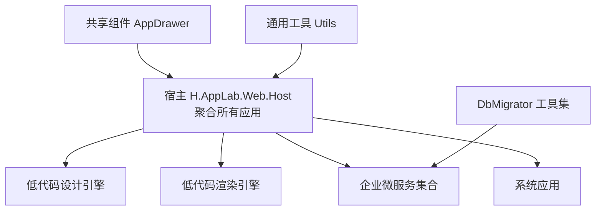
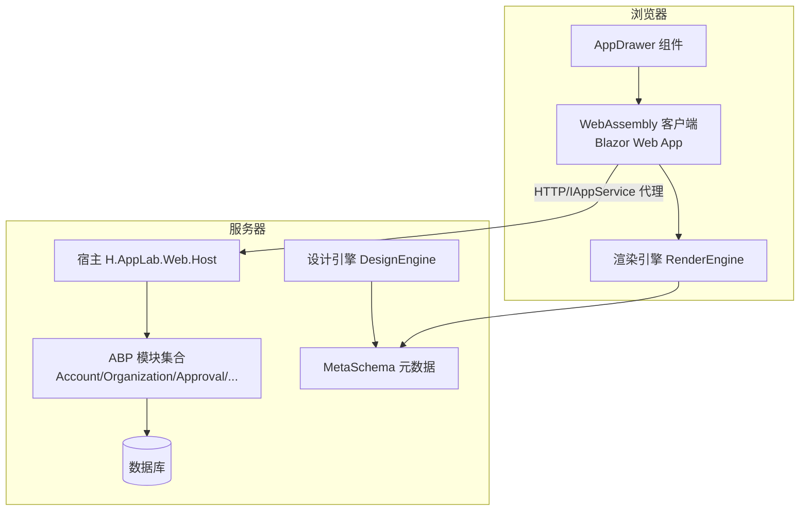
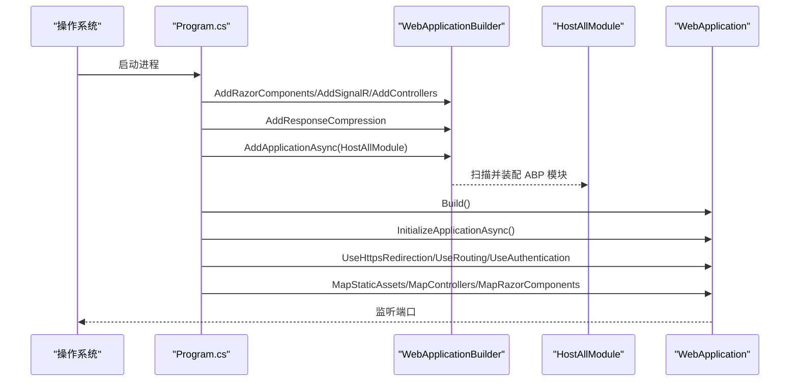
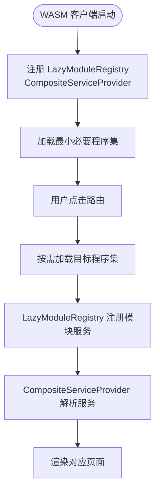
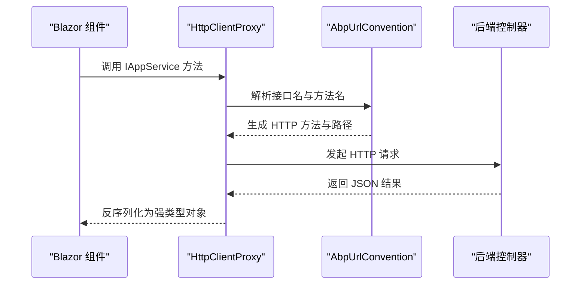
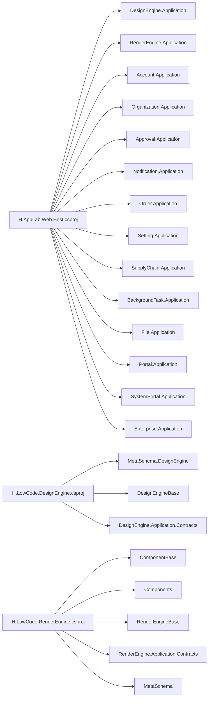

# 项目概述

<cite>
**本文引用的文件**   
- [README.md](file://README.md)
- [Program.cs](file://src/Host/H.AppLab.Web.Host/H.AppLab.Web.Host/Program.cs)
- [HostAllModule.cs](file://src/Host/H.AppLab.Web.Host/H.AppLab.Web.Host/HostAllModule.cs)
- [H.AppLab.Web.Host.csproj](file://src/Host/H.AppLab.Web.Host/H.AppLab.Web.Host/H.AppLab.Web.Host.csproj)
- [Client Program.cs](file://src/Host/H.AppLab.Web.Host/H.AppLab.Web.Host.Client/Program.cs)
- [后端 appsettings.json](file://src/Host/H.AppLab.Web.Host/H.AppLab.Web.Host/appsettings.json)
- [客户端 appsettings.json](file://src/Host/H.AppLab.Web.Host/H.AppLab.Web.Host.Client/wwwroot/appsettings.json)
- [H.LowCode.MetaSchema.csproj](file://src/LowCode/Common/H.LowCode.MetaSchema/H.LowCode.MetaSchema.csproj)
- [H.LowCode.DesignEngine.csproj](file://src/LowCode/DesignEngine/H.LowCode.DesignEngine/H.LowCode.DesignEngine.csproj)
- [H.LowCode.RenderEngine.csproj](file://src/LowCode/RenderEngine/H.LowCode.RenderEngine/H.LowCode.RenderEngine.csproj)
</cite>

## 目录
1. [引言](#引言)
2. [项目结构](#项目结构)
3. [核心组件](#核心组件)
4. [架构总览](#架构总览)
5. [关键流程与数据流](#关键流程与数据流)
6. [依赖关系分析](#依赖关系分析)
7. [性能与运行时优化](#性能与运行时优化)
8. [快速开始指南](#快速开始指南)
9. [故障排查要点](#故障排查要点)
10. [结论](#结论)

## 引言
H.AppLab 是一个基于 .NET + Blazor + ABP Framework 的全栈企业级应用开发平台，同时具备低代码能力。其核心价值主张是：通过可视化设计器产出“应用元数据”，再由运行时渲染引擎根据元数据动态生成可运行的前端应用；后端则按限界上下文拆分为多个微服务，既支持单体部署，也支持按服务独立部署。

从仓库说明可知，该项目是应用开发实验性项目，采用模块化架构，宿主程序仅负责服务注册与组合，不直接承载业务逻辑。前端统一使用 Blazor Web App（Server + WebAssembly Client），并通过 IAppService 动态代理调用 HTTP API，从而让同一份契约在服务端与 WASM 客户端无感复用。

**章节来源**
- [README.md:1-73](file://README.md#L1-L73)

## 项目结构
整体仓库以 `src` 为根，按职责划分为宿主、组件、低代码核心、企业服务、系统应用、工具迁移和通用工具库等层次：

- **宿主层**：`Host`
  - 单体宿主 `H.AppLab.Web.Host` 聚合所有业务模块；另有单服务宿主如 `Account`、`RenderEngine`。
  - 宿主均为 Blazor Web App，包含服务端与 WebAssembly 客户端工程。
- **组件层**：`Components/AppDrawer`
  - 提供统一顶部导航、侧边菜单与应用抽屉的跨应用 UI 组件。
- **低代码层**：`LowCode`
  - `Common`：元数据 Schema、组件基类、默认组件库、实体与契约等公共基础。
  - `DesignEngine`：页面与组件的可视化设计器，产出应用元数据。
  - `RenderEngine`：根据元数据动态渲染应用；主题基于 Ant Design Blazor。
  - `meta`：应用与组件的 JSON 元数据示例目录。
- **服务层**：`Services`
  - 按领域划分的企业级微服务：Account、Organization、Approval、AI、Notification、Order、Portal、Setting、SupplyChain、BackgroundTask、Testing、File 等。
- **系统层**：`System`
  - Enterprise、SystemPortal 等面向平台运营的系统应用，与服务层隔离。
- **工具层**：`Tools`
  - 每个服务的 DbMigrator 控制台程序，用于初始化或更新数据库结构。
- **通用工具**：`Utils`
  - ABP 应用契约扩展、HTTP 动态代理、Blazor 工具、ID 生成器等。

```mermaid
graph TB
    Host["宿主 H.AppLab.Web.Host<br/>聚合所有应用"] --> LowCodeDesign["低代码设计引擎"]
    Host --> LowCodeRender["低代码渲染引擎"]
    Host --> Services["企业微服务集合"]
    Host --> SystemApps["系统应用"]
    Components["共享组件 AppDrawer"] --> Host
    Utils["通用工具 Utils"] --> Host
    Tools["DbMigrator 工具集"] --> Services
```

**图示来源**
- [H.AppLab.Web.Host.csproj:1-64](file://src/Host/H.AppLab.Web.Host/H.AppLab.Web.Host/H.AppLab.Web.Host.csproj#L1-L64)
- [README.md:1-73](file://README.md#L1-L73)

**章节来源**
- [README.md:1-73](file://README.md#L1-L73)
- [H.AppLab.Web.Host.csproj:1-64](file://src/Host/H.AppLab.Web.Host/H.AppLab.Web.Host/H.AppLab.Web.Host.csproj#L1-L64)

## 核心组件
### 1. 低代码元数据模型
元数据是低代码体系的核心数据载体。`H.LowCode.MetaSchema` 引用通用工具库，用于描述应用、页面、组件及其属性的结构化 Schema。该模型被设计引擎与渲染引擎共同消费：设计器负责维护与编辑，渲染器负责解释与执行。

**章节来源**
- [H.LowCode.MetaSchema.csproj:1-7](file://src/LowCode/Common/H.LowCode.MetaSchema/H.LowCode.MetaSchema.csproj#L1-L7)
- [README.md:1-73](file://README.md#L1-L73)

### 2. 可视化设计引擎
`H.LowCode.DesignEngine` 是面向设计师与开发者的可视化编辑器，负责页面布局、组件装配与属性配置，最终输出应用元数据。它依赖 MetaSchema、DesignEngineBase、Application.Contracts 以及共享 UI 组件。

**章节来源**
- [H.LowCode.DesignEngine.csproj:1-22](file://src/LowCode/DesignEngine/H.LowCode.DesignEngine/H.LowCode.DesignEngine.csproj#L1-L22)
- [README.md:1-73](file://README.md#L1-L73)

### 3. 运行时渲染引擎
`H.LowCode.RenderEngine` 在浏览器中根据元数据动态加载并渲染组件树，实现“所见即所得”的低代码运行体验。它依赖 ComponentBase、Components、RenderEngineBase、Application.Contracts 以及 MetaSchema。

**章节来源**
- [H.LowCode.RenderEngine.csproj:1-21](file://src/LowCode/RenderEngine/H.LowCode.RenderEngine/H.LowCode.RenderEngine.csproj#L1-L21)
- [README.md:1-73](file://README.md#L1-L73)

### 4. 统一宿主与模块装配
`HostAllModule` 将 ABP、多租户、认证、各业务模块、低代码设计与渲染模块统一装配到单体宿主中。同时集中注册控制器、Cookie 认证、外部登录与多租户解析策略。

**章节来源**
- [HostAllModule.cs:1-207](file://src/Host/H.AppLab.Web.Host/H.AppLab.Web.Host/HostAllModule.cs#L1-L207)

## 架构总览
H.AppLab 采用“宿主 + 模块化服务 + 低代码引擎”的分层架构：

- **宿主层**：Blazor Web App 作为统一入口，聚合所有 Application 模块与 EF Core 基础设施。
- **服务层**：按领域拆分的微服务，遵循 Application.Contracts / Application / EntityFrameworkCore / Web 分层。
- **低代码层**：设计引擎与渲染引擎解耦，元数据贯穿两端。
- **客户端层**：WASM 客户端通过 IAppService 动态代理调用后端 API，按需懒加载程序集。

```mermaid
graph TB
    subgraph "浏览器"
        Wasm["WebAssembly 客户端<br/>Blazor Web App"]
        Drawer["AppDrawer 组件"]
        Render["渲染引擎 RenderEngine"]
    end

    subgraph "服务器"
        Host["宿主 H.AppLab.Web.Host"]
        Modules["ABP 模块集合<br/>Account/Organization/Approval/..."]
        Design["设计引擎 DesignEngine"]
        Meta["MetaSchema 元数据"]
        DB[("数据库")]
    end

    Wasm -->|HTTP/IAppService 代理| Host
    Wasm --> Render
    Render --> Meta
    Design --> Meta
    Host --> Modules
    Modules --> DB
    Drawer --> Wasm
```

**图示来源**
- [Program.cs:1-112](file://src/Host/H.AppLab.Web.Host/H.AppLab.Web.Host/Program.cs#L1-L112)
- [HostAllModule.cs:1-207](file://src/Host/H.AppLab.Web.Host/H.AppLab.Web.Host/HostAllModule.cs#L1-L207)
- [H.LowCode.MetaSchema.csproj:1-7](file://src/LowCode/Common/H.LowCode.MetaSchema/H.LowCode.MetaSchema.csproj#L1-L7)
- [H.LowCode.DesignEngine.csproj:1-22](file://src/LowCode/DesignEngine/H.LowCode.DesignEngine/H.LowCode.DesignEngine.csproj#L1-L22)
- [H.LowCode.RenderEngine.csproj:1-21](file://src/LowCode/RenderEngine/H.LowCode.RenderEngine/H.LowCode.RenderEngine.csproj#L1-L21)

## 关键流程与数据流
### 1. 应用启动与服务装配
宿主启动时创建 Blazor Web App 服务，启用 SignalR、JSON 序列化、响应压缩，并加载 `HostAllModule` 完成所有 ABP 模块装配。随后建立中间件管道、映射静态资源、路由、认证、授权、控制器与 Razor 组件。

```mermaid
sequenceDiagram
    participant OS as "操作系统"
    participant Program as "Program.cs"
    participant Builder as "WebApplicationBuilder"
    participant Module as "HostAllModule"
    participant App as "WebApplication"

    OS->>Program: 启动进程
    Program->>Builder: AddRazorComponents/AddSignalR/AddControllers
    Program->>Builder: AddResponseCompression
    Program->>Builder: AddApplicationAsync(HostAllModule)
    Builder-->>Module: 扫描并装配 ABP 模块
    Program->>App: Build()
    Program->>App: InitializeApplicationAsync()
    Program->>App: UseHttpsRedirection/UseRouting/UseAuthentication
    Program->>App: MapStaticAssets/MapControllers/MapRazorComponents
    App-->>OS: 监听端口
```

**图示来源**
- [Program.cs:1-112](file://src/Host/H.AppLab.Web.Host/H.AppLab.Web.Host/Program.cs#L1-L112)
- [HostAllModule.cs:1-207](file://src/Host/H.AppLab.Web.Host/H.AppLab.Web.Host/HostAllModule.cs#L1-L207)

### 2. 前端懒加载与组合式 DI
WASM 客户端启动时注册 `LazyModuleRegistry` 与 `CompositeServiceProvider`，使路由跳转时可按需加载程序集并注入模块服务。首页仅加载最小必要程序集，其他模块在导航触发时懒加载。

```mermaid
flowchart TD
    Start(["WASM 客户端启动"]) --> RegisterDI["注册 LazyModuleRegistry<br/>CompositeServiceProvider"]
    RegisterDI --> Boot["加载最小必要程序集"]
    Boot --> Route["用户点击路由"]
    Route --> LoadAsm["按需加载目标程序集"]
    LoadAsm --> RegModules["LazyModuleRegistry 注册模块服务"]
    RegModules --> Resolve["CompositeServiceProvider 解析服务"]
    Resolve --> Render["渲染对应页面"]
```

**图示来源**
- [Client Program.cs:1-13](file://src/Host/H.AppLab.Web.Host/H.AppLab.Web.Host.Client/Program.cs#L1-L13)
- [README.md:1-73](file://README.md#L1-L73)

### 3. IAppService 动态代理调用
前端只依赖 Application.Contracts 中的接口，由 `H.Abp.HttpClientProxy` 拦截方法调用并按 ABP 路由约定转换为 HTTP 请求。远程服务地址通过 `RemoteServices` 配置统一管理。

```mermaid
sequenceDiagram
    participant UI as "Blazor 组件"
    participant Proxy as "HttpClientProxy"
    participant Router as "AbpUrlConvention"
    participant Server as "后端控制器"

    UI->>Proxy: 调用 IAppService 方法
    Proxy->>Router: 解析接口名与方法名
    Router-->>Proxy: 生成 HTTP 方法与路径
    Proxy->>Server: 发起 HTTP 请求
    Server-->>Proxy: 返回 JSON 结果
    Proxy-->>UI: 反序列化为强类型对象
```

**图示来源**
- [README.md:1-73](file://README.md#L1-L73)
- [后端 appsettings.json:1-128](file://src/Host/H.AppLab.Web.Host/H.AppLab.Web.Host/appsettings.json#L1-L128)
- [客户端 appsettings.json:1-52](file://src/Host/H.AppLab.Web.Host/H.AppLab.Web.Host.Client/wwwroot/appsettings.json#L1-L52)

## 依赖关系分析
宿主工程引用了所有需要聚合的服务与低代码模块，包括设计引擎、渲染引擎、账号、组织、审批、通知、订单、设置、供应链、后台任务、文件管理、门户与系统门户等。低代码设计引擎与渲染引擎分别依赖公共元数据、组件库与契约模块。

```mermaid
graph LR
    HostProj["H.AppLab.Web.Host.csproj"] --> DesignApp["DesignEngine.Application"]
    HostProj --> RenderApp["RenderEngine.Application"]
    HostProj --> AccountApp["Account.Application"]
    HostProj --> OrgApp["Organization.Application"]
    HostProj --> ApprovalApp["Approval.Application"]
    HostProj --> NotificationApp["Notification.Application"]
    HostProj --> OrderApp["Order.Application"]
    HostProj --> SettingApp["Setting.Application"]
    HostProj --> SupplyChainApp["SupplyChain.Application"]
    HostProj --> BackgroundTaskApp["BackgroundTask.Application"]
    HostProj --> FileApp["File.Application"]
    HostProj --> PortalApp["Portal.Application"]
    HostProj --> SystemPortalApp["SystemPortal.Application"]
    HostProj --> EnterpriseApp["Enterprise.Application"]

    DesignEngineProj["H.LowCode.DesignEngine.csproj"] --> MetaDesign["MetaSchema.DesignEngine"]
    DesignEngineProj --> Base["DesignEngineBase"]
    DesignEngineProj --> Contracts["DesignEngine.Application.Contracts"]

    RenderEngineProj["H.LowCode.RenderEngine.csproj"] --> ComponentBase["ComponentBase"]
    RenderEngineProj --> Components["Components"]
    RenderEngineProj --> RenderBase["RenderEngineBase"]
    RenderEngineProj --> RenderContracts["RenderEngine.Application.Contracts"]
    RenderEngineProj --> Meta["MetaSchema"]
```

**图示来源**
- [H.AppLab.Web.Host.csproj:1-64](file://src/Host/H.AppLab.Web.Host/H.AppLab.Web.Host/H.AppLab.Web.Host.csproj#L1-L64)
- [H.LowCode.DesignEngine.csproj:1-22](file://src/LowCode/DesignEngine/H.LowCode.DesignEngine/H.LowCode.DesignEngine.csproj#L1-L22)
- [H.LowCode.RenderEngine.csproj:1-21](file://src/LowCode/RenderEngine/H.LowCode.RenderEngine/H.LowCode.RenderEngine.csproj#L1-L21)

**章节来源**
- [H.AppLab.Web.Host.csproj:1-64](file://src/Host/H.AppLab.Web.Host/H.AppLab.Web.Host/H.AppLab.Web.Host.csproj#L1-L64)
- [H.LowCode.DesignEngine.csproj:1-22](file://src/LowCode/DesignEngine/H.LowCode.DesignEngine/H.LowCode.DesignEngine.csproj#L1-L22)
- [H.LowCode.RenderEngine.csproj:1-21](file://src/LowCode/RenderEngine/H.LowCode.RenderEngine/H.LowCode.RenderEngine.csproj#L1-L21)

## 性能与运行时优化
- **Blazor Web App 模式**：服务端渲染与 WebAssembly 交互结合，兼顾首屏性能与交互能力。
- **响应压缩**：启用 Brotli 与 Gzip，并将 `.wasm`、`.dll` 加入压缩 MIME 类型，减少前端包体积。
- **WASM 懒加载**：仅在路由访问时加载所需程序集，降低初始下载量。
- **AOT 与裁剪**：Release 模式启用 AOT 与 Trimming，进一步减小客户端体积。
- **静态资源缓存**：通过指纹化 WASM 程序集并正确配置 boot manifest，避免旧清单导致的 404 问题。

**章节来源**
- [Program.cs:1-112](file://src/Host/H.AppLab.Web.Host/H.AppLab.Web.Host/Program.cs#L1-L112)
- [README.md:1-73](file://README.md#L1-L73)

## 快速开始指南
### 环境准备
- 安装 .NET SDK（版本见 `global.json`）。
- 安装 WSL + Docker（Engine + Compose）+ Portainer。
- 启动 Redis、RabbitMQ 等依赖服务：将 `cd/docker-compose.yml` 拷贝至 WSL 并运行 `docker-compose up -d`。

### 初始化数据库
- 使用 Tools 下的 DbMigrator 创建或更新数据库结构，例如：  
  `dotnet run --project src/Tools/H.Account.DbMigrator`

### 启动主程序
- 确保 Docker 已启动。
- 运行单体宿主：  
  `dotnet run --project src/Host/H.AppLab.Web.Host/H.AppLab.Web.Host --launch-profile HostAll`
- 默认访问地址为 `http://localhost:5045`（HTTPS 为 `https://localhost:7065`）。

### 首次运行建议
- 确认 `appsettings.json` 中连接字符串指向本地数据库。
- 检查 `RemoteServices` 是否指向正确的后端地址。
- 如需使用对象存储，请配置 MinIO 相关项。

**章节来源**
- [README.md:1-73](file://README.md#L1-L73)
- [后端 appsettings.json:1-128](file://src/Host/H.AppLab.Web.Host/H.AppLab.Web.Host/appsettings.json#L1-L128)

## 故障排查要点
- **WASM 加载卡住**：可能是 boot manifest 与指纹化程序集缓存不一致导致。应避免对 `/_framework` 整个目录启用 immutable 长缓存，让框架自行处理清单校验。
- **远程服务不可达**：检查前后端 `RemoteServices` 配置是否一致，且目标服务已启动。
- **认证失败**：确认 Cookie 认证方案与登录页路径配置正确，外部登录开关与凭据是否正确。
- **多租户异常**：若租户 Cookie 失效，应清理无效租户 Cookie 并返回首页，而不是直接返回 404。
- **静态资源 404**：确保静态资源映射与压缩中间件顺序正确，并使用 `MapStaticAssets()`。

**章节来源**
- [Program.cs:1-112](file://src/Host/H.AppLab.Web.Host/H.AppLab.Web.Host/Program.cs#L1-L112)
- [HostAllModule.cs:1-207](file://src/Host/H.AppLab.Web.Host/H.AppLab.Web.Host/HostAllModule.cs#L1-L207)

## 结论
H.AppLab 以 ABP 模块化架构为基础，结合 Blazor Web App 与低代码元数据驱动模式，提供了从可视化设计到运行时渲染的一体化解决方案。通过统一的宿主聚合、IAppService 动态代理、WASM 懒加载与多租户机制，平台既能满足企业级应用的复杂需求，又能显著降低重复开发与集成成本。对于初学者而言，理解“元数据—设计器—渲染器—微服务”的主干链路，是掌握该平台的关键。