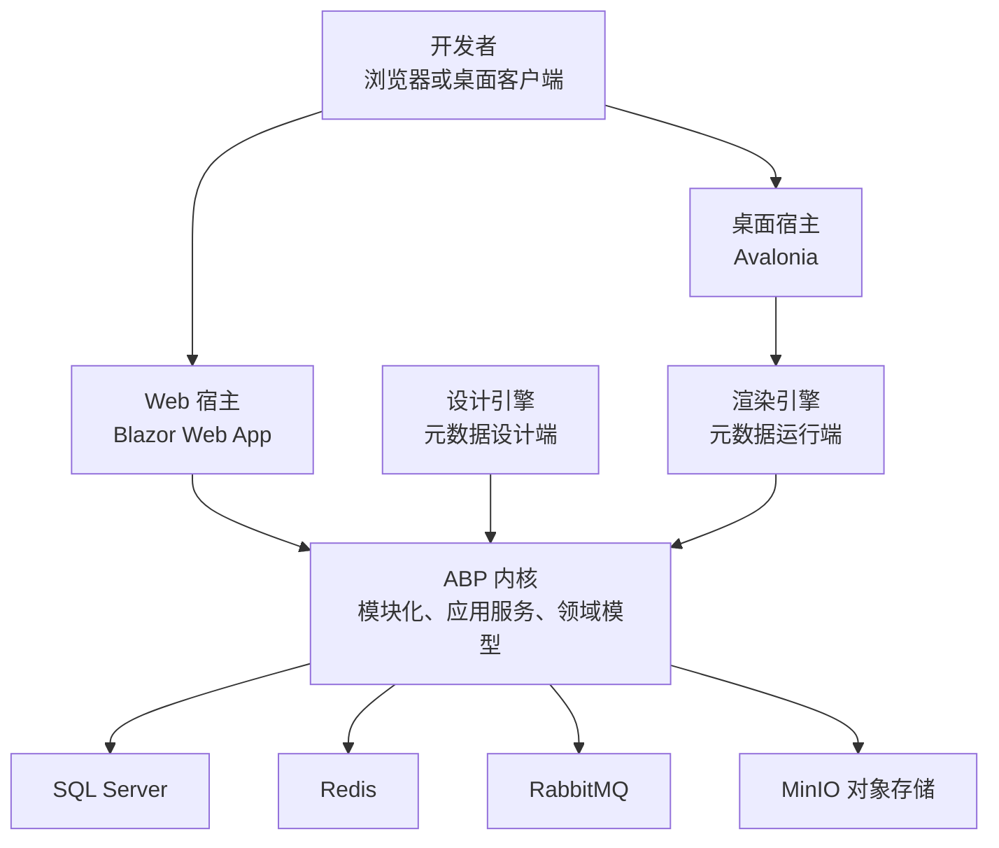
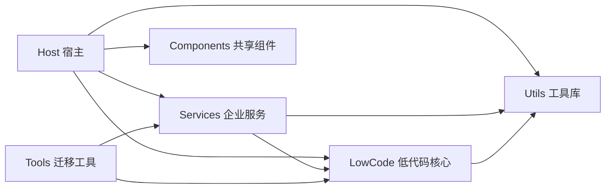
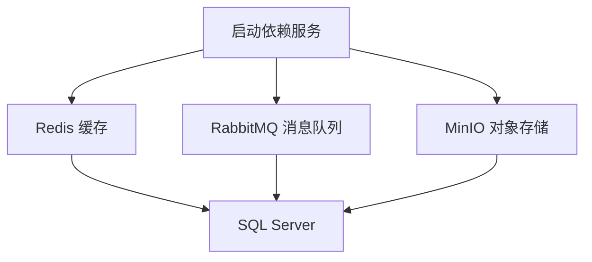

# 项目概述

<cite>
**本文引用的文件**   
- [README.md](file://README.md)
- [global.json](file://src/global.json)
- [docker-compose.yml](file://cd/docker-compose.yml)
- [H.AppLab.Web.Host.csproj](file://src/src/Host/H.AppLab.Web.Host/H.AppLab.Web.Host/H.AppLab.Web.Host.csproj)
</cite>

## 目录
1. [简介](#简介)
2. [项目结构](#项目结构)
3. [核心组件](#核心组件)
4. [架构总览](#架构总览)
5. [详细模块说明](#详细模块说明)
6. [依赖关系分析](#依赖关系分析)
7. [快速开始](#快速开始)
8. [性能与运行特性](#性能与运行特性)
9. [常见问题排查](#常见问题排查)
10. [结论](#结论)

## 简介
AppLab 是一个基于 .NET + Blazor 的实验性全栈应用开发平台。它同时承担两个角色：
- **业务应用运行时**：以 ABP Framework 为基础，提供账户、组织、审批、订单、供应链、通知、设置、背景任务等企业级服务。
- **低代码设计与渲染引擎**：通过元数据驱动页面和组件的设计、发布与运行，支持设计端可视化编辑与运行端动态渲染。

项目采用模块化架构，既支持单体部署，也支持按服务独立部署；前端主要使用 Blazor Web App，桌面端使用 Avalonia 作为本地宿主，整体围绕 ABP 的领域驱动分层与模块化约定组织代码。

## 项目结构
解决方案根位于 `src` 下，核心目录划分为以下七类：

| 目录 | 职责 | 关键说明 |
|---|---|---|
| Host | 宿主程序 | 负责启动 Web 或桌面宿主，注册各业务服务；不包含具体业务逻辑 |
| Components | 共享 UI 组件 | 如 AppDrawer 统一导航抽屉，供所有应用复用 |
| LowCode | 低代码核心 | 包含元数据 Schema、组件基类、默认组件库、设计引擎、渲染引擎及元数据存储实现 |
| Services | 企业级应用服务 | 按限界上下文划分的业务模块，每个模块遵循 Application.Contracts / Application / EntityFrameworkCore / Web 分层 |
| System | 系统级应用 | 面向平台运营侧的系统应用，与 Services 中的业务应用严格隔离 |
| Tools | 数据库迁移工具 | 每个服务对应一个 DbMigrator 控制台程序，用于创建或更新数据库结构 |
| Utils | 工具类库 | 提供 ABP 契约扩展、HTTP 动态代理、Blazor 工具、ID 生成器等通用能力 |


```mermaid
graph TB
    subgraph "宿主层"
        HWeb["Web 宿主<br/>H.AppLab.Web.Host"]
        HDesktop["桌面宿主<br/>H.AppLab.Desktop"]
        HRender["渲染引擎宿主<br/>H.LowCode.RenderEngine.Host"]
    end

    subgraph "共享层"
        Comp["Components<br/>AppDrawer 等共享组件"]
        Util["Utils<br/>ABP 契约、HTTP 代理、Blazor 工具、ID 生成器"]
    end

    subgraph "低代码层"
        LCCommon["LowCode.Common<br/>MetaSchema、组件基类、默认组件"]
        LCDesign["LowCode.DesignEngine<br/>可视化设计引擎"]
        LCRender["LowCode.RenderEngine<br/>元数据驱动渲染引擎"]
    end

    subgraph "企业服务层"
        SAccount["Account"]
        SOrg["Organization"]
        SApproval["Approval"]
        SOrder["Order"]
        SSupply["SupplyChain"]
        SFile["File"]
        SNotify["Notification"]
        SSetting["Setting"]
        SBackground["BackgroundTask"]
        STesting["Testing"]
        SPortal["Portal"]
    end

    subgraph "系统应用层"
        SysEnterprise["System.Enterprise"]
        SysPortal["System.SystemPortal"]
    end

    subgraph "工具层"
        TDb["Tools.DbMigrator<br/>各服务数据库迁移工具"]
    end

    HWeb --> Comp
    HWeb --> Util
    HWeb --> LCCommon
    HWeb --> LCDesign
    HWeb --> LCRender
    HWeb --> SAccount
    HWeb --> SOrg
    HWeb --> SApproval
    HWeb --> SOrder
    HWeb --> SSupply
    HWeb --> SFile
    HWeb --> SNotify
    HWeb --> SSetting
    HWeb --> SBackground
    HWeb --> STesting
    HWeb --> SPortal

    HDesktop --> Comp
    HDesktop --> Util
    HDesktop --> LCRender

    HRender --> LCRender
    HRender --> LCCommon

    SysEnterprise --> SAccount
    SysPortal --> SPortal

    TDb --> SAccount
    TDb --> SOrg
    TDb --> SApproval
    TDb --> SOrder
    TDb --> SSupply
    TDb --> SFile
    TDb --> SNotify
    TDb --> SSetting
    TDb --> SBackground
    TDb --> STesting
    TDb --> LCCommon
```

**图表来源**
- [README.md:6-55](file://README.md#L6-L55)

**章节来源**
- [README.md:6-55](file://README.md#L6-L55)

## 核心组件
### 应用抽屉组件
AppDrawer 是跨应用的统一入口组件，负责顶部导航栏、侧边菜单与应用切换面板。它以元数据方式接入应用，通过分类信息与应用项配置图标、跳转地址和打开方式，使不同宿主只需提供应用和菜单数据即可复用一致的布局体验。

### 低代码元数据体系
LowCode.Common 提供元数据 Schema、组件基类、默认组件库以及实体与应用契约。DesignEngine 基于这些基础类型进行可视化设计，产出应用元数据；RenderEngine 则在运行时读取元数据并动态渲染出可运行的应用。元数据仓储支持 JsonFile、EntityFrameworkCore 和 RemoteService 多种实现，便于在本地、数据库或远程服务之间切换。

### HTTP 动态代理
前端通过 `H.Abp.HttpClientProxy` 直接调用服务端 `IAppService` 接口。该代理基于 `DispatchProxy` 拦截接口方法，按照 ABP 路由约定将方法名转换为 HTTP 请求，例如查询方法映射为 GET，新增方法映射为 POST，复杂参数自动序列化为请求体。同一套接口在服务端是进程内实现，在 WebAssembly 客户端则是 HTTP 代理，业务代码无感知。

**章节来源**
- [README.md:19-55](file://README.md#L19-L55)

## 架构总览
AppLab 的技术选型可以概括为：

| 层次 | 技术 | 作用 |
|---|---|---|
| 运行时框架 | ABP Framework | 提供模块化、领域驱动、应用服务、实体、EF Core、远程服务等基础设施 |
| Web 前端 | Blazor Web App | Server + WebAssembly Client 模式，兼顾实时交互与可部署性 |
| 桌面宿主 | Avalonia | 本地桌面应用宿主，承载工作区或设计相关界面 |
| 低代码内核 | 元数据驱动 | 设计端定义元数据，运行端解析元数据渲染页面与组件 |
| 数据持久化 | SQL Server + EF Core | 各服务通过 EntityFrameworkCore 管理数据库表结构 |
| 缓存与消息 | Redis + RabbitMQ | Redis 用于缓存与会话，RabbitMQ 用于异步消息与背景任务 |
| 对象存储 | MinIO | 提供兼容 S3 的对象存储服务，用于文件上传与静态资源托管 |


```mermaid
graph TB
    Dev["开发者<br/>浏览器或桌面客户端"]
    WebHost["Web 宿主<br/>Blazor Web App"]
    DesktopHost["桌面宿主<br/>Avalonia"]
    AbpKernel["ABP 内核<br/>模块化、应用服务、领域模型"]
    Database["SQL Server"]
    Cache["Redis"]
    MQ["RabbitMQ"]
    Storage["MinIO 对象存储"]
    Design["设计引擎<br/>元数据设计端"]
    Render["渲染引擎<br/>元数据运行端"]

    Dev --> WebHost
    Dev --> DesktopHost
    WebHost --> AbpKernel
    DesktopHost --> Render
    Design --> AbpKernel
    Render --> AbpKernel
    AbpKernel --> Database
    AbpKernel --> Cache
    AbpKernel --> MQ
    AbpKernel --> Storage
```

[本图为概念性架构图，不直接映射到具体源码文件]

## 详细模块说明
### Host：宿主程序
- 职责：启动应用程序、注册服务、挂载中间件，不包含具体业务逻辑。
- 形态：
  - 单体宿主：聚合多个服务到一个进程中。
  - 单服务宿主：每个业务服务单独部署。
  - Web 宿主：Blazor Web App 模式。
  - 桌面宿主：Avalonia 本地窗口宿主。

**章节来源**
- [README.md:6-18](file://README.md#L6-L18)

### Components：共享 UI 组件
- 典型组件：AppDrawer，提供统一导航、菜单和应用切换。
- 价值：避免各应用重复实现布局，保证平台一致性。

**章节来源**
- [README.md:19-22](file://README.md#L19-L22)

### LowCode：低代码核心
- Common：MetaSchema、组件基类、默认组件库、实体与应用契约。
- DesignEngine：可视化设计引擎，产出应用元数据，包含 Workbench、MyApp 等设计端应用。
- RenderEngine：根据元数据动态渲染应用，主题基于 Ant Design Blazor。
- meta：存放应用与组件的元数据 JSON。
- 仓储实现：JsonFile、EntityFrameworkCore、RemoteService。

**章节来源**
- [README.md:23-36](file://README.md#L23-L36)

### Services：企业级应用服务
- 划分原则：按限界上下文拆分，包括 Account、Organization、Approval、Notification、Order、SupplyChain、BackgroundTask、Testing、Portal、Setting 等。
- 分层约定：Application.Contracts / Application / EntityFrameworkCore / Web。

**章节来源**
- [README.md:37-43](file://README.md#L37-L43)

### System：系统级应用
- 包含 Enterprise、SystemPortal，面向平台运营侧。
- 与 Services 下的企业级应用严格隔离，体现平台与业务解耦。

**章节来源**
- [README.md:44-47](file://README.md#L44-L47)

### Tools：数据库迁移工具
- 每个服务对应一个 DbMigrator 控制台程序。
- 用于创建或更新数据库结构，配合 EntityFrameworkCore 迁移机制使用。

**章节来源**
- [README.md:48-50](file://README.md#L48-L50)

### Utils：工具类库
- H.Abp.Application.Contracts：扩展 ABP 应用服务契约。
- H.Abp.HttpClientProxy：基于 `IAppService` 接口的 HTTP 动态代理。
- H.Util.Blazor / H.Util.Ids / H.Util.Base：Blazor 工具、ID 生成、基础工具与统一返回包装。

**章节来源**
- [README.md:51-55](file://README.md#L51-L55)

## 依赖关系分析
从宿主到服务的依赖方向是单向的：宿主依赖 Services、LowCode、Components 和 Utils；Services 之间通过 ABP 模块化与远程服务边界协作；LowCode 的 DesignEngine 与 RenderEngine 通过元数据契约解耦；Tools 只依赖对应服务的领域与数据层，不参与运行时服务调用。


```mermaid
graph LR
    Host["Host 宿主"] --> Services["Services 企业服务"]
    Host --> LowCode["LowCode 低代码核心"]
    Host --> Components["Components 共享组件"]
    Host --> Utils["Utils 工具库"]

    Services --> Utils
    LowCode --> Utils
    Services --> LowCode

    Tools["Tools 迁移工具"] --> Services
    Tools --> LowCode
```

**图表来源**
- [README.md:6-55](file://README.md#L6-L55)

**章节来源**
- [README.md:6-55](file://README.md#L6-L55)

## 快速开始

### 环境要求
- **.NET SDK**：版本由 `src/global.json` 指定，当前为 `10.0.0`，并允许回退到最新功能版本。
- **WSL + Docker**：推荐使用 WSL 环境，并通过 Docker Engine 与 Compose 启动依赖服务。
- **Portainer**（可选）：便于查看和管理容器状态。

**章节来源**
- [README.md:52-60](file://README.md#L52-L60)
- [global.json:1-6](file://src/global.json#L1-L6)

### 依赖服务
通过 `cd/docker-compose.yml` 可一键启动以下依赖服务：

| 服务 | 镜像 | 端口或用途 | 备注 |
|---|---|---|---|
| Redis | redis:8.8-alpine | 6379 | 提供缓存与会话能力 |
| RabbitMQ | rabbitmq:4.0-management-alpine | 5672、15672 | 消息队列与管理控制台 |
| MinIO | minio/minio:latest | 9010、9011 | 对象存储 API 与控制台 |


```mermaid
flowchart TD
    Start["启动依赖服务"] --> Redis["Redis 缓存"]
    Start --> Rabbit["RabbitMQ 消息队列"]
    Start --> MinIO["MinIO 对象存储"]
    Redis --> DB["SQL Server"]
    Rabbit --> DB
    MinIO --> DB
```

**图表来源**
- [docker-compose.yml:1-48](file://cd/docker-compose.yml#L1-L48)

**章节来源**
- [README.md:56-60](file://README.md#L56-L60)
- [docker-compose.yml:1-48](file://cd/docker-compose.yml#L1-L48)

### 启动步骤
1. **准备依赖服务**  
   将 `cd/docker-compose.yml` 复制到 WSL 中并执行 `sudo docker-compose up -d`，启动 Redis、RabbitMQ、MinIO。

2. **执行数据库迁移**  
   运行对应服务的 DbMigrator，例如账户服务迁移命令为 `dotnet run --project src/Tools/H.Account.DbMigrator`。其他服务类似，替换为对应的 Tools 项目路径。

3. **启动主程序**  
   启动单体宿主 `H.AppLab.Host.All`：
   ```text
   dotnet run --project src/Host/H.AppLab.Host.All/H.AppLab.Host.All --launch-profile HostAll
   ```
   默认访问地址为 `http://localhost:5045`，HTTPS 默认端口为 `7065`。

**章节来源**
- [README.md:56-69](file://README.md#L56-L69)

## 性能与运行特性
- **WebAssembly 懒加载**：首页仅加载必要程序集，其余 Contracts、LowCode 库及第三方依赖在导航到对应路由时才按需下载，减少首屏体积。
- **自研组合式依赖注入**：LazyModuleRegistry 管理各路由模块的服务容器，CompositeServiceProvider 提供“根容器 → 模块容器”的服务解析回退，支持程序集加载后延迟注册服务。
- **发布优化**：Release 模式启用 AOT 与裁剪，进一步减小下载体积；Debug 模式额外加载 `.pdb` 以便调试。
- **HTTP 动态代理**：前端无需手写 HttpClient 调用，降低样板代码量并保持一致的远端调用语义。

**章节来源**
- [README.md:61-73](file://README.md#L61-L73)

## 常见问题排查
| 现象 | 可能原因 | 处理建议 |
|---|---|---|
| 无法连接 Redis | Redis 未启动或密码不一致 | 检查 `docker-compose.yml` 中 Redis 是否运行，确认连接字符串与密码配置一致 |
| 消息队列不可用 | RabbitMQ 未启动或端口被占用 | 检查 RabbitMQ 容器状态、5672 与 15672 端口，必要时清理残留容器 |
| 文件上传失败 | MinIO 未启动或凭据错误 | 检查 MinIO 容器、API 端口 9010 与控制台 9011，确认 AccessKey 与 SecretKey |
| 数据库迁移失败 | 连接字符串错误或数据库权限不足 | 检查各 DbMigrator 的 `appsettings.json` 连接字符串，确认 SQL Server 可访问 |
| 前端页面空白或路由失效 | 懒加载程序集未正确加载 | 检查 WebAssembly 客户端路由与 `BlazorWebAssemblyLazyLoad` 配置 |

**章节来源**
- [README.md:56-73](file://README.md#L56-L73)

## 结论
AppLab 以 ABP Framework 和 Blazor 为核心，构建了一个既能承载企业级业务应用，又能支撑低代码设计与渲染的平台型解决方案。其模块化目录结构清晰区分了宿主、共享组件、低代码核心、企业服务、系统应用、迁移工具与通用工具，有利于团队分工、独立部署和持续演进。对于初学者，可以从 Host 与 README 的快速开始入手；对于有经验的开发者，LowCode 的元数据体系、Services 的分层约定、Tools 的迁移策略以及 Utils 的动态代理都是值得深入研究的工程实践点。