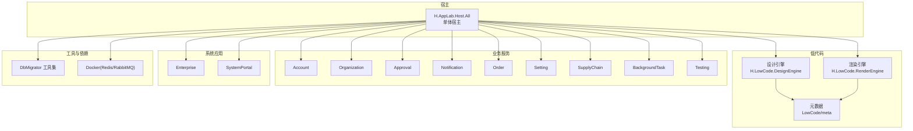
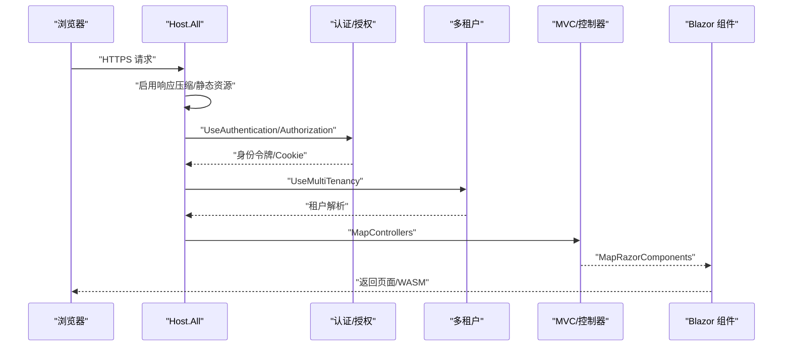
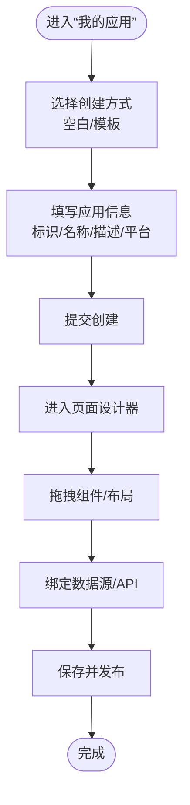

# 快速开始

<cite>
**本文档引用的文件**   
- [README.md](file://README.md)
- [global.json](file://src/global.json)
- [common.props](file://src/common.props)
- [docker-compose.yml](file://cd/docker-compose.yml)
- [appsettings.json（Host.All）](file://src/Host/H.AppLab.Host.All/H.AppLab.Host.All/appsettings.json)
- [Program.cs（Host.All）](file://src/Host/H.AppLab.Host.All/H.AppLab.Host.All/Program.cs)
- [launchSettings.json（Host.All）](file://src/Host/H.AppLab.Host.All/H.AppLab.Host.All/Properties/launchSettings.json)
- [HostAllModule.cs](file://src/Host/H.AppLab.Host.All/H.AppLab.Host.All/HostAllModule.cs)
- [appsettings.json（H.Account.DbMigrator）](file://src/Tools/H.Account.DbMigrator/appsettings.json)
- [appsettings.json（H.LowCode.DbMigrator）](file://src/Tools/H.LowCode.DbMigrator/appsettings.json)
- [Program.cs（H.LowCode.DbMigrator）](file://src/Tools/H.LowCode.DbMigrator/Program.cs)
- [IAppService.cs](file://src/Utils/H.Abp.Application.Contracts/IAppService.cs)
- [AppCreateFromTemplate.razor](file://src/LowCode/DesignEngine/H.LowCode.MyApp/Pages/MyApps/AppCreateFromTemplate.razor)
- [AppForm.razor](file://src/LowCode/DesignEngine/H.LowCode.MyApp/Pages/MyApps/AppForm.razor)
- [APIDataSourceList.razor](file://src/LowCode/DesignEngine/H.LowCode.MyApp/Pages/DataSource/APIDataSourceList.razor)
</cite>

## 目录
1. [简介](#简介)
2. [项目结构](#项目结构)
3. [核心组件](#核心组件)
4. [架构总览](#架构总览)
5. [详细组件分析](#详细组件分析)
6. [依赖关系分析](#依赖关系分析)
7. [性能注意事项](#性能注意事项)
8. [故障排除指南](#故障排除指南)
9. [结论](#结论)
10. [附录：命令行与IDE配置](#附录命令行与ide配置)

## 简介
本指南面向首次接触 AppLab 平台的开发者，目标是在 30 分钟内完成环境搭建、数据库初始化、启动开发主机并运行第一个低代码应用。平台基于 .NET + Blazor，采用模块化架构，支持单体部署与按服务独立部署；内置设计引擎与渲染引擎，提供可视化页面设计与动态渲染能力。

## 项目结构
- Host：宿主程序，负责服务注册与管线配置。H.AppLab.Host.All 为单体宿主，其他 Host 为单服务宿主。
- Components：共享 UI 组件（如 AppDrawer）。
- LowCode：低代码核心，包含元数据 Schema、默认组件库、设计引擎与渲染引擎。
- Services：按限界上下文划分的业务模块（Account、Organization、Approval、Notification、Order、Setting、SupplyChain、BackgroundTask、Testing 等）。
- System：系统级应用（Enterprise、SystemPortal）。
- Tools：各服务的 DbMigrator 控制台程序，用于创建/更新数据库结构。
- Utils：通用工具库（ABP 契约、HTTP 代理、Blazor 工具、ID 生成等）。

图表来源 
- [README.md:1-74](file://README.md#L1-L74)
- [appsettings.json（Host.All）:1-115](file://src/Host/H.AppLab.Host.All/H.AppLab.Host.All/appsettings.json#L1-L115)

章节来源
- [README.md:1-74](file://README.md#L1-L74)

## 核心组件
- 统一宿主（HostAll）：聚合所有模块，配置认证、多租户、控制器、WASM 资源压缩与路由映射。
- 设计引擎（DesignEngine）：可视化页面/组件设计，产出应用元数据。
- 渲染引擎（RenderEngine）：根据元数据动态渲染可运行的应用，主题基于 Ant Design Blazor。
- 应用抽屉（AppDrawer）：统一的顶部导航、侧边菜单与应用切换能力。
- 前端 HTTP 代理：基于 IAppService 接口自动生成 HTTP 调用，无需手写 HttpClient。

章节来源
- [HostAllModule.cs:37-78](file://src/Host/H.AppLab.Host.All/H.AppLab.Host.All/HostAllModule.cs#L37-L78)
- [Program.cs（Host.All）:11-12](file://src/Host/H.AppLab.Host.All/H.AppLab.Host.All/Program.cs#L11-L12)
- [README.md:58-73](file://README.md#L58-L73)

## 架构总览
下图展示单体宿主的请求处理流程：浏览器通过 HTTPS 访问 Host.All，启用响应压缩与 WASM 调试（开发模式），随后进入认证、授权、多租户与 MVC 控制器管线，最终由 Blazor 组件渲染页面。

图表来源 
- [Program.cs（Host.All）:27-46](file://src/Host/H.AppLab.Host.All/H.AppLab.Host.All/Program.cs#L27-L46)
- [Program.cs（Host.All）:82-94](file://src/Host/H.AppLab.Host.All/H.AppLab.Host.All/Program.cs#L82-L94)

## 详细组件分析

### 环境与依赖准备
- 安装 .NET SDK（版本见 global.json，当前指定为 10.0.0）。
- 安装 Docker 与 Compose，启动 Redis 与 RabbitMQ（端口 6379、5672、15672）。
- 克隆仓库后，确保 cd 目录下的 docker-compose.yml 可用。

章节来源
- [global.json:1-7](file://src/global.json#L1-L7)
- [docker-compose.yml:1-32](file://cd/docker-compose.yml#L1-L32)
- [README.md:38-55](file://README.md#L38-L55)

### 数据库迁移
- 使用 Tools 下对应 DbMigrator 创建或更新数据库结构。例如：
  - 账户服务：dotnet run --project src/Tools/H.Account.DbMigrator
  - 低代码服务：dotnet run --project src/Tools/H.LowCode.DbMigrator
- 连接字符串在 appsettings.json 中配置，默认指向 LocalDB。

章节来源
- [README.md:48-50](file://README.md#L48-L50)
- [appsettings.json（H.Account.DbMigrator）:1-6](file://src/Tools/H.Account.DbMigrator/appsettings.json#L1-L6)
- [appsettings.json（H.LowCode.DbMigrator）:1-9](file://src/Tools/H.LowCode.DbMigrator/appsettings.json#L1-L9)
- [Program.cs（H.LowCode.DbMigrator）:20-26](file://src/Tools/H.LowCode.DbMigrator/Program.cs#L20-L26)

### 启动开发主机（单体）
- 启动命令（示例）：dotnet run --project src/Host/H.AppLab.Host.All/H.AppLab.Host.All --launch-profile HostAll
- 默认地址：http://localhost:5045（https: 7065）
- Program.cs 中已启用 Blazor Server+WASM、SignalR、JSON 序列化、响应压缩、中间件管线与 Razor 组件映射。

章节来源
- [README.md:51-55](file://README.md#L51-L55)
- [launchSettings.json（Host.All）:1-15](file://src/Host/H.AppLab.Host.All/H.AppLab.Host.All/Properties/launchSettings.json#L1-L15)
- [Program.cs（Host.All）:11-19](file://src/Host/H.AppLab.Host.All/H.AppLab.Host.All/Program.cs#L11-L19)
- [Program.cs（Host.All）:27-46](file://src/Host/H.AppLab.Host.All/H.AppLab.Host.All/Program.cs#L27-L46)
- [Program.cs（Host.All）:82-94](file://src/Host/H.AppLab.Host.All/H.AppLab.Host.All/Program.cs#L82-L94)

### 基本配置说明
- 数据库连接字符串：位于 Host.All 的 appsettings.json 的 ConnectionStrings 节点，涵盖多个服务数据库。
- 远程服务地址：RemoteServices 节点统一管理各服务 BaseUrl（开发时通常指向同一站点）。
- 外部登录：ExternalLogin 节点支持微信、钉钉等第三方登录开关与回调路径。
- 元数据路径：Meta.appsFilePath 与 Meta.partsFilePath 指向 LowCode/meta 目录。

章节来源
- [appsettings.json（Host.All）:3-17](file://src/Host/H.AppLab.Host.All/H.AppLab.Host.All/appsettings.json#L3-L17)
- [appsettings.json（Host.All）:22-68](file://src/Host/H.AppLab.Host.All/H.AppLab.Host.All/appsettings.json#L22-L68)
- [appsettings.json（Host.All）:95-113](file://src/Host/H.AppLab.Host.All/H.AppLab.Host.All/appsettings.json#L95-L113)
- [appsettings.json（Host.All）:18-21](file://src/Host/H.AppLab.Host.All/H.AppLab.Host.All/appsettings.json#L18-L21)

### 认证与多租户
- 认证：Cookie 认证，支持系统 Cookie 与用户 Cookie，过期时间 24 小时，滑动过期。
- 多租户：启用 ABP 多租户，自定义 ITenantStore 从企业库读取租户配置，Claims 解析器优先解析当前租户。
- 错误处理：当租户无效时清理 Cookie 并重定向首页，避免 404 阻断。

章节来源
- [HostAllModule.cs:115-133](file://src/Host/H.AppLab.Host.All/H.AppLab.Host.All/HostAllModule.cs#L115-L133)
- [HostAllModule.cs:171-201](file://src/Host/H.AppLab.Host.All/H.AppLab.Host.All/HostAllModule.cs#L171-L201)

### 前端 HTTP 代理（IAppService）
- 前端仅依赖 Application.Contracts 中的 IAppService 接口，运行时通过 DispatchProxy 拦截方法调用，按 ABP 路由约定转换为 HTTP 请求。
- 通过 AddHttpClientProxies 批量注册代理，RemoteServices 节点管理远程服务地址。
- 同一套接口在服务端为进程内实现，在 WebAssembly 客户端为 HTTP 代理实现，业务代码无感知。

章节来源
- [README.md:63-67](file://README.md#L63-L67)
- [IAppService.cs:1-9](file://src/Utils/H.Abp.Application.Contracts/IAppService.cs#L1-L9)

### 创建第一个低代码应用（设计引擎）
- 在设计引擎的“我的应用”页面，选择“基础创建”或“从模板创建”。
- 填写应用标识、名称、描述，选择支持平台（Web、App、小程序）。
- 提交后进入页面设计器，拖拽组件、绑定数据源，保存并发布。

图表来源 
- [AppCreateFromTemplate.razor:1-42](file://src/LowCode/DesignEngine/H.LowCode.MyApp/Pages/MyApps/AppCreateFromTemplate.razor#L1-L42)
- [AppForm.razor:1-27](file://src/LowCode/DesignEngine/H.LowCode.MyApp/Pages/MyApps/AppForm.razor#L1-L27)

章节来源
- [AppCreateFromTemplate.razor:1-42](file://src/LowCode/DesignEngine/H.LowCode.MyApp/Pages/MyApps/AppCreateFromTemplate.razor#L1-L42)
- [AppForm.razor:1-27](file://src/LowCode/DesignEngine/H.LowCode.MyApp/Pages/MyApps/AppForm.razor#L1-L27)

### 调用 API 接口（数据源）
- 在设计引擎中新增“API 数据源”，设置名称、中文显示名、请求地址等。
- 发布后可在页面组件中引用该数据源进行数据绑定与交互。

章节来源
- [APIDataSourceList.razor:1-40](file://src/LowCode/DesignEngine/H.LowCode.MyApp/Pages/DataSource/APIDataSourceList.razor#L1-L40)

### 自定义组件（设计引擎）
- 设计引擎提供丰富的默认组件库，可在页面中拖拽使用。
- 如需扩展，可在组件库项目中新增组件并注册到设计面板，供设计器加载与渲染。

章节来源
- [README.md:14-20](file://README.md#L14-L20)

## 依赖关系分析
- 宿主模块（HostAllModule）依赖 ABP 框架与各业务模块的应用层、EF Core 模块与 JSON 文件仓储。
- 认证与多租户在宿主模块中集中配置，外部登录通过 ExternalLoginOptions 注入。
- 前端通过 IAppService 接口与后端通信，RemoteServices 节点决定实际调用地址。

```mermaid
classDiagram
class HostAllModule {
+ConfigureServices()
+ConfigureAuthentication()
+ConfigureMultiTenancy()
+ConfigureExternalLogin()
}
class AbpAutofacModule
class AbpAspNetCoreMvcModule
class AbpAspNetCoreMultiTenancyModule
class DesignEngineApplicationModule
class RenderEngineApplicationModule
class AccountApplicationModule
class OrganizationApplicationModule
class ApprovalApplicationModule
class NotificationApplicationModule
class OrderApplicationModule
class SettingApplicationModule
class SupplyChainApplicationModule
class BackgroundTaskApplicationModule
class YunXiaoMcpServerModule
HostAllModule --> AbpAutofacModule : "依赖"
HostAllModule --> AbpAspNetCoreMvcModule : "依赖"
HostAllModule --> AbpAspNetCoreMultiTenancyModule : "依赖"
HostAllModule --> DesignEngineApplicationModule : "依赖"
HostAllModule --> RenderEngineApplicationModule : "依赖"
HostAllModule --> AccountApplicationModule : "依赖"
HostAllModule --> OrganizationApplicationModule : "依赖"
HostAllModule --> ApprovalApplicationModule : "依赖"
HostAllModule --> NotificationApplicationModule : "依赖"
HostAllModule --> OrderApplicationModule : "依赖"
HostAllModule --> SettingApplicationModule : "依赖"
HostAllModule --> SupplyChainApplicationModule : "依赖"
HostAllModule --> BackgroundTaskApplicationModule : "依赖"
HostAllModule --> YunXiaoMcpServerModule : "依赖"
```

图表来源 
- [HostAllModule.cs:37-78](file://src/Host/H.AppLab.Host.All/H.AppLab.Host.All/HostAllModule.cs#L37-L78)

章节来源
- [HostAllModule.cs:37-78](file://src/Host/H.AppLab.Host.All/H.AppLab.Host.All/HostAllModule.cs#L37-L78)

## 性能注意事项
- 启用 Brotli/Gzip 压缩，减少 WASM 程序集与静态资源传输体积。
- 使用内容指纹化与长缓存策略，避免重复下载；注意不要将 /_framework 整体标记为 immutable，以免构建后清单失效导致静默 404。
- Release 模式启用 AOT 与裁剪，进一步减小包体；Debug 模式额外加载 .pdb 以支持调试。

章节来源
- [Program.cs（Host.All）:27-46](file://src/Host/H.AppLab.Host.All/H.AppLab.Host.All/Program.cs#L27-L46)
- [README.md:69-73](file://README.md#L69-L73)

## 故障排除指南
- 无法连接数据库：检查 appsettings.json 中 ConnectionStrings 是否指向正确的数据库实例与凭据；确认 LocalDB 或 SQL Server 服务已启动。
- 启动后页面卡在“加载中...”：确认未将 /_framework 标记为 immutable；检查响应压缩与静态资源映射是否正确。
- 认证失败或跳转异常：检查 Cookie 配置（名称、过期时间、滑动过期）、登录路径与外部登录回调路径是否正确。
- 多租户错误（404）：检查 __tenant Cookie 是否指向有效租户；若无效，系统将清理 Cookie 并重定向首页。
- 依赖服务不可用：确认 Redis、RabbitMQ 容器已启动且端口未被占用。

章节来源
- [Program.cs（Host.All）:58-66](file://src/Host/H.AppLab.Host.All/H.AppLab.Host.All/Program.cs#L58-L66)
- [HostAllModule.cs:115-133](file://src/Host/H.AppLab.Host.All/H.AppLab.Host.All/HostAllModule.cs#L115-L133)
- [HostAllModule.cs:171-201](file://src/Host/H.AppLab.Host.All/H.AppLab.Host.All/HostAllModule.cs#L171-L201)
- [docker-compose.yml:1-32](file://cd/docker-compose.yml#L1-L32)

## 结论
通过本指南，你可以在 30 分钟内完成 AppLab 平台的环境搭建、数据库初始化、启动开发主机并体验低代码应用创建与 API 调用。平台采用模块化架构与 Blazor 技术栈，具备强大的设计引擎与渲染引擎，适合快速构建企业级应用。

## 附录：命令行与IDE配置
- 常用命令
  - 启动单体宿主：dotnet run --project src/Host/H.AppLab.Host.All/H.AppLab.Host.All --launch-profile HostAll
  - 执行账户服务迁移：dotnet run --project src/Tools/H.Account.DbMigrator
  - 执行低代码服务迁移：dotnet run --project src/Tools/H.LowCode.DbMigrator
- IDE 建议
  - Visual Studio / VS Code：打开解决方案或项目，设置 Host.All 为启动项目，启用调试（WASM 调试已配置）。
  - 环境变量：Development 模式下启用详细错误与调试符号。
  - 端口与地址：默认 https://localhost:7065；http://localhost:5045。

章节来源
- [README.md:48-55](file://README.md#L48-L55)
- [launchSettings.json（Host.All）:1-15](file://src/Host/H.AppLab.Host.All/H.AppLab.Host.All/Properties/launchSettings.json#L1-L15)
- [Program.cs（Host.All）:11-19](file://src/Host/H.AppLab.Host.All/H.AppLab.Host.All/Program.cs#L11-L19)