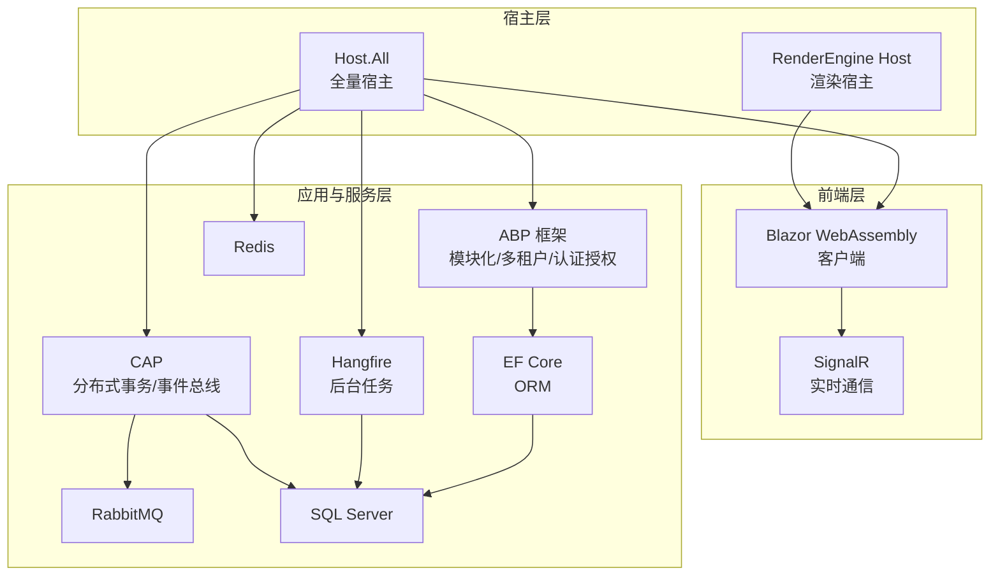
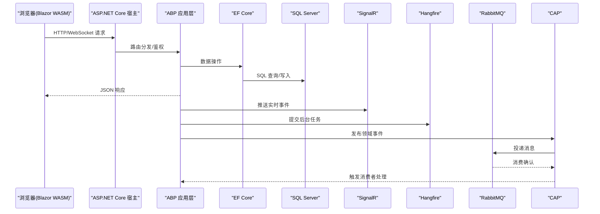
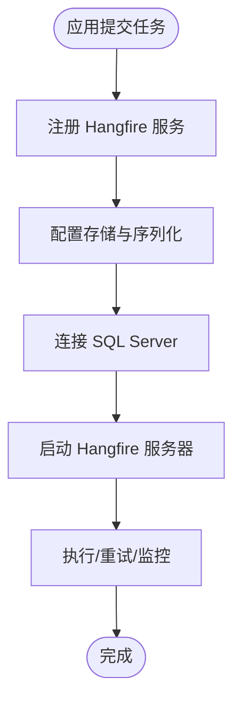
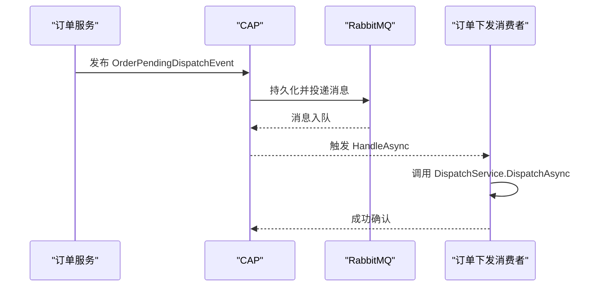
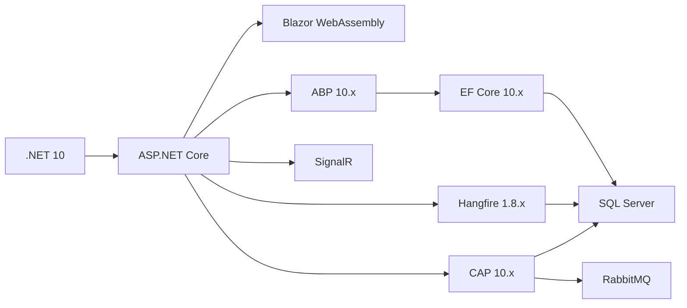

# 技术栈

<cite>
**本文引用的文件**   
- [README.md](file://README.md)
- [global.json](file://src/global.json)
- [common.props](file://src/common.props)
- [Directory.Packages.props](file://src/Directory.Packages.props)
- [docker-compose.yml](file://cd/docker-compose.yml)
- [Program.cs（Host.All）](file://src/Host/H.AppLab.Host.All/H.AppLab.Host.All/Program.cs)
- [H.AppLab.Host.All.csproj](file://src/Host/H.AppLab.Host.All/H.AppLab.Host.All/H.AppLab.Host.All.csproj)
- [BackgroundTaskApplicationModule.cs](file://src\Services\BackgroundTask\H.BackgroundTask.Application\BackgroundTaskApplicationModule.cs)
- [OrderDispatchEventConsumer.cs](file://src\Services\Order\H.Order.Application\Services\OrderDispatchEventConsumer.cs)
- [OrderApplicationModule.cs](file://src\Services\Order\H.Order.Application\OrderApplicationModule.cs)
- [Program.cs（RenderEngine Host）](file://src/Host/RenderEngine/H.LowCode.RenderEngine.Host/Program.cs)
</cite>

## 目录
1. [简介](#简介)
2. [项目结构](#项目结构)
3. [核心组件](#核心组件)
4. [架构总览](#架构总览)
5. [详细组件分析](#详细组件分析)
6. [依赖关系分析](#依赖关系分析)
7. [性能考量](#性能考量)
8. [故障排查指南](#故障排查指南)
9. [结论](#结论)
10. [附录](#附录)

## 简介
本技术栈文档面向 AppLab 平台，系统性梳理并解释核心技术选型与依赖库，包括 .NET 10、Blazor WebAssembly、Entity Framework Core、SignalR、Hangfire、CAP 等。文档同时给出开发环境要求、版本兼容性说明、架构图与数据流向，以及企业级应用的最佳实践与技术决策考量，帮助读者快速理解并高效使用平台。

## 项目结构
AppLab 采用模块化架构，支持单体部署与按服务独立部署两种模式：
- Host：宿主程序，仅做服务注册与管线配置，不包含业务逻辑；提供“全量宿主”和“单服务宿主”。
- Components：共享 UI 组件（如 AppDrawer）。
- LowCode：低代码核心，包含设计引擎、渲染引擎、元数据 Schema、默认组件库等。
- Services：按限界上下文划分的业务模块（Account、Organization、Approval、Notification、Order、Setting、SupplyChain、BackgroundTask、Testing 等），遵循 Application.Contracts / Application / EntityFrameworkCore / Web 分层。
- System：系统级应用（Enterprise、SystemPortal），与业务服务隔离。
- Tools：各服务的 DbMigrator 控制台程序，用于数据库迁移。
- Utils：通用工具库（ABP 契约、HTTP 动态代理、Blazor 工具、ID 生成等）。

图表来源 
- [Program.cs（Host.All）:1-41](file://src/Host/H.AppLab.Host.All/H.AppLab.Host.All/Program.cs#L1-L41)
- [Program.cs（RenderEngine Host）:44-79](file://src/Host/RenderEngine/H.LowCode.RenderEngine.Host/Program.cs#L44-L79)
- [H.AppLab.Host.All.csproj:1-63](file://src/Host/H.AppLab.Host.All/H.AppLab.Host.All/H.AppLab.Host.All.csproj#L1-L63)

章节来源
- [README.md:1-74](file://README.md#L1-L74)

## 核心组件
- .NET 10 与 Blazor WebAssembly：统一前后端语言与生态，Blazor Web App（Server + WASM）模式兼顾首屏性能与交互体验。
- ABP 框架：提供模块化、多租户、认证授权、依赖注入、DTO/CRUD 约定等基础设施。
- EF Core：强类型 ORM，配合 SQL Server 提供稳定可靠的数据访问。
- SignalR：实现服务端到客户端的实时双向通信。
- Hangfire：持久化后台任务调度与执行，内置 Dashboard 便于监控。
- CAP：基于消息队列的分布式事务与事件驱动架构，保障跨服务最终一致性。
- 容器化与中间件：Docker Compose 管理 Redis、RabbitMQ 等依赖服务。

章节来源
- [global.json:1-7](file://src/global.json#L1-L7)
- [common.props:1-15](file://src/common.props#L1-L15)
- [Directory.Packages.props:1-99](file://src/Directory.Packages.props#L1-L99)
- [README.md:1-74](file://README.md#L1-L74)

## 架构总览
下图展示 AppLab 的整体技术架构与数据流向：前端通过 Blazor WASM 发起请求，经由 ABP MVC/控制器或 API 进入应用层；数据访问由 EF Core 完成；实时通信通过 SignalR；后台任务由 Hangfire 调度；跨服务事件通过 CAP 在 RabbitMQ 上异步传递，并使用 SQL Server 作为持久化存储。

图表来源 
- [Program.cs（Host.All）:1-41](file://src/Host/H.AppLab.Host.All/H.AppLab.Host.All/Program.cs#L1-L41)
- [BackgroundTaskApplicationModule.cs:1-57](file://src\Services\BackgroundTask\H.BackgroundTask.Application\BackgroundTaskApplicationModule.cs#L1-L57)
- [OrderApplicationModule.cs:34-50](file://src\Services\Order\H.Order.Application\OrderApplicationModule.cs#L34-L50)

## 详细组件分析

### .NET 10 与 Blazor WebAssembly
- 目标框架与 SDK：通过 global.json 锁定 .NET 10 SDK，确保团队一致性与可复现构建。
- Blazor Web App：Host 中启用 AddInteractiveWebAssemblyComponents，支持混合渲染模式，提升首屏加载与交互性能。
- 压缩与传输优化：启用 Brotli/Gzip 压缩，扩展 MIME 类型以覆盖 .wasm/.dll 等资源，显著降低下载体积。
- 懒加载与 AOT：按需加载程序集，Release 模式启用 AOT 与裁剪，进一步减少包体。

章节来源
- [global.json:1-7](file://src/global.json#L1-L7)
- [Program.cs（Host.All）:1-41](file://src/Host/H.AppLab.Host.All/H.AppLab.Host.All/Program.cs#L1-L41)
- [Program.cs（RenderEngine Host）:44-79](file://src/Host/RenderEngine/H.LowCode.RenderEngine.Host/Program.cs#L44-L79)
- [README.md:69-74](file://README.md#L69-L74)

### ABP 框架与模块化
- 模块化：各服务通过 AbpModule 组织，清晰划分 Contracts/Application/EF/Web 层次。
- 多租户与认证授权：集成 Identity、JWT Bearer、权限管理等能力。
- HTTP 动态代理：前端基于 IAppService 接口自动生成 HttpClient 调用，简化前后端协作。

章节来源
- [Directory.Packages.props:42-71](file://src/Directory.Packages.props#L42-L71)
- [README.md:63-68](file://README.md#L63-L68)

### Entity Framework Core 与 SQL Server
- ORM 选择：EF Core 提供强类型映射、迁移与变更跟踪，结合 SQL Server 获得成熟稳定的数据层。
- 连接串与存储：各模块 DbContext 通过连接串指向 SQL Server，迁移工具集中管理数据库结构演进。

章节来源
- [Directory.Packages.props:29-32](file://src/Directory.Packages.props#L29-L32)
- [README.md:48-50](file://README.md#L48-L50)

### SignalR 实时通信
- 用途：为测试执行进度、通知等场景提供实时推送能力。
- 配置要点：设置最大接收消息大小、开发环境开启详细错误信息，便于调试。

章节来源
- [Program.cs（Host.All）:14-19](file://src/Host/H.AppLab.Host.All/H.AppLab.Host.All/Program.cs#L14-L19)

### Hangfire 后台任务
- 用途：统一编排定时任务、延迟任务与批处理作业，提供可视化 Dashboard。
- 存储与服务器：使用 SQL Server 作为作业存储，启动内置作业服务器随宿主运行。
- 关键参数：兼容级别、序列化设置、队列轮询间隔、隔离级别等。

图表来源 
- [BackgroundTaskApplicationModule.cs:17-56](file://src\Services\BackgroundTask\H.BackgroundTask.Application\BackgroundTaskApplicationModule.cs#L17-L56)

章节来源
- [BackgroundTaskApplicationModule.cs:1-57](file://src\Services\BackgroundTask\H.BackgroundTask.Application\BackgroundTaskApplicationModule.cs#L1-L57)

### CAP 分布式事务与事件总线
- 用途：跨服务解耦与最终一致性，订单下发等场景通过事件驱动。
- 配置要点：使用 SQL Server 持久化、内存消息队列（生产替换为 RabbitMQ/Kafka），失败重试次数与间隔可调。
- 消费者：通过特性标注订阅主题，自动反序列化为领域事件对象。

图表来源 
- [OrderApplicationModule.cs:34-50](file://src\Services\Order\H.Order.Application\OrderApplicationModule.cs#L34-L50)
- [OrderDispatchEventConsumer.cs:1-33](file://src\Services\Order\H.Order.Application\Services\OrderDispatchEventConsumer.cs#L1-L33)

章节来源
- [OrderApplicationModule.cs:34-50](file://src\Services\Order\H.Order.Application\OrderApplicationModule.cs#L34-L50)
- [OrderDispatchEventConsumer.cs:1-33](file://src\Services\Order\H.Order.Application\Services\OrderDispatchEventConsumer.cs#L1-L33)

### 容器化与依赖服务
- 使用 Docker Compose 一键启动 Redis、RabbitMQ 等依赖服务，环境变量与端口映射清晰。
- 建议在生产环境使用安全密码与最小权限原则。

章节来源
- [docker-compose.yml:1-32](file://cd/docker-compose.yml#L1-L32)

## 依赖关系分析
- 运行时与框架：.NET 10、ASP.NET Core、Blazor WebAssembly。
- 应用框架：ABP 10.x（Core、Identity、EF Core、Http.Client、MultiTenancy 等）。
- 数据层：EF Core 10.x + SQL Server 驱动。
- 实时通信：SignalR。
- 后台任务：Hangfire 1.8.x + SQL Server 存储。
- 分布式事务/事件：CAP 10.x + SQL Server + RabbitMQ（或 InMemory 用于开发）。
- 日志与序列化：Serilog、System.Text.Json。
- 其他：Avalonia（桌面端）、Elsa（工作流）、Markdig、Sqids 等。

图表来源 
- [Directory.Packages.props:1-99](file://src/Directory.Packages.props#L1-L99)

章节来源
- [Directory.Packages.props:1-99](file://src/Directory.Packages.props#L1-L99)

## 性能考量
- 资源压缩：启用 Brotli/Gzip 并扩展 MIME 类型，显著降低 WASM/DLL 下载体积。
- 懒加载与 AOT：按需加载程序集，Release 模式启用 AOT 与裁剪，减少初始负载。
- 缓存策略：静态资源设置 Cache-Control，提升重复访问性能。
- 并发与吞吐：合理配置 SignalR 消息大小、Hangfire 队列轮询与隔离级别，避免阻塞。
- 数据库优化：EF Core 查询优化、索引设计与连接池调优。

[本节为通用指导，不直接分析具体文件]

## 故障排查指南
- 数据库迁移失败：检查连接串与权限，确认对应 DbMigrator 已正确执行。
- Hangfire 任务未执行：查看 Dashboard 与作业表状态，确认服务器已启动且存储连通。
- CAP 事件未消费：检查消息队列连通性、消费者注册与重试策略。
- SignalR 连接异常：开发环境开启详细错误，检查网络与跨域配置。
- WASM 加载缓慢：确认压缩与懒加载配置，检查 CDN/缓存策略。

章节来源
- [README.md:48-55](file://README.md#L48-L55)
- [Program.cs（Host.All）:14-19](file://src/Host/H.AppLab.Host.All/H.AppLab.Host.All/Program.cs#L14-L19)
- [BackgroundTaskApplicationModule.cs:33-56](file://src\Services\BackgroundTask\H.BackgroundTask.Application\BackgroundTaskApplicationModule.cs#L33-L56)
- [OrderApplicationModule.cs:38-48](file://src\Services\Order\H.Order.Application\OrderApplicationModule.cs#L38-L48)

## 结论
AppLab 平台以 .NET 10 与 Blazor WebAssembly 为核心，结合 ABP 模块化、EF Core 数据层、SignalR 实时通信、Hangfire 后台任务与 CAP 分布式事务，构建了高内聚、低耦合、可扩展的企业级应用基座。通过容器化与标准化配置，平台具备良好的可移植性与运维友好性。建议在后续迭代中持续优化数据库与消息中间件配置，完善监控与告警体系，进一步提升稳定性与可观测性。

[本节为总结性内容，不直接分析具体文件]

## 附录

### 开发环境与工具要求
- .NET SDK：10.0.0（见 global.json）
- Visual Studio：建议使用最新稳定版，支持 Blazor WebAssembly 与 AOT 调试
- 数据库：SQL Server（本地或远程实例）
- 中间件：Redis、RabbitMQ（可通过 docker-compose 启动）
- Node.js：用于前端构建与依赖管理（参考 README 中的本地开发流程）

章节来源
- [global.json:1-7](file://src/global.json#L1-L7)
- [README.md:38-55](file://README.md#L38-L55)
- [docker-compose.yml:1-32](file://cd/docker-compose.yml#L1-L32)

### 版本兼容性清单（节选）
- .NET 10：SDK 10.0.0，ASP.NET Core 10.0.10，Blazor 10.0.10
- ABP：10.5.0（Core、EF Core、Identity、Mvc、Autofac、Http.Client 等）
- EF Core：10.0.10（含 Relational、SqlServer）
- Hangfire：1.8.24（Core、AspNetCore、SqlServer）
- CAP：10.0.1（含 SqlServer 与 InMemory 消息队列）
- Serilog：4.1.0（Extensions.Logging、Settings.Configuration、Sinks.*）
- Avalonia：11.3.2（Desktop、Themes.Fluent 等）

章节来源
- [Directory.Packages.props:1-99](file://src/Directory.Packages.props#L1-L99)