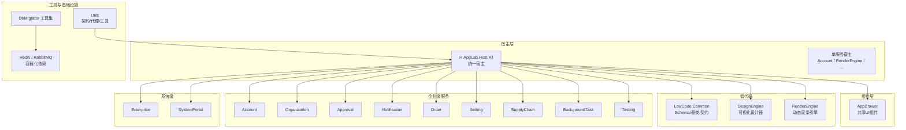
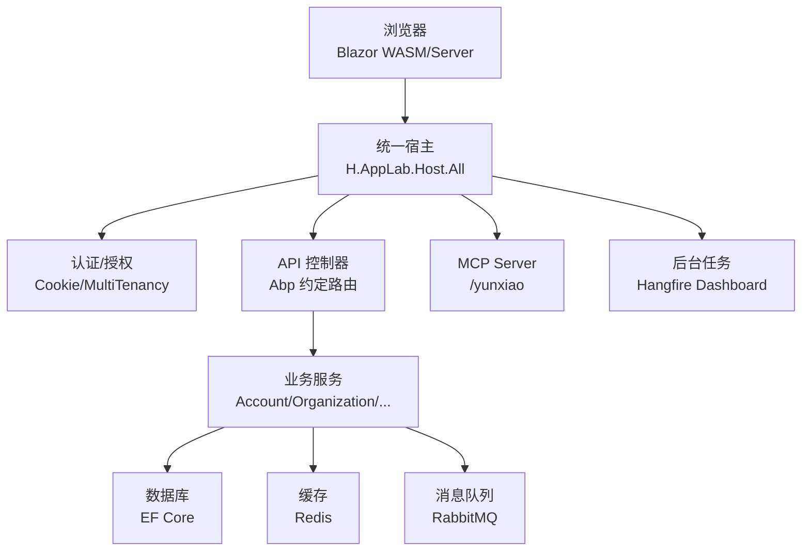
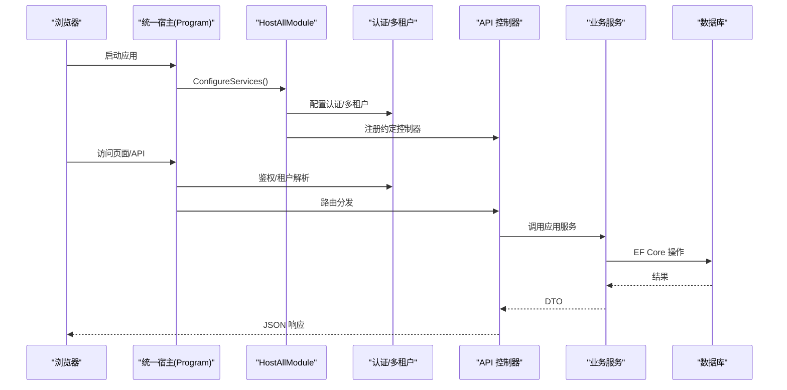
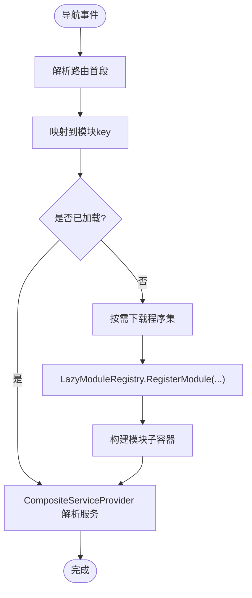
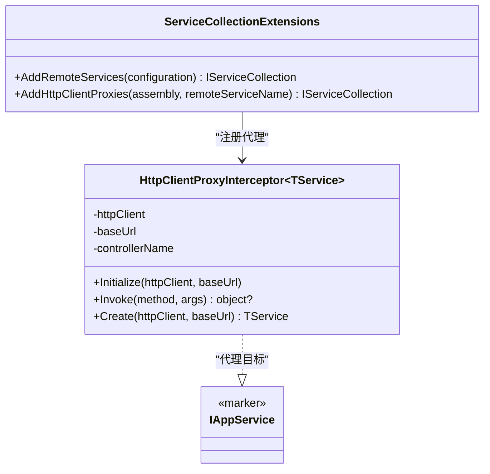
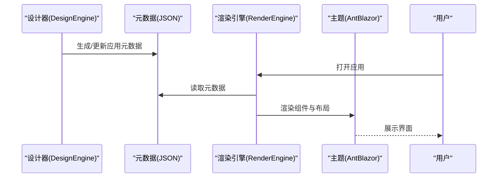
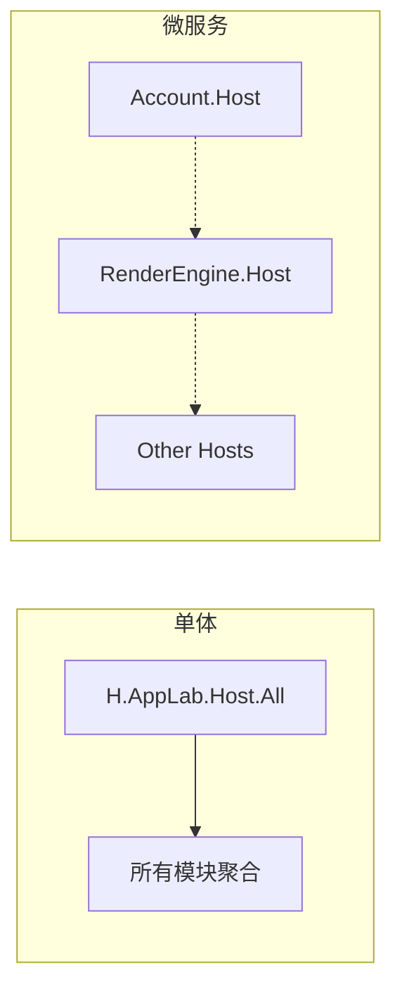
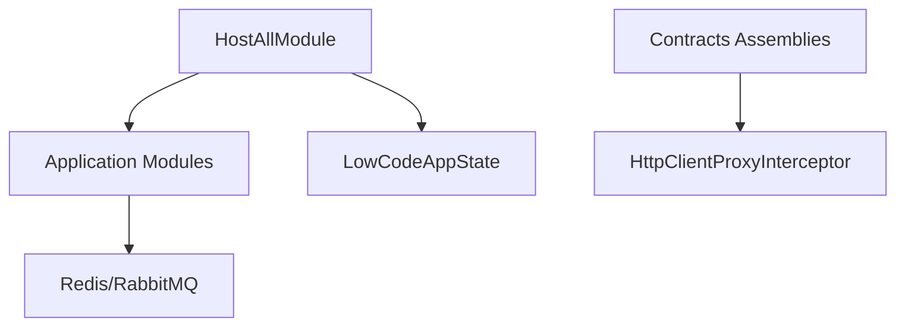

# 架构概览

<cite>
**本文引用的文件**   
- [README.md](file://README.md)
- [AppLab.slnx](file://src/AppLab.slnx)
- [common.props](file://src/common.props)
- [docker-compose.yml](file://cd/docker-compose.yml)
- [Program.cs](file://src/Host/H.AppLab.Host.All/H.AppLab.Host.All/Program.cs)
- [HostAllModule.cs](file://src/Host/H.AppLab.Host.All/H.AppLab.Host.All/HostAllModule.cs)
- [ClientServices.cs](file://src/Host/H.AppLab.Host.All/H.AppLab.Host.All.Client/ClientServices.cs)
- [LazyModuleServices.cs](file://src/Host/H.AppLab.Host.All/H.AppLab.Host.All.Client/LazyModuleServices.cs)
- [IAppService.cs](file://src/Utils/H.Abp.Application.Contracts/IAppService.cs)
- [HttpClientProxyInterceptor.cs](file://src/Utils/H.Abp.HttpClientProxy/HttpClientProxyInterceptor.cs)
- [ServiceCollectionExtensions.cs](file://src/Utils/H.Abp.HttpClientProxy/ServiceCollectionExtensions.cs)
- [LowCodeAppState.cs](file://src/LowCode/Common/H.LowCode.ComponentBase/LowCodeAppState.cs)
</cite>

## 目录
1. [引言](#引言)
2. [项目结构](#项目结构)
3. [核心组件](#核心组件)
4. [架构总览](#架构总览)
5. [详细组件分析](#详细组件分析)
6. [依赖关系分析](#依赖关系分析)
7. [性能考虑](#性能考虑)
8. [故障排查指南](#故障排查指南)
9. [结论](#结论)
10. [附录](#附录)

## 引言
本文件为 AppLab 平台的架构概览，面向技术与非技术读者，系统阐述模块化、分层与微服务融合的架构理念。平台基于 .NET + Blazor（Server + WebAssembly）构建，支持单体部署与按服务独立部署两种模式；通过宿主模块聚合业务服务与基础设施能力，提供统一的导航、认证、多租户与扩展点。低代码设计引擎与渲染引擎构成平台核心，配合应用抽屉、动态 HTTP 代理、懒加载与 AOT 裁剪等机制，实现高可维护性、可扩展性与良好性能。

## 项目结构
- 宿主层（Host）
  - H.AppLab.Host.All：统一宿主，聚合所有业务与服务模块，作为单体入口
  - 其他 Host：单服务宿主（如 Account、RenderEngine），用于微服务部署
- 组件层（Components）
  - AppDrawer：跨应用共享的 UI 组件（顶部导航、侧边菜单、应用抽屉）
- 低代码（LowCode）
  - Common：元数据 Schema、组件基类、默认组件库、实体与契约
  - DesignEngine：可视化设计器，产出应用元数据
  - RenderEngine：根据元数据动态渲染应用，主题基于 Ant Design Blazor
- 企业级服务（Services）
  - 按限界上下文划分：Account、Organization、Approval、Assistant、Notification、Order、Setting、SupplyChain、BackgroundTask、Testing 等
- 系统级（System）
  - Enterprise、SystemPortal：面向平台运营侧，与 Services 隔离
- 工具（Tools）
  - 各服务的 DbMigrator 控制台程序，负责数据库迁移
- 工具库（Utils）
  - IAppService 契约、HTTP 客户端代理、Blazor 工具、ID 生成等

**图表来源** 
- [AppLab.slnx](file://src/AppLab.slnx)
- [README.md](file://README.md)

**章节来源**
- [README.md](file://README.md)
- [AppLab.slnx](file://src/AppLab.slnx)

## 核心组件
- 统一宿主（HostAll）
  - 注册 Blazor、SignalR、JSON、响应压缩、静态资源、路由、认证、授权、反伪造、多租户、控制器约定、Hangfire 仪表盘等
  - 聚合所有 Application 模块，启用自动 API 控制器扫描
- 客户端服务与懒加载
  - ClientServices：集中管理远程服务名称、HttpClient 命名客户端、CookieHandler、以及按路由懒加载模块的服务注册
  - LazyModuleServices：组合式 DI，根容器 + 模块子容器，支持程序集下载后延迟注册服务并回退解析
- HTTP 客户端代理
  - IAppService：标记接口，标识可通过 HTTP 代理调用的服务
  - HttpClientProxyInterceptor：基于 DispatchProxy 拦截接口方法，按 ABP 约定生成 URL、序列化请求体、处理返回类型
  - ServiceCollectionExtensions：从配置加载 RemoteServices，扫描程序集注册代理
- 低代码状态
  - LowCodeAppState：区分设计时与运行时的全局状态

**章节来源**
- [Program.cs](file://src/Host/H.AppLab.Host.All/H.AppLab.Host.All/Program.cs)
- [HostAllModule.cs](file://src/Host/H.AppLab.Host.All/H.AppLab.Host.All/HostAllModule.cs)
- [ClientServices.cs](file://src/Host/H.AppLab.Host.All/H.AppLab.Host.All.Client/ClientServices.cs)
- [LazyModuleServices.cs](file://src/Host/H.AppLab.Host.All/H.AppLab.Host.All.Client/LazyModuleServices.cs)
- [IAppService.cs](file://src/Utils/H.Abp.Application.Contracts/IAppService.cs)
- [HttpClientProxyInterceptor.cs](file://src/Utils/H.Abp.HttpClientProxy/HttpClientProxyInterceptor.cs)
- [ServiceCollectionExtensions.cs](file://src/Utils/H.Abp.HttpClientProxy/ServiceCollectionExtensions.cs)
- [LowCodeAppState.cs](file://src/LowCode/Common/H.LowCode.ComponentBase/LowCodeAppState.cs)

## 架构总览
整体采用“模块化 + 分层 + 微服务”融合架构：
- 模块化：每个业务域以 Application.Contracts / Application / EntityFrameworkCore / Web 分层组织，便于独立演进
- 分层：宿主层负责编排与横切关注点，业务层聚焦领域逻辑，基础设施层提供存储、消息、缓存等
- 微服务：通过单服务宿主（Account、RenderEngine 等）独立部署，或统一宿主聚合为单体

**图表来源** 
- [Program.cs](file://src/Host/H.AppLab.Host.All/H.AppLab.Host.All/Program.cs)
- [HostAllModule.cs](file://src/Host/H.AppLab.Host.All/H.AppLab.Host.All/HostAllModule.cs)
- [docker-compose.yml](file://cd/docker-compose.yml)

## 详细组件分析

### 统一宿主与模块聚合
- Program 初始化 Blazor、SignalR、JSON、响应压缩、静态资源、路由、认证、授权、反伪造、多租户、控制器映射、Hangfire 仪表盘、WASM 渲染模式与附加程序集
- HostAllModule 聚合所有 Application 模块，启用 Abp MVC 约定控制器、Cookie 认证（双 Scheme）、外部登录、多租户（Claims 解析、错误页清理 Cookie 并重定向）、LowCodeAppState 注入

**图表来源** 
- [Program.cs](file://src/Host/H.AppLab.Host.All/H.AppLab.Host.All/Program.cs)
- [HostAllModule.cs](file://src/Host/H.AppLab.Host.All/H.AppLab.Host.All/HostAllModule.cs)

**章节来源**
- [Program.cs](file://src/Host/H.AppLab.Host.All/H.AppLab.Host.All/Program.cs)
- [HostAllModule.cs](file://src/Host/H.AppLab.Host.All/H.AppLab.Host.All/HostAllModule.cs)

### 前端懒加载与组合式 DI
- ClientServices 集中管理远程服务名、HttpClient 命名客户端、CookieHandler，并通过 AddRemoteServices 加载 RemoteServices 配置
- 路由首段到模块 key 的映射，在导航时触发程序集下载与模块服务注册（AddHttpClientProxies）
- LazyModuleRegistry 维护模块子容器，CompositeServiceProvider 优先从根容器解析，未命中回退到模块子容器

**图表来源** 
- [ClientServices.cs](file://src/Host/H.AppLab.Host.All/H.AppLab.Host.All.Client/ClientServices.cs)
- [LazyModuleServices.cs](file://src/Host/H.AppLab.Host.All/H.AppLab.Host.All.Client/LazyModuleServices.cs)

**章节来源**
- [ClientServices.cs](file://src/Host/H.AppLab.Host.All/H.AppLab.Host.All.Client/ClientServices.cs)
- [LazyModuleServices.cs](file://src/Host/H.AppLab.Host.All/H.AppLab.Host.All.Client/LazyModuleServices.cs)

### HTTP 客户端代理与远程调用
- IAppService 标记接口，表示可通过 HTTP 代理调用
- HttpClientProxyInterceptor 拦截接口方法，按 AbpUrlConvention 生成路径、参数与请求体，发送 HTTP 请求并反序列化返回
- ServiceCollectionExtensions 从配置读取 RemoteServices，扫描程序集内 IAppService 接口并注册代理

**图表来源** 
- [IAppService.cs](file://src/Utils/H.Abp.Application.Contracts/IAppService.cs)
- [HttpClientProxyInterceptor.cs](file://src/Utils/H.Abp.HttpClientProxy/HttpClientProxyInterceptor.cs)
- [ServiceCollectionExtensions.cs](file://src/Utils/H.Abp.HttpClientProxy/ServiceCollectionExtensions.cs)

**章节来源**
- [IAppService.cs](file://src/Utils/H.Abp.Application.Contracts/IAppService.cs)
- [HttpClientProxyInterceptor.cs](file://src/Utils/H.Abp.HttpClientProxy/HttpClientProxyInterceptor.cs)
- [ServiceCollectionExtensions.cs](file://src/Utils/H.Abp.HttpClientProxy/ServiceCollectionExtensions.cs)

### 低代码设计与渲染
- DesignEngine：可视化设计器，产出应用与组件元数据（JSON）
- RenderEngine：根据元数据动态渲染应用，主题基于 Ant Design Blazor
- LowCodeAppState：区分设计时与运行时的全局状态，宿主中注入 isDesign=true

**图表来源** 
- [README.md](file://README.md)
- [LowCodeAppState.cs](file://src/LowCode/Common/H.LowCode.ComponentBase/LowCodeAppState.cs)

**章节来源**
- [README.md](file://README.md)
- [LowCodeAppState.cs](file://src/LowCode/Common/H.LowCode.ComponentBase/LowCodeAppState.cs)

### 单体与微服务部署差异
- 单体部署
  - 使用 H.AppLab.Host.All 聚合所有模块，统一进程、统一数据库连接、统一认证与多租户
  - 适合快速迭代、中小规模团队与初期产品验证
- 微服务部署
  - 使用单服务宿主（Account、RenderEngine 等）独立部署，服务间通过 HTTP 调用（IAppService 代理）
  - 适合大规模团队、高并发与独立伸缩场景

**图表来源** 
- [README.md](file://README.md)
- [AppLab.slnx](file://src/AppLab.slnx)

**章节来源**
- [README.md](file://README.md)
- [AppLab.slnx](file://src/AppLab.slnx)

## 依赖关系分析
- 宿主依赖所有 Application 模块，启用 Abp MVC 约定控制器
- 客户端通过 ServiceCollectionExtensions 扫描 Contracts 程序集，注册 IAppService 代理
- 低代码模块通过 LowCodeAppState 区分设计/运行态
- 基础设施依赖 Redis、RabbitMQ（容器化）

**图表来源** 
- [HostAllModule.cs](file://src/Host/H.AppLab.Host.All/H.AppLab.Host.All/HostAllModule.cs)
- [ServiceCollectionExtensions.cs](file://src/Utils/H.Abp.HttpClientProxy/ServiceCollectionExtensions.cs)
- [HttpClientProxyInterceptor.cs](file://src/Utils/H.Abp.HttpClientProxy/HttpClientProxyInterceptor.cs)
- [LowCodeAppState.cs](file://src/LowCode/Common/H.LowCode.ComponentBase/LowCodeAppState.cs)
- [docker-compose.yml](file://cd/docker-compose.yml)

**章节来源**
- [HostAllModule.cs](file://src/Host/H.AppLab.Host.All/H.AppLab.Host.All/HostAllModule.cs)
- [ServiceCollectionExtensions.cs](file://src/Utils/H.Abp.HttpClientProxy/ServiceCollectionExtensions.cs)
- [HttpClientProxyInterceptor.cs](file://src/Utils/H.Abp.HttpClientProxy/HttpClientProxyInterceptor.cs)
- [LowCodeAppState.cs](file://src/LowCode/Common/H.LowCode.ComponentBase/LowCodeAppState.cs)
- [docker-compose.yml](file://cd/docker-compose.yml)

## 性能考虑
- 响应压缩：启用 Brotli/Gzip，针对 WASM 程序集与静态资源优化传输体积
- 静态资源缓存：MapStaticAssets 对指纹化程序集启用 immutable 长缓存，避免清单失效导致的 404
- 懒加载：仅首页加载必要程序集，其余模块按路由懒加载，减少初始包大小
- AOT 与裁剪：Release 模式启用 AOT 与 Trimming，进一步减小体积
- SignalR 与 Hangfire：提升实时通信与后台任务处理能力

**章节来源**
- [Program.cs](file://src/Host/H.AppLab.Host.All/H.AppLab.Host.All/Program.cs)
- [README.md](file://README.md)

## 故障排查指南
- 认证与多租户
  - 检查 Cookie 认证配置（双 Scheme）、登录/拒绝路径、过期策略
  - 多租户解析失败时，清理 __tenant Cookie 并重定向首页
- 静态资源与 WASM 启动
  - 不要将 /_framework 整体标记为 immutable，避免清单与指纹程序集不匹配导致静默 404
- 远程服务调用
  - 确认 RemoteServices 配置正确，命名客户端与 CookieHandler 已注册
  - 检查 AbpUrlConvention 生成的路径与参数是否符合后端控制器约定
- 懒加载模块
  - 确保路由首段到模块 key 映射正确，LazyModuleRegistry 已注册对应模块服务
- 基础设施依赖
  - 确认 Redis、RabbitMQ 容器运行正常，端口与凭据配置一致

**章节来源**
- [HostAllModule.cs](file://src/Host/H.AppLab.Host.All/H.AppLab.Host.All/HostAllModule.cs)
- [Program.cs](file://src/Host/H.AppLab.Host.All/H.AppLab.Host.All/Program.cs)
- [ClientServices.cs](file://src/Host/H.AppLab.Host.All/H.AppLab.Host.All.Client/ClientServices.cs)
- [docker-compose.yml](file://cd/docker-compose.yml)

## 结论
AppLab 平台通过模块化、分层与微服务融合的架构，实现了高可维护性与可扩展性。统一宿主聚合业务能力，低代码设计/渲染引擎提供灵活的应用构建与发布，前端懒加载与 HTTP 代理简化了跨服务调用。结合响应压缩、AOT 与容器化基础设施，平台在性能与运维方面具备良好表现。未来可按需拆分服务、扩展模块与插件，持续支撑企业级应用开发需求。

## 附录
- 版本与目标框架：net10.0，预览语言特性，Nullable 启用
- 本地依赖：Redis、RabbitMQ（容器化）
- 启动方式：单体宿主 H.AppLab.Host.All，默认地址 http://localhost:5045（https 7065）

**章节来源**
- [common.props](file://src/common.props)
- [README.md](file://README.md)