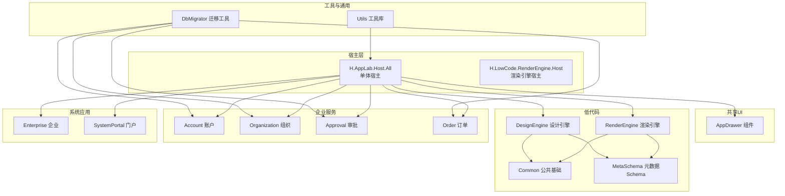
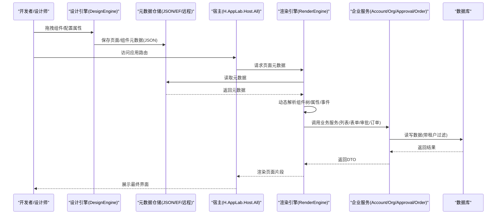
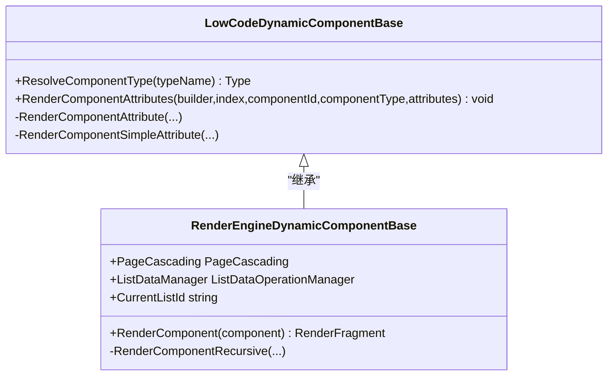
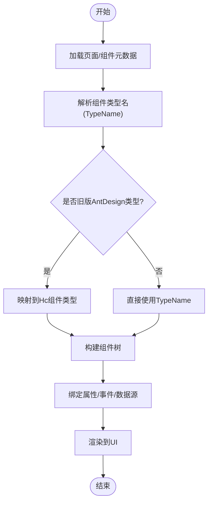
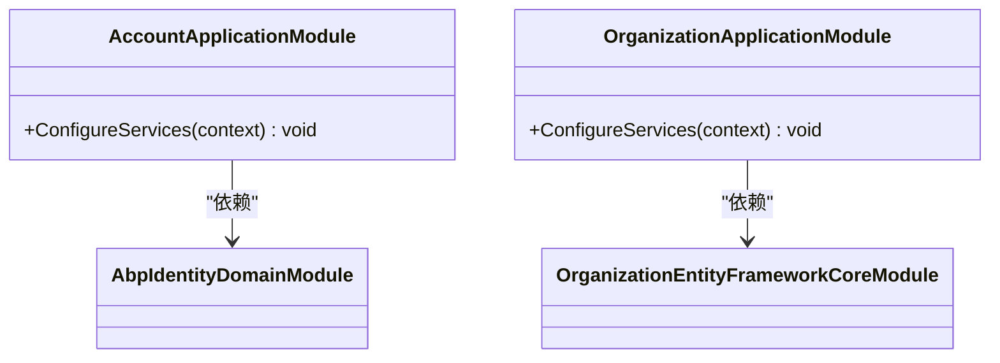
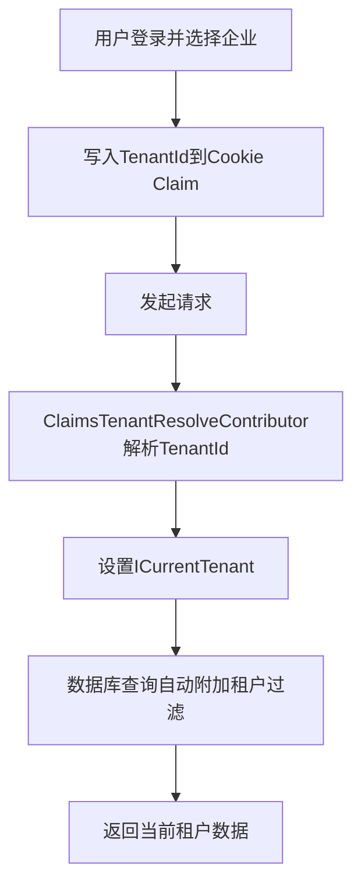
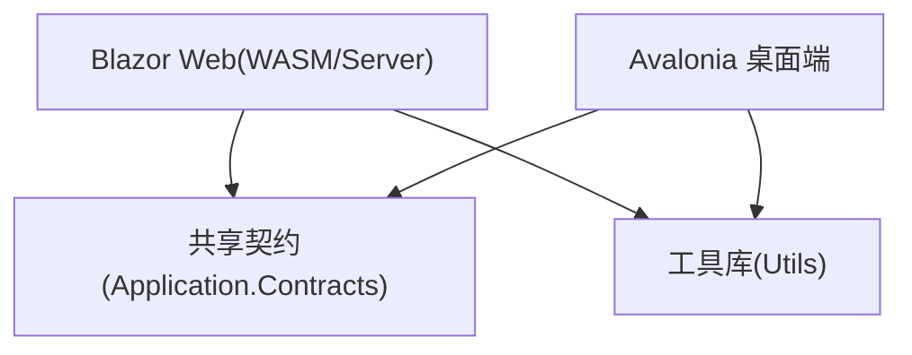
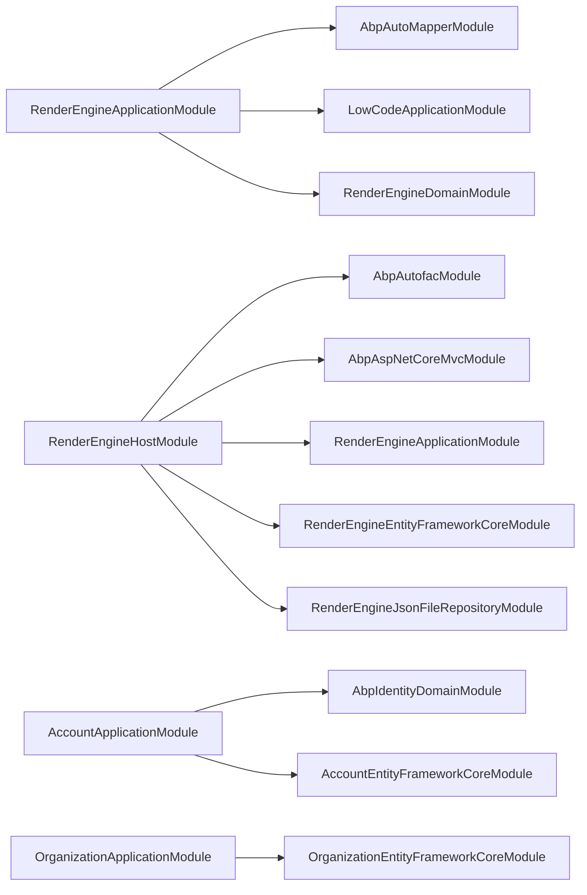

# 核心特性

<cite>
**本文引用的文件**   
- [README.md](file://README.md)
- [H.AppLab.Host.All/ClaimsTenantResolveContributor.cs](file://src/Host/H.AppLab.Host.All/H.AppLab.Host.All/ClaimsTenantResolveContributor.cs)
- [LowCodeDynamicComponentBase.cs](file://src/LowCode/Common/H.LowCode.ComponentBase/LowCodeDynamicComponentBase.cs)
- [RenderEngineApplicationModule.cs](file://src/LowCode/RenderEngine/H.LowCode.RenderEngine.Application/RenderEngineApplicationModule.cs)
- [RenderEngineHostModule.cs](file://src/Host/RenderEngine/H.LowCode.RenderEngine.Host/RenderEngineHostModule.cs)
- [RenderEngineDynamicComponentBase.cs](file://src/LowCode/RenderEngine/H.LowCode.RenderEngineBase/RenderEngineDynamicComponentBase.cs)
- [AccountApplicationModule.cs](file://src/Services/Account/H.Account.Application/AccountApplicationModule.cs)
- [OrganizationApplicationModule.cs](file://src/Services/Organization/H.Organization.Application/OrganizationApplicationModule.cs)
- [Program.cs（渲染引擎客户端）](file://src/Host/RenderEngine/H.LowCode.RenderEngine.Host.Client/Program.cs)
</cite>

## 目录
1. [简介](#简介)
2. [项目结构](#项目结构)
3. [核心组件](#核心组件)
4. [架构总览](#架构总览)
5. [详细组件分析](#详细组件分析)
6. [依赖关系分析](#依赖关系分析)
7. [性能考量](#性能考量)
8. [故障排查指南](#故障排查指南)
9. [结论](#结论)
10. [附录](#附录)

## 简介
本文件面向开发者与产品技术负责人，系统性介绍 AppLab 平台的核心能力与价值：
- 低代码引擎：可视化设计器、动态组件渲染、元数据驱动开发
- 企业级服务：账户管理、组织管理、审批流程、订单管理等常用业务模块
- AI 助手服务：MCP 协议集成、工具函数库、桌面端应用
- 多租户架构：基于 ABP 的租户识别与数据隔离
- 跨平台支持：Web 端与桌面端（Avalonia）的统一开发体验

通过“场景 + 价值”的方式，帮助读者快速理解平台如何降低交付成本、提升研发效率并保障企业级安全与可运维性。

## 项目结构
AppLab 采用模块化架构，支持单体部署与按服务独立部署两种模式。整体分层清晰：
- Host 宿主：仅做服务注册与启动，不包含业务逻辑；提供单体与单服务两种宿主形态
- Components 共享 UI：如 AppDrawer 抽屉组件，统一导航与布局
- LowCode 低代码：包含元数据 Schema、组件基类、默认组件库、设计引擎与渲染引擎
- Services 企业级服务：按限界上下文划分，遵循 Application.Contracts / Application / EntityFrameworkCore / Web 分层
- System 系统级应用：Enterprise、SystemPortal，面向平台运营侧
- Tools 数据库迁移：各服务的 DbMigrator 控制台程序
- Utils 工具库：HTTP 动态代理、Blazor 工具、ID 生成等

图表来源
- [README.md:1-74](file://README.md#L1-L74)

章节来源
- [README.md:1-74](file://README.md#L1-L74)

## 核心组件
- 低代码动态组件基类：负责根据元数据动态解析组件类型、属性与事件，实现“所见即所得”的动态渲染
- 渲染引擎应用模块：装配 AutoMapper、配置元数据选项，暴露渲染相关 API
- 渲染引擎宿主模块：注册 MVC 控制器、注入应用状态，完成运行时环境搭建
- 账户与组织模块：分别承载身份认证与企业组织架构的基础能力

章节来源
- [LowCodeDynamicComponentBase.cs:1-187](file://src/LowCode/Common/H.LowCode.ComponentBase/LowCodeDynamicComponentBase.cs#L1-L187)
- [RenderEngineApplicationModule.cs:1-31](file://src/LowCode/RenderEngine/H.LowCode.RenderEngine.Application/RenderEngineApplicationModule.cs#L1-L31)
- [RenderEngineHostModule.cs:1-39](file://src/Host/RenderEngine/H.LowCode.RenderEngine.Host/RenderEngineHostModule.cs#L1-L39)
- [AccountApplicationModule.cs:1-24](file://src/Services/Account/H.Account.Application/AccountApplicationModule.cs#L1-L24)
- [OrganizationApplicationModule.cs:1-17](file://src/Services/Organization/H.Organization.Application/OrganizationApplicationModule.cs#L1-L17)

## 架构总览
AppLab 以 ABP 模块化为核心，结合 Blazor Server/WASM 与 Avalonia，形成“设计-渲染-运行”的闭环：
- 设计端（DesignEngine）产出页面与组件的元数据（JSON）
- 渲染端（RenderEngine）读取元数据，动态构建组件树并渲染
- 宿主（Host）负责服务注册、路由与懒加载策略
- 企业级服务（Account/Organization/Approval/Order 等）提供领域能力
- 多租户通过 Claims 解析，贯穿所有服务的数据隔离

图表来源
- [RenderEngineApplicationModule.cs:1-31](file://src/LowCode/RenderEngine/H.LowCode.RenderEngine.Application/RenderEngineApplicationModule.cs#L1-L31)
- [RenderEngineHostModule.cs:1-39](file://src/Host/RenderEngine/H.LowCode.RenderEngine.Host/RenderEngineHostModule.cs#L1-L39)
- [LowCodeDynamicComponentBase.cs:1-187](file://src/LowCode/Common/H.LowCode.ComponentBase/LowCodeDynamicComponentBase.cs#L1-L187)

## 详细组件分析

### 低代码引擎：可视化设计器与动态渲染
- 可视化设计器（DesignEngine）
  - 提供页面与组件的可视化编辑能力，产出标准元数据（JSON）
  - 支持组件库、模板、主题等扩展点
- 动态组件渲染（RenderEngine）
  - 基于元数据动态解析组件类型、属性与事件回调
  - 兼容历史 AntDesign 类型名到自研 Hc 组件的映射，确保平滑升级
  - 支持数据源绑定、列表操作、表单校验等常见交互

图表来源
- [LowCodeDynamicComponentBase.cs:1-187](file://src/LowCode/Common/H.LowCode.ComponentBase/LowCodeDynamicComponentBase.cs#L1-L187)
- [RenderEngineDynamicComponentBase.cs:1-39](file://src/LowCode/RenderEngine/H.LowCode.RenderEngineBase/RenderEngineDynamicComponentBase.cs#L1-L39)

使用场景与价值
- 场景：市场活动页快速搭建、内部报表页面按需组合、表单类应用零代码搭建
- 价值：缩短交付周期、降低维护成本、统一设计规范与交互体验

章节来源
- [LowCodeDynamicComponentBase.cs:1-187](file://src/LowCode/Common/H.LowCode.ComponentBase/LowCodeDynamicComponentBase.cs#L1-L187)
- [RenderEngineDynamicComponentBase.cs:1-39](file://src/LowCode/RenderEngine/H.LowCode.RenderEngineBase/RenderEngineDynamicComponentBase.cs#L1-L39)

### 元数据驱动开发
- 元数据 Schema（MetaSchema）定义页面、组件、数据源的规范
- 渲染引擎根据 Schema 动态构建组件树，属性与事件由运行时注入
- 支持多种仓储实现（JsonFile/EntityFrameworkCore/RemoteService），便于本地调试与云端协作

图表来源
- [LowCodeDynamicComponentBase.cs:1-187](file://src/LowCode/Common/H.LowCode.ComponentBase/LowCodeDynamicComponentBase.cs#L1-L187)

章节来源
- [LowCodeDynamicComponentBase.cs:1-187](file://src/LowCode/Common/H.LowCode.ComponentBase/LowCodeDynamicComponentBase.cs#L1-L187)

### 企业级服务：账户管理与组织管理
- 账户管理（Account）
  - 提供用户、角色、外部登录等能力
  - 通过 AbpIdentity 集成，支持 HTTP Client 与 HttpContextAccessor
- 组织管理（Organization）
  - 提供企业、部门、岗位等组织模型与服务
  - 与多租户体系配合，实现组织维度数据隔离

图表来源
- [AccountApplicationModule.cs:1-24](file://src/Services/Account/H.Account.Application/AccountApplicationModule.cs#L1-L24)
- [OrganizationApplicationModule.cs:1-17](file://src/Services/Organization/H.Organization.Application/OrganizationApplicationModule.cs#L1-L17)

使用场景与价值
- 场景：企业员工账号开通、权限分配、组织架构调整
- 价值：开箱即用、标准化身份与组织模型，支撑上层业务快速集成

章节来源
- [AccountApplicationModule.cs:1-24](file://src/Services/Account/H.Account.Application/AccountApplicationModule.cs#L1-L24)
- [OrganizationApplicationModule.cs:1-17](file://src/Services/Organization/H.Organization.Application/OrganizationApplicationModule.cs#L1-L17)

### 审批流程与订单管理
- 审批流程（Approval）
  - 提供审批模板、流程实例、节点处理等服务
  - 与组织/账户联动，实现基于角色的审批人匹配
- 订单管理（Order）
  - 提供订单生命周期管理、状态机、事件发布等
  - 与通知、背景任务等基础服务协同

使用场景与价值
- 场景：采购审批、合同审核、订单创建与履约跟踪
- 价值：流程可配置、状态可追踪、与业务解耦，提升合规性与可审计性

章节来源
- [README.md:1-74](file://README.md#L1-L74)

### AI 助手服务：MCP 协议集成、工具函数库、桌面端应用
- MCP 协议集成
  - 通过 MCP 服务器与工具集对接，扩展助手能力
- 工具函数库
  - 为助手提供丰富的内置工具，覆盖数据处理、API 调用、文件操作等
- 桌面端应用（Avalonia）
  - 提供本地化运行体验，适合离线或内网环境

使用场景与价值
- 场景：智能问答、自动化脚本执行、本地数据分析
- 价值：增强人机协作效率，降低重复劳动，提升用户体验

章节来源
- [README.md:1-74](file://README.md#L1-L74)

### 多租户架构与数据安全隔离
- 租户识别
  - 通过 ClaimsTenantResolveContributor 从认证 Cookie 中的 TenantId Claim 解析当前租户
- 数据隔离
  - ABP 多租户机制在各服务中生效，查询自动附加租户过滤条件
- 适用场景
  - 企业级 SaaS 或多部门数据隔离

图表来源
- [H.AppLab.Host.All/ClaimsTenantResolveContributor.cs:1-31](file://src/Host/H.AppLab.Host.All/H.AppLab.Host.All/ClaimsTenantResolveContributor.cs#L1-L31)

章节来源
- [H.AppLab.Host.All/ClaimsTenantResolveContributor.cs:1-31](file://src/Host/H.AppLab.Host.All/H.AppLab.Host.All/ClaimsTenantResolveContributor.cs#L1-L31)

### 跨平台支持：Web 端与桌面端（Avalonia）
- Web 端
  - 基于 Blazor Server/WASM，支持服务端与客户端混合渲染
  - 懒加载与 AOT/Trimming 优化首屏与包体积
- 桌面端（Avalonia）
  - 统一的 MVVM 模式与视图模型，复用业务契约与服务
- 统一开发体验
  - 共享契约与工具库，减少重复实现

章节来源
- [README.md:1-74](file://README.md#L1-L74)

## 依赖关系分析
- 渲染引擎应用模块依赖 ABP AutoMapper 与 LowCode 应用模块，用于 DTO 映射与配置加载
- 渲染引擎宿主模块依赖 Autofac、Mvc 与 EF Core 模块，完成控制器注册与仓储装配
- 账户与组织模块依赖各自的 EF Core 模块与 Identity 域模块

图表来源
- [RenderEngineApplicationModule.cs:1-31](file://src/LowCode/RenderEngine/H.LowCode.RenderEngine.Application/RenderEngineApplicationModule.cs#L1-L31)
- [RenderEngineHostModule.cs:1-39](file://src/Host/RenderEngine/H.LowCode.RenderEngine.Host/RenderEngineHostModule.cs#L1-L39)
- [AccountApplicationModule.cs:1-24](file://src/Services/Account/H.Account.Application/AccountApplicationModule.cs#L1-L24)
- [OrganizationApplicationModule.cs:1-17](file://src/Services/Organization/H.Organization.Application/OrganizationApplicationModule.cs#L1-L17)

章节来源
- [RenderEngineApplicationModule.cs:1-31](file://src/LowCode/RenderEngine/H.LowCode.RenderEngine.Application/RenderEngineApplicationModule.cs#L1-L31)
- [RenderEngineHostModule.cs:1-39](file://src/Host/RenderEngine/H.LowCode.RenderEngine.Host/RenderEngineHostModule.cs#L1-L39)
- [AccountApplicationModule.cs:1-24](file://src/Services/Account/H.Account.Application/AccountApplicationModule.cs#L1-L24)
- [OrganizationApplicationModule.cs:1-17](file://src/Services/Organization/H.Organization.Application/OrganizationApplicationModule.cs#L1-L17)

## 性能考量
- 前端懒加载
  - 首页仅加载必要程序集，其余按路由懒加载，显著降低首屏体积
- AOT 与裁剪
  - Release 模式启用 AOT 与 Trimming，进一步减少下载与内存占用
- 动态代理
  - 基于 IAppService 的 HTTP 动态代理，避免手写 HttpClient，简化调用并保持一致性
- 渲染优化
  - 动态组件渲染时进行类型解析与属性映射，建议合理拆分组件与延迟加载资源

章节来源
- [README.md:1-74](file://README.md#L1-L74)

## 故障排查指南
- 组件类型解析失败
  - 检查元数据中的 TypeName 是否正确，必要时确认 AntDesign 到 Hc 的映射是否生效
- 租户数据不隔离
  - 确认 Cookie 中是否存在 TenantId Claim，以及 ClaimsTenantResolveContributor 是否被正确注册
- 渲染引擎无法加载
  - 检查宿主模块是否注册了必要的仓储与 EF Core 模块，确认应用状态注入
- 前端懒加载未触发
  - 检查 Routes.razor 的 OnNavigateAsync 是否按路由触发程序集加载

章节来源
- [LowCodeDynamicComponentBase.cs:1-187](file://src/LowCode/Common/H.LowCode.ComponentBase/LowCodeDynamicComponentBase.cs#L1-L187)
- [H.AppLab.Host.All/ClaimsTenantResolveContributor.cs:1-31](file://src/Host/H.AppLab.Host.All/H.AppLab.Host.All/ClaimsTenantResolveContributor.cs#L1-L31)
- [RenderEngineHostModule.cs:1-39](file://src/Host/RenderEngine/H.LowCode.RenderEngine.Host/RenderEngineHostModule.cs#L1-L39)
- [Program.cs（渲染引擎客户端）:1-18](file://src/Host/RenderEngine/H.LowCode.RenderEngine.Host.Client/Program.cs#L1-L18)

## 结论
AppLab 平台以低代码引擎为核心，结合企业级服务与 AI 助手能力，提供从设计到运行的完整闭环。通过元数据驱动、多租户隔离与跨平台支持，平台在提升研发效率的同时，保障了企业级的安全性与可运维性。建议在实际项目中优先复用默认组件与基础服务，按需扩展自定义组件与业务模块，以获得最佳的开发与交付体验。

## 附录
- 本地开发与部署
  - 参考 README 的环境准备、依赖服务启动与主程序启动说明
- 关键入口
  - 渲染引擎客户端 Program 负责初始化服务与配置

章节来源
- [README.md:1-74](file://README.md#L1-L74)
- [Program.cs（渲染引擎客户端）:1-18](file://src/Host/RenderEngine/H.LowCode.RenderEngine.Host.Client/Program.cs#L1-L18)