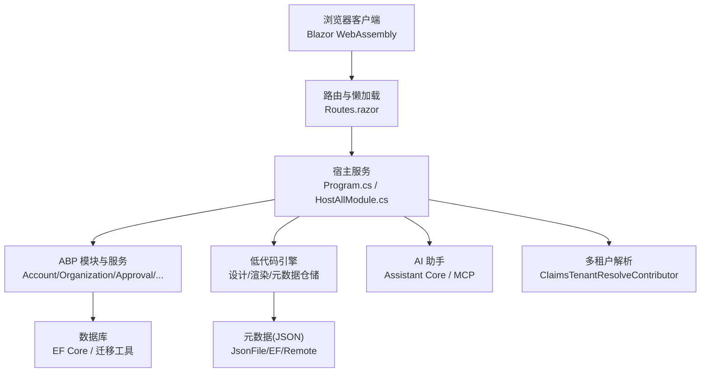
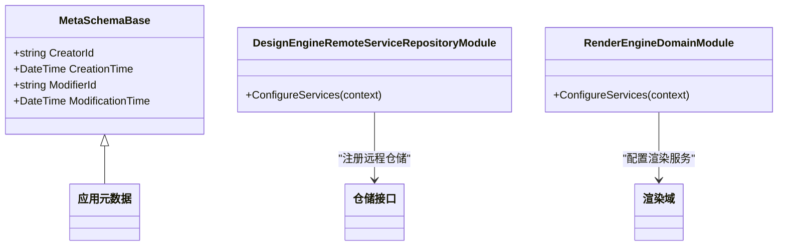
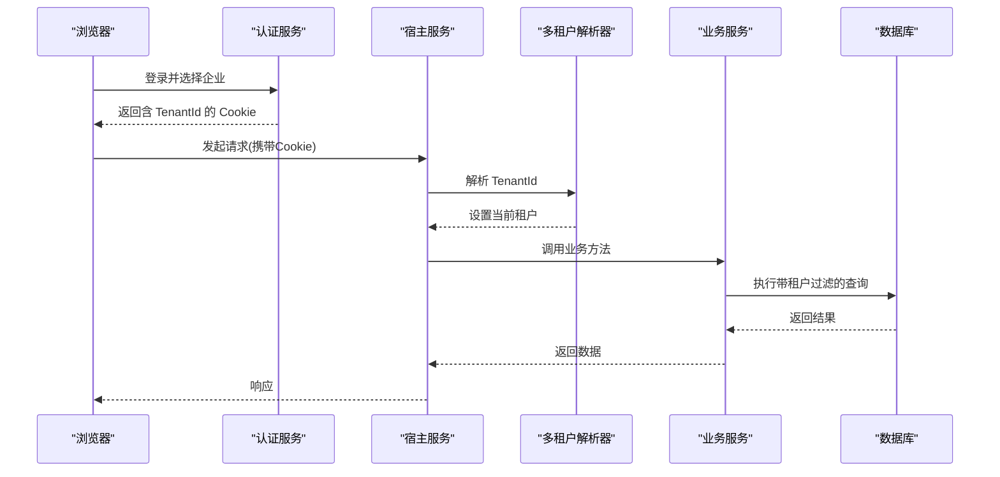
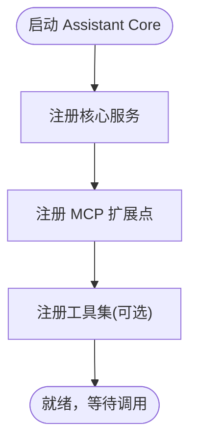
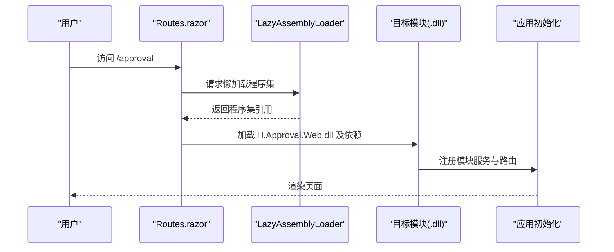
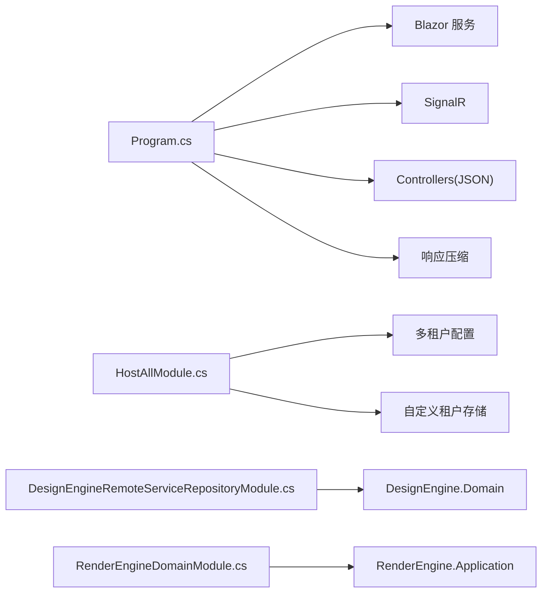

# 项目介绍

<cite>
**本文引用的文件**   
- [README.md](file://README.md)
- [Program.cs](file://src/Host/H.AppLab.Host.All/H.AppLab.Host.All/Program.cs)
- [HostAllModule.cs](file://src/Host/H.AppLab.Host.All/H.AppLab.Host.All/HostAllModule.cs)
- [ClaimsTenantResolveContributor.cs](file://src/Host/H.AppLab.Host.All/H.AppLab.Host.All/ClaimsTenantResolveContributor.cs)
- [H.AppLab.Host.All.Client.csproj](file://src/Host/H.AppLab.Host.All/H.AppLab.Host.All.Client/H.AppLab.Host.All.Client.csproj)
- [Routes.razor](file://src/Host/H.AppLab.Host.All/H.AppLab.Host.All.Client/Routes.razor)
- [MetaSchemaBase.cs](file://src/LowCode/Common/H.LowCode.MetaSchema/MetaSchemaBase.cs)
- [DesignEngineRemoteServiceRepositoryModule.cs](file://src/LowCode/DesignEngine/H.LowCode.DesignEngine.Repository.RemoteService/DesignEngineRemoteServiceRepositoryModule.cs)
- [RenderEngineDomainModule.cs](file://src/LowCode/RenderEngine/H.LowCode.RenderEngine.Domain/RenderEngineDomainModule.cs)
- [AssistantCoreModule.cs](file://src/Agent/Assistant/H.Assistant.Core/AssistantCoreModule.cs)
- [SupplyChainEntities.cs](file://src/Services/SupplyChain/H.SupplyChain.EntityFrameworkCore/Entities/SupplyChainEntities.cs)
- [common.props](file://src/common.props)
</cite>

## 目录
1. [简介](#简介)
2. [项目结构](#项目结构)
3. [核心组件](#核心组件)
4. [架构总览](#架构总览)
5. [详细组件分析](#详细组件分析)
6. [依赖关系分析](#依赖关系分析)
7. [性能考量](#性能考量)
8. [故障排查指南](#故障排查指南)
9. [结论](#结论)
10. [附录](#附录)

## 简介
AppLab 是一个基于 .NET + Blazor 的企业级应用开发平台，面向企业应用、快速原型与 SaaS 平台构建。平台以模块化架构为核心，支持单体部署与按服务独立部署；前端采用 Blazor Web App（Server + WebAssembly），通过低代码引擎实现可视化设计与动态渲染，内置企业级服务（账户、组织、审批、通知、订单、供应链等）与 AI 助手能力，并提供多租户数据隔离。其目标是让开发者与业务人员以更低的成本、更快的速度交付高质量企业应用。

## 项目结构
- Host：宿主程序，仅做服务注册与启动编排，不包含业务逻辑。提供单体宿主 H.AppLab.Host.All 与各单服务宿主。
- Components：共享 UI 组件，如 AppDrawer 统一导航与菜单。
- LowCode：低代码核心，包含元数据 Schema、设计引擎（可视化设计）、渲染引擎（动态运行）、默认组件库与主题。
- Services：按限界上下文划分的业务模块，遵循 Application.Contracts / Application / EntityFrameworkCore / Web 分层。
- System：系统级应用（Enterprise、SystemPortal），面向平台运营侧，与业务服务严格隔离。
- Tools：各服务的数据库迁移工具（DbMigrator）。
- Utils：通用工具库（ABP 契约、HTTP 动态代理、Blazor 工具、ID 生成等）。

```mermaid
graph TB
subgraph "宿主层"
HostAll["H.AppLab.Host.All"]
SingleHosts["单服务宿主(示例: Account, RenderEngine)"]
end
subgraph "共享UI"
AppDrawer["AppDrawer 组件"]
end
subgraph "低代码"
Design["设计引擎(DesignEngine)"]
Render["渲染引擎(RenderEngine)"]
CommonLC["公共基础(Common)"]
end
subgraph "企业服务"
Org["Organization"]
Acc["Account"]
Approval["Approval"]
Order["Order"]
Supply["SupplyChain"]
Notify["Notification"]
Setting["Setting"]
Background["BackgroundTask"]
end
subgraph "系统应用"
Enterprise["Enterprise"]
Portal["SystemPortal"]
end
subgraph "工具与通用"
Tools["DbMigrator 工具集"]
Utils["Utils 工具库"]
end
HostAll --> AppDrawer
HostAll --> Design
HostAll --> Render
HostAll --> Org
HostAll --> Acc
HostAll --> Approval
HostAll --> Order
HostAll --> Supply
HostAll --> Notify
HostAll --> Setting
HostAll --> Background
HostAll --> Enterprise
HostAll --> Portal
HostAll --> Tools
HostAll --> Utils
```

图表来源 
- [README.md:1-74](file://README.md#L1-L74)
- [Program.cs:1-41](file://src/Host/H.AppLab.Host.All/H.AppLab.Host.All/Program.cs#L1-L41)

章节来源
- [README.md:1-74](file://README.md#L1-L74)

## 核心组件
- 低代码引擎
  - 设计引擎：可视化拖拽页面与组件，产出应用元数据（JSON）。
  - 渲染引擎：根据元数据动态渲染可运行的应用，主题基于 Ant Design Blazor。
  - 元数据仓储：支持 JsonFile / EntityFrameworkCore / RemoteService 多种实现。
- 企业级服务
  - 账户、组织、审批、通知、订单、供应链、设置、后台任务等，均按 ABP 分层规范实现。
- AI 助手集成
  - 提供 Assistant 核心模块与 MCP 服务器扩展点，便于接入外部 LLM/MCP 能力。
- 多租户支持
  - 基于 ABP Multi-Tenancy，结合 Claims 解析器从认证 Cookie 中读取 TenantId，驱动数据隔离。

章节来源
- [README.md:14-36](file://README.md#L14-L36)
- [DesignEngineRemoteServiceRepositoryModule.cs:1-18](file://src/LowCode/DesignEngine/H.LowCode.DesignEngine.Repository.RemoteService/DesignEngineRemoteServiceRepositoryModule.cs#L1-L18)
- [RenderEngineDomainModule.cs:1-11](file://src/LowCode/RenderEngine/H.LowCode.RenderEngine.Domain/RenderEngineDomainModule.cs#L1-L11)
- [AssistantCoreModule.cs:1-12](file://src/Agent/Assistant/H.Assistant.Core/AssistantCoreModule.cs#L1-L12)
- [ClaimsTenantResolveContributor.cs:1-30](file://src/Host/H.AppLab.Host.All/H.AppLab.Host.All/ClaimsTenantResolveContributor.cs#L1-L30)

## 架构总览
平台采用“前后端分离 + 模块化”的架构：
- 前端：Blazor Web App（Server + WASM），首屏最小化加载，路由触发懒加载。
- 后端：ABP 模块化服务，按限界上下文拆分，支持单体与微服务部署。
- 低代码：设计端产出元数据，渲染端消费元数据动态生成界面与交互。
- 多租户：通过 Claims 解析与 ABP 多租户机制实现数据隔离。
- 运行时优化：AOT、裁剪、响应压缩、WASM 懒加载。

图表来源 
- [Program.cs:1-41](file://src/Host/H.AppLab.Host.All/H.AppLab.Host.All/Program.cs#L1-L41)
- [HostAllModule.cs:165-180](file://src/Host/H.AppLab.Host.All/H.AppLab.Host.All/HostAllModule.cs#L165-L180)
- [Routes.razor:1-32](file://src/Host/H.AppLab.Host.All/H.AppLab.Host.All.Client/Routes.razor#L1-L32)
- [H.AppLab.Host.All.Client.csproj:1-48](file://src/Host/H.AppLab.Host.All/H.AppLab.Host.All.Client/H.AppLab.Host.All.Client.csproj#L1-L48)

## 详细组件分析

### 低代码引擎（设计与渲染）
- 设计引擎负责页面与组件的可视化编辑，产出应用元数据（JSON）。仓储层支持本地 JSON、EF Core 与远程服务三种实现，便于在不同环境灵活切换。
- 渲染引擎根据元数据动态生成页面与组件，主题基于 Ant Design Blazor，开箱即用。
- 元数据基类包含创建者、修改者及时间戳等审计字段，便于追踪版本与变更。

图表来源 
- [MetaSchemaBase.cs:1-20](file://src/LowCode/Common/H.LowCode.MetaSchema/MetaSchemaBase.cs#L1-L20)
- [DesignEngineRemoteServiceRepositoryModule.cs:1-18](file://src/LowCode/DesignEngine/H.LowCode.DesignEngine.Repository.RemoteService/DesignEngineRemoteServiceRepositoryModule.cs#L1-L18)
- [RenderEngineDomainModule.cs:1-11](file://src/LowCode/RenderEngine/H.LowCode.RenderEngine.Domain/RenderEngineDomainModule.cs#L1-L11)

章节来源
- [README.md:14-21](file://README.md#L14-L21)
- [MetaSchemaBase.cs:1-20](file://src/LowCode/Common/H.LowCode.MetaSchema/MetaSchemaBase.cs#L1-L20)
- [DesignEngineRemoteServiceRepositoryModule.cs:1-18](file://src/LowCode/DesignEngine/H.LowCode.DesignEngine.Repository.RemoteService/DesignEngineRemoteServiceRepositoryModule.cs#L1-L18)
- [RenderEngineDomainModule.cs:1-11](file://src/LowCode/RenderEngine/H.LowCode.RenderEngine.Domain/RenderEngineDomainModule.cs#L1-L11)

### 多租户与数据隔离
- 启用 ABP 多租户，并通过自定义 Claims 解析器从认证 Cookie 中的 “TenantId” Claim 解析当前租户，驱动各服务的数据隔离。
- 领域实体实现 IMultiTenant 接口，确保查询自动附加租户过滤条件。

图表来源 
- [HostAllModule.cs:165-180](file://src/Host/H.AppLab.Host.All/H.AppLab.Host.All/HostAllModule.cs#L165-L180)
- [ClaimsTenantResolveContributor.cs:1-30](file://src/Host/H.AppLab.Host.All/H.AppLab.Host.All/ClaimsTenantResolveContributor.cs#L1-L30)
- [SupplyChainEntities.cs:1-43](file://src/Services/SupplyChain/H.SupplyChain.EntityFrameworkCore/Entities/SupplyChainEntities.cs#L1-L43)

章节来源
- [HostAllModule.cs:165-180](file://src/Host/H.AppLab.Host.All/H.AppLab.Host.All/HostAllModule.cs#L165-L180)
- [ClaimsTenantResolveContributor.cs:1-30](file://src/Host/H.AppLab.Host.All/H.AppLab.Host.All/ClaimsTenantResolveContributor.cs#L1-L30)
- [SupplyChainEntities.cs:1-43](file://src/Services/SupplyChain/H.SupplyChain.EntityFrameworkCore/Entities/SupplyChainEntities.cs#L1-L43)

### AI 助手集成
- Assistant Core 模块作为 AI 助手的核心入口，配合 MCP 服务器扩展点，便于接入外部大模型或 MCP 工具链。
- 该模块为后续扩展 Agent、LLM、Tools 等能力提供统一装配点。

图表来源 
- [AssistantCoreModule.cs:1-12](file://src/Agent/Assistant/H.Assistant.Core/AssistantCoreModule.cs#L1-L12)

章节来源
- [AssistantCoreModule.cs:1-12](file://src/Agent/Assistant/H.Assistant.Core/AssistantCoreModule.cs#L1-L12)

### 前端懒加载与运行时优化
- 首屏仅加载必要程序集，其余模块在导航到对应路由时按需下载。
- 通过 Routes.razor 的路由映射与 LazyAssemblyLoader 控制懒加载；Release 模式启用 AOT 与裁剪，减少体积；服务端启用 Brotli/Gzip 压缩。

图表来源 
- [H.AppLab.Host.All.Client.csproj:1-48](file://src/Host/H.AppLab.Host.All/H.AppLab.Host.All.Client/H.AppLab.Host.All.Client.csproj#L1-L48)
- [Routes.razor:1-32](file://src/Host/H.AppLab.Host.All/H.AppLab.Host.All.Client/Routes.razor#L1-L32)
- [Program.cs:1-41](file://src/Host/H.AppLab.Host.All/H.AppLab.Host.All/Program.cs#L1-L41)

章节来源
- [H.AppLab.Host.All.Client.csproj:1-48](file://src/Host/H.AppLab.Host.All/H.AppLab.Host.All.Client/H.AppLab.Host.All.Client.csproj#L1-L48)
- [Routes.razor:1-32](file://src/Host/H.AppLab.Host.All/H.AppLab.Host.All.Client/Routes.razor#L1-L32)
- [Program.cs:1-41](file://src/Host/H.AppLab.Host.All/H.AppLab.Host.All/Program.cs#L1-L41)

## 依赖关系分析
- 宿主 Program.cs 统一注册 Blazor、SignalR、控制器与响应压缩等服务。
- HostAllModule.cs 启用多租户并注入自定义租户存储。
- 低代码仓储模块通过 AbpModule 声明依赖并注册具体仓储实现。
- 领域模块（如 RenderEngine.Domain）用于聚合领域服务与基础设施装配。

图表来源 
- [Program.cs:1-41](file://src/Host/H.AppLab.Host.All/H.AppLab.Host.All/Program.cs#L1-L41)
- [HostAllModule.cs:165-180](file://src/Host/H.AppLab.Host.All/H.AppLab.Host.All/HostAllModule.cs#L165-L180)
- [DesignEngineRemoteServiceRepositoryModule.cs:1-18](file://src/LowCode/DesignEngine/H.LowCode.DesignEngine.Repository.RemoteService/DesignEngineRemoteServiceRepositoryModule.cs#L1-L18)
- [RenderEngineDomainModule.cs:1-11](file://src/LowCode/RenderEngine/H.LowCode.RenderEngine.Domain/RenderEngineDomainModule.cs#L1-L11)

章节来源
- [Program.cs:1-41](file://src/Host/H.AppLab.Host.All/H.AppLab.Host.All/Program.cs#L1-L41)
- [HostAllModule.cs:165-180](file://src/Host/H.AppLab.Host.All/H.AppLab.Host.All/HostAllModule.cs#L165-L180)
- [DesignEngineRemoteServiceRepositoryModule.cs:1-18](file://src/LowCode/DesignEngine/H.LowCode.DesignEngine.Repository.RemoteService/DesignEngineRemoteServiceRepositoryModule.cs#L1-L18)
- [RenderEngineDomainModule.cs:1-11](file://src/LowCode/RenderEngine/H.LowCode.RenderEngine.Domain/RenderEngineDomainModule.cs#L1-L11)

## 性能考量
- 前端：WASM 懒加载、AOT 编译与裁剪、Brotli/Gzip 压缩，显著降低首屏体积与启动时间。
- 后端：模块化装配按需加载，避免不必要的依赖；SignalR 配置合理接收大小与错误细节开关。
- 数据库：EF Core 迁移工具保障结构一致性；多租户查询自动附加过滤，避免跨租户数据泄露。

[本节为通用指导，不直接分析具体文件]

## 故障排查指南
- 启动失败或服务未注册
  - 检查 Program.cs 中 Blazor、SignalR、控制器与压缩服务是否已正确注册。
- 路由无法懒加载
  - 确认 Routes.razor 的路由映射与 csproj 中的 BlazorWebAssemblyLazyLoad 列表一致。
- 多租户数据异常
  - 检查 ClaimsTenantResolveContributor 是否正确从 Cookie 中解析 TenantId，并确保 HostAllModule 启用了多租户与自定义租户存储。
- 低代码元数据读写问题
  - 核对仓储实现（JsonFile/EF/Remote）是否已正确注册，以及元数据基类字段是否符合约定。

章节来源
- [Program.cs:1-41](file://src/Host/H.AppLab.Host.All/H.AppLab.Host.All/Program.cs#L1-L41)
- [H.AppLab.Host.All.Client.csproj:1-48](file://src/Host/H.AppLab.Host.All/H.AppLab.Host.All.Client/H.AppLab.Host.All.Client.csproj#L1-L48)
- [Routes.razor:1-32](file://src/Host/H.AppLab.Host.All/H.AppLab.Host.All.Client/Routes.razor#L1-L32)
- [HostAllModule.cs:165-180](file://src/Host/H.AppLab.Host.All/H.AppLab.Host.All/HostAllModule.cs#L165-L180)
- [ClaimsTenantResolveContributor.cs:1-30](file://src/Host/H.AppLab.Host.All/H.AppLab.Host.All/ClaimsTenantResolveContributor.cs#L1-L30)
- [DesignEngineRemoteServiceRepositoryModule.cs:1-18](file://src/LowCode/DesignEngine/H.LowCode.DesignEngine.Repository.RemoteService/DesignEngineRemoteServiceRepositoryModule.cs#L1-L18)

## 结论
AppLab 将低代码、企业级服务与 AI 助手整合在一个现代化 .NET + Blazor 平台上，通过模块化与前后端分离的设计，兼顾了开发效率与运行性能。其多租户支持与丰富的运行时优化策略，使其成为企业应用、快速原型与 SaaS 平台的理想选择。

[本节为总结性内容，不直接分析具体文件]

## 附录
- 技术栈与版本
  - 目标框架：net10.0，语言预览特性开启，Nullable 启用。
- 本地开发与部署
  - 使用 Docker Compose 启动依赖（Redis、RabbitMQ 等），通过 DbMigrator 初始化数据库，再启动宿主程序。

章节来源
- [common.props:1-15](file://src/common.props#L1-L15)
- [README.md:38-56](file://README.md#L38-L56)