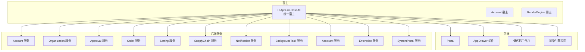
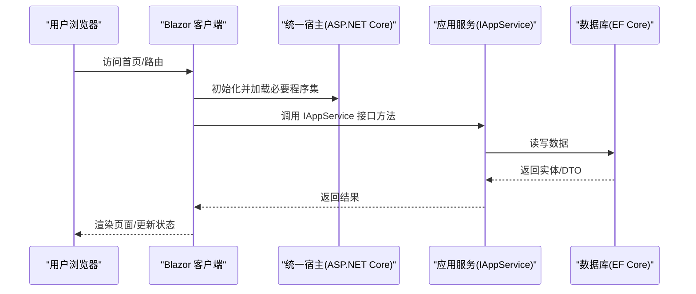
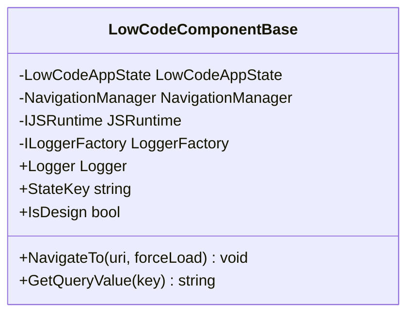
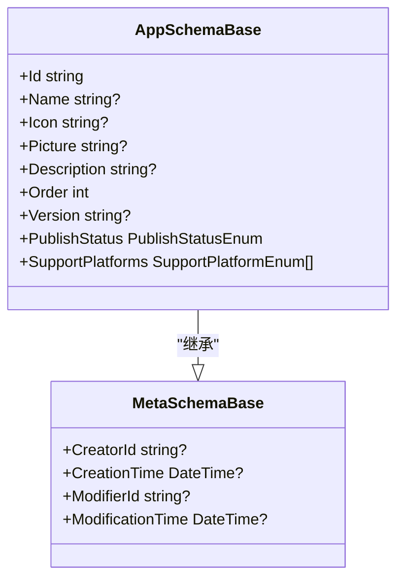
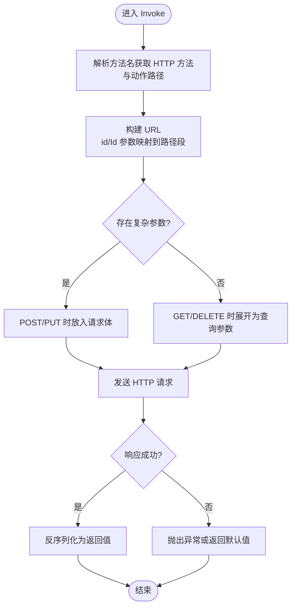
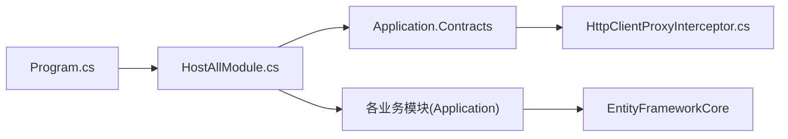

# 项目概述

<cite>
**本文引用的文件**   
- [README.md](file://README.md)
- [AppLab.slnx](file://src/AppLab.slnx)
- [global.json](file://src/global.json)
- [common.props](file://src/common.props)
- [Program.cs](file://src/Host/H.AppLab.Host.All/H.AppLab.Host.All/Program.cs)
- [HostAllModule.cs](file://src/Host/H.AppLab.Host.All/H.AppLab.Host.All/HostAllModule.cs)
- [LowCodeComponentBase.cs](file://src/LowCode/Common/H.LowCode.ComponentBase/LowCodeComponentBase.cs)
- [IAppService.cs](file://src/Utils/H.Abp.Application.Contracts/IAppService.cs)
- [HttpClientProxyInterceptor.cs](file://src/Utils/H.Abp.HttpClientProxy/HttpClientProxyInterceptor.cs)
- [MetaSchemaBase.cs](file://src/LowCode/Common/H.LowCode.MetaSchema/MetaSchemaBase.cs)
- [AppSchemaBase.cs](file://src/LowCode/Common/H.LowCode.MetaSchema/AppSchemaBase.cs)
- [AssistantCoreModule.cs](file://src/Agent/Assistant/H.Assistant.Core/AssistantCoreModule.cs)
</cite>

## 目录
1. [简介](#简介)
2. [项目结构](#项目结构)
3. [核心组件](#核心组件)
4. [架构总览](#架构总览)
5. [详细组件分析](#详细组件分析)
6. [依赖关系分析](#依赖关系分析)
7. [性能考量](#性能考量)
8. [故障排查指南](#故障排查指南)
9. [结论](#结论)
10. [附录：快速开始与最佳实践](#附录快速开始与最佳实践)

## 简介
AppLab 是一个基于 .NET + Blazor 的应用开发平台，采用模块化架构，支持单体部署与按服务独立部署（微服务）两种模式。平台内置低代码引擎、企业级服务、AI 助手等核心能力，提供统一的宿主程序、应用抽屉、动态 HTTP 代理、WebAssembly 懒加载与 AOT 裁剪等特性，帮助团队快速构建、发布和运行企业级应用。

## 项目结构
- Host：宿主程序，仅负责服务注册与管线配置，不包含业务逻辑。H.AppLab.Host.All 为单体宿主；其他 Host 为单服务宿主（如 Account、RenderEngine）。
- Components：共享 UI 组件，如 AppDrawer，提供统一导航与菜单。
- LowCode：低代码核心，包含元数据 Schema、组件基类、默认组件库、设计引擎与渲染引擎。仓储支持 JsonFile / EF Core / RemoteService。
- Services：按限界上下文划分的业务模块（Account、Organization、Approval、Notification、Order、Setting、SupplyChain、BackgroundTask、Testing 等），遵循 Application.Contracts / Application / EntityFrameworkCore / Web 分层。
- System：系统级应用（Enterprise、SystemPortal），面向平台运营侧，与 Services 严格隔离。
- Tools：各服务的 DbMigrator 控制台程序，用于数据库迁移。
- Utils：通用工具库，包括 ABP 契约、HTTP 动态代理、Blazor 工具、ID 生成等。

图表来源
- [Program.cs:1-115](file://src/Host/H.AppLab.Host.All/H.AppLab.Host.All/Program.cs#L1-L115)
- [HostAllModule.cs:1-203](file://src/Host/H.AppLab.Host.All/H.AppLab.Host.All/HostAllModule.cs#L1-L203)

章节来源
- [README.md:1-74](file://README.md#L1-L74)
- [AppLab.slnx:1-183](file://src/AppLab.slnx#L1-L183)

## 核心组件
- 应用抽屉（AppDrawer）：统一顶部导航、侧边菜单与应用切换，通过元数据接入应用分类、图标与跳转方式，实现跨应用一致体验。
- IAppService 动态 HTTP 代理：前端只依赖接口定义，无需手写 HttpClient 调用；DispatchProxy 拦截方法调用，按 ABP 路由约定转换为 HTTP 请求，复杂参数自动序列化。
- 低代码引擎：设计引擎产出应用元数据，渲染引擎根据元数据动态渲染可运行应用；主题基于 Ant Design Blazor。
- AI 助手（Assistant）：集成 LLM、MCP 与桌面/Web 客户端，提供智能交互能力。
- 多租户与认证：Cookie 认证、外部登录、多租户解析与错误处理。

章节来源
- [README.md:58-74](file://README.md#L58-L74)
- [IAppService.cs:1-9](file://src/Utils/H.Abp.Application.Contracts/IAppService.cs#L1-L9)
- [HttpClientProxyInterceptor.cs:1-219](file://src/Utils/H.Abp.HttpClientProxy/HttpClientProxyInterceptor.cs#L1-L219)
- [HostAllModule.cs:115-201](file://src/Host/H.AppLab.Host.All/H.AppLab.Host.All/HostAllModule.cs#L115-L201)

## 架构总览
平台采用“宿主 + 模块”的模块化架构，使用 ABP 框架进行服务发现与依赖注入。统一宿主聚合所有应用模块，同时支持按服务拆分部署。前端基于 Blazor Web App（Server + WebAssembly），通过动态代理与服务端通信，结合懒加载与 AOT 裁剪优化首屏与包体大小。

图表来源
- [Program.cs:1-115](file://src/Host/H.AppLab.Host.All/H.AppLab.Host.All/Program.cs#L1-L115)
- [HostAllModule.cs:135-156](file://src/Host/H.AppLab.Host.All/H.AppLab.Host.All/HostAllModule.cs#L135-L156)
- [HttpClientProxyInterceptor.cs:30-70](file://src/Utils/H.Abp.HttpClientProxy/HttpClientProxyInterceptor.cs#L30-L70)

## 详细组件分析

### 低代码组件基类（LowCodeComponentBase）
- 职责：为低代码组件提供公共能力，包括日志、消息提示、导航、查询参数解析与设计态标识。
- 关键点：
  - 注入 LowCodeAppState，IsDesign 判断当前是否处于设计态。
  - 封装 JS 消息服务，简化前端提示。
  - 提供导航与 URL 查询参数解析工具。

图表来源
- [LowCodeComponentBase.cs:1-73](file://src/LowCode/Common/H.LowCode.ComponentBase/LowCodeComponentBase.cs#L1-L73)

章节来源
- [LowCodeComponentBase.cs:1-73](file://src/LowCode/Common/H.LowCode.ComponentBase/LowCodeComponentBase.cs#L1-L73)

### 元数据 Schema（MetaSchemaBase / AppSchemaBase）
- 职责：定义低代码元数据的公共字段与应用级元数据结构。
- 关键点：
  - MetaSchemaBase 提供创建者、修改者、时间戳等审计字段。
  - AppSchemaBase 扩展应用 ID、名称、图标、描述、排序、版本、发布状态、支持平台等属性。

图表来源
- [MetaSchemaBase.cs:1-20](file://src/LowCode/Common/H.LowCode.MetaSchema/MetaSchemaBase.cs#L1-L20)
- [AppSchemaBase.cs:1-32](file://src/LowCode/Common/H.LowCode.MetaSchema/AppSchemaBase.cs#L1-L32)

章节来源
- [MetaSchemaBase.cs:1-20](file://src/LowCode/Common/H.LowCode.MetaSchema/MetaSchemaBase.cs#L1-L20)
- [AppSchemaBase.cs:1-32](file://src/LowCode/Common/H.LowCode.MetaSchema/AppSchemaBase.cs#L1-L32)

### HTTP 动态代理（HttpClientProxyInterceptor）
- 职责：将 IAppService 接口方法调用转换为 HTTP 请求，按 ABP 约定生成路径与参数。
- 关键点：
  - 使用 DispatchProxy 拦截方法调用。
  - 自动识别 id 与以 Id 结尾的参数作为路径段。
  - GET/DELETE 复杂类型展开为查询参数，POST/PUT 复杂类型放入请求体。
  - 统一 JSON 命名策略与反序列化选项。

图表来源
- [HttpClientProxyInterceptor.cs:30-131](file://src/Utils/H.Abp.HttpClientProxy/HttpClientProxyInterceptor.cs#L30-L131)

章节来源
- [HttpClientProxyInterceptor.cs:1-219](file://src/Utils/H.Abp.HttpClientProxy/HttpClientProxyInterceptor.cs#L1-L219)

### AI 助手（Assistant）
- 职责：提供 AI 助手核心能力，包括 LLM 集成、MCP 协议支持与桌面/Web 客户端。
- 关键点：
  - AssistantCoreModule 作为 ABP 模块入口，集中注册核心服务。
  - 支持 MCP 服务器扩展（如 YunXiao）。

章节来源
- [AssistantCoreModule.cs:1-12](file://src/Agent/Assistant/H.Assistant.Core/AssistantCoreModule.cs#L1-L12)

### 统一宿主与模块聚合（HostAllModule）
- 职责：聚合所有应用模块，配置认证、多租户、控制器与外部登录。
- 关键点：
  - 启用 Cookie 认证与双 Cookie Scheme（系统与业务）。
  - 启用多租户，从 Claims 解析租户，处理无效租户重定向。
  - 自动注册各模块的控制器。
  - 注入 LowCodeAppState（设计态为 true）。

章节来源
- [HostAllModule.cs:1-203](file://src/Host/H.AppLab.Host.All/H.AppLab.Host.All/HostAllModule.cs#L1-L203)

## 依赖关系分析
- 宿主层：Program.cs 配置 Blazor、SignalR、压缩、中间件与静态资源；HostAllModule 聚合模块与配置。
- 前端层：Blazor Client 通过 IAppService 接口与后端通信，使用动态代理与懒加载。
- 领域层：Services 与 LowCode 按限界上下文划分，Application.Contracts 暴露接口供前端引用。
- 基础设施：EF Core 数据访问、Hangfire 后台任务、Redis/RabbitMQ（由 docker-compose 管理）。

图表来源
- [Program.cs:1-115](file://src/Host/H.AppLab.Host.All/H.AppLab.Host.All/Program.cs#L1-L115)
- [HostAllModule.cs:1-203](file://src/Host/H.AppLab.Host.All/H.AppLab.Host.All/HostAllModule.cs#L1-L203)
- [HttpClientProxyInterceptor.cs:1-219](file://src/Utils/H.Abp.HttpClientProxy/HttpClientProxyInterceptor.cs#L1-L219)

章节来源
- [AppLab.slnx:1-183](file://src/AppLab.slnx#L1-L183)

## 性能考量
- 响应压缩：启用 Brotli/Gzip 压缩，减少 WASM 资源传输体积。
- 静态资源缓存：MapStaticAssets 对指纹化程序集启用 immutable 长缓存，避免启动清单过期导致 404。
- WebAssembly 懒加载：按需下载程序集，减少首屏负载。
- AOT 与裁剪：Release 模式启用 AOT 与 Trimming，进一步减小包体。
- SignalR 配置：限制最大接收消息大小，开发环境开启详细错误便于调试。

章节来源
- [Program.cs:22-46](file://src/Host/H.AppLab.Host.All/H.AppLab.Host.All/Program.cs#L22-L46)
- [Program.cs:73-79](file://src/Host/H.AppLab.Host.All/H.AppLab.Host.All/Program.cs#L73-L79)
- [README.md:69-74](file://README.md#L69-L74)

## 故障排查指南
- 启动清单与缓存问题：不要对整个 /_framework 标记为 immutable，否则构建后旧清单仍指向不存在的程序集，导致页面卡在“加载中...”。
- 多租户无效：当 __tenant Cookie 指向已删除租户时，会清理 Cookie 并重定向到首页，避免 404 阻断请求。
- 认证失败：检查 Cookie Scheme 与登录路径配置，确认 SameSite 与 CSRF 设置。
- 代理调用异常：确认 IAppService 接口命名符合 ABP 约定，参数 id/Id 映射正确，复杂参数在 POST/PUT 中放入请求体。

章节来源
- [Program.cs:73-79](file://src/Host/H.AppLab.Host.All/H.AppLab.Host.All/Program.cs#L73-L79)
- [HostAllModule.cs:171-201](file://src/Host/H.AppLab.Host.All/H.AppLab.Host.All/HostAllModule.cs#L171-L201)
- [HttpClientProxyInterceptor.cs:72-131](file://src/Utils/H.Abp.HttpClientProxy/HttpClientProxyInterceptor.cs#L72-L131)

## 结论
AppLab 以模块化架构与 Blazor 技术栈为基础，提供低代码引擎、企业级服务与 AI 助手等核心能力，支持单体与微服务双重部署模式。通过动态 HTTP 代理、懒加载与 AOT 裁剪，平台在保证开发效率的同时兼顾了性能与可维护性，适用于企业内部应用快速交付与持续演进。

## 附录：快速开始与最佳实践
- 环境准备
  - 安装 .NET SDK（版本见 global.json）、WSL + Docker（Engine+Compose）+ Portainer。
  - 启动依赖服务（Redis、RabbitMQ 等）：将 cd 目录下的 docker-compose.yml 拷贝到 WSL，执行 sudo docker-compose up -d。
- 项目启动
  - 数据库迁移：通过 Tools 目录下对应的 DbMigrator 创建数据库结构，例如 dotnet run --project src/Tools/H.Account.DbMigrator。
  - 启动主程序：dotnet run --project src/Host/H.AppLab.Host.All/H.AppLab.Host.All --launch-profile HostAll。
  - 默认地址：http://localhost:5045（https: 7065）。
- 最佳实践
  - 使用 IAppService 接口定义服务契约，保持前后端一致。
  - 合理划分限界上下文，每个服务遵循 Application.Contracts / Application / EntityFrameworkCore / Web 分层。
  - 利用 AppDrawer 元数据配置应用分类与跳转，统一导航体验。
  - 在生产环境启用 AOT 与裁剪，配合响应压缩与静态资源指纹缓存提升性能。

章节来源
- [README.md:38-56](file://README.md#L38-L56)
- [global.json:1-7](file://src/global.json#L1-L7)
- [common.props:1-15](file://src/common.props#L1-L15)